# IT3180 - Tổng hợp quiz 9 chương

- Tổng số câu sau audit/dedupe: 404
- Số câu trùng đã gộp trong pass audit: 62
- Nguồn: quiz phụ.pdf, c1/c2 p2.txt, c3-c9 PDF scan, c3-c9 p2 PDF scan.
- Đã dọn lỗi OCR/rác nguồn và thêm giải thích ngắn cho từng câu.

## Chương 1: Tổng quan về Công nghệ phần mềm

### Câu 1
Nguồn: c1 p2 / quiz phụ

Công nghệ phần mềm được hiểu là một lĩnh vực... nhằm phát triển phần mềm.

- A. Áp dụng các quy trình một cách có hệ thống
- B. Áp dụng các Phương pháp luận và các kỹ thuật
- C. Nghiên cứu các quy trình mới, các phương pháp và kỹ thuật liên quan
- D. Tất cả các đáp án

Hiện đáp án và giải thích

**Đáp án:** D. Tất cả các đáp án

**Giải thích:** Theo định nghĩa chuẩn (như IEEE), Công nghệ phần mềm (Software Engineering) là việc áp dụng một cách tiếp cận có hệ thống, có kỷ luật và định lượng được cho việc phát triển, vận hành và bảo trì phần mềm. Lĩnh vực này đòi hỏi sự kết hợp toàn diện của cả 3 yếu tố: áp dụng quy trình (để quản lý), phương pháp/kỹ thuật (để triển khai) và cả việc nghiên cứu, tối ưu hóa các quy trình/công nghệ đó để ngày càng tốt hơn.

### Câu 2
Nguồn: c1 p2 / quiz phụ

Theo Pressman, công nghệ phần mềm là bộ môn tích hợp … để phát triển phần mềm máy tính.

- A. quy trình, các phương pháp, các công cụ các kỹ thuật,
- B. Phương pháp luận công nghệ học các nguyên tắc công nghệ các phương pháp tiếp cận có hệ thống

Hiện đáp án và giải thích

**Đáp án:** quy trình, các phương pháp, các công cụ

**Giải thích:** Theo mô hình "Công nghệ phân lớp" (Layered Technology) kinh điển của tác giả Roger S. Pressman, Công nghệ phần mềm được xây dựng trên 3 lớp nền tảng vững chắc (kiềng 3 chân): **Quy trình (Process)** để tạo khung quản lý dự án, **Phương pháp (Methods)** cung cấp giải pháp kỹ thuật ("làm như thế nào"), và **Công cụ (Tools)** hỗ trợ tự động/bán tự động cho quy trình và phương pháp. Đáp án B dùng các từ ngữ quá hàn lâm và có xu hướng lai với định nghĩa của IEEE để gây nhiễu.

### Câu 3
Nguồn: c1 p2

Công nghệ phần mềm giúp giải quyết câu hỏi nào sau đây:

- A. Làm thế nào để đảm bảo phần mềm giao diện đẹp, dễ nhìn, dễ dùng?
- B. Làm thế nào để đảm bảo phần mềm có độ tin cậy cao, chất lượng tốt?
- C. Làm thế nào để đảm bảo phần mềm đáp ứng được các yêu cầu của khách hàng mà không vượt quá chi phí đưa ra?
- D. Làm thế nào để dự án thành công đúng thời hạn và không vượt quá chi phí ban đầu?

Hiện đáp án và giải thích

**Đáp án:** Làm thế nào để đảm bảo phần mềm có độ tin cậy cao, chất lượng tốt?

**Giải thích:** Ngành Công nghệ phần mềm ra đời từ cuộc "khủng hoảng phần mềm" vào những năm 1960 khi các hệ thống lớn liên tục sập và hoạt động sai. Mục tiêu kỹ thuật cốt lõi và tối thượng của Công nghệ phần mềm là áp dụng các nguyên lý để xây dựng ra phần mềm có độ tin cậy tuyệt đối và chất lượng cao (không sập, không mất dữ liệu). Việc quản lý ngân sách hay tiến độ thường thiên nhiều hơn về "Quản lý dự án".

### Câu 4
Nguồn: quiz phụ

Đâu không phải là định nghĩa của công nghệ phần mềm?

- A. Là lĩnh vực khoa học để tạo ra chương trình máy tính, dữ liệu và các tài liệu liên quan
- B. Là lĩnh vực khoa học về các phương pháp luận, kỹ thuật và công cụ tích hợp trong quy trình sản xuất và vận hành phần mềm nhằm tạo ra phần mềm với những chất lượng mong muốn
- C. Là lĩnh vực liên quan đến lý thuyết, phương pháp và công cụ dùng cho phát triển phần mềm
- D. Là việc xây dựng phần mềm nhiều phiên bản bởi nhiều người

Hiện đáp án và giải thích

**Đáp án:** Là lĩnh vực khoa học để tạo ra chương trình máy tính, dữ liệu và các tài liệu liên quan

**Giải thích:** Câu A là định nghĩa cấu thành của một "Sản phẩm phần mềm" (Software = Code + Dữ liệu + Tài liệu), chứ không phải định nghĩa của chuyên ngành "Công nghệ phần mềm" (Software Engineering). Công nghệ phần mềm là một lĩnh vực bao trùm, áp dụng lý thuyết, phương pháp và công cụ có hệ thống để tạo ra các sản phẩm đó.

### Câu 5
Nguồn: c1 p2

Trong các liệt kê sau, liệt kê nào chỉ chứa các ứng dụng hệ thống?

- A. Tất cả các lựa chọn trên đều đúng
- B. MySQL, Access, Python Windows,
- C. Partition Magic, Antivirus, File
- D. Management Windows, Office, Unikey

Hiện đáp án và giải thích

**Đáp án:** Windows, Partition Magic, Antivirus, File Management

**Giải thích:** Phần mềm hệ thống (System Software) là các phần mềm được thiết kế để vận hành máy tính, quản lý phần cứng và cung cấp nền tảng cho các phần mềm khác. Windows (Hệ điều hành), Partition Magic (Quản lý phân vùng), Antivirus (Bảo vệ lõi hệ thống), File Management (Quản lý tệp tin) đều tương tác ở cấp độ hệ thống/hạ tầng. Ngược lại, Office, Unikey, phần mềm kế toán là các phần mềm ứng dụng (Application Software).

### Câu 6
Nguồn: quiz phụ

Các giai đoạn (các pha) trong công nghệ phần mềm bao gồm

- A. Pha thực hiện, pha đánh giá và pha nâng cấp
- B. Pha định nghĩa, pha phát triển và pha hỗ trợ
- C. Pha tìm hiểu, pha phân tích và pha thực thi
- D. Pha bắt đầu, pha thực hiện và pha kết thúc

Hiện đáp án và giải thích

**Đáp án:** Pha định nghĩa, pha phát triển và pha hỗ trợ

**Giải thích:** Theo cách tiếp cận vĩ mô kinh điển của Roger S. Pressman, bất kỳ quy trình phát triển nào cũng xoay quanh 3 pha nền tảng: (1) **Pha định nghĩa** (Definition phase) - Tìm hiểu xem phần mềm cần làm gì; (2) **Pha phát triển** (Development phase) - Lên kiến trúc và tiến hành viết code; (3) **Pha hỗ trợ** (Support phase) - Bảo trì và xử lý các thay đổi sau khi giao cho khách hàng.

### Câu 7
Nguồn: c1 p2 / quiz phụ

Các công việc được thực hiện trong pha hỗ trợ...

- A. Xác định các yêu cầu chính của hệ thống và
- B. Phần mềm
- C. Tất cả các công việc
- D. Tương ứng với các thay đổi theo yêu cầu của bối cảnh và khách hàng
- E. Xác định các chức năng, dữ liệu, giao diện... được xây dựng như thế nào

Hiện đáp án và giải thích

**Đáp án:** D. Tương ứng với các thay đổi theo yêu cầu của bối cảnh và khách hàng

**Giải thích:** Pha hỗ trợ (Support phase / Maintenance) diễn ra sau khi phần mềm đã được bàn giao. Trọng tâm của pha này là xử lý **sự thay đổi** (Change), bao gồm sửa lỗi phát sinh, điều chỉnh hệ thống để tương thích với môi trường mới (bảo trì thích ứng), và cập nhật thêm tính năng theo yêu cầu thay đổi từ khách hàng. Việc xác định yêu cầu hay thiết kế chức năng là của các pha trước đó.

### Câu 8
Nguồn: c1 p2

Lợi ích của việc chia quá trình phát triển phần mềm thành những chu kỳ nhỏ

- A. Khách hàng có thể đưa ra các thay đổi và đội phát triển dễ dàng sửa đổi theo
- B. Giảm thiểu rủi ro
- C. Khách hàng có thể đánh giá ngay được kết quả công việc của đội phát triển
- D. Chu kỳ nhỏ dễ quản lý

Hiện đáp án và giải thích

**Đáp án:** B. Giảm thiểu rủi ro

**Giải thích:** Mục tiêu cốt lõi mang tính học thuật của việc chia chu kỳ nhỏ (như mô hình Agile/Tăng trưởng) là **quản lý và giảm thiểu rủi ro**. Thay vì ôm một cục rủi ro khổng lồ ở cuối dự án, việc chia nhỏ giúp đội phát triển phát hiện sớm các lỗi kỹ thuật, sai lệch yêu cầu, từ đó dừng lại và sửa đổi kịp thời. Các đáp án A, C, D là các "tác dụng phụ" dẫn đến mục tiêu vĩ mô cao nhất là B.

### Câu 9
Nguồn: c1 p2

Nhóm phát triển phần mềm cần phải hiểu.......

- A. Mong đợi của khách hàng, tổ chức của khách hàng, của người dùng cuối sản phẩm phần mềm về phần mềm Mong đợi của người dùng về phần mềm
- C. Mong đợi của khách hàng và tổ chức của khách hàng nơi họ làm việc về phần mềm
- D. Người mua sản phẩm trên chợ ứng dụng (vd. Google Play) là....... của nhóm phát triển?
- E. Cả người mua và người sử dụng (Customer và User)
- F. Người mua (Customer)

Hiện đáp án và giải thích

**Đáp án:** Mong đợi của khách hàng, tổ chức của khách hàng, của người dùng cuối sản phẩm phần mềm về phần mềm

**Giải thích:** Để xây dựng phần mềm thành công, đội phát triển phải thấu hiểu toàn diện các bên liên quan (Stakeholders). Họ không chỉ cần hiểu mong muốn của người trực tiếp chi tiền (Khách hàng), mà còn phải hiểu các ràng buộc nghiệp vụ của tổ chức đó, và đặc biệt là trải nghiệm thao tác của người trực tiếp sử dụng (Người dùng cuối). Thiếu hụt một góc nhìn nào cũng có thể dẫn tới làm ra sản phẩm không dùng được.

### Câu 10
Nguồn: c1 p2 / quiz phụ

Giá thành của phần mềm ngày càng giảm?

- A. Sai
- B. Đúng

Hiện đáp án và giải thích

**Đáp án:** A. Sai

**Giải thích:** Mệnh đề này là Sai. Trên thực tế, giá thành sản xuất phần mềm ngày càng tăng cao. Nguyên nhân là hệ thống phần mềm ngày càng đồ sộ, phức tạp. Quan trọng hơn, Công nghệ phần mềm phụ thuộc gần như tuyệt đối vào chất xám con người, nên chi phí trả lương nhân sự kỹ thuật cao và chi phí bảo trì liên tục đẩy giá thành dự án lên rất đắt đỏ.

### Câu 11
Nguồn: c1 p2 / quiz phụ

Vì sao giá thành phần mềm ngày càng cao?

- A. Phần mềm có thể giúp khách hàng tiết kiệm tiền
- B. Tất cả các đáp án
- C. Một số Phần mềm là không thể thay thế
- D. Sản xuất Phần mềm rất đắt đỏ

Hiện đáp án và giải thích

**Đáp án:** B. Tất cả các đáp án

**Giải thích:** Giá thành (Price/Cost) của phần mềm cao xuất phát từ cả chi phí kỹ thuật lẫn giá trị kinh doanh: (D) Quá trình sản xuất tốn nhiều chất xám và ngân sách nhân sự; (A) Định giá dựa trên giá trị (Value-based pricing), phần mềm giúp công ty tiết kiệm tiền tỷ nên phí bán ra cao tương xứng; và (C) Tính độc quyền, khi doanh nghiệp phụ thuộc vào một phần mềm, họ khó thay thế nên phải chịu phí cấp phép và bảo trì rất cao.

### Câu 12
Nguồn: c1 p2 / quiz phụ

Chi phí nào là tốn kém nhất trong phát triển phần mềm?

- A. Chi phí phần cứng cho nhóm phát triển
- B. Các công cụ phát triển phần 
- C. Hỗ trợ, bảo trì 
- D. Quảng cáo, marketing

Hiện đáp án và giải thích

**Đáp án:** Hỗ trợ, bảo trì

**Giải thích:** Theo các nghiên cứu kinh điển, chi phí cho khâu Hỗ trợ và Bảo trì luôn chiếm tỷ trọng lớn nhất, thường rơi vào 60% đến 80% tổng vòng đời ngân sách. Lý do là giai đoạn phát triển ban đầu chỉ mất vài tháng hoặc 1 năm, nhưng phần mềm sẽ tồn tại, hoạt động, sửa lỗi và phải liên tục nâng cấp tính năng ròng rã suốt 5-10 năm sau đó.

### Câu 13
Nguồn: c1 p2 / quiz phụ

Một kỹ sư phần mềm (software engineer) phải làm được...?

- A. Có khả năng viết mã nguồn.
- B. Có khả năng cài đặt các giải thuật để giải quyết vấn đề.
- C. tạo ra các ứng dụng có thể sử dụng được, thu được lợi nhuận từ việc bán phần mềm.
- D. Thiết kế giải pháp, xây dựng các hệ thống và viết mã nguồn để xây dựng các ứng dụng có khả năng mở rộng.

Hiện đáp án và giải thích

**Đáp án:** Thiết kế giải pháp, xây dựng các hệ thống và viết mã nguồn để xây dựng các ứng dụng có khả năng mở rộng.

**Giải thích:** Sự khác biệt giữa một thợ gõ code (Coder) và một Kỹ sư phần mềm (Software Engineer) nằm ở tư duy tổng thể. Kỹ sư không chỉ biết cài thuật toán hay gõ mã nguồn, mà họ bắt buộc phải có khả năng phân tích yêu cầu, thiết kế kiến trúc hệ thống chuyên nghiệp, đảm bảo tính ổn định và tính mở rộng (scalable) để hệ thống không bị "vỡ trận" khi dự án lớn lên.

### Câu 14
Nguồn: c1 p2 / quiz phụ

Việc không áp dụng các kỹ thuật công nghệ phần mềm có thể khiến

- A. Quy trình không tái sử dụng và khó quản lý
- B. Tất cả các yếu tố này 
- C. Phần mềm thiếu chắc chắn, ổn định
- D. Phần mềm khó bảo trì và đáp ứng với các thay đổi

Hiện đáp án và giải thích

**Đáp án:** Tất cả các yếu tố này

**Giải thích:** Việc tự làm tự code vô tổ chức (không áp dụng tiêu chuẩn CNPM) là nguyên nhân gây ra thảm họa dự án. Thiếu kỹ thuật sẽ sinh ra code rác khiến phần mềm thiếu ổn định; vì không có tài liệu hay mô-đun hóa nên khó bảo trì; và dự án không đo lường được tiến độ rõ ràng dẫn đến quy trình khó quản lý, vỡ kế hoạch.

### Câu 15
Nguồn: c1 p2 / quiz phụ

Người mua sản phẩm trên chợ ứng dụng (vd. Google Play) là....... của nhóm phát triển?

- A. Người mua (Customer)
- B. Cả người mua và người sử dụng (Customer và User)
- C. Khách hàng (Client)
- D. Người sử dụng (User)

Hiện đáp án và giải thích

**Đáp án:** B. Cả người mua và người sử dụng (Customer và User)

**Giải thích:** Khi bạn mua một app trên Google Play để tự mình dùng, bạn vừa đóng vai trò là "Customer" (người trực tiếp trả tiền mua) vừa là "User" (người cuối cùng trực tiếp thao tác trên ứng dụng). Khái niệm này giúp phân biệt với hệ thống doanh nghiệp (B2B), nơi Giám đốc trả tiền (Customer) nhưng nhân viên mới là người thao tác (User).

### Câu 16
Nguồn: c1 p2 / quiz phụ

Có rất ít dự án phần mềm thất bại vì người phát triển phần mềm xây dựng sai phần mềm

- A. Sai
- B. Đúng

Hiện đáp án và giải thích

**Đáp án:** A. Sai

**Giải thích:** Mệnh đề này hoàn toàn Sai với thực tiễn. Việc "Xây dựng sai hệ thống" (Hiểu sai yêu cầu khách hàng, làm ra thứ khách hàng không cần) là một trong những nguyên nhân hàng đầu và tốn kém nhất gây thất bại dự án. Dù code có sạch (Verification tốt), nhưng nếu đáp ứng sai nhu cầu thực tiễn (Validation thất bại), thì sản phẩm vẫn vô dụng.

### Câu 17
Nguồn: c1 p2 / quiz phụ

Để giảm thiểu rủi ro, nhóm phát triển phần mềm phải...

- A. Hiểu những gì tổ chức của khách hàng mong đợi ở khách hàng
- B. Hiểu những gì khách hàng và người dùng mong đợi ở phần mềm
- C. Tất cả các yêu cầu
- D. Hiểu những gì khách hàng mong đợi ở phần mềm

Hiện đáp án và giải thích

**Đáp án:** C. Tất cả các yêu cầu

**Giải thích:** Sự thành công của dự án là điểm giao thoa giữa các nhu cầu khác nhau. Đội dự án bắt buộc phải nhìn đa chiều: Khách hàng (người cấp vốn) mong chờ phần mềm giải quyết bài toán gì, Tổ chức có ràng buộc nghiệp vụ gì, và Người dùng (user) cần giao diện/trải nghiệm ra sao. Bỏ lọt bất cứ một vế nào cũng tiềm ẩn rủi ro rất lớn.

### Câu 18
Nguồn: quiz phụ

Trong các yếu tố sau, yếu tố nào không góp phần giảm thiểu rủi ro trong quá trình phát triển phần mềm?

- A. Kiểm thử
- B. Báo cáo tiến độ
- C. Nghiên cứu tiền khả thi
- D. Phát triển ứng dụng nhanh

Hiện đáp án và giải thích

**Đáp án:** D. Phát triển ứng dụng nhanh

**Giải thích:** Nghiên cứu tiền khả thi, Báo cáo tiến độ và Kiểm thử đều là các hoạt động có mục đích trực tiếp là quản lý và kiểm soát rủi ro. Ngược lại, "Phát triển ứng dụng nhanh" (RAD) là một mô hình chú trọng vào tốc độ. Việc phải tăng tốc, đôi khi bỏ qua thiết kế bài bản, thậm chí còn có thể làm *tăng rủi ro* cho dự án nếu đội ngũ không đủ kinh nghiệm.

### Câu 19
Nguồn: c1 p2 / quiz phụ

Việc phát triển phần mềm hướng đến...

- A. Ngân sách tối thiểu
- B. Bảo đảm sản phẩm hoạt động như mong đợi
- C. Sớm nhất có thể
- D. Cân bằng giữa tính năng, chi phí và thời gian

Hiện đáp án và giải thích

**Đáp án:** Cân bằng giữa tính năng, chi phí và thời gian

**Giải thích:** Mọi dự án Công nghệ phần mềm đều bị giới hạn bởi "Tam giác quản lý dự án": Tính năng - Chi phí - Thời gian. Mục tiêu tối cao không phải là làm rẻ nhất (thường sẽ gây lỗi) hay làm nhanh nhất một cách mù quáng, mà là tìm ra điểm **cân bằng tối ưu** giữa 3 yếu tố này để giao đúng sản phẩm chất lượng trong điều kiện cho phép.

### Câu 20
Nguồn: quiz phụ

Đâu không là đặc trưng của phần mềm?

- A. Phần mềm có quy mô càng lớn thì khả năng chứa lỗi càng cao
- B. Chức năng của Phần mềm thường biến hóa thay đổi theo thời gian
- C. Chất lượng Phần mềm có xu hướng kém dần vì các lỗi được phát hiện bởi
- D. Người dùng
- E. Là hàng hóa vô hình, không nhìn thấy được

Hiện đáp án và giải thích

**Đáp án:** Chất lượng phần mềm có xu hướng kém dần vì các lỗi được phát hiện bởi người dùng

**Giải thích:** Phương án này phản ánh sai đặc trưng cốt lõi của phần mềm. Khác với phần cứng cơ khí, phần mềm **không bị hao mòn** (Wear out) theo thời gian. Ngược lại, chất lượng của phần mềm thường có xu hướng *tốt dần lên* sau mỗi lần lỗi được người dùng phát hiện và đội ngũ kỹ thuật phát hành các bản vá (patch) để khắc phục triệt để.

### Câu 21
Nguồn: c1 p2 / quiz phụ

Lựa chọn nào sau đây không phải là một trong những yếu tố của công nghệ phần mềm?

- A. Phương pháp (methods)
- B. Công cụ (tools)
- C. Chế tạo (manufacturing)
- D. Quy trình (process)

Hiện đáp án và giải thích

**Đáp án:** C. Chế tạo (manufacturing)

**Giải thích:** Phần mềm là một sản phẩm logic trí tuệ, nó được **phát triển (developed)** hoặc **thiết kế/kỹ nghệ (engineered)** chứ không được "chế tạo" (manufactured) rập khuôn vật lý như dây chuyền làm tivi, ô tô. Ba phương án còn lại gồm: Quy trình (Process), Phương pháp (Methods) và Công cụ (Tools) chính là 3 lớp cấu thành tiêu chuẩn của Công nghệ phần mềm.

### Câu 22
Nguồn: c1 p2 / quiz phụ

Phát biểu nào sau đây không phải là đặc trưng cho một sản phẩm phần mềm?

- A. Phần mềm không bị hao mòn
- B. Các yếu tố về thay đổi yêu cầu của
- C. Phần mềm không được xem xét một khi phát hành sản phẩm
- D. Phần mềm Phần mềm được hỗ trợ trong suốt toàn bộ vòng đời của nó
- E. Phát triển sản phẩm
- F. Phần mềm vô cùng tốn kém

Hiện đáp án và giải thích

**Đáp án:** Các yếu tố về thay đổi yêu cầu của phần mềm không được xem xét một khi phát hành sản phẩm phần mềm

**Giải thích:** Bản chất sống còn của phần mềm là **tính tiến hóa**. Ngay cả khi phần mềm đã được phát hành (Release), nó vẫn phải liên tục được bảo trì, tiếp nhận phản hồi từ người dùng và thay đổi để cập nhật công nghệ mới hoặc thích ứng với môi trường hệ điều hành mới. Nói rằng "không xem xét thay đổi khi đã phát hành" là phủ nhận hoàn toàn vai trò của pha Bảo trì.

### Câu 23
Nguồn: quiz phụ

Phần mềm bao gồm

- A. Các tài liệu mô tả thao tác và cách sử dụng chương trình.
- B. Các lệnh (chương trình máy tính) cung cấp những chức năng và kết quả mong muốn khi được thực hiện.
- C. Các cấu trúc dữ liệu làm cho chương trình thao tác với các thông tin tương ứng.
- D. Tất cả các thành phần trên

Hiện đáp án và giải thích

**Đáp án:** D. Tất cả các thành phần trên

**Giải thích:** Theo định nghĩa chuẩn xác từ sách giáo khoa Pressman, "Phần mềm" không chỉ đơn giản là bộ mã code. Nó bắt buộc phải bao gồm đủ 3 thành tố: (1) Mã lệnh thực thi để ra kết quả; (2) Cấu trúc dữ liệu để hệ thống lưu trữ/thao tác thông tin; và cực quan trọng là (3) Tài liệu (Documentation) để hướng dẫn sử dụng và hỗ trợ bảo trì sau này. Thiếu tài liệu thì không được coi là phần mềm công nghiệp.

### Câu 24
Nguồn: c1 p2 / quiz phụ

Phần mềm nào dưới đây là phần mềm hệ thống

- A. Ứng dụng nhắc lịch công việc
- B. Phần mềm kế toán
- C. Hệ điều hành
- D. Hệ thống quản lý nhà hàng

Hiện đáp án và giải thích

**Đáp án:** C. Hệ điều hành

**Giải thích:** Dựa theo phân loại cơ bản, **Phần mềm hệ thống** (System Software) là các chương trình vận hành ở tầng lõi, quản lý phần cứng và làm nền tảng cho phần mềm khác chạy (Ví dụ: Hệ điều hành Windows/Linux, Driver). Trong khi đó, phần mềm kế toán, hệ thống nhà hàng hay nhắc lịch công việc đều là **Phần mềm ứng dụng** (Application Software) vì chúng được làm ra để phục vụ nghiệp vụ trực tiếp của người dùng.

## Chương 2: Vòng đời phần mềm

### Câu 1
Nguồn: c2 p2

Phát biểu nào sau đây đúng cho mô hình thác nước?

- A. Một ứng dụng được chia thành nhiều phần khác nhau, mỗi phần được phát triển độc lập với nhau, các bản phát hành của sản phẩm được tạo ra bởi sự tích hợp dần dần của các bộ phận này
- B. Vòng đời phát triển là một chuỗi các giai đoạn tuyến tính, trong đó đầu ra của giai đoạn trước được sử dụng làm đầu vào của giai đoạn hiện tại và có thể quay lại các giai đoạn trước để sửa đổi hoặc sửa lỗi (nếu có)
- C. Vòng đời phát triển liên quan đến khách hàng để cải thiện năng suất và giảm rủi ro thay đổi
- D. Việc phát triển phần mềm được thực hiện tuần tự, kết quả của giai đoạn trước được sử dụng làm đầu vào cho giai đoạn tiếp theo và không thể quay lại các giai đoạn trước

Hiện đáp án và giải thích

**Đáp án:** Việc phát triển phần mềm được thực hiện tuần tự, kết quả của giai đoạn trước được sử dụng làm đầu vào cho giai đoạn tiếp theo và không thể quay lại các giai đoạn trước

**Giải thích:** Mô hình thác nước đi tuần tự qua các pha nên phù hợp khi yêu cầu ổn định và tài liệu hóa rõ. Điểm yếu của nó là thay đổi muộn thường tốn kém vì các pha trước đã được chốt. Yêu cầu ổn định và tài liệu rõ là tín hiệu của waterfall; thay đổi nhanh hoặc phản hồi liên tục thường nghiêng về mô hình lặp.

### Câu 2
Nguồn: c2 p2 / quiz phụ

Pha đầu tiên trong vòng đời phát triển phần mềm là gì?

- A. Triển khai (deployment).
- B. Phát triển (implementation).
- C. Lập kế hoạch (planning).
- D. Phân tích (analysis).

Hiện đáp án và giải thích

**Đáp án:** C. Lập kế hoạch (planning).

**Giải thích:** Vòng đời phần mềm mô tả các pha từ hiểu yêu cầu, thiết kế, xây dựng đến kiểm thử và bảo trì. Các lựa chọn sai thường nhầm giữa hoạt động của một pha với toàn bộ quy trình. Hỏi pha nào thì bám vào đầu vào/đầu ra của hoạt động: phân tích làm rõ yêu cầu, thiết kế định hình cấu trúc, kiểm thử tìm lỗi.

### Câu 3
Nguồn: c2 p2 / quiz phụ

Pha thứ 3 trong vòng đời phát triển phần mềm là gì?

- A. Kiểm thử và tích hợp (Testing and integration).
- B. Thiết kế (design).
- C. Triển khai (deployment).
- D. Phát triển (implementation).

Hiện đáp án và giải thích

**Đáp án:** B. Thiết kế (design).

**Giải thích:** Vòng đời phần mềm mô tả các pha từ hiểu yêu cầu, thiết kế, xây dựng đến kiểm thử và bảo trì. Các lựa chọn sai thường nhầm giữa hoạt động của một pha với toàn bộ quy trình. Hỏi pha nào thì bám vào đầu vào/đầu ra của hoạt động: phân tích làm rõ yêu cầu, thiết kế định hình cấu trúc, kiểm thử tìm lỗi.

### Câu 4
Nguồn: quiz phụ

Trong bài học SDLC viết tắt của từ gì? Pha thứ 3 trong vòng đời phát triển phần mềm là gì?

- A. System development life conditions.
- B. Software development life cycle.
- C. System development life cycle.
- D. Software development litigation cycle.

Hiện đáp án và giải thích

**Đáp án:** B. Software development life cycle.

**Giải thích:** Vòng đời phần mềm mô tả các pha từ hiểu yêu cầu, thiết kế, xây dựng đến kiểm thử và bảo trì. Các lựa chọn sai thường nhầm giữa hoạt động của một pha với toàn bộ quy trình. Hỏi pha nào thì bám vào đầu vào/đầu ra của hoạt động: phân tích làm rõ yêu cầu, thiết kế định hình cấu trúc, kiểm thử tìm lỗi.

### Câu 5
Nguồn: c2 p2 / quiz phụ

Trong bước thiết kế phần mềm, chúng ta thường làm gì

- A. Thực hiện các thay đổi khi tạo phần mềm
- B. Viết mã chương trình
- C. Đảm bảo các yêu cầu về phần mềm được hiểu rõ
- D. Lập kế hoạch giải pháp, giao diện phần mềm

Hiện đáp án và giải thích

**Đáp án:** Lập kế hoạch giải pháp, giao diện phần mềm

**Giải thích:** Quản lý dự án phối hợp con người, quy trình, sản phẩm và ràng buộc tiến độ/chi phí/chất lượng. Nhóm thực thi biến kế hoạch thành công việc cụ thể, còn lập kế hoạch, giám sát hoặc kết thúc thuộc nhóm quy trình khác. Các câu PM thường xoay quanh người, sản phẩm, quy trình, phạm vi, chi phí và tiến độ; đáp án sai hay trộn sang portfolio hoặc kỹ thuật triển khai.

### Câu 6
Nguồn: c2 p2 / quiz phụ

Điều gì xảy ra trong giai đoạn phân tích?

- A. Quyết định hệ thống mới hoạt động tốt như thế nào
- B. Nhìn vào hệ thống hiện có và tìm các vấn đề cần cải thiện
- C. Đưa hệ thống mới vào công ty để sử dụng
- D. Tạo hệ thống mới và kiểm tra nó

Hiện đáp án và giải thích

**Đáp án:** B. Nhìn vào hệ thống hiện có và tìm các vấn đề cần cải thiện

**Giải thích:** Điểm chính là nhận ra hoạt động đang thuộc pha nào trong quá trình phát triển. Nhầm pha phân tích, thiết kế, xây dựng và kiểm thử là lỗi thường gặp ở nhóm câu này. Hỏi pha nào thì bám vào đầu vào/đầu ra của hoạt động: phân tích làm rõ yêu cầu, thiết kế định hình cấu trúc, kiểm thử tìm lỗi.

### Câu 7
Nguồn: quiz phụ

Một dự án phần mềm có độ phức tạp cao, đòi hỏi độ tin cậy tuyệt đối cùng với khung thời gian phát triển rộng có thể sẽ được phát triển bằng cách sử dụng phương pháp nào?

- A. Cách tiếp cận theo người dùng cuối (end-user approach)
- B. Theo cách tiếp cận RAD (phát triển nhanh)
- C. Theo cách tiếp cận của Waterfall.
- D. Theo cách tiếp cận kiểu mẫu thử (prototyping).

Hiện đáp án và giải thích

**Đáp án:** C. Theo cách tiếp cận của Waterfall.

**Giải thích:** Mô hình thác nước đi tuần tự qua các pha nên phù hợp khi yêu cầu ổn định và tài liệu hóa rõ. Điểm yếu của nó là thay đổi muộn thường tốn kém vì các pha trước đã được chốt. Yêu cầu ổn định và tài liệu rõ là tín hiệu của waterfall; thay đổi nhanh hoặc phản hồi liên tục thường nghiêng về mô hình lặp.

### Câu 8
Nguồn: quiz phụ

Khi áp dụng quy trình phát triển phần mềm trong thực tế, cần lưu ý

- A. Tập trung vào tính ưu tiên và quan trọng
- B. Tập trung vào giao diện
- C. Nên có nhiều lập trình viên
- D. Viết Phần mềm nhanh

Hiện đáp án và giải thích

**Đáp án:** A. Tập trung vào tính ưu tiên và quan trọng

**Giải thích:** Thiết kế giao diện tốt dựa trên tính nhất quán, khả năng nhận biết và giảm gánh nặng ghi nhớ cho người dùng. Phương án sai thường nhầm loại control, luồng thao tác hoặc nguyên tắc usability đang bị vi phạm. Ưu tiên nhận diện control và nguyên tắc usability; tên gọi đẹp nhưng làm người dùng nhớ nhiều hoặc thao tác không nhất quán thường là sai.

### Câu 9
Nguồn: c2 p2 / quiz phụ

Liên quan đến cách tiếp cận có cấu trúc, thời gian tương đối được phân bổ cho từng bước của dự án sẽ là một phần của giai đoạn phát triển nào?

- A. Lập kế hoạch và thiết kế.
- B. Phát triển/lập trình. Xác định, định nghĩa yêu cầu
- C. Kiểm tra và đánh giá.

Hiện đáp án và giải thích

**Đáp án:** A. Lập kế hoạch và thiết kế.

**Giải thích:** Quản lý dự án phối hợp con người, quy trình, sản phẩm và ràng buộc tiến độ/chi phí/chất lượng. Nhóm thực thi biến kế hoạch thành công việc cụ thể, còn lập kế hoạch, giám sát hoặc kết thúc thuộc nhóm quy trình khác. Các câu PM thường xoay quanh người, sản phẩm, quy trình, phạm vi, chi phí và tiến độ; đáp án sai hay trộn sang portfolio hoặc kỹ thuật triển khai.

### Câu 10
Nguồn: c2 p2 / quiz phụ

Cách tiếp cận nào thường được coi là tốn chi phí nhất?

- A. Cách tiếp cận nguyên mẫu.
- B. Cách tiếp cận linh hoạt.
- C. Cách tiếp cận thác nước.
- D. Cách tiếp cận của người dùng cuối.

Hiện đáp án và giải thích

**Đáp án:** C. Cách tiếp cận thác nước.

**Giải thích:** Mô hình thác nước đi tuần tự qua các pha nên phù hợp khi yêu cầu ổn định và tài liệu hóa rõ. Điểm yếu của nó là thay đổi muộn thường tốn kém vì các pha trước đã được chốt. Yêu cầu ổn định và tài liệu rõ là tín hiệu của waterfall; thay đổi nhanh hoặc phản hồi liên tục thường nghiêng về mô hình lặp.

### Câu 11
Nguồn: c2 p2 / quiz phụ

Việc thiết kế các cấu trúc chứa dữ liệu thường diễn ra ở giai đoạn phát triển nào?

- A. Xác định vấn đề.
- B. Kiểm tra giải pháp.
- C. Lập kế hoạch giải pháp.
- D. Xây dựng giải pháp.

Hiện đáp án và giải thích

**Đáp án:** C. Lập kế hoạch giải pháp.

**Giải thích:** Quản lý dự án phối hợp con người, quy trình, sản phẩm và ràng buộc tiến độ/chi phí/chất lượng. Nhóm thực thi biến kế hoạch thành công việc cụ thể, còn lập kế hoạch, giám sát hoặc kết thúc thuộc nhóm quy trình khác. Các câu PM thường xoay quanh người, sản phẩm, quy trình, phạm vi, chi phí và tiến độ; đáp án sai hay trộn sang portfolio hoặc kỹ thuật triển khai.

### Câu 12
Nguồn: c2 p2 / quiz phụ

Cách tiếp cận nào mang lại phiên bản hoạt động của phần mềm sau mỗi lần lặp?

- A. Agile. Nguyên mẫu.
- B. RAD Thác nước

Hiện đáp án và giải thích

**Đáp án:** Agile.

**Giải thích:** Agile nhấn mạnh vòng lặp ngắn, phản hồi liên tục và khả năng thích ứng khi yêu cầu thay đổi. Dễ nhầm Scrum Master với quản lý dự án truyền thống, nhưng vai trò này chủ yếu hỗ trợ quy trình và gỡ cản trở cho nhóm. Product Owner giữ ưu tiên sản phẩm, Scrum Master hỗ trợ quy trình, còn nhóm phát triển tự tổ chức để giao increment.

### Câu 13
Nguồn: c2 p2 / quiz phụ

Mô hình phát triển phần mềm nào dưới đây sẽ phù hợp cho một doanh nghiệp nhỏ khi phát triển sản phẩm phần mềm với thời hạn cụ thể?

- A. Thác nước Tăng trưởng Xoắn ốc
- B. RAD

Hiện đáp án và giải thích

**Đáp án:** Thác nước

**Giải thích:** Mô hình thác nước đi tuần tự qua các pha nên phù hợp khi yêu cầu ổn định và tài liệu hóa rõ. Điểm yếu của nó là thay đổi muộn thường tốn kém vì các pha trước đã được chốt. Yêu cầu ổn định và tài liệu rõ là tín hiệu của waterfall; thay đổi nhanh hoặc phản hồi liên tục thường nghiêng về mô hình lặp.

### Câu 14
Nguồn: c2 p2 / quiz phụ

Tên gọi khác của bản phác thảo thô hoặc phiên bản khung của chương trình là gì?

- A. Phiên bản (Version)
- B. Mẫu thử (prototype)
- C. Nguyên mẫu (Archetype)
- D. Mô hình (model)

Hiện đáp án và giải thích

**Đáp án:** B. Mẫu thử (prototype)

**Giải thích:** Prototype dùng mẫu thử để làm rõ yêu cầu và nhận phản hồi sớm từ người dùng. Throwaway prototype phục vụ học yêu cầu rồi bỏ đi, còn evolutionary prototype được cải tiến dần thành sản phẩm. Nếu đề nói bản phác thảo hoặc khung để nhận phản hồi, trọng tâm là prototype chứ không phải một quy trình tuyến tính hoàn chỉnh.

### Câu 15
Nguồn: c2 p2 / quiz phụ

Một nguyên mẫu được phát triển để hỗ trợ việc xác định các yêu cầu và sau đó bị loại bỏ được gọi là:

- A. Nguyên mẫu vứt/loại bỏ.
- B. Nguyên mẫu tiến triển.
- C. Nguyên mẫu lý thuyết.
- D. Nguyên mẫu tiến hóa.

Hiện đáp án và giải thích

**Đáp án:** A. Nguyên mẫu vứt/loại bỏ.

**Giải thích:** Prototype dùng mẫu thử để làm rõ yêu cầu và nhận phản hồi sớm từ người dùng. Throwaway prototype phục vụ học yêu cầu rồi bỏ đi, còn evolutionary prototype được cải tiến dần thành sản phẩm. Nếu đề nói bản phác thảo hoặc khung để nhận phản hồi, trọng tâm là prototype chứ không phải một quy trình tuyến tính hoàn chỉnh.

### Câu 16
Nguồn: c2 p2 / quiz phụ

Phương pháp RAD nhằm mục đích:

- A. Sản xuất các sản phẩm phần mềm có quy mô lớn, phức tạp.
- B. Tất cả ý kiến trên đều sai.
- C. Giảm cả thời gian phát triển và chi phí phát triển.
- D. Dạy các lập trình viên cách làm việc hiệu quả hơn.

Hiện đáp án và giải thích

**Đáp án:** C. Giảm cả thời gian phát triển và chi phí phát triển.

**Giải thích:** RAD ưu tiên tốc độ phát triển bằng công cụ hỗ trợ, tái sử dụng và phản hồi nhanh. Nó chỉ phù hợp khi phạm vi đủ kiểm soát và người dùng có thể tham gia thường xuyên. Loại các phương án chỉ nói về công cụ, pha khác hoặc hệ quả phụ; đáp án đúng phải giữ đúng phạm vi khái niệm.

### Câu 17
Nguồn: quiz phụ

Ai nên xem xét thiết kế chi tiết trước khi nó được phát triển?

- A. Những người dùng.
- B. Càng nhiều bên liên quan càng tốt.
- C. Nhóm hỗ trợ CNTT.
- D. Người sản xuất.

Hiện đáp án và giải thích

**Đáp án:** B. Càng nhiều bên liên quan càng tốt.

**Giải thích:** Bảo trì chiếm chi phí lớn vì phần mềm luôn phải sửa lỗi, thích nghi môi trường và đáp ứng yêu cầu mới. Đừng hiểu bảo trì chỉ là sửa lỗi sau phát hành; nó còn bao gồm cải tiến và thích nghi. Bảo trì có thể là sửa lỗi, thích nghi môi trường hoặc cải tiến; không nên đồng nhất nó với một lần vá lỗi đơn lẻ.

### Câu 18
Nguồn: quiz phụ

Đối với một hệ thống lớn, nhiều người dùng xử lý dữ liệu, nhìn chung mô hình phát triển phần mềm tốt nhất sẽ là:

- A. Agile
- B. Truyền thống

Hiện đáp án và giải thích

**Đáp án:** B. Truyền thống

**Giải thích:** Agile nhấn mạnh vòng lặp ngắn, phản hồi liên tục và khả năng thích ứng khi yêu cầu thay đổi. Dễ nhầm Scrum Master với quản lý dự án truyền thống, nhưng vai trò này chủ yếu hỗ trợ quy trình và gỡ cản trở cho nhóm. Product Owner giữ ưu tiên sản phẩm, Scrum Master hỗ trợ quy trình, còn nhóm phát triển tự tổ chức để giao increment.

### Câu 19
Nguồn: c2 p2 / quiz phụ

Khi áp dụng mô hình thác nước, một nguyên mẫu có thể được phát triển..

- A. Trong giai đoạn Triển khai.
- B. Trong giai đoạn Thiết kế.
- C. Trong giai đoạn Phát triển.
- D. Trong giai đoạn Phân tích.

Hiện đáp án và giải thích

**Đáp án:** B. Trong giai đoạn Thiết kế.

**Giải thích:** Mô hình thác nước đi tuần tự qua các pha nên phù hợp khi yêu cầu ổn định và tài liệu hóa rõ. Điểm yếu của nó là thay đổi muộn thường tốn kém vì các pha trước đã được chốt. Yêu cầu ổn định và tài liệu rõ là tín hiệu của waterfall; thay đổi nhanh hoặc phản hồi liên tục thường nghiêng về mô hình lặp.

### Câu 20
Nguồn: quiz phụ

Sẽ hữu ích khi tuyển dụng một lập trình viên sẽ trong giai đoạn nào?

- A. Thiết kế.
- B. Thực hiện.
- C. Lập kế hoạch
- D. Phân tích.

Hiện đáp án và giải thích

**Đáp án:** B. Thực hiện.

**Giải thích:** Mô thức lập trình quy định cách tổ chức dữ liệu, lệnh và trách nhiệm trong chương trình. Imperative nhấn mạnh cách làm từng bước, declarative nhấn mạnh mô tả kết quả mong muốn. Imperative tập trung vào các bước thực hiện, declarative tập trung vào mô tả kết quả mong muốn.

### Câu 21
Nguồn: c2 p2 / quiz phụ

Bảng Kanban là một công cụ quản lý dự án theo mô hình:

- A. Agile
- B. Thác nước
- C. Mô hình V
- D. Lặp đi lặp lại

Hiện đáp án và giải thích

**Đáp án:** A. Agile

**Giải thích:** Agile nhấn mạnh vòng lặp ngắn, phản hồi liên tục và khả năng thích ứng khi yêu cầu thay đổi. Dễ nhầm Scrum Master với quản lý dự án truyền thống, nhưng vai trò này chủ yếu hỗ trợ quy trình và gỡ cản trở cho nhóm. Product Owner giữ ưu tiên sản phẩm, Scrum Master hỗ trợ quy trình, còn nhóm phát triển tự tổ chức để giao increment.

### Câu 22
Nguồn: c2 p2 / quiz phụ

Pha thứ 2 trong vòng đời phát triển phần mềm là gì?

- A. Lập kế hoạch (planning).
- B. Phân tích (analysis).
- C. Phát triển (implementation.
- D. Triển khai (deployment).

Hiện đáp án và giải thích

**Đáp án:** B. Phân tích (analysis).

**Giải thích:** Vòng đời phần mềm mô tả các pha từ hiểu yêu cầu, thiết kế, xây dựng đến kiểm thử và bảo trì. Các lựa chọn sai thường nhầm giữa hoạt động của một pha với toàn bộ quy trình. Hỏi pha nào thì bám vào đầu vào/đầu ra của hoạt động: phân tích làm rõ yêu cầu, thiết kế định hình cấu trúc, kiểm thử tìm lỗi.

### Câu 23
Nguồn: quiz phụ

Pha thứ 4 trong vòng đời phát triển phần mềm là gì?

- A. Thiết kế (design).
- B. Triển khai (deployment).
- C. Kiểm thử và tích hợp (Testing and integration).
- D. Phát triển (implementation.

Hiện đáp án và giải thích

**Đáp án:** C. Kiểm thử và tích hợp (Testing and integration).

**Giải thích:** Vòng đời phần mềm mô tả các pha từ hiểu yêu cầu, thiết kế, xây dựng đến kiểm thử và bảo trì. Các lựa chọn sai thường nhầm giữa hoạt động của một pha với toàn bộ quy trình. Hỏi pha nào thì bám vào đầu vào/đầu ra của hoạt động: phân tích làm rõ yêu cầu, thiết kế định hình cấu trúc, kiểm thử tìm lỗi.

### Câu 24
Nguồn: quiz phụ

Bước thứ sáu trong Vòng đời phát triển phần mềm là gì?

- A. Kiểm tra và tích hợp
- B. Vận hành và bảo trì
- C. Thực hiện/Phát triển Triển khai

Hiện đáp án và giải thích

**Đáp án:** Triển khai

**Giải thích:** Vòng đời phần mềm mô tả các pha từ hiểu yêu cầu, thiết kế, xây dựng đến kiểm thử và bảo trì. Các lựa chọn sai thường nhầm giữa hoạt động của một pha với toàn bộ quy trình. Hỏi pha nào thì bám vào đầu vào/đầu ra của hoạt động: phân tích làm rõ yêu cầu, thiết kế định hình cấu trúc, kiểm thử tìm lỗi.

### Câu 25
Nguồn: quiz phụ

Bước nào trong Vòng đời phát triển phần mềm (SDLC) phù hợp với mô tả sau đây? ”Trong giai đoạn này của SDLC, người đứng đầu dự án đánh giá các vấn đề của dự án. Điều này bao gồm việc tính toán chi phí nhân công và vật chất, lập thời gian biểu với các mục tiêu cụ thể cũng như tạo ra các nhóm và cơ cấu quản lý của nhóm tỏng dự án”.

- A. Phát triển (implementation.
- B. Phân tích (analysis).
- C. Triển khai (deployment).
- D. Lập kế hoạch (planning).

Hiện đáp án và giải thích

**Đáp án:** D. Lập kế hoạch (planning).

**Giải thích:** Vòng đời phần mềm mô tả các pha từ hiểu yêu cầu, thiết kế, xây dựng đến kiểm thử và bảo trì. Các lựa chọn sai thường nhầm giữa hoạt động của một pha với toàn bộ quy trình. Hỏi pha nào thì bám vào đầu vào/đầu ra của hoạt động: phân tích làm rõ yêu cầu, thiết kế định hình cấu trúc, kiểm thử tìm lỗi.

### Câu 26
Nguồn: quiz phụ

Bước nào trong Vòng đời phát triển phần mềm (SDLC) phù hợp với mô tả sau đây? ”Trong giai đoạn này của SDLC, nhóm bắt đầu kiểm tra các lỗi và thiếu sót. Họ sẽ tiếp tục khắc phục mọi vấn đề được phát hiện cho đến khi sản phẩm đáp ứng được các thông số kỹ thuật ban đầu.”

- A. Triển khai (deployment).
- B. Lập kế hoạch (planning).
- C. Kiểm thử và tích hợp (Testing and integration).
- D. Phân tích (analysis).

Hiện đáp án và giải thích

**Đáp án:** C. Kiểm thử và tích hợp (Testing and integration).

**Giải thích:** Vòng đời phần mềm mô tả các pha từ hiểu yêu cầu, thiết kế, xây dựng đến kiểm thử và bảo trì. Các lựa chọn sai thường nhầm giữa hoạt động của một pha với toàn bộ quy trình. Hỏi pha nào thì bám vào đầu vào/đầu ra của hoạt động: phân tích làm rõ yêu cầu, thiết kế định hình cấu trúc, kiểm thử tìm lỗi.

### Câu 27
Nguồn: quiz phụ

Bước nào trong Vòng đời phát triển phần mềm (SDLC) phù hợp với mô tả sau đây? “Trong giai đoạn này của SDLC, chu trình phát triển gần như đã kết thúc. Ứng dụng đã được thực hiện và đang được sử dụng trong thực tế. Trong giai đoạn này, nếu người dùng phát hiện ra các lỗi không được tìm thấy trong quá trình thử nghiệm/phát triển. Những lỗi này cần được lên kế hoạch giải quyết bằng cách có thể tạo ra các chu kỳ phát triển mới.”

- A. Phân tích (analysis).
- B. Kiểm thử và tích hợp (Testing and integration).
- C. Vận hành và bảo trì (Operation and Maintenance).
- D. Triển khai (deployment).

Hiện đáp án và giải thích

**Đáp án:** C. Vận hành và bảo trì (Operation and Maintenance).

**Giải thích:** Câu hỏi đang tìm ngoại lệ của vòng đời phát triển phần mềm; hãy giữ lại các lựa chọn đúng chuẩn rồi xét lựa chọn còn nằm ngoài phạm vi. Vòng đời phần mềm mô tả các pha từ hiểu yêu cầu, thiết kế, xây dựng đến kiểm thử và bảo trì. Các lựa chọn sai thường nhầm giữa hoạt động của một pha với toàn bộ quy trình. Các phương án còn lại thường đúng nhưng thuộc cùng nhóm chuẩn; đáp án cần chọn là ý nhầm pha, nhầm phạm vi hoặc không thuộc danh sách đang hỏi.

### Câu 28
Nguồn: quiz phụ

Mô hình phát triển phần mềm giả định rằng mọi thứ được thực hiện và diễn ra một cách hoàn hảo theo kế hoạch ở giai đoạn trước và không cần phải suy nghĩ về những vấn đề trong quá khứ có thể phát sinh trong giai đoạn tiếp theo.

- A. Mô hình Thác nước
- B. Mô hình Xoắn ốc
- C. Mô hình lặp V-Model

Hiện đáp án và giải thích

**Đáp án:** A. Mô hình Thác nước

**Giải thích:** Mô hình thác nước đi tuần tự qua các pha nên phù hợp khi yêu cầu ổn định và tài liệu hóa rõ. Điểm yếu của nó là thay đổi muộn thường tốn kém vì các pha trước đã được chốt. Yêu cầu ổn định và tài liệu rõ là tín hiệu của waterfall; thay đổi nhanh hoặc phản hồi liên tục thường nghiêng về mô hình lặp.

### Câu 29
Nguồn: c2 p2 / quiz phụ

Yêu cầu chức năng của phần mềm bao gồm những điều sau đây?

- A. Tên miền, Hosting, Lưu trữ
- B. Phần mềm vận hành, Thông số kỹ thuật của thiết bị, Trình duyệt sử dụng.
- C. Phân tích hệ thống, Người phát triển Front End, Người phát triển Back End, tài liệu Quản trị viên, Người dùng cụ thể

Hiện đáp án và giải thích

**Đáp án:** Phần mềm vận hành, Thông số kỹ thuật của thiết bị, Trình duyệt sử dụng.

**Giải thích:** Yêu cầu chức năng mô tả hệ thống phải làm gì; yêu cầu phi chức năng mô tả ràng buộc chất lượng như bảo mật, hiệu năng, độ tin cậy. Các câu ngoại lệ thường gài những mô tả về dữ liệu, giao diện hoặc tổ chức không trực tiếp là chức năng hệ thống. Chức năng là hành vi hệ thống phải cung cấp; phi chức năng là ràng buộc chất lượng hoặc môi trường vận hành.

## Chương 3: Phương pháp Agile

### Câu 1
Nguồn: c3 p2

Tư tưởng phát triển lặp lại (iterative development) trong Agile là gì?.

- A. Phần mềm được phát triển có tính đến phản hồi của khách hàng
- B. Phẩn mềm được phát triển tại chỗ với khách hàng với đội ngũ phát triển
- C. Phần mềm được phát triển có tính đến các quyết định quản lý
- D. Phần mềm được phát triển với sự tiếp xúc hàng ngày với khách hàng

Hiện đáp án và giải thích

**Đáp án:** A. Phần mềm được phát triển có tính đến phản hồi của khách hàng

**Giải thích:** Tư duy "lặp lại" (iterative) sinh ra để giải quyết rủi ro làm sai yêu cầu. Thay vì làm một mạch từ đầu đến cuối, phần mềm được phát triển thành từng chu kỳ ngắn. Sau mỗi chu kỳ, khách hàng dùng thử, đưa ra phản hồi, và đội dự án sẽ dùng phản hồi đó làm cơ sở để điều chỉnh cho chu kỳ tiếp theo.

### Câu 2
Nguồn: c3 p2

Trong mô hình Agile Scrum; ai là người chịu trách nhiệm đánh giá hiệu năng của dự án?

- A. QA Leader
- B. Scrum Master
- C. Product Owner
- D. Project Manager
- E. Team Leader

Hiện đáp án và giải thích

**Đáp án:** C. Product Owner

**Giải thích:** Trong Scrum, **Product Owner (Chủ sở hữu sản phẩm)** là người đại diện cho tiếng nói của khách hàng. Họ chịu trách nhiệm tối đa hóa giá trị của sản phẩm, quản lý danh sách yêu cầu (Product Backlog), và là người có quyền lực cao nhất trong việc nghiệm thu, đánh giá xem các tính năng làm ra có đáp ứng đúng hiệu năng và yêu cầu nghiệp vụ hay không.

### Câu 3
Nguồn: c3 p2

Những kiến trúc, yêu cầu và thiết kế tốt nhất xuất hiện từ các nhóm tự tổ chức

- A. Sai
- B. Đúng

Hiện đáp án và giải thích

**Đáp án:** B. Đúng

**Giải thích:** Đây là một trong 12 nguyên tắc cốt lõi của **Tuyên ngôn Agile**. Agile tin rằng khi trao quyền tự chủ (tự tổ chức công việc, tự phân công, không bị quản lý vi mô), đội ngũ phát triển sẽ có động lực và sự sáng tạo cao nhất để đưa ra các giải pháp kiến trúc và thiết kế xuất sắc.

### Câu 4
Nguồn: c3

Phát biểu nào sau đây đúng cho mô hình thác nước?

- A. Việc phát triển phần mềm được thực hiện tuần tự, kết quả của giai đoạn trước được sử dụng làm đầu vào cho giai đoạn tiếp theo và không thể quay lại các giai đoạn trước
- B. Vòng đời phát triển liên quan đến khách hàng để cải thiện năng suất và giảm rủi ro thay đổi
- C. Vòng đời phát triển là một chuỗi các giai đoạn tuyến tính trong đó đầu ra của giai đoạn trước được sử dụng làm đầu vào của giai đoạn hiện tại và có thể quay lại 
các giai đoạn trước để sửa đổi hoặc sửa lỗi (nếu có)
- D. Một ứng dụng được chia thành nhiều phần khác nhau, mỗi phần được phát triển độc lập với nhau;
các bản phát hành

Hiện đáp án và giải thích

**Đáp án:** Việc phát triển phần mềm được thực hiện tuần tự; kết quả của giai đoạn trước được sử dụng làm đầu vào cho giai đoạn tiếp theo và không thể quay lại các giai đoạn trước

**Giải thích:** Đặc trưng kinh điển của mô hình Thác nước (Waterfall) là **tính tuyến tính và một chiều**. Đầu ra (tài liệu) của pha phân tích là đầu vào của pha thiết kế. Giống như nước chảy từ trên cao xuống, bạn bắt buộc phải hoàn thành trọn vẹn pha trước mới được sang pha sau và rất khó/tốn kém để quay ngược trở lại. (Đáp án E sai vì Thác nước truyền thống không dễ dàng cho phép quay lại sửa đổi).

### Câu 5
Nguồn: c3

Phát biểu nào sau đây đúng về Scrum Master trong mô hình Agile Scrum khi phát triển phần mềm

- A. Là một thành viên của đội dự án, có am hiểu về quy trình Agile Scrum, đóng vai trò điều phối, tương tác với các thành viên khác để hoàn thành kế hoạch
- B. Là người quản lý dự án (PM)
- C. Là QA Leader
- D. Là đại diện từ phía khách hàng

Hiện đáp án và giải thích

**Đáp án:** Là một thành viên của đội dự án, có am hiểu về quy trình Agile Scrum, đóng vai trò điều phối, tương tác với các thành viên khác để hoàn thành kế hoạch

**Giải thích:** **Scrum Master** KHÔNG PHẢI là Quản lý dự án (Project Manager) hay người giao việc. Vai trò của họ là một "Người phục vụ lãnh đạo" (Servant-leader). Họ giữ cho quy trình Scrum vận hành trơn tru, bảo vệ nhóm khỏi các yếu tố phân tâm bên ngoài, và điều phối, tháo gỡ các rào cản (blockers) để đội ngũ dev tập trung viết code.

### Câu 6
Nguồn: c3

Đâu là điểm nổi bật nhất của mô hình xoắn ốc?

- A. Hoat động phân tích rủi ro.
- B. Hoạt động quản lý hiệu suất.
- C. Hoạt động lập kế hoạch
- D. Hoat động Quản lý chất lượng.

Hiện đáp án và giải thích

**Đáp án:** A. Hoat động phân tích rủi ro.
**Giải thích:** "Trái tim" tạo nên sự khác biệt hoàn toàn của Mô hình Xoắn ốc (Spiral - do Boehm đề xuất) so với mọi mô hình khác chính là bước **Phân tích rủi ro (Risk Analysis)** bắt buộc trong từng vòng lặp. Mô hình này sinh ra dành cho các dự án quy mô cực lớn nhằm triệt tiêu rủi ro trước khi tốn kém chi phí lập trình.

### Câu 7
Nguồn: c3

Mô hình phần mềm nào sau đây nên được lựa chọn nếu đội phát triển có ít kinh nghiệm về dự án tương tự?
- A. Waterfall
- B. Spiral
- C. Prototype
- D. RAD

Hiện đáp án và giải thích

**Đáp án:** B. Spiral

**Giải thích:** Việc đội ngũ "có ít kinh nghiệm" được xem là một **Rủi ro kỹ thuật rất cao**. Khi đó, không thể dùng Thác nước (vì không thể chốt chuẩn tài liệu từ đầu) hay RAD (đòi hỏi đội ngũ lão luyện). Spiral (Xoắn ốc) là lựa chọn tối ưu vì nó cho phép đội phát triển chia dự án thành các vòng lặp nhỏ, vừa làm vừa phân tích rủi ro, xây dựng các bản nháp để "thử nghiệm và học hỏi" trước khi đi tiếp.

### Câu 8
Nguồn: c3

Hai mô hình phần mềm cho phép các yêu cầu phần mềm chưa cần xác định rõ ràng ở các giai đoạn sớm của dự án?

- A. Spiral & Prototype
- B. Waterfall & RAD
- C. Incremental & Prototype
- D. Waterfall & Spiral

Hiện đáp án và giải thích

**Đáp án:** A. Spiral & Prototype

**Giải thích:** Khi yêu cầu không rõ ràng, ta cần các phương pháp linh hoạt. **Prototype (Nguyên mẫu)** giải quyết bằng cách làm nhanh bản nháp cho khách click thử để "moi" yêu cầu ra. **Spiral (Xoắn ốc)** giải quyết bằng cách đi qua các vòng lặp khám phá để dần định hình hệ thống. Ngược lại, Waterfall và RAD đều yêu cầu phải chốt chặt tài liệu/chức năng ngay từ đầu.

### Câu 9
Nguồn: c3 p2 / quiz phụ

Đâu là lý do để chuyển sang phương pháp Agile?
- A. Có tính linh hoạt và khả năng thích ứng cao hơn
- B. Trao quyền cho nhóm và ít trách nhiệm quản lý trách nhiệm
- C. Có khả năng thích ứng và luân chuyển nhóm tốt hơn
- D. Có sự linh hoạt hơn và luân chuyển nhóm

Hiện đáp án và giải thích

**Đáp án:** A. Có tính linh hoạt và khả năng thích ứng cao hơn

**Giải thích:** Agile ra đời để chống lại sự cứng nhắc của các phương pháp truyền thống. Lý do lớn nhất để các công ty chuyển sang Agile là **sự thích ứng (Adaptability)**. Nó cho phép dự án dễ dàng "bẻ lái" tiếp nhận các yêu cầu thay đổi từ thị trường hoặc khách hàng ngay cả ở những giai đoạn phát triển muộn.

### Câu 10
Nguồn: c3 p2 / quiz phụ

Phương pháp Agile có bao nhiều ý trong tuyên ngôn?
- A. 1
- B. 3
- C. 4
- D. 2

Hiện đáp án và giải thích

**Đáp án:** C. 4

**Giải thích:** Tuyên ngôn Agile (Agile Manifesto) được xây dựng dựa trên **4 giá trị cốt lõi**: (1) Cá nhân và tương tác hơn là quy trình/công cụ; (2) Phần mềm chạy tốt hơn là tài liệu đồ sộ; (3) Hợp tác với khách hàng hơn là đàm phán hợp đồng; (4) Phản hồi với thay đổi hơn là bám sát kế hoạch. (Kèm theo đó là 12 nguyên tắc).

### Câu 11
Nguồn: c3 / c3 p2 / quiz phụ

Agile là được hiểu là gì?
- A. Mã số
- B. Framework
- C. Phương pháp luận
- D. Phần mềm

Hiện đáp án và giải thích

**Đáp án:** C. Phương pháp luận

**Giải thích:** Agile không phải là một quy trình kỹ thuật cụ thể (không phải là Framework chi tiết như Scrum), mà nó là một **Phương pháp luận (Methodology) / Triết lý / Hệ tư tưởng**. Nó cung cấp các nguyên tắc và giá trị cốt lõi để hướng dẫn tư duy phát triển phần mềm linh hoạt.

### Câu 12
Nguồn: c3 / c3 p2 / quiz phụ

Những ý nào sau đây là đúng về Agile?
- A. Tất cả những ý trên
- B. Linh hoạt trong phân tích và viết mã chương trình
- C. Chu kỳ phản hồi ngắn
- D. Rà soát/đánh giá theo các mốc thời gian

Hiện đáp án và giải thích

**Đáp án:** A. Tất cả những ý trên

**Giải thích:** Toàn bộ các ý trên đều mô tả đúng các đặc trưng của Agile. (C) và (D) thể hiện qua các chu kỳ Sprint (1-4 tuần) luôn có các buổi đánh giá (Sprint Review). (B) thể hiện tính thích ứng liên tục với sự thay đổi yêu cầu trong quá trình phân tích và viết mã.

### Câu 13
Nguồn: quiz phụ

Ý tưởng phát triển lặp lại (iterative development) trong Agile là gì?.
- A. Phần mềm được phát triển với sự tiếp xúc hàng ngày với khách hàng
- B. Phần mềm được phát triển có tính đến phản hồi của khách hàng
- C. Phần mềm được phát triển tại chỗ với khách hàng với đội ngũ phát triển
- D. Phần mềm được phát triển có tính đến các quyết định quản lý

Hiện đáp án và giải thích

**Đáp án:** B. Phần mềm được phát triển có tính đến phản hồi của khách hàng

**Giải thích:** Mục đích lớn nhất của việc "lặp đi lặp lại" là tạo ra cơ hội để nghiệm thu sớm. Đưa bản nháp/bản thu gọn cho khách hàng trải nghiệm, nhận lại **phản hồi (feedback)**, sau đó tinh chỉnh ở vòng lặp tiếp theo. (Đáp án này giống câu 1).

### Câu 14
Nguồn: quiz phụ

Điều nào sau đây là nhược điểm của mô hình Agile?
- A. Yêu cầu mới có thể xung đột với kiến trúc hiện tại
- B. Nhóm phát triển phải có tính chuyên nghiệp cao và hướng tới khách hàng.
- C. Tất cả những điều trên
- D. Có thể khó ước tính được chi phí cuối cùng của dự án do sự lặp lại liên tục

Hiện đáp án và giải thích

**Đáp án:** C. Tất cả những điều trên

**Giải thích:** Agile rất linh hoạt nhưng kéo theo nhiều rủi ro quản lý: Vì yêu cầu thay đổi liên tục, kiến trúc code rất dễ bị "nát" (A). Do không có quy trình cứng ép buộc, team phải cực kỳ kỷ luật và cứng tay nghề (B). Và vì khách hàng cứ đổi ý qua mỗi Sprint, ta không thể biết chính xác dự án sẽ kết thúc vào ngày nào và tốn tổng bao nhiêu tiền (D).

### Câu 15
Nguồn: quiz phụ

Vòng lặp trong Agile thường kéo dài?
- A. 1 đến 3 tuần
- B. 1 đến 4 ngày
- C. 4 đến 8 tuần
- D. 1 đến 4 tháng

Hiện đáp án và giải thích

**Đáp án:** A. 1 đến 3 tuần

**Giải thích:** Một vòng lặp (Sprint / Iteration) trong Agile thường được giữ ở mức ngắn để đảm bảo rủi ro thấp và khả năng phản hồi nhanh. Tiêu chuẩn phổ biến nhất trong ngành (như Scrum quy định) là từ **1 đến 4 tuần** (Thường gặp nhất là mốc 1-3 tuần trong các giáo trình). Dài hơn 4 tuần sẽ làm mất đi tính "linh hoạt" (Agile).

### Câu 16
Nguồn: quiz phụ

Agile hoan nghênh các yêu cầu thay đổi, thậm chí ở giai đoạn phát triển muộn?
- A. Sai
- B. Đúng

Hiện đáp án và giải thích

**Đáp án:** B. Đúng

**Giải thích:** Đây là sự phản ánh chính xác Nguyên tắc số 2 trong 12 nguyên tắc của Tuyên ngôn Agile: *"Hoan nghênh các yêu cầu thay đổi, thậm chí muộn trong quá trình phát triển. Các quy trình linh hoạt khai thác sự thay đổi để tạo lợi thế cạnh tranh cho khách hàng"*.

### Câu 17
Nguồn: quiz phụ

Khách hàng và nhóm phát triển phải làm việc cùng nhau...

- A. Hàng ngày
- B. Hàng tuần 
- C. Hàng tháng
- D. Mã giờ

Hiện đáp án và giải thích

**Đáp án:** A. Hàng ngày

**Giải thích:** Đây là nội dung của Nguyên tắc số 4 trong Tuyên ngôn Agile: *"Những người làm kinh doanh (đại diện khách hàng) và những nhà phát triển phải làm việc cùng nhau **hàng ngày (daily)** trong suốt dự án"*. Điều này đảm bảo tính minh bạch và tránh sai lệch yêu cầu.

### Câu 18
Nguồn: quiz phụ

Những kiến trúc, yêu cầu và thiết kế tốt nhất xuất hiện từ các nhóm tự tổ chức

- A. Sai
- B. Đúng

Hiện đáp án và giải thích

**Đáp án:** Đúng

**Giải thích:** (Trùng với Câu 3). Đây là nguyên tắc cốt lõi thứ 11 của Agile. Các nhóm tự tổ chức (Self-organizing teams) tự chịu trách nhiệm phân công, tự ra quyết định kỹ thuật sẽ mang lại sản phẩm có thiết kế và kiến trúc tốt hơn so với việc bị quản lý chỉ đạo vi mô từ trên xuống.

### Câu 19
Nguồn: c3

Mô hình Tăng dần là kết quả của việc kết hợp các yếu tố của các mô hình nào sau đây?
- A. Linear & Prototype
- B. Linear & Iterative
- C. Prototype & Iterative
- D. Linear & RAD

Hiện đáp án và giải thích

**Đáp án:** A. Linear & Prototype

**Giải thích:** Theo giáo trình Roger S. Pressman: Mô hình Tăng trưởng (Incremental) áp dụng các chuỗi tuyến tính (Linear / Waterfall) theo các mốc thời gian so le, kết hợp với triết lý lặp đi lặp lại để khám phá yêu cầu của mô hình Nguyên mẫu (Prototype). Bạn giao lõi trước, thu thập phản hồi, rồi tuyến tính làm tiếp phần sau đắp vào lõi.

### Câu 20
Nguồn: c3

Lựa chọn nào chỉ ra ưu điểm quan trọng nhất của mô hình tăng dần?
- A. Dễ dàng kiểm thử và sửa lỗi
- B. Dễ dàng kiểm thử và sửa lỗi, nhanh chóng đẩy sản phẩm ra thị trường
- C. Mô hình này thường được dùng khi muốn phát triển một sản phẩm nhanh chóng đẩy ra thị trường
- D. Khách hàng có thể phản hồi về từng phiên bản "tăng dần"

Hiện đáp án và giải thích

**Đáp án:** Dễ dàng kiểm thử và sửa lỗi, nhanh chóng đẩy sản phẩm ra thị trường

**Giải thích:** Ưu điểm lớn nhất của mô hình Tăng dần (Incremental) so với Thác nước là khả năng giao sớm phiên bản "Lõi" (Core product) để khách hàng có thể sử dụng ngay (Nhanh đẩy ra thị trường kinh doanh). Đồng thời, vì được chia nhỏ, việc kiểm thử từng mô-đun riêng lẻ cũng đơn giản và ít rủi ro hơn là đợi ráp toàn bộ rồi mới test.

### Câu 21
Nguồn: c3

Mô hình xoáy ốc (Spiral) có hai chiều (dimensions) là ... và ...

- A. radial và angular
- B. tia xuất phát từ tâm (radial) và các đường vuông góc (perpendicular)
- C. đường chéo (diagonal) và góc (angular)
- D. diagonal và perpendicular

Hiện đáp án và giải thích

**Đáp án:** A. radial và angular

**Giải thích:** Theo sơ đồ gốc của Barry Boehm, đồ thị Mô hình Xoắn ốc được đọc trên hệ tọa độ cực với 2 chiều:
1. **Chiều góc (Angular dimension):** Thể hiện tiến trình đạt được (progress) trong mỗi pha của vòng lặp.
2. **Chiều bán kính / tia từ tâm (Radial dimension):** Đại diện cho chi phí, công sức tích lũy ngày càng phình to ra của dự án.

### Câu 22
Nguồn: quiz phụ

Trong Agile, trách nhiệm chính của người kiểm thử là gì?
- A. Không có vai trò là người kiểm thử
- B. Tìm lỗi
- C. Tạo tập lệnh tự động hóa
- . Tạo kịch bản thử nghiệm và trường hợp thử nghiệm

Hiện đáp án và giải thích

**Đáp án:** Không có vai trò là Người kiểm thử

**Giải thích:** Trong các framework Agile chuẩn mực như Scrum, không có chức danh (title) riêng biệt như "Developer", "Tester" hay "Designer". Tất cả đều được gọi chung là "Development Team" (Nhóm phát triển). Trách nhiệm kiểm thử, đảm bảo chất lượng là trách nhiệm chéo (cross-functional) của *toàn bộ nhóm*, chứ không khoán trắng cho một vị trí Tester độc lập nào.

### Câu 23
Nguồn: c3 p2 / quiz phụ

Phát triển lặp đi lặp lại KHÔNG phải là một ý tưởng hay cho?
- A. Phát triển back-end
- B. Phát triển Phần mềm trung gian
- C. Phát triển front-end
- D. Phát triển Phần mềm

Hiện đáp án và giải thích

**Đáp án:** C. Phát triển front-end

**Giải thích:** *(Lưu ý: Câu hỏi này phụ thuộc vào quan điểm bài giảng cụ thể).* Thông thường, giao diện (Front-end) là phần đập vào mắt người dùng nên cần thay đổi liên tục. Tuy nhiên, nếu tiếp cận theo góc nhìn kiến trúc khắt khe: Khi chưa chốt chặt được logic hệ thống, việc cứ đập đi xây lại giao diện liên tục (Iterative front-end) sẽ sinh ra các bản code rác (UI không đồng bộ) rất khó tái cấu trúc.

### Câu 24
Nguồn: c3 p2 / quiz phụ

Khái niệm chính đằng sau Agile là gì?

- A. Định hướng theo kế hoạch
- B. Định hướng giá trị và chất lượng
- C. Áp dụng theo lô lớn
- D. Kiểm tra vào cuối

Hiện đáp án và giải thích

**Đáp án:** B. Định hướng giá trị và chất lượng

**Giải thích:** Khác với Thác nước làm việc "Định hướng theo kế hoạch" (A), Agile làm việc theo "Định hướng giá trị". Tức là ưu tiên cao nhất của Agile luôn là giao sớm, giao liên tục các phần mềm có **giá trị sử dụng thực tế cao nhất** cho khách hàng, thay vì cố gắng tuân thủ một kế hoạch giấy tờ khô khan.

### Câu 25
Nguồn: c3 p2 / quiz phụ

Đâu KHÔNG phải là lợi thế của quản lý dự án theo Agile?
- A. Tuân thủ nghiêm ngặt các mốc thời gian
- B. Tính linh hoạt để thích ứng với những thay đổi
- C. Tài liệu hạn chế
- D. Giao tiếp và hợp tác rõ ràng

Hiện đáp án và giải thích

**Đáp án:** C. Tài liệu hạn chế

**Giải thích:** "Phần mềm chạy tốt hơn là tài liệu đồ sộ". Việc Agile giới hạn tài liệu (ít giấy tờ) mang lại sự nhẹ nhàng, tốc độ, nhưng nó lại là một **Nhược điểm / Điểm yếu (Rủi ro)** khi dự án chuyển giao nhân sự hoặc cần bảo trì lâu dài, chứ không được coi là một "Lợi thế quản lý".

### Câu 26
Nguồn: quiz phụ

Mục tiêu của sprint/lặp trong Agile là gì?
- A. Tối đa hóa năng suất của nhóm
- B. Hoàn thành mọi nhiệm vụ theo kế hoạch
- C. Đáp ứng mọi thời hạn của dự án
- D. Cung cấp sản phẩm có khả dụng sớm

Hiện đáp án và giải thích

**Đáp án:** D. Cung cấp sản phẩm có khả dụng sớm

**Giải thích:** Trong Agile, đầu ra bắt buộc ở cuối mỗi Sprint/Vòng lặp phải là một "Increment" - tức là một phần mềm **có khả năng hoạt động được và dùng được luôn (shippable/usable)**. Mục tiêu không phải là viết xong 100% tài liệu mà là có đồ thật để giao sớm cho khách nghiệm thu.

### Câu 27
Nguồn: quiz phụ

Scrum là một phương pháp phát triển phần mềm

- A. Đúng
- B. Sai

Hiện đáp án và giải thích

**Đáp án:** B. Sai

**Giải thích:** Theo định nghĩa chuẩn (Scrum Guide), Scrum không phải là một phương pháp, một quy trình hay kỹ thuật (methodology/process/technique). Scrum là một **Khung làm việc (Framework)** nhẹ, trong đó mọi người có thể giải quyết các vấn đề thích ứng phức tạp, mà vẫn phân phối sản phẩm giá trị cao một cách sáng tạo. Nó không chỉ định bạn phải viết code hay test thế nào.

### Câu 28
Nguồn: c3 p2 / quiz phụ

Khi nào một Sprint được coi là kết thúc?
- A. Khi thời gian hết hạn
- B. Khi Product Owner cho biết nó đã hoàn thành
- C. Khi tất cả các nhiệm vụ được hoàn thành
- D. Khi tất cả các hạng mục
- E. Product Backlog được định nghĩa đã hoàn thành

Hiện đáp án và giải thích

**Đáp án:** A. Khi thời gian hết hạn

**Giải thích:** Sprint hoạt động dựa trên khái niệm **Time-boxing (Giới hạn thời gian cứng)**. Nếu một Sprint được ấn định là 2 tuần, nó sẽ *chính thức kết thúc* khi đúng 2 tuần đó trôi qua. Ngay cả khi các tác vụ chưa được lập trình xong, Sprint cũng không được phép gia hạn. Các task dở dang sẽ bị đẩy ngược về Backlog cho Sprint sau.

### Câu 29
Nguồn: c3 p2 / quiz phụ

Khung thời gian cho Daily Scrum là:

- A. 1 giờ.
- B. 15 phút cho mỗi tuần trong sprint.
- C. 15 phút.
- D. Hai phút mỗi người.

Hiện đáp án và giải thích

**Đáp án:** C. 15 phút.
**Giải thích:** Đây là luật cứng của Scrum. Daily Scrum (Buổi họp đứng hàng ngày) được giới hạn tối đa (time-boxed) không bao giờ vượt quá **15 phút**, bất kể nhóm đông hay ít người, nhằm giữ sự tập trung cao độ, chỉ cập nhật tiến độ (hôm qua làm gì, hôm nay làm gì, có khó khăn gì) chứ không phải để bàn cãi kỹ thuật dông dài.

### Câu 30
Nguồn: c3 / c3 p2 / quiz phụ

Product Backlog là gì?
- A. Danh sách các thành viên trong nhóm
- B. Danh sách các ý tưởng tiếp thị
- C. Danh sách yêu cầu đối với sản phẩm
- D. Danh sách các chuyên gia scrum tiềm năng

Hiện đáp án và giải thích

**Đáp án:** C. Danh sách yêu cầu đối với sản phẩm

**Giải thích:** Product Backlog đóng vai trò thay thế cho cuốn "Tài liệu đặc tả yêu cầu" (SRS) trong mô hình truyền thống. Nó là danh sách ưu tiên chứa toàn bộ các **yêu cầu, tính năng, cải tiến, sửa lỗi**... cần thiết phải có để phát triển và hoàn thiện sản phẩm. Danh sách này do Product Owner quản lý.

### Câu 31
Nguồn: c3 p2 / quiz phụ

Điều nào sau đây mô tả đúng nhất về Scrum?
- A. Một tập hợp các phương pháp hay nhất cho dự án
- B. Một framework để phát triển các sản phẩm phức tạp
- C. Một tiêu chuẩn quản lý dự án thực tế và hiện đại
- D. Một phương pháp phát triển
- E. Phần mềm

Hiện đáp án và giải thích

**Đáp án:** B. Một framework để phát triển các sản phẩm phức tạp

**Giải thích:** (Giống nội dung giải thích câu 27). Định nghĩa cốt lõi của Scrum: Nó là một **khung làm việc (Framework)** được sinh ra để duy trì và phát triển các sản phẩm trong môi trường biến động, **phức tạp**, đòi hỏi tính linh hoạt cao.

### Câu 32
Nguồn: c3 / quiz phụ

Định nghĩa nào mô tả đúng nhất về vòng đời phần mềm?
- A. Là khoảng thời gian phần mềm được vận hành và bảo trì
- B. Là một quá trình phân tích và thiết kế phần mềm
- C. Là khoảng thời gian phần mềm được phát triển
- D. Là một giai đoạn bắt đầu từ ý tưởng ban đầu về sản phẩm phần mềm đến việc vận hành và bảo trì phần mềm và kết thúc nếu phần mềm không được hỗ trợ

Hiện đáp án và giải thích

**Đáp án:** D. Là một giai đoạn bắt đầu từ ý tưởng ban đầu về sản phẩm phần mềm đến việc vận hành và 
bảo trì phần mềm và kết thúc nếu phần mềm không được hỗ trợ

**Giải thích:** Vòng đời phát triển phần mềm (SDLC - Software Development Life Cycle) là một quá trình toàn diện. Nó không chỉ là lúc gõ code. Nó bao trùm từ lúc dự án thai nghén (phân tích, lập kế hoạch), thiết kế, xây dựng, nghiệm thu, giao hàng, bảo trì trong nhiều năm, và chỉ kết thúc khi hệ thống bị khai tử (retire/loại bỏ).

### Câu 33
Nguồn: c3 p2 / quiz phụ

Phát biểu nào sau đây đúng cho mô hình thác nước?

- A. Vòng đời phát triển là một chuỗi các giai đoạn tuyến tính, trong đó đầu ra của giai đoạn trước được sử dụng làm đầu vào của giai đoạn hiện tại và có thể quay lại các giai đoạn trước để sửa đổi hoặc sửa lỗi (nếu có)
- B. Vòng đời phát triển liên quan đến khách hàng để cải thiện năng suất và giảm rủi ro thay đổi
- C. Việc phát triển phần mềm được thực hiện tuần tự, kết quả của giai đoạn trước được sử dụng làm đầu vào cho giai đoạn tiếp 
theo và không thể quay lại các giai đoạn trước
- D. Một ứng dụng được chia thành nhiều phần khác nhau, mỗi phần được phát triển độc lập với nhau, các bản phát hành của sản phẩm được tạo ra bởi sự tích hợp dần dần của các bộ phận này

Hiện đáp án và giải thích

**Đáp án:** Việc phát triển phần mềm được thực hiện tuần tự, kết quả của giai đoạn trước được sử dụng làm đầu vào cho giai đoạn tiếp theo và không thể quay lại các giai đoạn trước

**Giải thích:** (Câu này trùng lập với câu 4). Đặc tính của Waterfall (Thác nước) là dòng chảy một chiều (tuyến tính). Bạn khóa tài liệu yêu cầu (phân tích) xong thì dùng nó làm đầu vào thiết kế, làm xong thiết kế thì dùng làm đầu vào để code. Không có khái niệm quay lui dễ dàng để thay đổi pha trước.

### Câu 34
Nguồn: c3

Nhược điểm lớn nhất của mô hình xoắn ốc là gì?
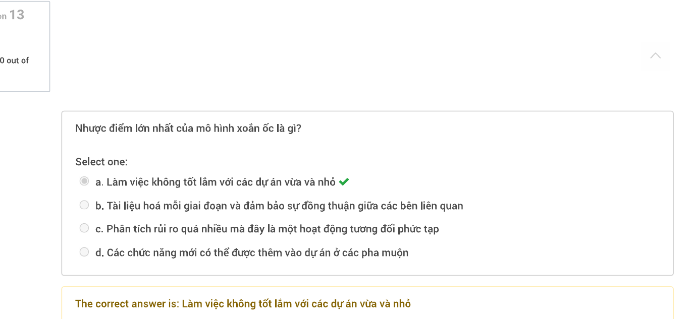

- A. Làm việc không tốt lắm với các dự án vừa và nhỏ
- B. Tài liệu hoá mỗi giai đoạn và đảm bảo sự 'đông thuận giữa các bên liên quan
- C. Phân tích rủi ro quá nhiều mà đây là một hoạt động tương đối phức tạp
- D. Các chức nẵng mới có thể được thêm vào dự án ở các pha muộn

Hiện đáp án và giải thích

**Đáp án:** A. Làm việc không tốt lắm với các dự án vừa và nhỏ

**Giải thích:** Mô hình Xoắn ốc đòi hỏi phải phân tích rủi ro chi tiết ở mỗi vòng lặp. Điều này yêu cầu những chuyên gia siêu đẳng về quản trị rủi ro. Với các dự án nhỏ và vừa (ít ngân sách), việc thuê chuyên gia và vận hành quy trình xoắn ốc nặng nề này gây lãng phí khủng khiếp về thời gian và tiền bạc, hoàn toàn "dùng dao mổ trâu để giết gà".

### Câu 35
Nguồn: c3

Định nghĩa về mô hình chế thử nhanh (rapid/throwable prototype)

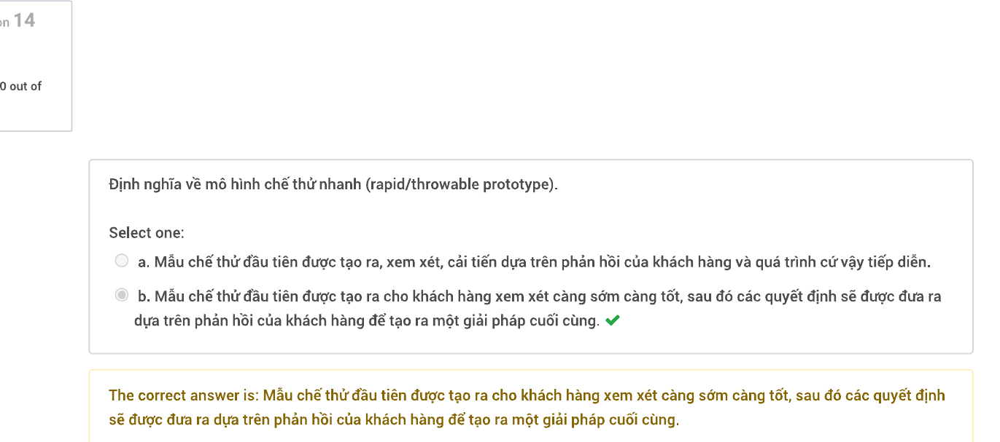

- A. Mẫu chế thử đầu tiên được tạo ra, xem xét, cải tiến dựa trên phản hồi của khách hàng và quá trình cứ vậy tiếp diễn.
- B. Mẫu chế thử đầu tiên được tạo ra cho khách hàng xem xét càng sớm càng tốt, sau đó các quyết định sẽ được đưa ra ựa trên phản hồi của khách hàng để tạo ra một giải pháp cuối cùng.

Hiện đáp án và giải thích

**Đáp án:** Mẫu chế thử đầu tiên được tạo ra cho khách hàng xem xét càng sớm càng tốt, sau đó các quyết định sẽ được đưa ra dựa trên phản hồi của khách hàng để tạo ra một giải pháp cuối cùng.
**Giải thích:** Có hai loại prototype chính. Đáp án B mô tả đúng **Throwaway Prototype (Nguyên mẫu loại bỏ)**: Nó được code cẩu thả cực nhanh cốt để cho khách xem và chốt yêu cầu, sau khi chốt xong thì bản nháp này bị vứt đi để xây dựng lại hệ thống chuẩn từ đầu. Trong khi đó, mô tả A thuộc về Nguyên mẫu tiến hóa (Evolutionary Prototype - đắp dần trên nháp để ra sản phẩm thật).

### Câu 36
Nguồn: c2 p2 / quiz phụ

Phát biểu nào sau đây đúng về Scrum Master trong mô hình Agile Scrum khi phát triển phần mềm

- A. Là đại diện từ phía khách hàng
- B. Là một thành viên của đội dự án, có am hiểu về quy trình
- C. Agile Scrum, đóng vai trò điều phối, tương tác với các thành viên khác để hoàn thành kế hoạch
- D. Là người quản lý dự án
- E. (PM)
- F. Là QA Leader

Hiện đáp án và giải thích

**Đáp án:** Là một thành viên của đội dự án, có am hiểu về 
quy trình Agile Scrum, đóng vai trò điều phối, tương tác với các thành viên khác để hoàn thành kế hoạch

**Giải thích:** (Câu này trùng lặp với Câu 5). Scrum Master chỉ đóng vai trò bảo vệ quy trình làm việc chuẩn Scrum, đóng vai trò hỗ trợ, tháo gỡ khó khăn (facilitator), chứ không có quyền ra lệnh hay áp đặt tiến độ chuyên môn lên Dev Team như một Quản lý dự án (PM) truyền thống.

### Câu 37
Nguồn: c3 p2 / quiz phụ

Đâu là điểm nổi bật nhất của mô hình xoắn ốc?

- A. Hoạt động quản lý chất lượng.
- B. Hoạt động phân tích rủi ro.
- C. Hoạt động quản lý hiệu suất.
- D. Hoạt động lập kế hoạch.

Hiện đáp án và giải thích

**Đáp án:** B. Hoạt động phân tích rủi ro.
**Giải thích:** (Trùng với Câu 6). Phân tích rủi ro (Risk Analysis) là chìa khóa nhận diện của mô hình Boehm (Spiral). Ở góc phần tư thứ 2 của mỗi vòng xoắn ốc, dự án buộc phải dừng lại để đánh giá: Rủi ro kỹ thuật là gì? Phương án dự phòng? Có nên làm Prototype để giảm rủi ro hay có nên hủy bỏ dự án hay không.

### Câu 38
Nguồn: quiz phụ

Mô hình phần mềm nào sau đây nên được lựa chọn nếu đội phát triển có ít kinh nghiệm về dự án tương tự?
- A. RAD
- B. Prototype
- C. Waterfall
- D. Spiral

Hiện đáp án và giải thích

**Đáp án:** D. Spiral

**Giải thích:** (Trùng với Câu 7). Kinh nghiệm của team thấp đồng nghĩa với rủi ro kỹ thuật rất cao. Mô hình Xoắn ốc được sinh ra chính xác là để đối phó và triệt tiêu các dự án có rủi ro kỹ thuật cao bằng cơ chế phân tích và làm mẫu nháp từng vòng.

### Câu 39
Nguồn: quiz phụ

Hai mô hình phần mềm cho phép các yêu cầu phần mềm chưa cần xác định rõ ràng ở các giai đoạn sớm của dự án?
- A. Incremental & Prototype
- B. Waterfall & Spiral
- C. Waterfall & RAD
- D. Spiral & Prototype

Hiện đáp án và giải thích

**Đáp án:** D. Spiral & Prototype

**Giải thích:** (Trùng với Câu 8). Waterfall bắt buộc chốt sổ tài liệu rồi mới code (yêu cầu phải rõ ràng). Incremental cũng cần có cái nhìn tổng quan về kiến trúc lõi. Chỉ có Prototype (dùng bản nháp) và Spiral (vòng lặp rủi ro) là được thiết kế đặc biệt để giải quyết bài toán "vừa đi vừa dò đường" khi yêu cầu ban đầu quá mơ hồ.

### Câu 40
Nguồn: c3 p2 / quiz phụ

Mô hình Tăng dần là kết quả của việc kết hợp các yếu tố của các mô hình nào sau đây?

- A. Linear & Iterative
- B. Prototype & Iterative
- C. Linear & RAD
- D. Linear & Prototype

Hiện đáp án và giải thích

**Đáp án:** D. Linear & Prototype

**Giải thích:** (Trùng câu 19). Theo Pressman, Incremental kết hợp luồng đi tuần tự (Linear) và triết lý lặp lại để học hỏi (Prototype/Iterative). Nó xây dựng lõi phần mềm theo tuyến tính, rồi bàn giao, thu thập ý kiến, và dùng luồng tuyến tính mới đắp thêm module vào cái lõi đó.

### Câu 41
Nguồn: quiz phụ

Lựa chọn nào chỉ ra ưu điểm quan trọng nhất của mô hình tăng dần?
- A. Dễ dàng kiểm thử và sửa lỗi, nhanh chóng đẩy sản phẩm ra thị trường
- B. Dễ dàng kiểm thử và sửa lỗi
- C. Khách hàng có thể phản hồi về từng phiên bản ”tăng dần”
- D. Mô hình này thường được dùng khi muốn phát triển một sản phẩm nhanh chóng đẩy ra thị trường

Hiện đáp án và giải thích

**Đáp án:** Dễ dàng kiểm thử và sửa lỗi, nhanh chóng đẩy sản phẩm ra thị trường

**Giải thích:** (Trùng câu 20). Chia nhỏ dự án ra nhiều phần Increments mang lại 2 lợi ích tuyệt đối so với ôm 1 cục: Module nhỏ hơn nghĩa là Test dễ hơn/ít lỗi hơn; và tính năng cốt lõi (Core increment) được code xong trước nên sản phẩm tung ra thị trường sớm hơn đối thủ.

### Câu 42
Nguồn: quiz phụ

Mô hình xoáy ốc (Spiral) có hai chiều (dimensions) là.... và.....?
- A. radial và angular đường chéo (diagonal) và góc (angular)
- C. diagonal và perpendicular
- D. tia xuất phát từ tâm (radial) và các đường vuông góc (perpendicular)

Hiện đáp án và giải thích

**Đáp án:** radial và angular

**Giải thích:** (Trùng câu 21). Trong đồ thị của mô hình Boehm: 
- Angular (Trục góc): Đại diện cho tiến độ (progress) hoàn thành công việc ở các chu kỳ.
- Radial (Trục bán kính tia từ tâm): Càng ngày càng nở rộng ra ngoài, đại diện cho chi phí (Cost) và nỗ lực (Effort) tăng dần qua mỗi vòng xoắn.

### Câu 43
Nguồn: quiz phụ

Nhược điểm lớn nhất của mô hình xoắn ốc là gì?
- A. Tài liệu hoá mỗi giai đoạn và đảm bảo sự đồng thuận giữa các bên liên quan
- B. Làm việc không tốt lắm với các dự án vừa và nhỏ
- C. Phân tích rủi ro quá nhiều mà đây là một hoạt động tương đối phức tạp
- D. Các chức năng mới có thể được thêm vào dự án ở các pha muộn

Hiện đáp án và giải thích

**Đáp án:** B. Làm việc không tốt lắm với các dự án vừa và nhỏ

**Giải thích:** (Trùng câu 34). Áp dụng Spiral cho dự án nhỏ là một sự tốn kém và cồng kềnh quá mức cần thiết, do quy trình này đòi hỏi phải phân tích rủi ro và đánh giá vòng lặp quá khắt khe, tốn nhiều chi phí tư vấn.

### Câu 44
Nguồn: c3 p2 / quiz phụ

Định nghĩa về mô hình chế thử nhanh (rapid/throwable prototype).
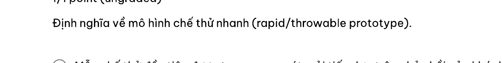

- A. Mẫu chế thử đầu tiên được tạo ra cho khách hàng xem xét càng sớm càng tốt, sau đó các quyết định sẽ được đưa ra dựa trên phản hồi của khách hàng để tạo ra một giải pháp cuối cùng.
- B. Mẫu chế thử đầu tiên được tạo ra, xem xét, cải tiến dựa trên phản hồi của khách hàng và quá trình cứ vậy tiếp diễn.

Hiện đáp án và giải thích

**Đáp án:** Mẫu chế thử đầu tiên được tạo ra cho khách hàng xem xét càng sớm càng tốt, sau đó các quyết định sẽ được đưa ra dựa trên phản hồi của khách hàng để tạo ra một giải pháp cuối cùng.
**Giải thích:** (Trùng câu 35). Keyword của "Throwable/Throwaway Prototype" (Nguyên mẫu loại bỏ) là làm nháp thật nhanh để gợi mở ý tưởng. Sau khi hai bên chốt xong thiết kế giải pháp cuối cùng, bản nháp (code bẩn) sẽ bị đập đi hoàn toàn, nhường chỗ cho việc code thật từ vạch xuất phát.

### Câu 45
Nguồn: quiz phụ

Hình vẽ sau đây mô tả loại mô hình chế thử nào?
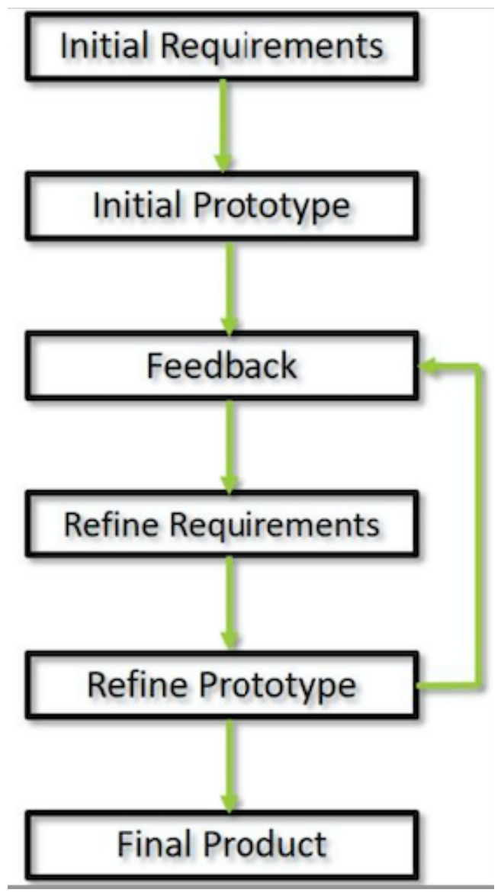

- A. Throwaway Prototype
- B. Incremental Prototype
- C. Evolutionary Prototype
- D. Requirement Prototype

Hiện đáp án và giải thích

**Đáp án:** C. Evolutionary Prototype

**Giải thích:** Trong sơ đồ có bước "Initial Prototype $\rightarrow$ Feedback $\rightarrow$ Refine Prototype $\rightarrow$ Final Product". Quá trình này mô tả bản thân cái Prototype (bản nháp) cứ tiếp tục được refine (tinh chỉnh/gọt giũa/đắp thêm) mãi cho đến khi nó hóa thành Final Product. Đó đích thị là đặc trưng tiến hóa không bị đập đi của **Evolutionary Prototype**.

### Câu 46
Nguồn: quiz phụ

Hình vẽ sau mô tả loại mô hình chế thử nào?
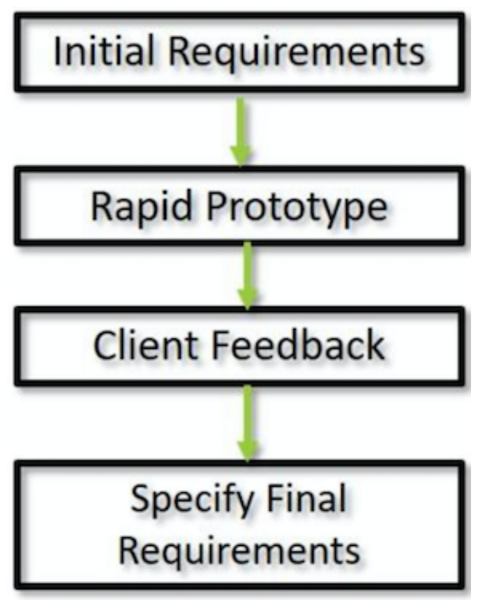

- A. Requirement Prototype
- B. Throwaway Prototype
- C. Incremental Prototype
- D. Evolutionary Prototype

Hiện đáp án và giải thích

**Đáp án:** B. Throwaway Prototype

**Giải thích:** Trong sơ đồ này: "Rapid Prototype $\rightarrow$ Client Feedback $\rightarrow$ Specify Final Requirements". Bản Prototype ở đây chỉ đóng vai trò phương tiện trung gian để làm rõ "Tài liệu yêu cầu cuối cùng" (Specify Final Requirements). Sau khi chốt được tài liệu, hệ thống thật mới bắt đầu được xây dựng từ tài liệu đó. Đây là **Throwaway Prototype (Mẫu thử loại bỏ)**.

### Câu 47
Nguồn: c3 / quiz phụ

Thế nào là một mẫu thử?
- A. được coi là một phần giả lập của một
- B. Phần mềm hoặc một giải pháp cho một vấn đề nào đó
- C. Là một Phần mềm mới được tạo ra cho một mục đích đặc biệt nào đó
- D. Một tác vụ trong dự án phải được hoàn thành trước khi tác vụ khác được bắt đầu
- E. Các tác vụ cần được hoàn thành đúng hạn

Hiện đáp án và giải thích

**Đáp án:** được coi là một phần giả lập của một phần mềm hoặc một giải pháp cho một vấn đề nào đó

**Giải thích:** Mẫu thử (Prototype) bản chất không phải là sản phẩm hoàn chỉnh mà chỉ là hình ảnh mô phỏng (Mockup), giả lập giao diện hoặc giả lập một đoạn logic hẹp của phần mềm. Nó được dùng để khách hàng "có cái để hình dung" và trải nghiệm sớm, từ đó đánh giá giải pháp trước khi đi sâu lập trình.

### Câu 48
Nguồn: quiz phụ

Mô hình nào dưới đây cho phép người dùng tham gia vào mọi pha trong quá trình phát triển phần mềm?
- A. Mô hình nguyên mẫu
- B. Mô hình tăng dần (gia tăng)
- C. Mô hình Thác nước
- D. Mô hình nguyên mẫu và mô hình gia tăng

Hiện đáp án và giải thích

**Đáp án:** A. Mô hình nguyên mẫu

**Giải thích:** Với **Mô hình nguyên mẫu (Prototype)**, do bản chất phải phụ thuộc vào ý kiến điều chỉnh để làm mịn phần mềm, nên sự tương tác của khách hàng liên tục xuất hiện ở mọi bước (từ phác thảo yêu cầu $\rightarrow$ thiết kế nhanh $\rightarrow$ đánh giá mẫu thử $\rightarrow$ tinh chỉnh lại). Ngược lại, Thác nước chỉ lấy yêu cầu lúc đầu rồi "mất tích" đến cuối mới giao hàng.

### Câu 49
Nguồn: c3 p2 / quiz phụ

Mô hình tăng dần (incremental) khác với mô hình xoáy ốc (spiral) ở điểm nào?

- A. Thay đổi yêu cầu
- B. Phần mềm có thể được thêm vào trong mô hình tăng dần
- C. Tiến độ dự án có thể ước tính được với mô hình tăng dần
- D. Khách hàng có thể nhìn thấy toàn bộ hệ thống từ các pha sớm trong mô hình tăng dần
- E. Tất cả các lựa chọn trên đều đúng

Hiện đáp án và giải thích

**Đáp án:** C. Tiến độ dự án có thể ước tính được với mô hình tăng dần

**Giải thích:** Mô hình tăng dần chia hệ thống đã chốt đặc tả sẵn thành các mô-đun chức năng riêng rẽ và xây dựng từng phần, do đó rất dễ lập kế hoạch ước lượng lịch trình (Ví dụ: Module A tốn 2 tháng, B tốn 1 tháng). Trong khi đó, Spiral đi theo vòng lặp, luôn tồn tại xác suất rủi ro không lường trước hoặc đập đi làm mẫu thử lại, nên không thể ước tính tiến độ chính xác.

### Câu 50
Nguồn: c3

Hình vẽ sau đây mô tả loại mô hình chế thử nào?
Initial Requirements Initial Prototype Feedback Refine Requirements Refine Prototype Final Product

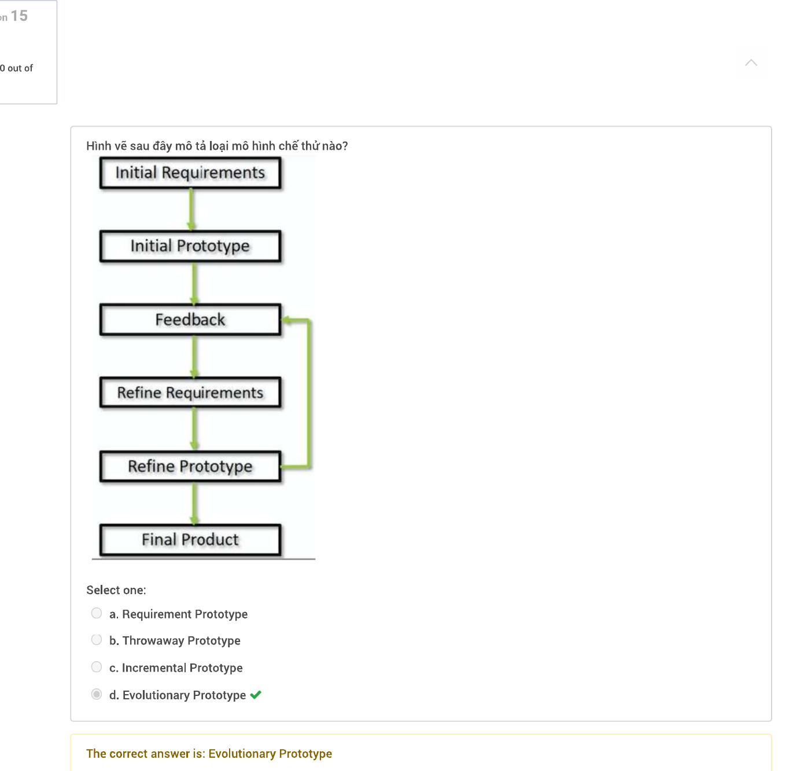

- A. Requirement Prototype
- B. Throwaway Prototype
- C. Incremental Prototype
- D. Evolutionary Prototype

Hiện đáp án và giải thích

**Đáp án:** D. Evolutionary Prototype

**Giải thích:** (Trùng câu 45). Luồng Refine Prototype liên tục tiến hóa cho đến khi chuyển hóa thành Final Product (không bị vứt đi) chính là định nghĩa của Nguyên mẫu tiến hóa (Evolutionary Prototype).

### Câu 51
Nguồn: c3

Hình vẽ sau mô tả loại mô hình chế thử nào?
Initial Requirements Rapid Prototype Client Feedback Specify Final Requirements

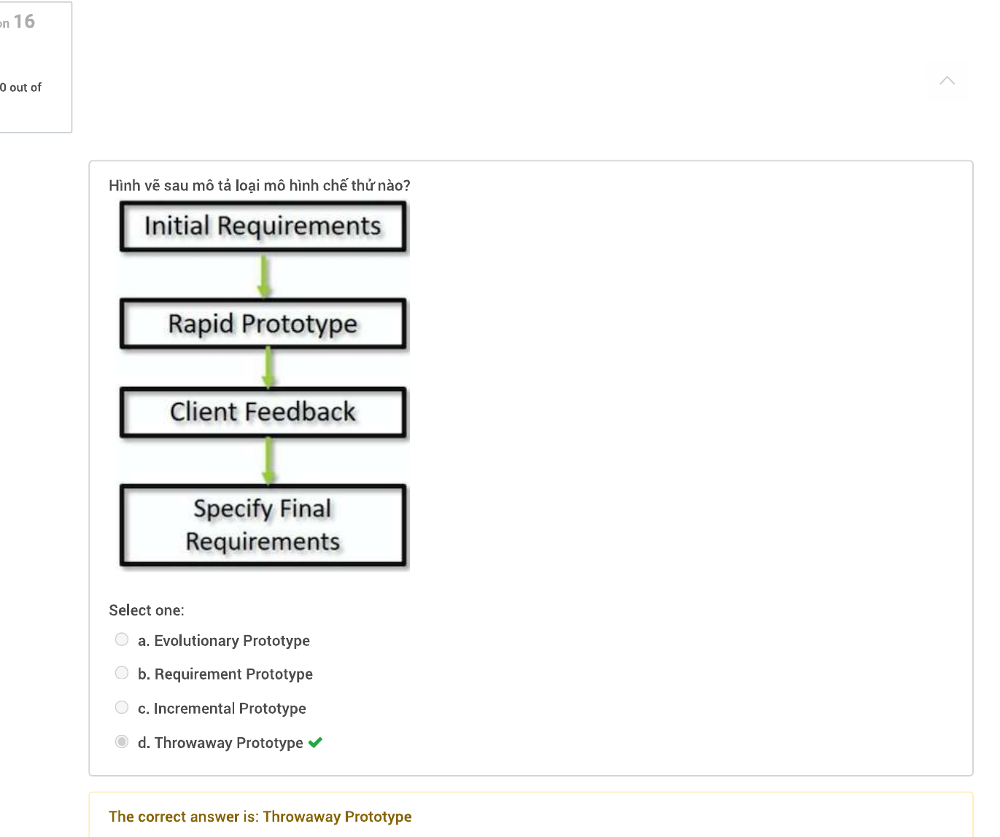

- A. Evolutionary Prototype
- B. Requirement Prototype
- C. Incremental Prototype
- D. Throwaway Prototype

Hiện đáp án và giải thích

**Đáp án:** D. Throwaway Prototype

**Giải thích:** (Trùng câu 46). Bản Prototype chỉ được dùng để "Specify Final Requirements" (Đặc tả yêu cầu cuối cùng) rồi dừng. Đây là Mẫu thử loại bỏ.

### Câu 52
Nguồn: c3

Mô hình nào dưới đây cho phép người dùng tham gia vào mọi pha trong quá trình phát triển phần mềm?
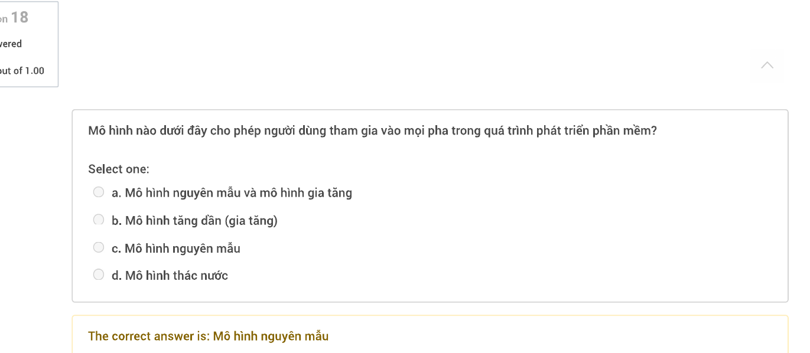

- A. Mô hình nguyên mẫu và mô hình gia tăng
- B. Mô hinh tăng dần (gia tăng) g
- C. Mô hình nguyên mẫu
- D. Mô hình Thác nước

Hiện đáp án và giải thích

**Đáp án:** C. Mô hình nguyên mẫu

**Giải thích:** (Trùng câu 48). Mô hình nguyên mẫu yêu cầu sự tham gia và phản hồi liên tục của khách hàng ngay từ bước thiết kế cho đến khi bàn giao.

### Câu 53
Nguồn: c3

Mô hình tăng dần (incremental) khác với mô hình xoáy ốc (spiral) ở điểm nào?
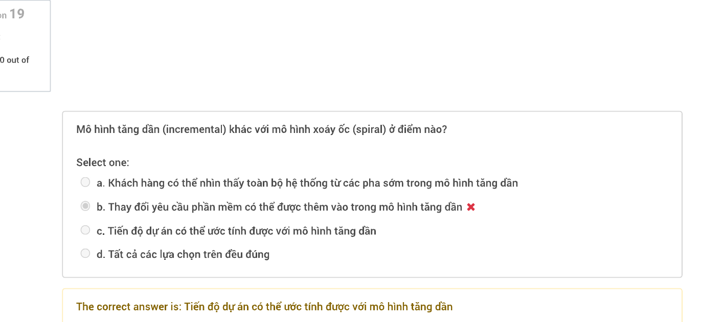

- A. Khách hàng có thể nhìn thấy toàn bộ hệ thống từ các pha sớm trong mô hình tăng dầân
- B. Thay đổi yêu cầu
- C. Phần mềm có thể được thêm vào trong mô hình tăng dần
- D. Tiến độ dự án có thể ước tính được với mô hình tăng dần
- E. Tất cả các lựa chọn trên đều đúng

Hiện đáp án và giải thích

**Đáp án:** D. Tiến độ dự án có thể ước tính được với mô hình tăng dần

**Giải thích:** (Trùng câu 49). Incremental đi theo tuyến tính lặp nên ước lượng được lịch trình. Spiral đi theo quản trị rủi ro nên rất khó ước lượng.

### Câu 54
Nguồn: c3

Mô hình xoắn ốc có sự tham gia của khách hàng trong tất cả các pha của dự án

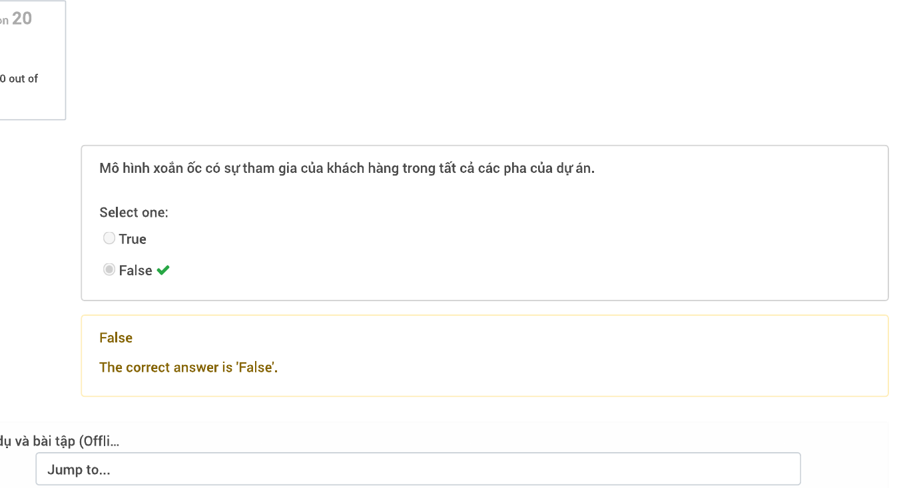

- A. True
- B. False

Hiện đáp án và giải thích

**Đáp án:** B. False (Sai)

**Giải thích:** Mô hình xoắn ốc (Spiral) có 4 cung phần tư kinh điển. Khách hàng thường chỉ tham gia vào góc phần tư thứ 4 là **Đánh giá (Evaluation) của khách hàng** ở cuối mỗi vòng xoắn. Còn trong các pha như Kế hoạch (Planning), Phân tích rủi ro (Risk Analysis) và Kỹ nghệ lập trình (Engineering), đó là công việc nội bộ chuyên sâu của đội phát triển. Do đó nói KH tham gia vào "tất cả các pha" là hoàn toàn sai.

## Chương 4: Quản lý dự án phần mềm

### Câu 1
Nguồn: c4 p2

Quan sát màn hình giao diện đăng ký tài khoản Google dưới đây. Các phần tử giao diện được khoanh đỏ trong hình thuộc loại nào?

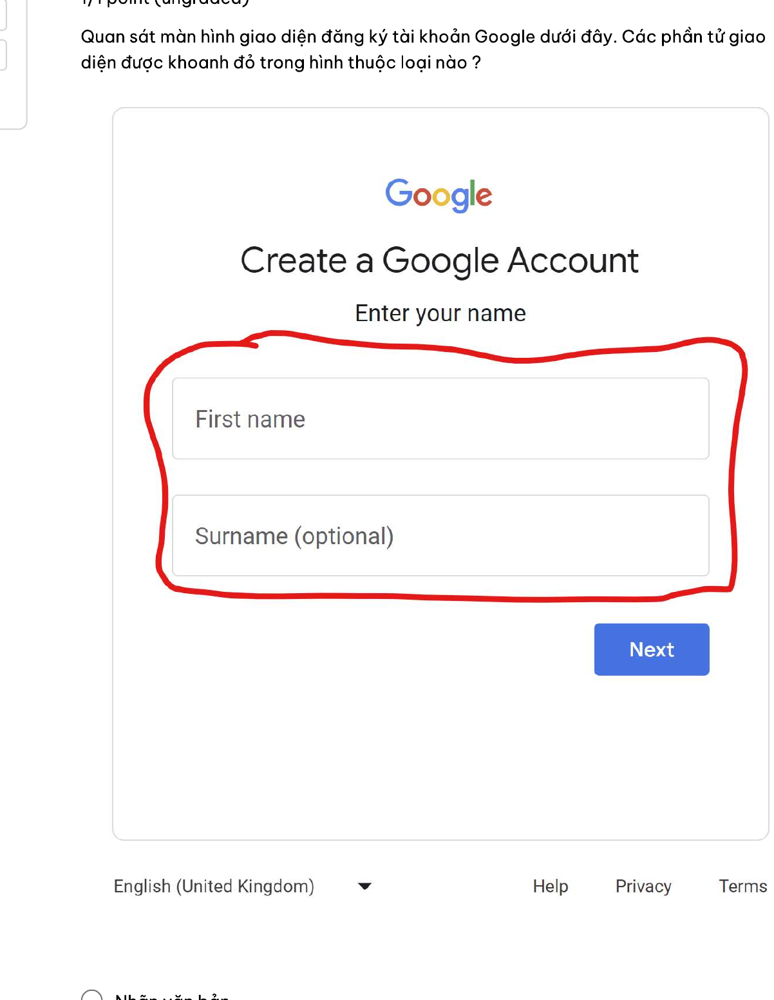

- A. Nhãn văn bản
- B. Nút bấm
- C. Ô nhập liệu
- D. Tiêu đề

Hiện đáp án và giải thích

**Đáp án:** C. Ô nhập liệu

**Giải thích:** Với hình giao diện, cần nhìn loại control, nhãn, vị trí và tính nhất quán giữa các màn hình. Thiết kế giao diện tốt dựa trên tính nhất quán, khả năng nhận biết và giảm gánh nặng ghi nhớ cho người dùng. Phương án sai thường nhầm loại control, luồng thao tác hoặc nguyên tắc usability đang bị vi phạm. Các lỗi giao diện thường lộ ra ở nhãn mơ hồ, vị trí control không nhất quán hoặc thao tác bắt người dùng nhớ quá nhiều.

### Câu 2
Nguồn: c4 p2 / quiz phụ

Mô tả sau đây thuộc loại nào: Sinh viên: Thông tin chung: Độ tuổi: 18-22 Trình độ văn hóa: tốt nghiệp trung học phổ thông Hiện đang theo học tại các trường đại học tại Hà Nội, và có làm thêm (bán thời gian). Vai trò: Người thực hiện công việc Mục đích mục tiêu tương tác: Được nhắc nhở thời hạn hoàn thành các bài tập, bài kiểm tra Theo dõi lịch học Tìm kiếm giải pháp hỗ trợ cân bằng trách nhiệm học tập với các hoạt động xã hội và lợi ích cá nhân.

- A. Bản mô tả yêu cầu xuất phát từ nhu cầu của
- B. Người dùng và bối cảnh sử dụng
- C. Hồ sơ Người dùng Bản mô tả bối cảnh sử dụng
- D. Báo cáo về nhu cầu
- E. Người dùng

Hiện đáp án và giải thích

**Đáp án:** B. Hồ sơ người dùng

**Giải thích:** Bảo trì chiếm chi phí lớn vì phần mềm luôn phải sửa lỗi, thích nghi môi trường và đáp ứng yêu cầu mới. Đừng hiểu bảo trì chỉ là sửa lỗi sau phát hành; nó còn bao gồm cải tiến và thích nghi. Bảo trì có thể là sửa lỗi, thích nghi môi trường hoặc cải tiến; không nên đồng nhất nó với một lần vá lỗi đơn lẻ.

### Câu 3
Nguồn: c4 p2

Cô A. cân thiết kế một cửa sổ thông báo có kích thước tuân thủ tỉ lệ vàng. Tỉ lệ kích thước của cửa số đó là:

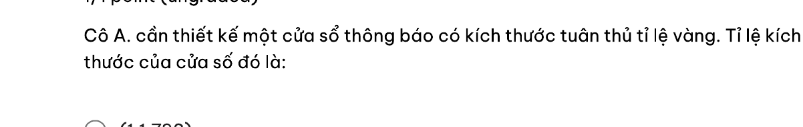

- A. (1:1.732)
- B. (1:2)
- C. (1:1.618)
- D. (1:1)

Hiện đáp án và giải thích

**Đáp án:** C. (1:1.618)

**Giải thích:** Với câu có hình, phần ảnh đang cung cấp dấu hiệu chính để nhận ra quản lý dự án phần mềm; phần chữ OCR chỉ nên dùng để đối chiếu. Câu hỏi thường xoay quanh phạm vi, tiến độ, chi phí, rủi ro và nhóm quy trình quản lý. Đáp án sai hay trộn khái niệm sản phẩm với công việc quản lý dự án. Nhãn, mũi tên và vị trí phần tử trong sơ đồ thường quyết định đáp án hơn phần mô tả OCR bị thiếu.

### Câu 4
Nguồn: c4 / quiz phụ

Mô tả nào sau đây đúng về phạm vi sản phẩm và phạm vi dự án?

- A. 9
- B. Phạm vi sản phẩm trả lời câu hỏi: cần làm gì. Phạm vi dự án trả lời câu hỏi: làm nhưthế nào
- C. Phạm vi sản phẩm trả lời câu hỏi: cần tạo ra cái gì. Phạm vi dự án trả lời câu hỏi: cần làm gì
- D. Phạm vi sản phẩm trả lời câu hỏi: cần tạo ra cái gì. Phạm vi dự án trả lời câu hỏi: làm nhưthế nào.
- E. Phạm vi sản phẩm trả lời câu hỏi: cần làm gì. Phạm vi dự án trả lời câu hỏi: cần tạo ra cái gì

Hiện đáp án và giải thích

**Đáp án:** C. Phạm vi sản phẩm trả lời câu hỏi: cần tạo ra cái gì. Phạm vi dự án trả lời câu hỏi: cần làm gì

**Giải thích:** Phạm vi sản phẩm nói về thứ cần tạo ra, còn phạm vi dự án nói về công việc phải làm để tạo ra nó. Nhầm hai phạm vi này dễ dẫn tới chọn đáp án nói đúng một nửa nhưng sai ngữ cảnh. Loại các phương án chỉ nói về công cụ, pha khác hoặc hệ quả phụ; đáp án đúng phải giữ đúng phạm vi khái niệm.

### Câu 5
Nguồn: c4 / quiz phụ

Phần tử ở mức thấp nhất trong cấu trúc phân cấp công việc được gọi là gì?

- A. ông việc Hoạt động
- B. Sản phẩm bàn giao
- C. Gói công việc

Hiện đáp án và giải thích

**Đáp án:** C. Gói công việc

**Giải thích:** WBS phân rã công việc dự án thành các gói nhỏ để ước lượng, giao việc và theo dõi. Mức thấp nhất là gói công việc, không phải mục tiêu sản phẩm hay tài liệu bàn giao chung. WBS dừng ở gói công việc đủ nhỏ để giao và theo dõi, không phải ở mục tiêu nghiệp vụ cấp cao.

### Câu 6
Nguồn: c4 / c4 p2 / quiz phụ

Đâu không phải là một mục tiêu ước lượng dự án?

- A. Số lượng lỗi Thời gian
- B. Số ngày công
- C. Chi phí

Hiện đáp án và giải thích

**Đáp án:** Số lượng lỗi

**Giải thích:** Câu hỏi đang tìm ngoại lệ của quản lý dự án phần mềm; hãy giữ lại các lựa chọn đúng chuẩn rồi xét lựa chọn còn nằm ngoài phạm vi. Câu hỏi thường xoay quanh phạm vi, tiến độ, chi phí, rủi ro và nhóm quy trình quản lý. Đáp án sai hay trộn khái niệm sản phẩm với công việc quản lý dự án. Các phương án còn lại thường đúng nhưng thuộc cùng nhóm chuẩn; đáp án cần chọn là ý nhầm pha, nhầm phạm vi hoặc không thuộc danh sách đang hỏi.

### Câu 7
Nguồn: c4 / c4 p2 / quiz phụ

Mô tả nào sau đây không phải là một phân mục kiến thức về quản lý dự án?

- A. ,
- B. Quản lý phạm vi
- C. Quản lý nguồn lực
- D. Quản lý chiến lược
- E. Quản lý rủi ro

Hiện đáp án và giải thích

**Đáp án:** D. Quản lý chiến lược

**Giải thích:** Câu hỏi đang tìm ngoại lệ của quản lý rủi ro; hãy giữ lại các lựa chọn đúng chuẩn rồi xét lựa chọn còn nằm ngoài phạm vi. Rủi ro được đánh giá bằng khả năng xảy ra và mức ảnh hưởng tới mục tiêu dự án. Rủi ro kỹ thuật liên quan công nghệ, nền tảng, nhân lực kỹ thuật; rủi ro lịch trình hoặc tổ chức thuộc nhóm khác. Các phương án còn lại thường đúng nhưng thuộc cùng nhóm chuẩn; đáp án cần chọn là ý nhầm pha, nhầm phạm vi hoặc không thuộc danh sách đang hỏi.

### Câu 8
Nguồn: c4 / c4 p2 / quiz phụ

Mô tả nào sau đây không thể hiện tính thời hạn của dự án?

- A. Dự án kết thúc khi đã đạt mục tiêu đề ra.
- B. Dự án có thời điểm bắt đầu, thời điểm kết thúc rõ ràng.
- C. Cơ quan chủ quản không muốn kết thúc dự án.
- D. Dự án kết thúc do các vấn đề pháp lý.

Hiện đáp án và giải thích

**Đáp án:** C. Cơ quan chủ quản không muốn kết thúc dự án.

**Giải thích:** Câu hỏi đang tìm ngoại lệ của quản lý dự án phần mềm; hãy giữ lại các lựa chọn đúng chuẩn rồi xét lựa chọn còn nằm ngoài phạm vi. Câu hỏi thường xoay quanh phạm vi, tiến độ, chi phí, rủi ro và nhóm quy trình quản lý. Đáp án sai hay trộn khái niệm sản phẩm với công việc quản lý dự án. Các phương án còn lại thường đúng nhưng thuộc cùng nhóm chuẩn; đáp án cần chọn là ý nhầm pha, nhầm phạm vi hoặc không thuộc danh sách đang hỏi.

### Câu 9
Nguồn: c4 / quiz phụ

Dự án nào sau đây không phải dự án phần mềm?

- A. Dự án chuyển đổi nhà cung cấp dịch vụ công nghệ thông tin.
- B. Dự án chỉnh sửa một phần mềm có sẵn.
- C. Dự án tích hợp một tập hợp các thành phần phần mềm hiện có.
- D. Dự án xây dựng một phần mềm mới.

Hiện đáp án và giải thích

**Đáp án:** A. Dự án chuyển đổi nhà cung cấp dịch vụ công nghệ thông tin.

**Giải thích:** Câu hỏi đang tìm ngoại lệ của quản lý dự án phần mềm; hãy giữ lại các lựa chọn đúng chuẩn rồi xét lựa chọn còn nằm ngoài phạm vi. Câu hỏi thường xoay quanh phạm vi, tiến độ, chi phí, rủi ro và nhóm quy trình quản lý. Đáp án sai hay trộn khái niệm sản phẩm với công việc quản lý dự án. Các phương án còn lại thường đúng nhưng thuộc cùng nhóm chuẩn; đáp án cần chọn là ý nhầm pha, nhầm phạm vi hoặc không thuộc danh sách đang hỏi.

### Câu 10
Nguồn: c4 / quiz phụ

Xét dự án phần mềm A. Dự án này bị chậm tiến độ 10 tháng, chi phí tăng gấp rưỡi so với dự kiến. Nhưng sản phẩm của dự án được khách hàng sử dụng liên tục trong vòng 15 năm vì nó rất hữu ích cho công việc của họ. Mức độ thành công của dự án này là gì?

- A. Tiềm năng cho tương lai
- B. Thành công trong nghiệp vụ
- C. Thành công trong quản lý dự án
- D. Thành công trong dự án

Hiện đáp án và giải thích

**Đáp án:** D. Thành công trong dự án

**Giải thích:** Câu hỏi thường xoay quanh phạm vi, tiến độ, chi phí, rủi ro và nhóm quy trình quản lý. Đáp án sai hay trộn khái niệm sản phẩm với công việc quản lý dự án. Loại các phương án chỉ nói về công cụ, pha khác hoặc hệ quả phụ; đáp án đúng phải giữ đúng phạm vi khái niệm.

### Câu 11
Nguồn: c4 / c4 p2 / quiz phụ

Thành phần nào sau đây không thuộc 4 thành phần của quản lý dự án (4Ps of project management)?

- A. Con người (People)
- B. Quy trình (Process)
- C. Hồ sơ (Portfolio)
- D. Sản phẩm (Product)

Hiện đáp án và giải thích

**Đáp án:** C. Hồ sơ (Portfolio)

**Giải thích:** Câu hỏi đang tìm ngoại lệ của quản lý dự án; hãy giữ lại các lựa chọn đúng chuẩn rồi xét lựa chọn còn nằm ngoài phạm vi. Quản lý dự án phối hợp con người, quy trình, sản phẩm và ràng buộc tiến độ/chi phí/chất lượng. Nhóm thực thi biến kế hoạch thành công việc cụ thể, còn lập kế hoạch, giám sát hoặc kết thúc thuộc nhóm quy trình khác. Các phương án còn lại thường đúng nhưng thuộc cùng nhóm chuẩn; đáp án cần chọn là ý nhầm pha, nhầm phạm vi hoặc không thuộc danh sách đang hỏi.

### Câu 12
Nguồn: quiz phụ

Ai không phải là thành viên của một đội phát triển dự án phần mềm?

- A. Người dùng cuối (End user)
- B. Kỹ sư phát triển / triển khai (DevOps Engineer)
- C. Kiến trúc sư phần mềm (Software architect)
- D. Người phân tích nghiệp vụ (Business analyst)

Hiện đáp án và giải thích

**Đáp án:** A. Người dùng cuối (End user)

**Giải thích:** Câu hỏi đang tìm ngoại lệ của kiến trúc/thiết kế phần mềm; hãy giữ lại các lựa chọn đúng chuẩn rồi xét lựa chọn còn nằm ngoài phạm vi. Thiết kế kiến trúc chia hệ thống thành thành phần và quan hệ phụ thuộc để dễ thay đổi, triển khai và kiểm thử. Pattern được nhận diện bằng cấu trúc luồng xử lý: layered theo tầng, pipes-and-filters theo chuỗi biến đổi dữ liệu. Các phương án còn lại thường đúng nhưng thuộc cùng nhóm chuẩn; đáp án cần chọn là ý nhầm pha, nhầm phạm vi hoặc không thuộc danh sách đang hỏi.

### Câu 13
Nguồn: c4 / c4 p2 / quiz phụ

Mô tả nào sau đây không thể hiện các đầu vào đặc trưng của dự án?

- A. Tiền bạc, thời gian, công nghệ
- B. Các yêu cầu, chỉ dẫn thực hiện
- C. Con người, thiết bị, máy móc
- D. Sản phẩm giao nộp

Hiện đáp án và giải thích

**Đáp án:** D. Sản phẩm giao nộp

**Giải thích:** Câu hỏi đang tìm ngoại lệ của yêu cầu phần mềm; hãy giữ lại các lựa chọn đúng chuẩn rồi xét lựa chọn còn nằm ngoài phạm vi. Yêu cầu chức năng mô tả hệ thống phải làm gì; yêu cầu phi chức năng mô tả ràng buộc chất lượng như bảo mật, hiệu năng, độ tin cậy. Các câu ngoại lệ thường gài những mô tả về dữ liệu, giao diện hoặc tổ chức không trực tiếp là chức năng hệ thống. Các phương án còn lại thường đúng nhưng thuộc cùng nhóm chuẩn; đáp án cần chọn là ý nhầm pha, nhầm phạm vi hoặc không thuộc danh sách đang hỏi.

### Câu 14
Nguồn: c4 / c4 p2 / quiz phụ

Nhóm quy trình nào sau đây không phải là nhóm quy trình quản lý dự án?

- A. Nhóm quy trình lập kế hoạch
- B. Nhóm quy trình tổ chức
- C. Nhóm quy trình khởi tạo
- D. Nhóm quy trình giám sát và kiểm soát

Hiện đáp án và giải thích

**Đáp án:** B. Nhóm quy trình tổ chức

**Giải thích:** Câu hỏi đang tìm ngoại lệ của quản lý dự án; hãy giữ lại các lựa chọn đúng chuẩn rồi xét lựa chọn còn nằm ngoài phạm vi. Quản lý dự án phối hợp con người, quy trình, sản phẩm và ràng buộc tiến độ/chi phí/chất lượng. Nhóm thực thi biến kế hoạch thành công việc cụ thể, còn lập kế hoạch, giám sát hoặc kết thúc thuộc nhóm quy trình khác. Các phương án còn lại thường đúng nhưng thuộc cùng nhóm chuẩn; đáp án cần chọn là ý nhầm pha, nhầm phạm vi hoặc không thuộc danh sách đang hỏi.

### Câu 15
Nguồn: c4 p2 / quiz phụ

Thông tin về các công việc / hoạt động cần thực hiện trong khuôn khổ dự án là đầu ra của nhóm quy trình quản lý dự án nào?

- A. Nhóm quy trình giám sát và kiểm soát
- B. Nhóm quy trình thực thi
- C. Nhóm quy trình khởi tạo
- D. Nhóm quy trình lập kế hoạch

Hiện đáp án và giải thích

**Đáp án:** D. Nhóm quy trình lập kế hoạch

**Giải thích:** Quản lý dự án phối hợp con người, quy trình, sản phẩm và ràng buộc tiến độ/chi phí/chất lượng. Nhóm thực thi biến kế hoạch thành công việc cụ thể, còn lập kế hoạch, giám sát hoặc kết thúc thuộc nhóm quy trình khác. Các câu PM thường xoay quanh người, sản phẩm, quy trình, phạm vi, chi phí và tiến độ; đáp án sai hay trộn sang portfolio hoặc kỹ thuật triển khai.

### Câu 16
Nguồn: c4 / quiz phụ

Hoạt động nào sau đây không thuộc về kế hoạch quản lý thời gian?

- A. Xâu chuỗi các hoạt động
- B. Ước tính chi phí của từng hoạt động
- C. Lập lịch thực hiện các hoạt động
- D. Xác định các hoạt động

Hiện đáp án và giải thích

**Đáp án:** B. Ước tính chi phí của từng hoạt động

**Giải thích:** Câu hỏi đang tìm ngoại lệ của quản lý dự án phần mềm; hãy giữ lại các lựa chọn đúng chuẩn rồi xét lựa chọn còn nằm ngoài phạm vi. Câu hỏi thường xoay quanh phạm vi, tiến độ, chi phí, rủi ro và nhóm quy trình quản lý. Đáp án sai hay trộn khái niệm sản phẩm với công việc quản lý dự án. Các phương án còn lại thường đúng nhưng thuộc cùng nhóm chuẩn; đáp án cần chọn là ý nhầm pha, nhầm phạm vi hoặc không thuộc danh sách đang hỏi.

### Câu 17
Nguồn: c4 / quiz phụ

Phát biểu nào sau đây là đúng về đường găng (critical path)?

- A. Các hoạt động trên đường găng được phép trễ hạn
- B. Các hoạt động trên đường găng không có quan hệ phụ thuộc về thứ tự thực hiện
- C. Các hoạt động trên đường găng có thể thực hiện song song
- D. Các hoạt động trên đường găng không được phép trễ hạn

Hiện đáp án và giải thích

**Đáp án:** D. Các hoạt động trên đường găng không được phép trễ hạn

**Giải thích:** Đường găng gồm các công việc có độ dự trữ bằng không nên trễ ở đó sẽ kéo trễ toàn dự án. Các công việc ngoài đường găng có thể có khoảng trễ nhất định mà chưa làm đổi ngày kết thúc. Loại các phương án chỉ nói về công cụ, pha khác hoặc hệ quả phụ; đáp án đúng phải giữ đúng phạm vi khái niệm.

### Câu 18
Nguồn: c4 / c4 p2 / quiz phụ

Đâu không phải là một rủi ro kỹ thuật của dự án phần mềm?

- A. Lựa chọn nền tảng phát triển, ngôn ngữ hoặc công cụ mới trong khi số lượng nhân sự hạn chế và thiếu kinh nghiệm
- B. Mã nguồn chất lượng kém dẫn đến phần mềm không đáp ứng được yêu cầu về hiệu suất
- C. Các module phần mềm được tích hợp trễ, dẫn tới việc kiểm thử trễ, khi phát hiện lỗi không có đủ thời gian sửa chữa
- D. Lịch trình cơ sở không nhất quán với tốc độ thực hiện dự án thực tế

Hiện đáp án và giải thích

**Đáp án:** D. Lịch trình cơ sở không nhất quán với tốc độ thực hiện dự án thực tế

**Giải thích:** Câu hỏi đang tìm ngoại lệ của quản lý rủi ro; hãy giữ lại các lựa chọn đúng chuẩn rồi xét lựa chọn còn nằm ngoài phạm vi. Rủi ro được đánh giá bằng khả năng xảy ra và mức ảnh hưởng tới mục tiêu dự án. Rủi ro kỹ thuật liên quan công nghệ, nền tảng, nhân lực kỹ thuật; rủi ro lịch trình hoặc tổ chức thuộc nhóm khác. Các phương án còn lại thường đúng nhưng thuộc cùng nhóm chuẩn; đáp án cần chọn là ý nhầm pha, nhầm phạm vi hoặc không thuộc danh sách đang hỏi.

### Câu 19
Nguồn: c4 / c4 p2 / quiz phụ

Một quá trình liên quan đến việc ưu tiên các rủi ro để có hành động hoặc phân tích tiếp theo bằng cách đánh giá tác động và xác suất xảy ra được gọi là?

- A. Phân tích rủi ro định tính
- B. Đáp trả rủi ro
- C. Xác định rủi ro
- D. Phân tích rủi ro định lượng

Hiện đáp án và giải thích

**Đáp án:** A. Phân tích rủi ro định tính

**Giải thích:** Rủi ro được đánh giá bằng khả năng xảy ra và mức ảnh hưởng tới mục tiêu dự án. Rủi ro kỹ thuật liên quan công nghệ, nền tảng, nhân lực kỹ thuật; rủi ro lịch trình hoặc tổ chức thuộc nhóm khác. Rủi ro kỹ thuật liên quan công nghệ và giải pháp; rủi ro lịch trình hoặc tổ chức thuộc nhóm quản trị khác.

### Câu 20
Nguồn: c4 / c4 p2 / quiz phụ

Đâu không phải một kiểu ứng phó rủi ro?

- A. Giảm thiểu (Mitigate)
- B. Tránh (Avoid)
- C. Chuyển (Transfer)
- D. Bỏ qua (Skip)

Hiện đáp án và giải thích

**Đáp án:** D. Bỏ qua (Skip)

**Giải thích:** Câu hỏi đang tìm ngoại lệ của quản lý rủi ro; hãy giữ lại các lựa chọn đúng chuẩn rồi xét lựa chọn còn nằm ngoài phạm vi. Rủi ro được đánh giá bằng khả năng xảy ra và mức ảnh hưởng tới mục tiêu dự án. Rủi ro kỹ thuật liên quan công nghệ, nền tảng, nhân lực kỹ thuật; rủi ro lịch trình hoặc tổ chức thuộc nhóm khác. Các phương án còn lại thường đúng nhưng thuộc cùng nhóm chuẩn; đáp án cần chọn là ý nhầm pha, nhầm phạm vi hoặc không thuộc danh sách đang hỏi.

### Câu 21
Nguồn: c4 / c4 p2 / quiz phụ

Mức độ rủi ro tổng cộng (risk exposure) được tính toán dựa trên?

- A. Mức độ tác động và phân loại rủi ro
- B. Xác suất xảy ra rủi ro và mức độ tác động của rủi ro
- C. Xác suất xảy ra rủi ro và phân loại rủi ro
- D. Mức độ tác động và thời điểm xảy ra rủi ro

Hiện đáp án và giải thích

**Đáp án:** B. Xác suất xảy ra rủi ro và mức độ tác động của rủi ro

**Giải thích:** Rủi ro được đánh giá bằng khả năng xảy ra và mức ảnh hưởng tới mục tiêu dự án. Rủi ro kỹ thuật liên quan công nghệ, nền tảng, nhân lực kỹ thuật; rủi ro lịch trình hoặc tổ chức thuộc nhóm khác. Rủi ro kỹ thuật liên quan công nghệ và giải pháp; rủi ro lịch trình hoặc tổ chức thuộc nhóm quản trị khác.

### Câu 22
Nguồn: c4 / quiz phụ

Câu hỏi nào sau đây không cho phép xác định rủi ro về khách hàng / bên liên quan?

- A. Người quản lý phần mềm và khách hàng cấp cao có chính thức cam kết hỗ trợ dự án hay không?
- B. Khách hàng có được tham gia hoàn toàn trong việc định ra các yêu cầu hay không?
- C. Dự án có sử dụng các công nghệ mới không?
- D. Người dùng cuối có những mong muốn mang tính thực tế hay không?

Hiện đáp án và giải thích

**Đáp án:** C. Dự án có sử dụng các công nghệ mới không?

**Giải thích:** Rủi ro được đánh giá bằng khả năng xảy ra và mức ảnh hưởng tới mục tiêu dự án. Rủi ro kỹ thuật liên quan công nghệ, nền tảng, nhân lực kỹ thuật; rủi ro lịch trình hoặc tổ chức thuộc nhóm khác. Rủi ro kỹ thuật liên quan công nghệ và giải pháp; rủi ro lịch trình hoặc tổ chức thuộc nhóm quản trị khác.

### Câu 23
Nguồn: c4 / quiz phụ

Chỉ đạo và quản lý các công việc của dự án là quy trình thuộc nhóm nào?

- A. Nhóm quy trình thực thi
- B. Nhóm quy trình lập kế hoạch
- C. Nhóm quy trình khởi tạo
- D. Nhóm quy trình giám sát và kiểm soát

Hiện đáp án và giải thích

**Đáp án:** A. Nhóm quy trình thực thi

**Giải thích:** Quản lý dự án phối hợp con người, quy trình, sản phẩm và ràng buộc tiến độ/chi phí/chất lượng. Nhóm thực thi biến kế hoạch thành công việc cụ thể, còn lập kế hoạch, giám sát hoặc kết thúc thuộc nhóm quy trình khác. Các câu PM thường xoay quanh người, sản phẩm, quy trình, phạm vi, chi phí và tiến độ; đáp án sai hay trộn sang portfolio hoặc kỹ thuật triển khai.

## Chương 5: Quản lý cấu hình phần mềm

### Câu 1
Nguồn: c5 p2

Trong các hoạt động của quản lý cấu hình phần mềm, hoạt động nào phù hợp với mô tả "Mô hình hóa hệ thống như một tập các thành phần đang phát triển"

- A. Nhận dạng mục cấu hình (Configuration items identification)
- B. Quản lý phát hành (Release management)
- C. Kiểm toán cấu hình (Configuration audit)
- D. Quản lý thay đổi (Change management)

Hiện đáp án và giải thích

**Đáp án:** A. Nhận dạng mục cấu hình (Configuration items identification)

**Giải thích:** Với hình quản lý cấu hình, cần xác định mục cấu hình, phiên bản, baseline và quan hệ thay đổi giữa các thành phần. SCM kiểm soát các mục cấu hình, phiên bản, baseline và thay đổi trong suốt vòng đời phần mềm. Mấu chốt là khả năng truy vết: biết thành phần nào đổi, đổi khi nào và thuộc phiên bản nào. Check-out là lấy về để sửa, check-in là đưa thay đổi vào kho; baseline là mốc đã được kiểm soát thay đổi.

### Câu 2
Nguồn: c5 p2

Phát biểu nào sau đây là không chính xác?

- A. Duy trì một hệ thống tệp (file system) dưới dạng vùng làm việc sẽ tiết kiệm không gian hơn so với sử dụng không gian làm việc (workspace)
- B. Một không gian làm việc (workspace) có thể bắt nguồn từ một kho lưu trữ (repository)
- C. Kho lưu trữ dự án (repository) duy trì phiên bản "chính của tất cả các thành phần phân mềm
- D. Một không gian làm việc (workspace) có thể bắt nguồn từ cấu hình được bảo tồn của một không gian làm việc khác

Hiện đáp án và giải thích

**Đáp án:** A. Duy trì một hệ thống tệp (file system) dưới dạng vùng làm việc sẽ tiết kiệm không gian hơn so với sử dụng không gian làm việc (workspace)

**Giải thích:** Với câu có hình, phần ảnh đang cung cấp dấu hiệu chính để nhận ra Git/kho lưu trữ; phần chữ OCR chỉ nên dùng để đối chiếu. Git lưu lịch sử thay đổi và trạng thái làm việc để nhóm có thể phối hợp trên cùng mã nguồn. Tên lệnh thường phản ánh trực tiếp thao tác: clone sao chép kho, status xem trạng thái, version xem phiên bản. Nhãn, mũi tên và vị trí phần tử trong sơ đồ thường quyết định đáp án hơn phần mô tả OCR bị thiếu.

### Câu 3
Nguồn: c5 p2

Hệ thống quản lý phiên bản như hình minh họa được gọi là? Server Reposicory 1l update commit 1 { commi

- A. Working copy Working copy
- B. Working copy Tất cả các lựa chọn còn lại đều không đúng
- C. Hệ thống quản lý phiên bản phân tán
- D. Hệ thống quản lý phiên bản tập trung
- E. Hệ thống chia sẻ tệp tin

Hiện đáp án và giải thích

**Đáp án:** D. Hệ thống quản lý phiên bản tập trung

**Giải thích:** Với câu có hình, phần ảnh đang cung cấp dấu hiệu chính để nhận ra Git/kho lưu trữ; phần chữ OCR chỉ nên dùng để đối chiếu. Git lưu lịch sử thay đổi và trạng thái làm việc để nhóm có thể phối hợp trên cùng mã nguồn. Tên lệnh thường phản ánh trực tiếp thao tác: clone sao chép kho, status xem trạng thái, version xem phiên bản. Nhãn, mũi tên và vị trí phần tử trong sơ đồ thường quyết định đáp án hơn phần mô tả OCR bị thiếu.

### Câu 4
Nguồn: c5 p2

Các từ khóa có thể điền vào vị trí A, B theo thứ tự trong hình minh họa các thao tác của hệ thống quản lý phiên bản? Runtime environment Development environment

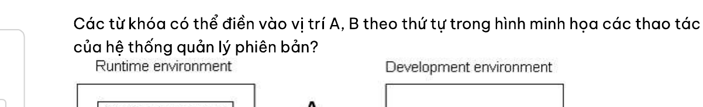

- A. get, set
- B. check-in, check-out
- C. copy, paste
- D. check-out, check-in

Hiện đáp án và giải thích

**Đáp án:** D. check-out, check-in

**Giải thích:** Với hình quản lý phiên bản, cần đọc hướng di chuyển giữa repository, workspace và các thao tác check-in/check-out. Check-out lấy thành phần ra vùng làm việc để sửa, check-in đưa thay đổi trở lại kho quản lý. Thứ tự thao tác rất quan trọng vì đảo hai khái niệm sẽ làm sai luồng quản lý phiên bản. Check-out là lấy về để sửa, check-in là đưa thay đổi vào kho; đảo chiều hai thao tác sẽ làm sai toàn bộ luồng.

### Câu 5
Nguồn: c5 p2

Phát triển phiên bản 1.2 của thực thể obj thành các phiên bản 1.3 và 2.0 như hình minh họa trong hệ thống quản lý phiên bản được gọi là? 2 obj obj 1.3 1.4

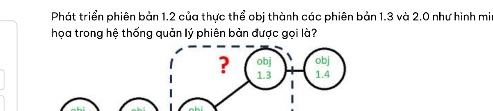

- A. obj obj obj
- B. 1.0
- C. 1.1
- D. 1.2 Merging Check-in Branching
- E. Check-out

Hiện đáp án và giải thích

**Đáp án:** D. Branching

**Giải thích:** Với câu có hình, phần ảnh đang cung cấp dấu hiệu chính để nhận ra nhánh và gộp phiên bản; phần chữ OCR chỉ nên dùng để đối chiếu. Branching tạo hướng phát triển song song từ một phiên bản, còn merging hợp nhất các thay đổi từ nhiều nhánh. Nhìn sơ đồ phiên bản: tách đường là branch, nhập đường là merge. Nhãn, mũi tên và vị trí phần tử trong sơ đồ thường quyết định đáp án hơn phần mô tả OCR bị thiếu.

### Câu 6
Nguồn: c5 p2

Phẩn mềm được phát triển theo thời gian và liên tục có những thay đổi. Thay đổi đó là:

- A. Tất cả các thành phần trên
- B. Thay đổi về yêu cầu
- C. Người dùng dẫn tới thay đổi vê chương trình, dữ liệu và tài liệu
- D. Thay đổi tỏng kế hoạch phát triển
- E. PM
- F. Thay đổi về yêu cầu nghiệp vụ, về công nghệ sử dụng

Hiện đáp án và giải thích

**Đáp án:** A. Tất cả các thành phần trên

**Giải thích:** Các lựa chọn đang mô tả những mặt khác nhau của yêu cầu phần mềm, nên câu trả lời phải bao quát cả nhóm. Yêu cầu chức năng mô tả hệ thống phải làm gì; yêu cầu phi chức năng mô tả ràng buộc chất lượng như bảo mật, hiệu năng, độ tin cậy. Các câu ngoại lệ thường gài những mô tả về dữ liệu, giao diện hoặc tổ chức không trực tiếp là chức năng hệ thống. Dạng 'tất cả' hợp lý khi từng lựa chọn là một lát cắt hợp lệ của cùng tiêu chí, không có ý nào phá vỡ phạm vi câu hỏi.

### Câu 7
Nguồn: c5 p2

Câu lệnh nào của Git được sử dụng để tạo bản sao từ kho lưu trữtừ xa trên Github?

- A. git log
- B. git clone
- C. git push

Hiện đáp án và giải thích

**Đáp án:** B. git clone

**Giải thích:** Git lưu lịch sử thay đổi và trạng thái làm việc để nhóm có thể phối hợp trên cùng mã nguồn. Tên lệnh thường phản ánh trực tiếp thao tác: clone sao chép kho, status xem trạng thái, version xem phiên bản. Tên lệnh Git thường mô tả đúng hành động: clone sao chép kho, status xem trạng thái, commit ghi nhận thay đổi.

### Câu 8
Nguồn: c5 p2

Phát biểu nào phù hợp cho vấn để xung đột (conflicts) mã nguồn trong các hệ thống kiểm soát phiên bản?

- A. Tất cả các lựa chọn còn lại đều đúng
- B. Xung đột có thể xảy ra khi hai hoặc nhiều nhà phát triển thay đổi cùng một tệp mã nguồn
- C. Hệ thống kiểm soát phiên ban Git luôn có thể xử lý xung đột tự động
- D. Xung đột chỉ xảy ra tại kho lưu trữ cục bộ của thành viên, không xuất hiện tại kho lưu trữtừ xa như Github

Hiện đáp án và giải thích

**Đáp án:** B. Xung đột có thể xảy ra khi hai hoặc nhiều nhà phát triển thay đổi cùng một tệp mã nguồn

**Giải thích:** Git lưu lịch sử thay đổi và trạng thái làm việc để nhóm có thể phối hợp trên cùng mã nguồn. Tên lệnh thường phản ánh trực tiếp thao tác: clone sao chép kho, status xem trạng thái, version xem phiên bản. Tên lệnh Git thường mô tả đúng hành động: clone sao chép kho, status xem trạng thái, commit ghi nhận thay đổi.

### Câu 9
Nguồn: c5 p2

Vai trò chịu trách nhiệm xác định các mục cấu hình và xác định các thủ tục để tạo các sựtăng trưởng và các bản phát hành?

- A. Tất cả các phương án còn lại
- B. Người quản lý cấu hình
- C. Lập trình viên Ban kiểm soát thay đổi

Hiện đáp án và giải thích

**Đáp án:** B. Người quản lý cấu hình

**Giải thích:** Với hình quản lý cấu hình, cần xác định mục cấu hình, phiên bản, baseline và quan hệ thay đổi giữa các thành phần. SCM kiểm soát các mục cấu hình, phiên bản, baseline và thay đổi trong suốt vòng đời phần mềm. Mấu chốt là khả năng truy vết: biết thành phần nào đổi, đổi khi nào và thuộc phiên bản nào. Check-out là lấy về để sửa, check-in là đưa thay đổi vào kho; baseline là mốc đã được kiểm soát thay đổi.

### Câu 10
Nguồn: c5

Phát triển phiên bản 1.2 của thực thể obj thành các phiên bản 1.3 và 2.0 như hình minh họa trong hệ thống quản lý phiên bản được gọi là? obj obj 1.3 1.4 obj obj obj 1.0 1.1 1.2 obj obj 2.0 2.1 obj obj 1.1.1 1.1.2

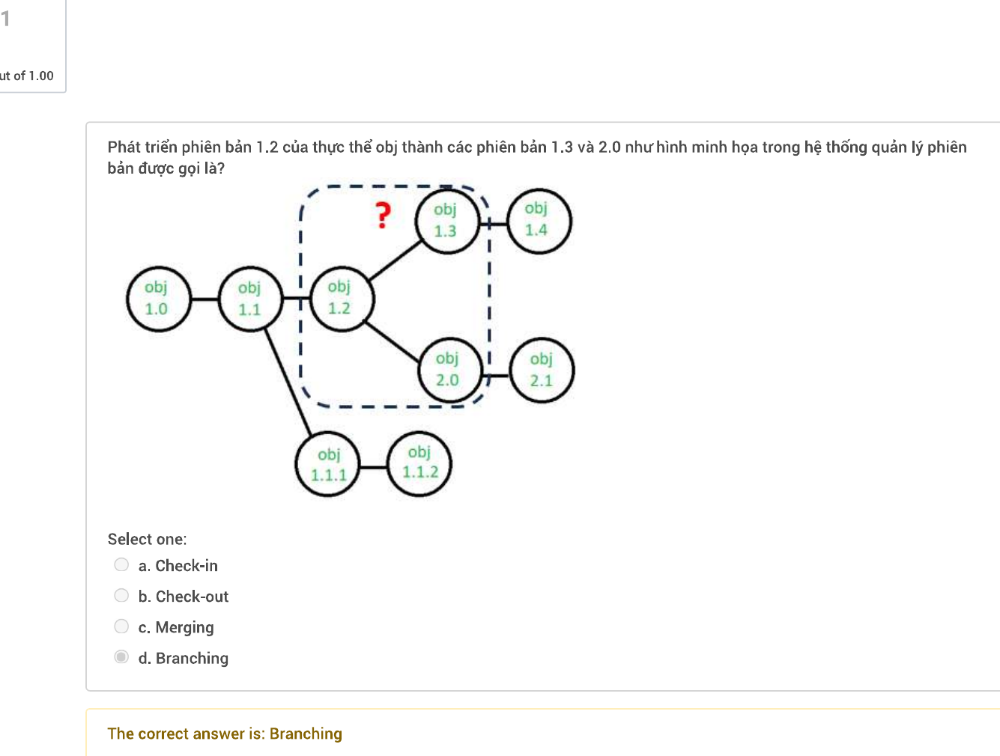

- A. Check-in
- B. Check-out
- C. Merging
- D. Branching

Hiện đáp án và giải thích

**Đáp án:** D. Branching

**Giải thích:** Với câu có hình, phần ảnh đang cung cấp dấu hiệu chính để nhận ra nhánh và gộp phiên bản; phần chữ OCR chỉ nên dùng để đối chiếu. Branching tạo hướng phát triển song song từ một phiên bản, còn merging hợp nhất các thay đổi từ nhiều nhánh. Nhìn sơ đồ phiên bản: tách đường là branch, nhập đường là merge. Nhãn, mũi tên và vị trí phần tử trong sơ đồ thường quyết định đáp án hơn phần mô tả OCR bị thiếu.

### Câu 11
Nguồn: c5 / quiz phụ

Câu lệnh trong Git để đặt email người dùng cho kho luu trữ hiện tại là gì?

- A. git config user.email git email
- B. 9 git email.user; d. git config email

Hiện đáp án và giải thích

**Đáp án:** git config user,email

**Giải thích:** Git lưu lịch sử thay đổi và trạng thái làm việc để nhóm có thể phối hợp trên cùng mã nguồn. Tên lệnh thường phản ánh trực tiếp thao tác: clone sao chép kho, status xem trạng thái, version xem phiên bản. Tên lệnh Git thường mô tả đúng hành động: clone sao chép kho, status xem trạng thái, commit ghi nhận thay đổi.

### Câu 12
Nguồn: c5

Các từ khóa có thể điền vào vị trí A, B theo thứ tự trong hình minh họa các thao tác của hệ thống quản lý phiên bản? Runtime environment Development environment Original component A Revision X Các hoạt động phát triển phần mềm Modified corponent B Revision X +1

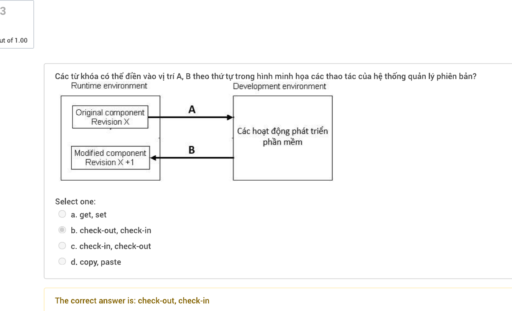

- A. get, set
- B. check-out, check-in
- C. check-in, check-out
- D. copy, paste

Hiện đáp án và giải thích

**Đáp án:** check-out, check-in

**Giải thích:** Với hình quản lý phiên bản, cần đọc hướng di chuyển giữa repository, workspace và các thao tác check-in/check-out. Check-out lấy thành phần ra vùng làm việc để sửa, check-in đưa thay đổi trở lại kho quản lý. Thứ tự thao tác rất quan trọng vì đảo hai khái niệm sẽ làm sai luồng quản lý phiên bản. Check-out là lấy về để sửa, check-in là đưa thay đổi vào kho; đảo chiều hai thao tác sẽ làm sai toàn bộ luồng.

### Câu 13
Nguồn: c5

Hệ thống quản lý phiên bản như hình minh họa được gọi là? Server Reposicory 1 update commic 1 1 commit Working copy [Working copy Working copy; Workstation/PC 41 Worksration/PC "2 WorkstationiPc #3

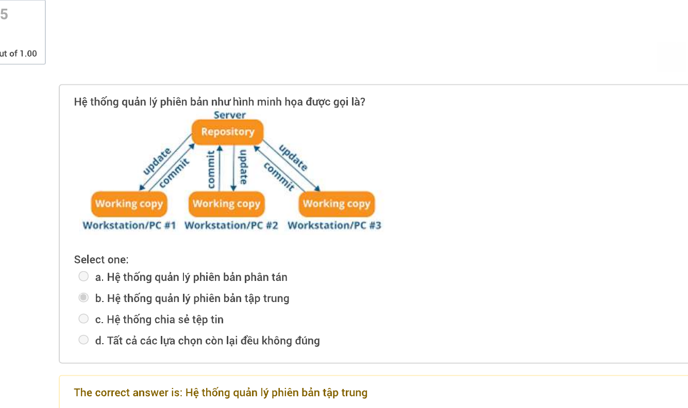

- A. Hệ thống quản lý phiên bản phân tán
- B. Hệ thống quản lý phiên bản tập trung
- C. Hệ thống chia sẻ tệp tin
- D. Tất cả các lựa chọn còn lại đều không đúng

Hiện đáp án và giải thích

**Đáp án:** B. Hệ thống quản lý phiên bản tập trung

**Giải thích:** Với câu có hình, phần ảnh đang cung cấp dấu hiệu chính để nhận ra Git/kho lưu trữ; phần chữ OCR chỉ nên dùng để đối chiếu. Git lưu lịch sử thay đổi và trạng thái làm việc để nhóm có thể phối hợp trên cùng mã nguồn. Tên lệnh thường phản ánh trực tiếp thao tác: clone sao chép kho, status xem trạng thái, version xem phiên bản. Nhãn, mũi tên và vị trí phần tử trong sơ đồ thường quyết định đáp án hơn phần mô tả OCR bị thiếu.

### Câu 14
Nguồn: c5 / quiz phụ

Trong hệ thống quản lý phiên bản, thao tác nào đảm bảo rằng những thay đổi trên một tệp mã nguồn được thực hiện bởi một nhà phát triển sẽ có sẵn cho tất cả những nhà phát triển khác?

- A. Check-out
- B. Branching Merging;
- C. Check-in

Hiện đáp án và giải thích

**Đáp án:** C. Check-in

**Giải thích:** Check-out lấy thành phần ra vùng làm việc để sửa, check-in đưa thay đổi trở lại kho quản lý. Thứ tự thao tác rất quan trọng vì đảo hai khái niệm sẽ làm sai luồng quản lý phiên bản. Loại các phương án chỉ nói về công cụ, pha khác hoặc hệ quả phụ; đáp án đúng phải giữ đúng phạm vi khái niệm.

### Câu 15
Nguồn: c5 / quiz phụ

Mục đích chính của việc báo cáo trạng thái cấu hình kiểm kê trạng thái là để?

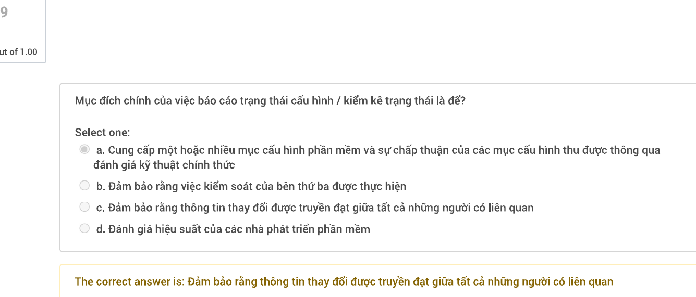

- A. ung cấp một hoặc nhiều mục cấu hình phần mềm và sựchấp thuận của các mục cấu hình thu được thông qua đánh giá kỹ thuật chính thức
- C. Đảm bảo rằng việc kiểm soát của bên thứ ba được thực hiện
- D. Đảm bảo rằng thông tin thay đổi được truyền đạt giữa tất cả những người có liên quan
- E. Đánh giá hiệu suất của các nhà phát triển phần mềm

Hiện đáp án và giải thích

**Đáp án:** D. Đảm bảo rằng thông tin thay đổi được truyền đạt giữa tất cả những người có liên quan

**Giải thích:** Với hình quản lý cấu hình, cần xác định mục cấu hình, phiên bản, baseline và quan hệ thay đổi giữa các thành phần. SCM kiểm soát các mục cấu hình, phiên bản, baseline và thay đổi trong suốt vòng đời phần mềm. Mấu chốt là khả năng truy vết: biết thành phần nào đổi, đổi khi nào và thuộc phiên bản nào. Check-out là lấy về để sửa, check-in là đưa thay đổi vào kho; baseline là mốc đã được kiểm soát thay đổi.

### Câu 16
Nguồn: c5 / c5 p2 / quiz phụ

Mô tả nào thể hiện sự cần thiết của quản lý cấu hình phần mềm?

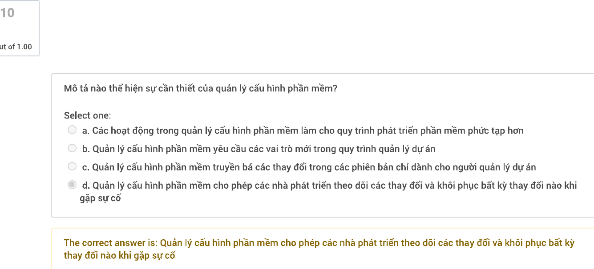

- A. , Các hoạt động trong quản lý cấu hình phần mềm làm cho quy trình phát triển phần mềm phức tạp hơn
- B. Quản lý cấu hình phần mềm yêu cầu các vai trò mới trong quy trình quản lý dự án
- C. Quản lý cấu hình phần mềm truyền bá các thay đổi trong các phiên bản chỉ dành cho người quản lý dự án
- D. Quản lý cấu hình phần mềm cho phép các nhà phát triển theo dõi các thay đổi và khôi phục bất kỳ thay đổi nào khi gặp sự cố

Hiện đáp án và giải thích

**Đáp án:** Quản lý cấu hình phần mềm cho phép các nhà phát triển theo dõi các thay đổi và khôi phục bất kỳ thay đổi nào khi gặp sựcố

**Giải thích:** Với hình quản lý cấu hình, cần xác định mục cấu hình, phiên bản, baseline và quan hệ thay đổi giữa các thành phần. SCM kiểm soát các mục cấu hình, phiên bản, baseline và thay đổi trong suốt vòng đời phần mềm. Mấu chốt là khả năng truy vết: biết thành phần nào đổi, đổi khi nào và thuộc phiên bản nào. Check-out là lấy về để sửa, check-in là đưa thay đổi vào kho; baseline là mốc đã được kiểm soát thay đổi.

### Câu 17
Nguồn: c5

Phương án nào có thể được xác dịnh là mục cấu hình phần mềm (Software Configuration Item)?

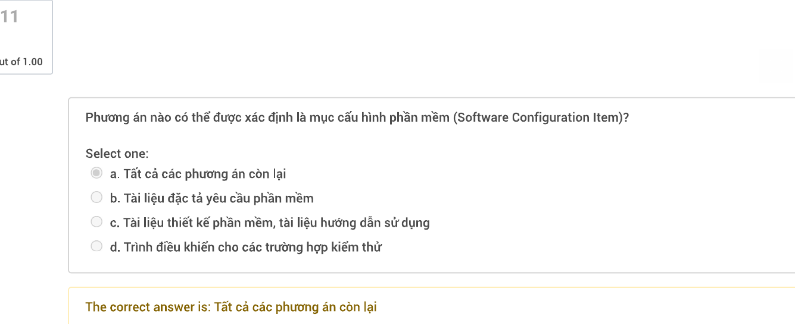

- A. Tất cả các phương án còn lại
- B. Tài liệu đặc tả yêu cầu
- C. Phần mềm Tài liệu thiết kế
- D. Phần mềm, tài liệu hướng dẫn sử dụng; d.
- E. Trình điều khiển cho các trường hợp kiểm thử

Hiện đáp án và giải thích

**Đáp án:** A. Tất cả các phương án còn lại

**Giải thích:** Với hình quản lý cấu hình, cần xác định mục cấu hình, phiên bản, baseline và quan hệ thay đổi giữa các thành phần. SCM kiểm soát các mục cấu hình, phiên bản, baseline và thay đổi trong suốt vòng đời phần mềm. Mấu chốt là khả năng truy vết: biết thành phần nào đổi, đổi khi nào và thuộc phiên bản nào. Check-out là lấy về để sửa, check-in là đưa thay đổi vào kho; baseline là mốc đã được kiểm soát thay đổi.

### Câu 18
Nguồn: c5

Thuật ngữnào sau đây phù hợp nhất với phát biểu "Sựkết hợp các nhánh phiên bản để tạo phiên bản mới của thành phần bao gồm tất cả các thay đổi đã được thực hiện"?

- A. Codeline
- B. ranching
- C. Merging
- D. Baseline

Hiện đáp án và giải thích

**Đáp án:** C. Merging

**Giải thích:** Branching tạo hướng phát triển song song từ một phiên bản, còn merging hợp nhất các thay đổi từ nhiều nhánh. Nhìn sơ đồ phiên bản: tách đường là branch, nhập đường là merge. Nếu mô tả nói 'kết hợp' thay đổi từ nhiều nhánh thì chọn merge; nếu nói tạo hướng phát triển song song thì chọn branch.

### Câu 19
Nguồn: c5 / quiz phụ

Mô tả phù hợp cho việc tìm kiếm các mục cấu hinh phần mềm?

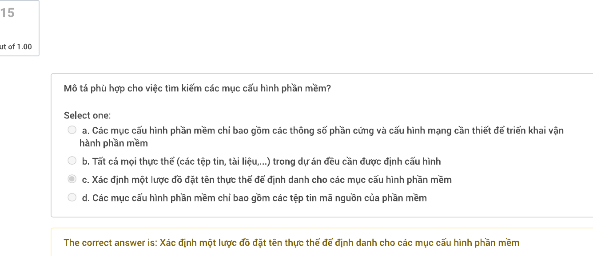

- A. , Các mục cấu hình phần mềm chỉ bao gồm các thông số phần cứng và cấu hình mạng cần thiết để triển khai vận hành phần mềm
- C. Tất cả mọi thực thể (các tệp tin, tài liệu,) trong dự án đều cần được định cấu hình
- D. Xác định một lược đồ đặt tên thực thể để định danh cho các mục cấu hình phần mềm
- E. Các mục cấu hình phần mềm chỉ bao gồm các tệp tin mã nguồn của phần mềm

Hiện đáp án và giải thích

**Đáp án:** D. Xác định một lược đồ đặt tên thực thể để định danh cho các mục cấu hình phần mềm

**Giải thích:** Với hình quản lý cấu hình, cần xác định mục cấu hình, phiên bản, baseline và quan hệ thay đổi giữa các thành phần. SCM kiểm soát các mục cấu hình, phiên bản, baseline và thay đổi trong suốt vòng đời phần mềm. Mấu chốt là khả năng truy vết: biết thành phần nào đổi, đổi khi nào và thuộc phiên bản nào. Check-out là lấy về để sửa, check-in là đưa thay đổi vào kho; baseline là mốc đã được kiểm soát thay đổi.

### Câu 20
Nguồn: c5 / quiz phụ

Trong khóa học này, thuật ngữ SCM là viết tắt cho?

- A. Software Change Management System
- B. Crossover Management Supply Chain
- C. Management; d. Software Configuration
- D. Management

Hiện đáp án và giải thích

**Đáp án:** Software Configuration Management

**Giải thích:** SCM kiểm soát các mục cấu hình, phiên bản, baseline và thay đổi trong suốt vòng đời phần mềm. Mấu chốt là khả năng truy vết: biết thành phần nào đổi, đổi khi nào và thuộc phiên bản nào. SCM cần truy vết được mục cấu hình, phiên bản, baseline và thay đổi để tránh mất kiểm soát khi nhiều người cùng sửa.

### Câu 21
Nguồn: c5 / c5 p2 / quiz phụ

Quản lý cấu hình phần mềm (SCM) nằm trong các hoạt động bao trùm (umbrella activities)?

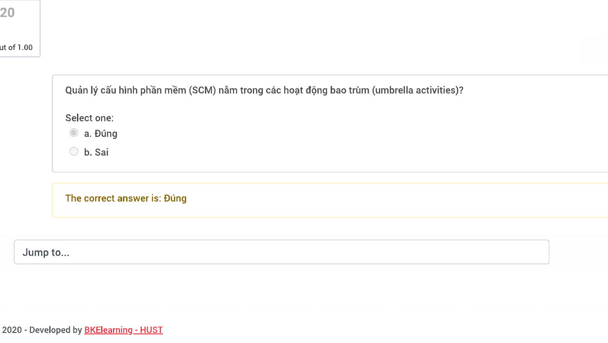

- A. Đúng
- B. Sai
- C. 9;

Hiện đáp án và giải thích

**Đáp án:** A. Đúng

**Giải thích:** Với hình quản lý cấu hình, cần xác định mục cấu hình, phiên bản, baseline và quan hệ thay đổi giữa các thành phần. SCM kiểm soát các mục cấu hình, phiên bản, baseline và thay đổi trong suốt vòng đời phần mềm. Mấu chốt là khả năng truy vết: biết thành phần nào đổi, đổi khi nào và thuộc phiên bản nào. Check-out là lấy về để sửa, check-in là đưa thay đổi vào kho; baseline là mốc đã được kiểm soát thay đổi.

### Câu 22
Nguồn: quiz phụ

Những thay đổi của phần mềm có thể là?

- A. Thay đổi yêu cầu
- B. Người dùng
- C. Thay đổi yêu cầu nghiệp vụ
- D. Tất cả các phương án còn lại
- E. Thay đổi trong nhóm phát triển

Hiện đáp án và giải thích

**Đáp án:** D. Tất cả các phương án còn lại

**Giải thích:** Các lựa chọn đang mô tả những mặt khác nhau của yêu cầu phần mềm, nên câu trả lời phải bao quát cả nhóm. Yêu cầu chức năng mô tả hệ thống phải làm gì; yêu cầu phi chức năng mô tả ràng buộc chất lượng như bảo mật, hiệu năng, độ tin cậy. Các câu ngoại lệ thường gài những mô tả về dữ liệu, giao diện hoặc tổ chức không trực tiếp là chức năng hệ thống. Dạng 'tất cả' hợp lý khi từng lựa chọn là một lát cắt hợp lệ của cùng tiêu chí, không có ý nào phá vỡ phạm vi câu hỏi.

### Câu 23
Nguồn: quiz phụ

Lựa chọn nào có thể được chỉ định để quản lý cấu hình trong quy trình quản lý cấu hình?

- A. Design specification, Activity diagrams
- B. Source Code, Test Plan,
- C. Test Script, Test results
- D. Tất cả các phương án còn lại
- E. Project plan, Requirement specification,
- F. Class diagrams

Hiện đáp án và giải thích

**Đáp án:** D. Tất cả các phương án còn lại

**Giải thích:** Các lựa chọn đang mô tả những mặt khác nhau của quản lý cấu hình phần mềm, nên câu trả lời phải bao quát cả nhóm. SCM kiểm soát các mục cấu hình, phiên bản, baseline và thay đổi trong suốt vòng đời phần mềm. Mấu chốt là khả năng truy vết: biết thành phần nào đổi, đổi khi nào và thuộc phiên bản nào. Dạng 'tất cả' hợp lý khi từng lựa chọn là một lát cắt hợp lệ của cùng tiêu chí, không có ý nào phá vỡ phạm vi câu hỏi.

### Câu 24
Nguồn: quiz phụ

Lựa chọn nào phù hợp cho mô tả về ”gồm các nguyên tắc và kỹ thuật đánh giá và kiểm soát sự thay đổi đối với các sản phẩm phần mềm trong và sau quá trình kỹ thuật phần mềm”?

- A. Quản lý nhà thầu phụ
- B. Quản lý cấu hình phần mềm
- C. Quản lý rủi ro dự án phần mềm
- D. Lập kế hoạch dự án phần mềm

Hiện đáp án và giải thích

**Đáp án:** B. Quản lý cấu hình phần mềm

**Giải thích:** SCM kiểm soát các mục cấu hình, phiên bản, baseline và thay đổi trong suốt vòng đời phần mềm. Mấu chốt là khả năng truy vết: biết thành phần nào đổi, đổi khi nào và thuộc phiên bản nào. SCM cần truy vết được mục cấu hình, phiên bản, baseline và thay đổi để tránh mất kiểm soát khi nhiều người cùng sửa.

### Câu 25
Nguồn: c5 p2 / quiz phụ

Thay đổi của phần mềm có thể ảnh hưởng đến các sản phẩm nào?

- A. Kế hoạch dự án
- B. Mã nguồn Phần mềm
- C. Tất cả các phương án còn lại
- D. Các tài liệu trong quá trình phát triển
- E. Phần mềm

Hiện đáp án và giải thích

**Đáp án:** C. Tất cả các phương án còn lại

**Giải thích:** Các lựa chọn đang mô tả những mặt khác nhau của quản lý cấu hình, nên câu trả lời phải bao quát cả nhóm. Trọng tâm là kiểm soát phiên bản, thay đổi và khả năng truy vết của các thành phần phần mềm. Các thuật ngữ Git/SCM cần được hiểu theo thao tác thực tế trong kho lưu trữ. Dạng 'tất cả' hợp lý khi từng lựa chọn là một lát cắt hợp lệ của cùng tiêu chí, không có ý nào phá vỡ phạm vi câu hỏi.

### Câu 26
Nguồn: quiz phụ

Mô tả nào sau đây không thể hiện sự tiến hóa của phần mềm?

- A. Nhiều yếu tố khác nhau được tạo ra trong suốt thời gian của dự án
- B. Các thành viên của nhóm dự án làm việc đồng thời trên
- C. Phần mềm đang thay đổi
- D. Phần mềm có thể thay đổi liên tục
- E. Các sản phẩm được tạo ra trong quá trình phát triển
- F. Phần mềm chỉ có một phiên bản duy nhất

Hiện đáp án và giải thích

**Đáp án:** Các sản phẩm được tạo ra trong quá trình phát triển phần mềm chỉ có một phiên bản duy nhất

**Giải thích:** Câu hỏi đang tìm ngoại lệ của quản lý cấu hình; hãy giữ lại các lựa chọn đúng chuẩn rồi xét lựa chọn còn nằm ngoài phạm vi. Trọng tâm là kiểm soát phiên bản, thay đổi và khả năng truy vết của các thành phần phần mềm. Các thuật ngữ Git/SCM cần được hiểu theo thao tác thực tế trong kho lưu trữ. Các phương án còn lại thường đúng nhưng thuộc cùng nhóm chuẩn; đáp án cần chọn là ý nhầm pha, nhầm phạm vi hoặc không thuộc danh sách đang hỏi.

### Câu 27
Nguồn: quiz phụ

Vai trò chịu trách nhiệm xác định các mục cấu hình và xác định các thủ tục để tạo các sự tăng trưởng và các bản phát hành?

- A. Tất cả các phương án còn lại
- B. Ban kiểm soát thay đổi
- C. Lập trình viên
- D. Người quản lý cấu hình

Hiện đáp án và giải thích

**Đáp án:** D. Người quản lý cấu hình

**Giải thích:** SCM kiểm soát các mục cấu hình, phiên bản, baseline và thay đổi trong suốt vòng đời phần mềm. Mấu chốt là khả năng truy vết: biết thành phần nào đổi, đổi khi nào và thuộc phiên bản nào. SCM cần truy vết được mục cấu hình, phiên bản, baseline và thay đổi để tránh mất kiểm soát khi nhiều người cùng sửa.

### Câu 28
Nguồn: c5 p2 / quiz phụ

Nhận dạng mục cấu hình là một phần thiết yếu của quản lý cấu hình phần mềm. Mô tả nào phù hợp về nhận dạng mục cấu hình?

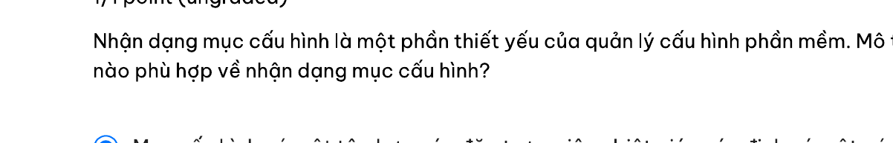

- A. Đảm bảo rằng tại một thời điểm chỉ có một người đang trong quá trình tạo phiên bản mới cho một nhánh (branch) cụ thể
- B. Phát hiện sự không nhất quán trong quá trình phát triển
- C. Cung cấp thông tin lịch sử về nỗ lực phát triển và bảo trì trong suốt vòng đời của sản phẩm
- D. Mục cấu hình có một tập hợp các đặc trưng riêng biệt giúp xác định nó một cách duy nhất

Hiện đáp án và giải thích

**Đáp án:** D. Mục cấu hình có một tập hợp các đặc trưng riêng biệt giúp xác định nó một cách duy nhất

**Giải thích:** Với hình quản lý cấu hình, cần xác định mục cấu hình, phiên bản, baseline và quan hệ thay đổi giữa các thành phần. SCM kiểm soát các mục cấu hình, phiên bản, baseline và thay đổi trong suốt vòng đời phần mềm. Mấu chốt là khả năng truy vết: biết thành phần nào đổi, đổi khi nào và thuộc phiên bản nào. Check-out là lấy về để sửa, check-in là đưa thay đổi vào kho; baseline là mốc đã được kiểm soát thay đổi.

### Câu 29
Nguồn: quiz phụ

Lựa chọn nào đảm bảo rằng sự phát triển của hệ thống là một quá trình được quản lý và ưu tiên dành cho những thay đổi cấp bách nhất và tiết kiệm chi phí?

- A. Tất cả các lựa chọn còn lại đều không đúng Kiểm soát phiên bản (Version control)
- C. Kiểm toán cấu hình (Configuration audit)
- D. Kiểm soát thay đổi (Change control)

Hiện đáp án và giải thích

**Đáp án:** D. Kiểm soát thay đổi (Change control)

**Giải thích:** SCM kiểm soát các mục cấu hình, phiên bản, baseline và thay đổi trong suốt vòng đời phần mềm. Mấu chốt là khả năng truy vết: biết thành phần nào đổi, đổi khi nào và thuộc phiên bản nào. SCM cần truy vết được mục cấu hình, phiên bản, baseline và thay đổi để tránh mất kiểm soát khi nhiều người cùng sửa.

### Câu 30
Nguồn: quiz phụ

Kiểm soát thay đổi (Change control) có thể được kích hoạt bởi?

- A. Các thay đổi yêu cầu của khách hàng
- B. Các lỗi được tìm thấy trong quá trình kiểm thử
- C. Tất cả các lựa chọn còn lại đều đúng
- D. Phát hiện sự không nhất quán trong quá trình phát triển

Hiện đáp án và giải thích

**Đáp án:** C. Tất cả các lựa chọn còn lại đều đúng

**Giải thích:** Các lựa chọn đang mô tả những mặt khác nhau của yêu cầu phần mềm, nên câu trả lời phải bao quát cả nhóm. Yêu cầu chức năng mô tả hệ thống phải làm gì; yêu cầu phi chức năng mô tả ràng buộc chất lượng như bảo mật, hiệu năng, độ tin cậy. Các câu ngoại lệ thường gài những mô tả về dữ liệu, giao diện hoặc tổ chức không trực tiếp là chức năng hệ thống. Dạng 'tất cả' hợp lý khi từng lựa chọn là một lát cắt hợp lệ của cùng tiêu chí, không có ý nào phá vỡ phạm vi câu hỏi.

### Câu 31
Nguồn: quiz phụ

Phương án nào phù hợp với mô tả về hoạt động đánh giá cấu hình phần mềm bổ sung cho việc xét duyệt kỹ thuật và đảm bảo rằng thay đổi đã được thực hiện đúng cách?

- A. Kiểm soát thay đổi (Change control)
- B. Kiểm toán cấu hình (Configuration audit)
- C. Báo cáo trạng thái cấu hình (Configuration status reporting)
- D. Nhận dạng mục cấu hình (Configuration item identification)

Hiện đáp án và giải thích

**Đáp án:** B. Kiểm toán cấu hình (Configuration audit)

**Giải thích:** SCM kiểm soát các mục cấu hình, phiên bản, baseline và thay đổi trong suốt vòng đời phần mềm. Mấu chốt là khả năng truy vết: biết thành phần nào đổi, đổi khi nào và thuộc phiên bản nào. SCM cần truy vết được mục cấu hình, phiên bản, baseline và thay đổi để tránh mất kiểm soát khi nhiều người cùng sửa.

### Câu 32
Nguồn: quiz phụ

Phát biểu nào sau đây là không chính xác?

- A. Một không gian làm việc (workspace) có thể bắt nguồn từ một kho lưu trữ (repository)
- B. Kho lưu trữ dự án (repository) duy trì phiên bản ”chính” của tất cả các thành phần phần mềm
- C. Một không gian làm việc (workspace) có thể bắt nguồn từ cấu hình được bảo tồn của một không gian làm việc khác
- D. Duy trì một hệ thống tệp (file system) dưới dạng vùng làm việc sẽ tiết kiệm không gian hơn so với sử dụng không gian làm việc (workspace)

Hiện đáp án và giải thích

**Đáp án:** D. Duy trì một hệ thống tệp (file system) dưới dạng vùng làm việc sẽ tiết kiệm không gian hơn so với sử dụng không gian làm việc (workspace)

**Giải thích:** Git lưu lịch sử thay đổi và trạng thái làm việc để nhóm có thể phối hợp trên cùng mã nguồn. Tên lệnh thường phản ánh trực tiếp thao tác: clone sao chép kho, status xem trạng thái, version xem phiên bản. Tên lệnh Git thường mô tả đúng hành động: clone sao chép kho, status xem trạng thái, commit ghi nhận thay đổi.

### Câu 33
Nguồn: quiz phụ

Phân nhánh phiên bản (version bBranching) được sử dụng cho?

- A. Thay đổi đồng thời trên các thành phần mã nguồn
- B. Phát triển thử nghiệm tính năng mới của
- C. Phần mềm Tất cả các lựa chọn còn lại đều đúng
- D. Đường phát triển độc lập của các lập trình viên

Hiện đáp án và giải thích

**Đáp án:** Tất cả các lựa chọn còn lại đều đúng

**Giải thích:** Các lựa chọn đang mô tả những mặt khác nhau của mô thức lập trình, nên câu trả lời phải bao quát cả nhóm. Mô thức lập trình quy định cách tổ chức dữ liệu, lệnh và trách nhiệm trong chương trình. Imperative nhấn mạnh cách làm từng bước, declarative nhấn mạnh mô tả kết quả mong muốn. Dạng 'tất cả' hợp lý khi từng lựa chọn là một lát cắt hợp lệ của cùng tiêu chí, không có ý nào phá vỡ phạm vi câu hỏi.

### Câu 34
Nguồn: quiz phụ

Trong quá trình làm việc với công cụ quản lý phiên bản, chuỗi hoạt động nào là phù hợp để chỉnh sửa tệp mã nguồn hiện có?

- A. Check-out, sửa đổi bản sao của tệp mã nguồn trên máy cục bộ và check-in
- B. Check-in, sửa đổi bản sao của tệp mã nguồn trên máy cục bộ và check-out
- C. Check-out, thực hiện sửa đổi tệp mã nguồn ở phía máy chủ và check-in
- D. Check-in, thực hiện sửa đổi tệp mã nguồn ở phía máy chủ và check-out

Hiện đáp án và giải thích

**Đáp án:** Check-out, sửa đổi bản sao của tệp mã nguồn trên máy cục bộ và check-in

**Giải thích:** Check-out lấy thành phần ra vùng làm việc để sửa, check-in đưa thay đổi trở lại kho quản lý. Thứ tự thao tác rất quan trọng vì đảo hai khái niệm sẽ làm sai luồng quản lý phiên bản. Loại các phương án chỉ nói về công cụ, pha khác hoặc hệ quả phụ; đáp án đúng phải giữ đúng phạm vi khái niệm.

### Câu 35
Nguồn: c5 p2 / quiz phụ

Trong các hệ thống quản lý phiên bản, lựa chọn nào mô tả phù hợp cho thao tác check-in?

- A. Nhà phát triển hoàn thành các thay đổi của mình trên không gian làm việc riêng, các thành phần đã thay đổi sẽ được trả lại vào kho lưu trữ
- B. Nhà phát triển sao chép những thành phần cần sử dụng hoặc sửa đổi từ kho lưu trữ vào không gian làm việc riêng
- C. Các lựa chọn còn lại đều không đúng
- D. Hợp nhất các nhánh phiên bản để tạo phiên bản mới của thành phần bao gồm tất cả các thay đổi đã được thực hiện

Hiện đáp án và giải thích

**Đáp án:** Nhà phát triển hoàn thành các thay đổi của mình trên không gian làm việc riêng, các thành phần đã thay đổi sẽ được trả lại vào kho lưu trữ

**Giải thích:** Check-out lấy thành phần ra vùng làm việc để sửa, check-in đưa thay đổi trở lại kho quản lý. Thứ tự thao tác rất quan trọng vì đảo hai khái niệm sẽ làm sai luồng quản lý phiên bản. Loại các phương án chỉ nói về công cụ, pha khác hoặc hệ quả phụ; đáp án đúng phải giữ đúng phạm vi khái niệm.

### Câu 36
Nguồn: quiz phụ

Trong hệ thống quản lý phiên bản, các hoạt động phân nhánh và hợp nhất phiên bản (version bBranching and merging) được thể hiện bằng cấu trúc được gọi là?

- A. Các lựa chọn còn lại đều không đúng
- B. Version Graph History Tree
- C. Structure Chart

Hiện đáp án và giải thích

**Đáp án:** Version Graph 5.4 Quản lý thay đổi (O…

**Giải thích:** Branching tạo hướng phát triển song song từ một phiên bản, còn merging hợp nhất các thay đổi từ nhiều nhánh. Nhìn sơ đồ phiên bản: tách đường là branch, nhập đường là merge. Nếu mô tả nói 'kết hợp' thay đổi từ nhiều nhánh thì chọn merge; nếu nói tạo hướng phát triển song song thì chọn branch.

### Câu 37
Nguồn: quiz phụ

Một chức năng phần mềm đã được lập trình viên xây dựng không chính xác. Tính năng nào của công cụ quản lý phiên bản có thể được sử dụng để theo vết người lập trình và phiên bản được phát triển?

- A. History log
- B. Tất cả các phương án còn lại
- C. Branching Merging

Hiện đáp án và giải thích

**Đáp án:** A. History log

**Giải thích:** Mô thức lập trình quy định cách tổ chức dữ liệu, lệnh và trách nhiệm trong chương trình. Imperative nhấn mạnh cách làm từng bước, declarative nhấn mạnh mô tả kết quả mong muốn. Imperative tập trung vào các bước thực hiện, declarative tập trung vào mô tả kết quả mong muốn.

### Câu 38
Nguồn: quiz phụ

Điều nào sau đây cần được xem xét khi lựa chọn công cụ quản lý cấu hình phần mềm?

- A. Yêu cầu phần cứng
- B. Tất cả các phương án còn lại
- C. Môi trường phát triển
- D. Hỗ trợ hệ điều hành

Hiện đáp án và giải thích

**Đáp án:** B. Tất cả các phương án còn lại

**Giải thích:** Các lựa chọn đang mô tả những mặt khác nhau của quản lý cấu hình phần mềm, nên câu trả lời phải bao quát cả nhóm. SCM kiểm soát các mục cấu hình, phiên bản, baseline và thay đổi trong suốt vòng đời phần mềm. Mấu chốt là khả năng truy vết: biết thành phần nào đổi, đổi khi nào và thuộc phiên bản nào. Dạng 'tất cả' hợp lý khi từng lựa chọn là một lát cắt hợp lệ của cùng tiêu chí, không có ý nào phá vỡ phạm vi câu hỏi.

### Câu 39
Nguồn: quiz phụ

Cơ chế làm việc của hệ thống quản lý phiên bản Git?

- A. Git không lưu trữ những thay đổi được thực hiện đối với từng tệp theo thời gian mà ghi đè dữ liệu lên tệp cũ
- B. Tất cả các phương án còn lại đều không đúng
- C. Git lưu trữ dữ liệu như một luồng các ảnh chụp nhanh (stream of snapshots) trạng thái của dự án theo thời gian
- D. Git lưu trữ dữ liệu dưới dạng một tập hợp các tệp và những thay đổi được thực hiện đối với từng tệp theo thời gian

Hiện đáp án và giải thích

**Đáp án:** C. Git lưu trữ dữ liệu như một luồng các ảnh chụp nhanh (stream of snapshots) trạng thái của dự án theo thời gian

**Giải thích:** Git lưu lịch sử thay đổi và trạng thái làm việc để nhóm có thể phối hợp trên cùng mã nguồn. Tên lệnh thường phản ánh trực tiếp thao tác: clone sao chép kho, status xem trạng thái, version xem phiên bản. Tên lệnh Git thường mô tả đúng hành động: clone sao chép kho, status xem trạng thái, commit ghi nhận thay đổi.

### Câu 40
Nguồn: quiz phụ

Lựa chọn nào phù hợp với mô tả về vùng tổ chức hay khu vực trung gian (staging area) trong hệ thống quản lý phiên bản Git?

- A. Khu vực này là nơi
- B. Git lưu trữ siêu dữ liệu và cơ sở dữ liệu đối tượng cho dự án.
- C. Đây là thứ được sao chép khi thực hiện lệnh clone kho lưu trữ từ máy tính khác hoặc kho lưu trữ từ xa trên đám mây
- D. Khu vực sẽ lưu trữ những thay đổi trên tập tin để nó có thể được commit
- E. Khu vực các nhà phát triển làm việc trực tiếp để thay đổi, cập nhật tệp tin
- F. Tất cả các phương án còn lại đều đúng

Hiện đáp án và giải thích

**Đáp án:** Khu vực sẽ lưu trữ những thay đổi trên tập tin để nó có thể được commit Quiz Kết thúc chương …

**Giải thích:** Git lưu lịch sử thay đổi và trạng thái làm việc để nhóm có thể phối hợp trên cùng mã nguồn. Tên lệnh thường phản ánh trực tiếp thao tác: clone sao chép kho, status xem trạng thái, version xem phiên bản. Tên lệnh Git thường mô tả đúng hành động: clone sao chép kho, status xem trạng thái, commit ghi nhận thay đổi.

### Câu 41
Nguồn: quiz phụ

Các từ khóa có thể điền vào vị trí A, B theo thứ tự trong hình minh họa các thao tác của hệ thống quản lý phiên bản?

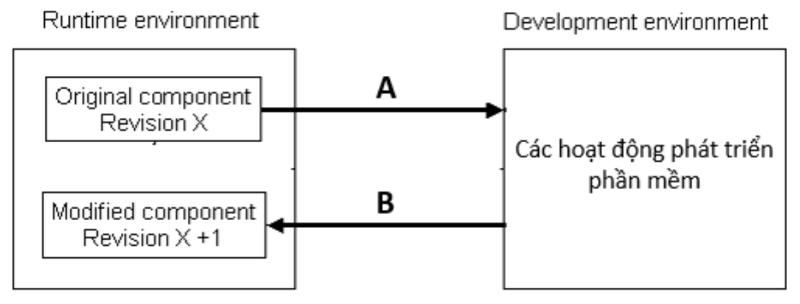

- A. check-in, check-out
- B. check-out, check-in
- C. copy, paste
- D. get, set

Hiện đáp án và giải thích

**Đáp án:** check-out, check-in

**Giải thích:** Với hình quản lý phiên bản, cần đọc hướng di chuyển giữa repository, workspace và các thao tác check-in/check-out. Check-out lấy thành phần ra vùng làm việc để sửa, check-in đưa thay đổi trở lại kho quản lý. Thứ tự thao tác rất quan trọng vì đảo hai khái niệm sẽ làm sai luồng quản lý phiên bản. Check-out là lấy về để sửa, check-in là đưa thay đổi vào kho; đảo chiều hai thao tác sẽ làm sai toàn bộ luồng.

### Câu 42
Nguồn: c5 p2 / quiz phụ

Phương án nào có thể được xác định là mục cấu hình phần mềm (Software Configuration Item)?

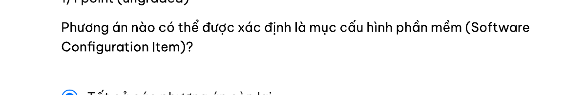

- A. Trình điều khiển cho các trường hợp kiểm thử
- B. Tài liệu đặc tả yêu cầu
- C. Phần mềm
- D. Tất cả các phương án còn lại
- E. Tài liệu thiết kế
- F. Phần mềm, tài liệu hướng dẫn sử dụng

Hiện đáp án và giải thích

**Đáp án:** D. Tất cả các phương án còn lại

**Giải thích:** Với hình quản lý cấu hình, cần xác định mục cấu hình, phiên bản, baseline và quan hệ thay đổi giữa các thành phần. SCM kiểm soát các mục cấu hình, phiên bản, baseline và thay đổi trong suốt vòng đời phần mềm. Mấu chốt là khả năng truy vết: biết thành phần nào đổi, đổi khi nào và thuộc phiên bản nào. Check-out là lấy về để sửa, check-in là đưa thay đổi vào kho; baseline là mốc đã được kiểm soát thay đổi.

### Câu 43
Nguồn: c5 / quiz phụ

Đặc trưng của hệ thống kiểm soát phiên bản?

- A. Tất cả các phương án còn lại
- B. Sử dụng các cơ chế lưu trữ phiên bản hiệu quả
- C. Ghi lại lịch sử thay đổi
- D. Định danh phiên bản và bản phát hành

Hiện đáp án và giải thích

**Đáp án:** A. Tất cả các phương án còn lại

**Giải thích:** Các lựa chọn đang mô tả những mặt khác nhau của quản lý cấu hình, nên câu trả lời phải bao quát cả nhóm. Trọng tâm là kiểm soát phiên bản, thay đổi và khả năng truy vết của các thành phần phần mềm. Các thuật ngữ Git/SCM cần được hiểu theo thao tác thực tế trong kho lưu trữ. Dạng 'tất cả' hợp lý khi từng lựa chọn là một lát cắt hợp lệ của cùng tiêu chí, không có ý nào phá vỡ phạm vi câu hỏi.

### Câu 44
Nguồn: c5 / quiz phụ

Quản lý cấu hình hỗ trợ kiểm soát thay đổi bằng cách?

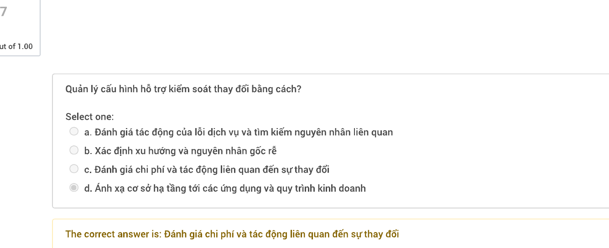

- A. Ánh xạ cơ sở hạ tầng tới các ứng dụng và quy trình kinh doanh
- B. Xác định xu hướng và nguyên nhân gốc rễ
- C. Đánh giá tác động của lỗi dịch vụ và tìm kiếm nguyên nhân liên quan
- D. Đánh giá chi phí và tác động liên quan đến sự thay đổi

Hiện đáp án và giải thích

**Đáp án:** D. Đánh giá chi phí và tác động liên quan đến sự thay đổi

**Giải thích:** Với câu có hình, phần ảnh đang cung cấp dấu hiệu chính để nhận ra bảo trì phần mềm; phần chữ OCR chỉ nên dùng để đối chiếu. Bảo trì chiếm chi phí lớn vì phần mềm luôn phải sửa lỗi, thích nghi môi trường và đáp ứng yêu cầu mới. Đừng hiểu bảo trì chỉ là sửa lỗi sau phát hành; nó còn bao gồm cải tiến và thích nghi. Nhãn, mũi tên và vị trí phần tử trong sơ đồ thường quyết định đáp án hơn phần mô tả OCR bị thiếu.

### Câu 45
Nguồn: c5 / c5 p2 / quiz phụ

Câu lệnh để thu được thông tin phiên bản Git đã cài đặt là gì?

- A. getGitVersion
- B. git help version
- C. gitVersion
- D. git –version

Hiện đáp án và giải thích

**Đáp án:** D. git –version

**Giải thích:** Git lưu lịch sử thay đổi và trạng thái làm việc để nhóm có thể phối hợp trên cùng mã nguồn. Tên lệnh thường phản ánh trực tiếp thao tác: clone sao chép kho, status xem trạng thái, version xem phiên bản. Tên lệnh Git thường mô tả đúng hành động: clone sao chép kho, status xem trạng thái, commit ghi nhận thay đổi.

### Câu 46
Nguồn: c5 / quiz phụ

Trong hệ thống quản lý phiên bản Git, mô tả nào phù hợp cho trạng thái Staged của tệp tin?

- A. Tất cả các lựa chọn còn lại đều không đúng
- B. Đánh dấu tệp tin đã được chỉnh sửa trong phiên bản hiện tại để đưa vào snapshot lần commit tiếp theo
- C. Dữ liệu (các thay đổi) đã được lưu trữ an toàn trong kho lưu trữ cục bộ
- D. Tệp tin chưa được theo dõi phiên bản

Hiện đáp án và giải thích

**Đáp án:** B. Đánh dấu tệp tin đã được chỉnh sửa trong phiên bản hiện tại để đưa vào snapshot lần commit tiếp theo

**Giải thích:** Git lưu lịch sử thay đổi và trạng thái làm việc để nhóm có thể phối hợp trên cùng mã nguồn. Tên lệnh thường phản ánh trực tiếp thao tác: clone sao chép kho, status xem trạng thái, version xem phiên bản. Tên lệnh Git thường mô tả đúng hành động: clone sao chép kho, status xem trạng thái, commit ghi nhận thay đổi.

### Câu 47
Nguồn: quiz phụ

Hệ thống quản lý phiên bản như hình minh họa được gọi là?

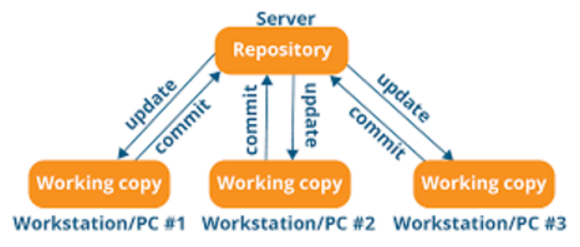

- A. Hệ thống quản lý phiên bản phân tán
- B. Hệ thống chia sẻ tệp tin
- C. Tất cả các lựa chọn còn lại đều không đúng
- D. Hệ thống quản lý phiên bản tập trung

Hiện đáp án và giải thích

**Đáp án:** D. Hệ thống quản lý phiên bản tập trung

**Giải thích:** Với hình quản lý cấu hình, cần xác định mục cấu hình, phiên bản, baseline và quan hệ thay đổi giữa các thành phần. Trọng tâm là kiểm soát phiên bản, thay đổi và khả năng truy vết của các thành phần phần mềm. Các thuật ngữ Git/SCM cần được hiểu theo thao tác thực tế trong kho lưu trữ. Nhãn, mũi tên và vị trí phần tử trong sơ đồ thường quyết định đáp án hơn phần mô tả OCR bị thiếu.

### Câu 48
Nguồn: c5 / quiz phụ

Phần mềm hiện tại đang phát hành phiên bản 2.0.0. Nhà phát triển đã thực hiện sửa một lỗi (bug) nhỏ trong mã nguồn nhằm khắc phục việc hiển thị không chính xác của một nút bấm trên giao diện. Định danh phiên bản nào phù hợp để gán cho phần mềm sau thao tác sửa lỗi này?

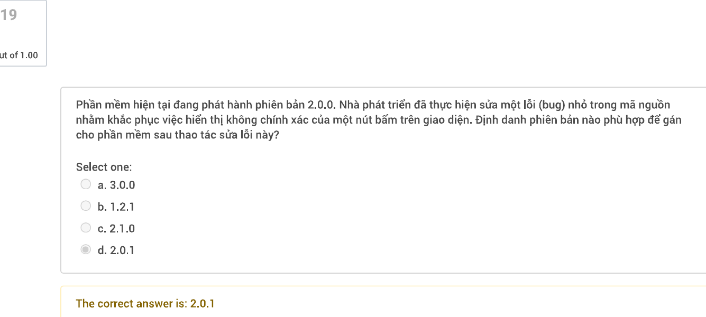

- A. 3.0.0
- B. 2.0.1
- C. 1.2.1
- D. 2.1.0

Hiện đáp án và giải thích

**Đáp án:** B. 2.0.1

**Giải thích:** Với hình giao diện, cần nhìn loại control, nhãn, vị trí và tính nhất quán giữa các màn hình. Thiết kế giao diện tốt dựa trên tính nhất quán, khả năng nhận biết và giảm gánh nặng ghi nhớ cho người dùng. Phương án sai thường nhầm loại control, luồng thao tác hoặc nguyên tắc usability đang bị vi phạm. Các lỗi giao diện thường lộ ra ở nhãn mơ hồ, vị trí control không nhất quán hoặc thao tác bắt người dùng nhớ quá nhiều.

### Câu 49
Nguồn: c5 / quiz phụ

Khi một sản phẩm của quá trình phát triển phần mềm được xét duyệt chính thức trở thành baseline thì nó sẽ không được thay đổi tiếp sau đó?

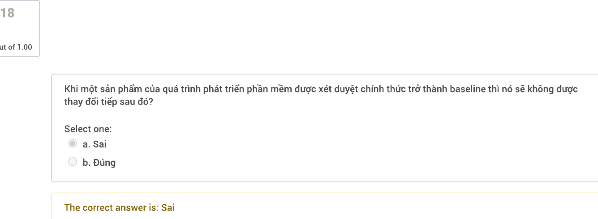

- A. Đúng
- B. Sai

Hiện đáp án và giải thích

**Đáp án:** B. Sai

**Giải thích:** Với hình quản lý cấu hình, cần xác định mục cấu hình, phiên bản, baseline và quan hệ thay đổi giữa các thành phần. SCM kiểm soát các mục cấu hình, phiên bản, baseline và thay đổi trong suốt vòng đời phần mềm. Mấu chốt là khả năng truy vết: biết thành phần nào đổi, đổi khi nào và thuộc phiên bản nào. Check-out là lấy về để sửa, check-in là đưa thay đổi vào kho; baseline là mốc đã được kiểm soát thay đổi.

### Câu 50
Nguồn: c5 / c5 p2 / quiz phụ

Nhiệm vụ nào sau đây không phải là một phần của quản lý cấu hình phần mềm (SCM)?

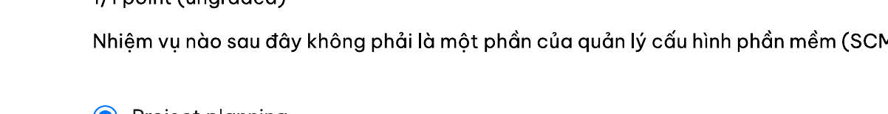

- A. Project planning Configuration status reporting
- B. Version control Change control

Hiện đáp án và giải thích

**Đáp án:** Project planning

**Giải thích:** Với hình quản lý cấu hình, cần xác định mục cấu hình, phiên bản, baseline và quan hệ thay đổi giữa các thành phần. SCM kiểm soát các mục cấu hình, phiên bản, baseline và thay đổi trong suốt vòng đời phần mềm. Mấu chốt là khả năng truy vết: biết thành phần nào đổi, đổi khi nào và thuộc phiên bản nào. Check-out là lấy về để sửa, check-in là đưa thay đổi vào kho; baseline là mốc đã được kiểm soát thay đổi.

### Câu 51
Nguồn: c5 / quiz phụ

Câu lệnh để lấy trạng thái hiện tại của kho lưu trữ trong Git là gì?

- A. git getStatus
- B. –status git
- C. git status
- D. git config –status

Hiện đáp án và giải thích

**Đáp án:** C. git status

**Giải thích:** Git lưu lịch sử thay đổi và trạng thái làm việc để nhóm có thể phối hợp trên cùng mã nguồn. Tên lệnh thường phản ánh trực tiếp thao tác: clone sao chép kho, status xem trạng thái, version xem phiên bản. Tên lệnh Git thường mô tả đúng hành động: clone sao chép kho, status xem trạng thái, commit ghi nhận thay đổi.

### Câu 52
Nguồn: quiz phụ

Phát triển phiên bản 1.2 của thực thể obj thành các phiên bản 1.3 và 2.0 như hình minh họa trong hệ thống quản lý phiên bản được gọi là?

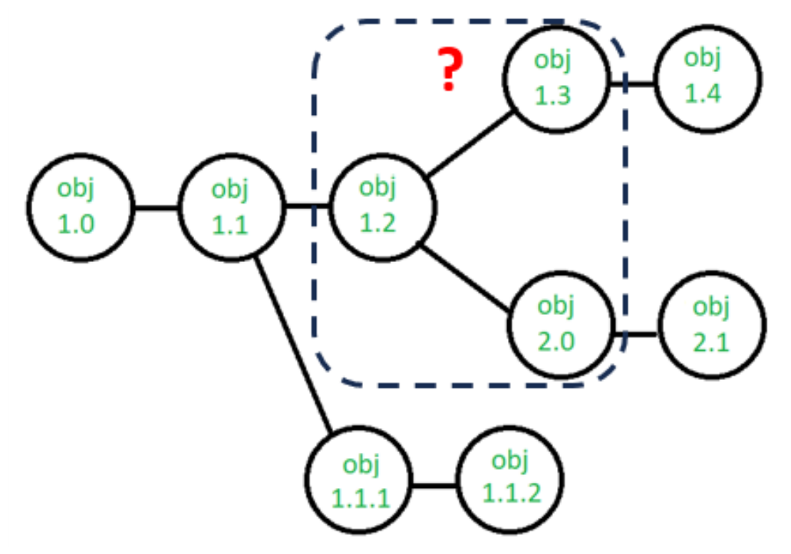

- A. Check-in
- B. Merging
- C. Check-out
- D. ranching

Hiện đáp án và giải thích

**Đáp án:** D. Branching

**Giải thích:** Với câu có hình, phần ảnh đang cung cấp dấu hiệu chính để nhận ra nhánh và gộp phiên bản; phần chữ OCR chỉ nên dùng để đối chiếu. Branching tạo hướng phát triển song song từ một phiên bản, còn merging hợp nhất các thay đổi từ nhiều nhánh. Nhìn sơ đồ phiên bản: tách đường là branch, nhập đường là merge. Nhãn, mũi tên và vị trí phần tử trong sơ đồ thường quyết định đáp án hơn phần mô tả OCR bị thiếu.

### Câu 53
Nguồn: quiz phụ

Thuật ngữ nào sau đây phù hợp nhất với phát biểu ”Sự kết hợp các nhánh phiên bản để tạo phiên bản mới của thành phần bao gồm tất cả các thay đổi đã được thực hiện”?

- A. Merging
- B. Codeline
- C. ranching
- D. Baseline

Hiện đáp án và giải thích

**Đáp án:** A. Merging

**Giải thích:** Branching tạo hướng phát triển song song từ một phiên bản, còn merging hợp nhất các thay đổi từ nhiều nhánh. Nhìn sơ đồ phiên bản: tách đường là branch, nhập đường là merge. Nếu mô tả nói 'kết hợp' thay đổi từ nhiều nhánh thì chọn merge; nếu nói tạo hướng phát triển song song thì chọn branch.

## Chương 6: Kỹ nghệ yêu cầu phần mềm

### Câu 1
Nguồn: c6 p2

Đâu là phát biểu đúng vê biểu đồ hoạt động trong UML? (1) Nút chia của sơ đổ hoạt động UML2 được sử dụng để mô hình hóa các luông song song và tạo mã thông báo cho tất cả các cạnh đi ra. (2) Nút chia là một nút thay thế cho nút quyết định và chỉ hợp lệ khi được kết hợp với nút nối. (3) Một nút ghép giúp đông bộ hóa nhiều luông thay thế. (4) Nút ghép hợp nhất các mã thông báo ngay khi chúng có sẵn trên tất cả các canh đến (5) Nút cuối cùng của hoạt động chỉ có thể được mô hình hóa một Iân trong mỗi mô hình (6) Các phân vùng không được có độ sâu phân cấp nhiều hơn một.

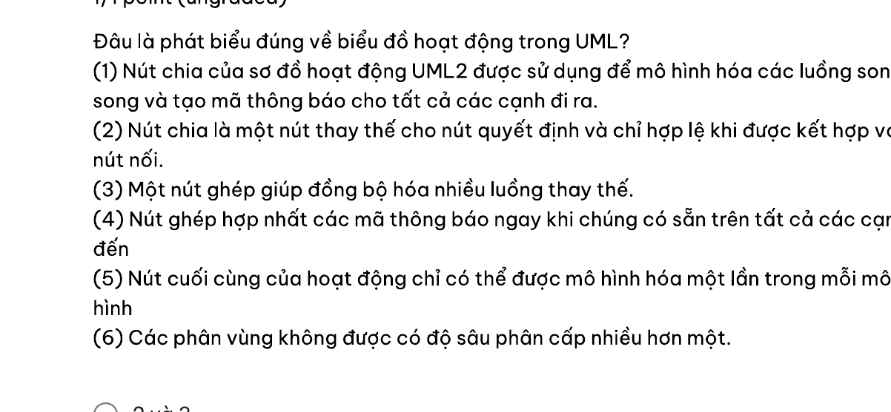

- A. 2 và 3
- B. 5 và 6
- C. 1 và 4
- D. 1, 3 và 4
- E. 1 và 2

Hiện đáp án và giải thích

**Đáp án:** C. 1 và 4

**Giải thích:** Với hình activity, cần đọc luồng điều khiển, nút rẽ nhánh, fork/join và swimlane. Biểu đồ hoạt động mô tả luồng xử lý, rẽ nhánh, đồng bộ và phân vùng trách nhiệm. Nút chia/tách luồng song song khác với nút quyết định chọn một nhánh thay thế. Fork/join dùng cho luồng song song; decision/merge dùng cho lựa chọn nhánh theo điều kiện.

### Câu 2
Nguồn: c6 p2 / quiz phụ

Hãy lựa chọn phát biểu đúng cho biểu đồ sau đây.

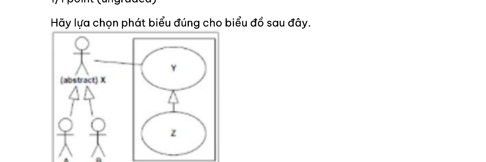

- A. 3
- B. A và B có thể thực hiện Ymột cách riêng biệt nhưng không thể thực hiện Z và B có thể thực hiện Zcùng nhau
- D. Z kế thừa từ Y, do đó kế thừa cả quan hệ của Y và được coi là một trường hợp đặc biệt của Y, do vậy có thể được thực thi bởi bất kỳ một hậu duệ (con) của. A và B là hậu duệ của X, cho nên có thể thay thế X và thực hiện _ A và B cùng thực hiện Y cùng nhau

Hiện đáp án và giải thích

**Đáp án:** D. Z kế thừa từ Y, do đó kế thừa cả quan hệ của Y và được coi là một trường hợp đặc biệt của Y, do vậy có thể được thực thi bởi bất kỳ một hậu duệ (con) của. A và B là hậu duệ của X, cho nên có thể thay thế X và thực hiện _

**Giải thích:** Với câu có hình, phần ảnh đang cung cấp dấu hiệu chính để nhận ra kỹ nghệ yêu cầu và mô hình UML; phần chữ OCR chỉ nên dùng để đối chiếu. Trọng tâm là mô tả đúng yêu cầu, tác nhân, luồng dữ liệu hoặc quan hệ trên mô hình. Cần tách mô hình yêu cầu khỏi thiết kế chi tiết hoặc cài đặt. Nhãn, mũi tên và vị trí phần tử trong sơ đồ thường quyết định đáp án hơn phần mô tả OCR bị thiếu.

### Câu 3
Nguồn: c6 p2

Chọn phát biểu đúng nhất về yêu cầu phi chức năng cuả phân mềm

- A. Là các yêu cầu về dữ liệu, con người
- B. ND và các ràng buộc như tính an toàn; độ tin cậy của
- C. PM.
- D. Các yêu cầu về dữ liệu
- E. Các yêu cầu về dữ liệu và con người-ND
- F. Các yêu cầu không liên quan đến xử lý

Hiện đáp án và giải thích

**Đáp án:** A. Là các yêu cầu về dữ liệu, con người ND và các ràng buộc như tính an toàn; độ tin cậy của PM.

**Giải thích:** Yêu cầu chức năng mô tả hệ thống phải làm gì; yêu cầu phi chức năng mô tả ràng buộc chất lượng như bảo mật, hiệu năng, độ tin cậy. Thiết kế và cài đặt dùng yêu cầu làm đầu vào, nhưng không phải hoạt động cốt lõi của kỹ nghệ yêu cầu. Chức năng là hành vi hệ thống phải cung cấp; phi chức năng là ràng buộc chất lượng hoặc môi trường vận hành.

### Câu 4
Nguồn: c6 p2

Hãy mô hình hoá tình huống sau đây bằng biểu đô UML usecase (2.0): {\it The director or his secretary are allowed to make an appointment, but nobody else Chỉ giám đốc và thưký của anh ta là có thể được phép đặt hẹn ngoài ra không có người nào khác có thể}.

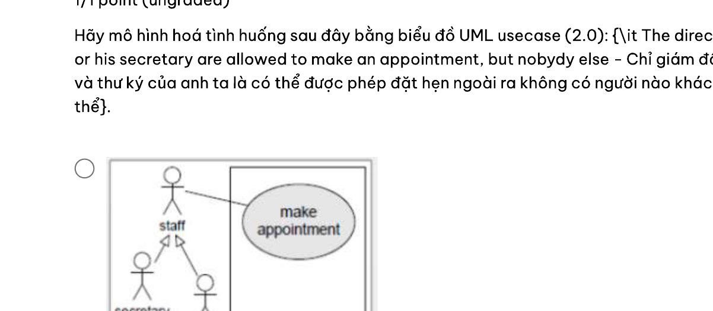

- A. Phương án A trong hình
- B. Phương án B trong hình
- C. Phương án C trong hình
- D. Phương án D trong hình

Hiện đáp án và giải thích

**Đáp án:** A

**Giải thích:** Với hình use case, cần đọc actor, use case và kiểu mũi tên trước khi kết luận quan hệ. Use case mô tả mục tiêu tương tác giữa actor và hệ thống; actor là vai trò bên ngoài chứ không phải lớp nội bộ. Include biểu diễn hành vi bắt buộc dùng chung, extend là hành vi mở rộng có điều kiện, generalization biểu diễn chuyên biệt hóa. Generalization là kế thừa quan hệ, include là hành vi bắt buộc dùng chung, còn extend là hành vi mở rộng có điều kiện.

### Câu 5
Nguồn: c6

Trong lược đồ DFDs, các tương tác giữa người dùng với hệ thống được biểu thị 5 bằng:

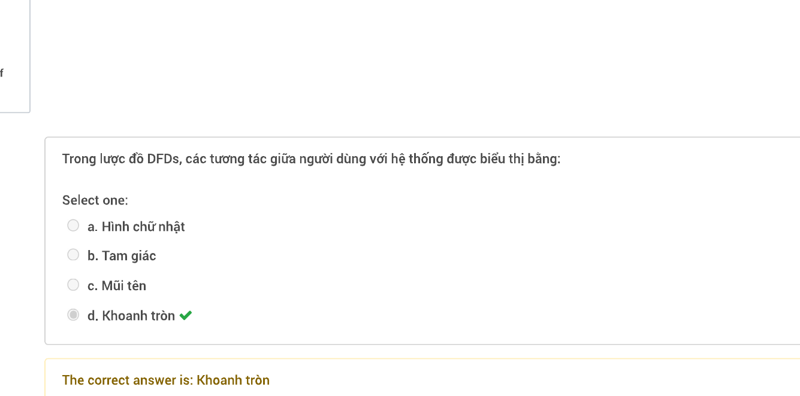

- A. Hình chữ nhật Tam giác
- B. Mũi tên Khoanh tròn

Hiện đáp án và giải thích

**Đáp án:** Khoanh tròn

**Giải thích:** Với câu có hình, phần ảnh đang cung cấp dấu hiệu chính để nhận ra kỹ nghệ yêu cầu và mô hình UML; phần chữ OCR chỉ nên dùng để đối chiếu. Trọng tâm là mô tả đúng yêu cầu, tác nhân, luồng dữ liệu hoặc quan hệ trên mô hình. Cần tách mô hình yêu cầu khỏi thiết kế chi tiết hoặc cài đặt. Nhãn, mũi tên và vị trí phần tử trong sơ đồ thường quyết định đáp án hơn phần mô tả OCR bị thiếu.

### Câu 6
Nguồn: c6

Công cụ đặc tả hình thức các yêu cầu chức năng của phần mềm theo tiếp cận cấu trúc. Chọn phát biểu đúng nhất

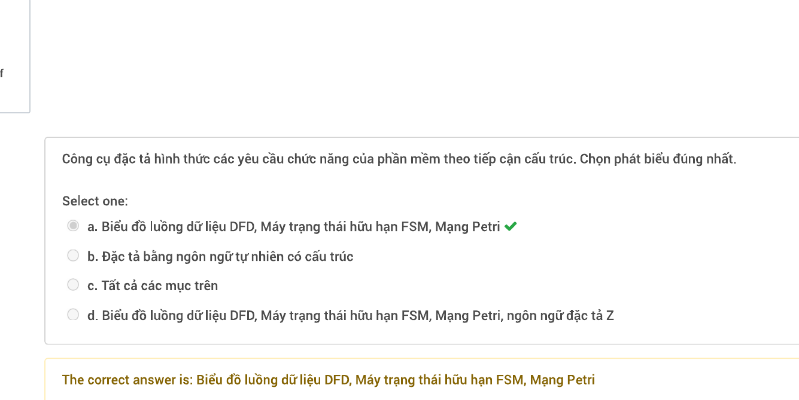

- A. Biểu đồ luồng dữ liệu DFD; Máy trang thái hữu hạn FSM; Mạng Petri Đặc tả bằng ngôn ngữtự nhiên có cấu trúc Tất cả các mục trên
- D. Biểu đồ luồng dữ liệu DFD, Máy trạng thái hữu hạn FSM; Mạng Petri, ngôn ngữđặc tả Z

Hiện đáp án và giải thích

**Đáp án:** Biểu đồ luồng dữ liệu DFD, Máy trạng thái hữu hạn FSM; Mạng Petri

**Giải thích:** Với câu có hình, phần ảnh đang cung cấp dấu hiệu chính để nhận ra DFD; phần chữ OCR chỉ nên dùng để đối chiếu. DFD tập trung vào luồng dữ liệu giữa tiến trình, kho dữ liệu và tác nhân ngoài. Nó không mô tả thứ tự điều khiển chi tiết như lưu đồ thuật toán hay mã chương trình. Nhãn, mũi tên và vị trí phần tử trong sơ đồ thường quyết định đáp án hơn phần mô tả OCR bị thiếu.

### Câu 7
Nguồn: c6

Trong sơ đồ use-case của UML, một usecase A bao gồm (includes) một usecase B có nghĩa là:

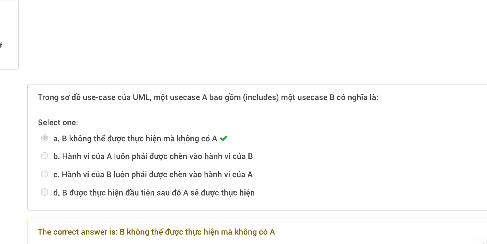

- A. B không thể được thực hiện mà không có A
- B. Hành vi của A luôn phải được chèn vào hành vi của B
- C. Hành vi của B luôn phải được chèn vào hành vi của A
- D. B dược thực hiện đầu tiên sau đó A sẽ được thực hiện

Hiện đáp án và giải thích

**Đáp án:** B không thể được thực hiện mà không có A

**Giải thích:** Với hình use case, cần đọc actor, use case và kiểu mũi tên trước khi kết luận quan hệ. Use case mô tả mục tiêu tương tác giữa actor và hệ thống; actor là vai trò bên ngoài chứ không phải lớp nội bộ. Include biểu diễn hành vi bắt buộc dùng chung, extend là hành vi mở rộng có điều kiện, generalization biểu diễn chuyên biệt hóa. Generalization là kế thừa quan hệ, include là hành vi bắt buộc dùng chung, còn extend là hành vi mở rộng có điều kiện.

### Câu 8
Nguồn: c6

Trong sơ đồ use-case của UML, mối quan hệ tổng quát hoá (generalization relationship) giữa usecase A và usecase B (được hiểu là B là một trường hợp đặc biệt của A) có nghĩa là:

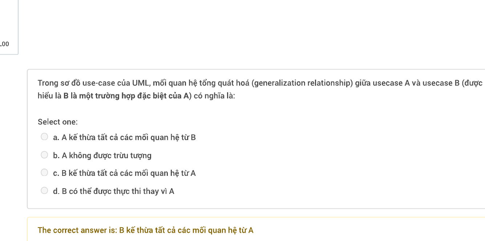

- A. 1 A kế thừa tất cả các mối quan hệ từ
- B. B A không được trừu tượng
- C. B kế thừa tất cả các mối quan hệ từ
- D. A B có thể được thực thi thay vÌ
- E. A

Hiện đáp án và giải thích

**Đáp án:** B kế thừa tất cả các mối quan hệ từ A

**Giải thích:** Với hình use case, cần đọc actor, use case và kiểu mũi tên trước khi kết luận quan hệ. Use case mô tả mục tiêu tương tác giữa actor và hệ thống; actor là vai trò bên ngoài chứ không phải lớp nội bộ. Include biểu diễn hành vi bắt buộc dùng chung, extend là hành vi mở rộng có điều kiện, generalization biểu diễn chuyên biệt hóa. Generalization là kế thừa quan hệ, include là hành vi bắt buộc dùng chung, còn extend là hành vi mở rộng có điều kiện.

### Câu 9
Nguồn: c6

Hãy mô hình hoá tình huống sau đây bằng biểu đồ UML usecase (2.0): {\it A mother cooks dinner together with her daughter. In the course of that, the mother always has to mix the cocktail Một người mẹ nấu bữa tối cùng với con gái, trong quá trình thực hiện điều đó, người mẹ luôn luôn là người thực hiện việc pha chế cốc-tai}

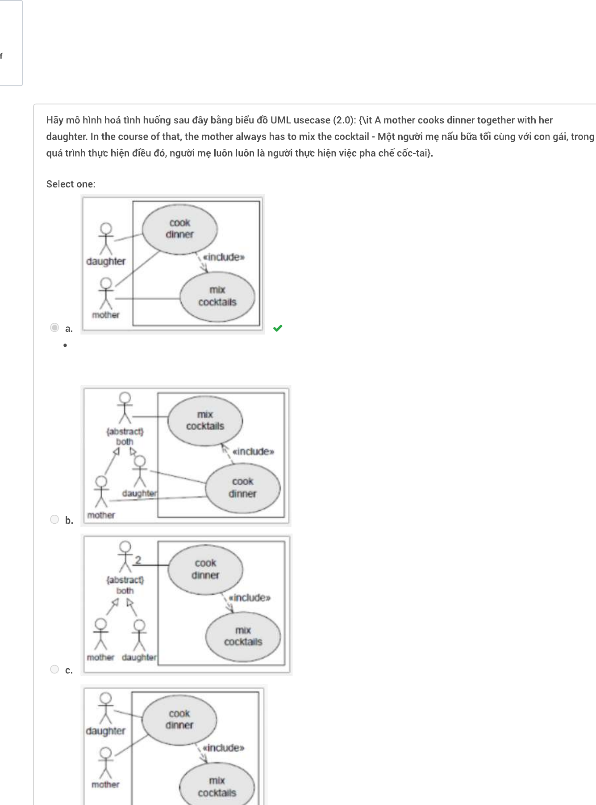

- A. Phương án A trong hình
- B. Phương án B trong hình
- C. Phương án C trong hình
- D. Phương án D trong hình

Hiện đáp án và giải thích

**Đáp án:** A

**Giải thích:** Với hình use case, cần đọc actor, use case và kiểu mũi tên trước khi kết luận quan hệ. Use case mô tả mục tiêu tương tác giữa actor và hệ thống; actor là vai trò bên ngoài chứ không phải lớp nội bộ. Include biểu diễn hành vi bắt buộc dùng chung, extend là hành vi mở rộng có điều kiện, generalization biểu diễn chuyên biệt hóa. Generalization là kế thừa quan hệ, include là hành vi bắt buộc dùng chung, còn extend là hành vi mở rộng có điều kiện.

### Câu 10
Nguồn: c6

Hãy mô hình hoá tình huống sau đây bằng biểu đồ UML usecase (2.0): {\it A teacher is conducting the interview with her với sinh viên của mình, trong quá trình thực hiện điều đó, người giáo viên luôn luôn là người phải cho điểm sinh viên}.

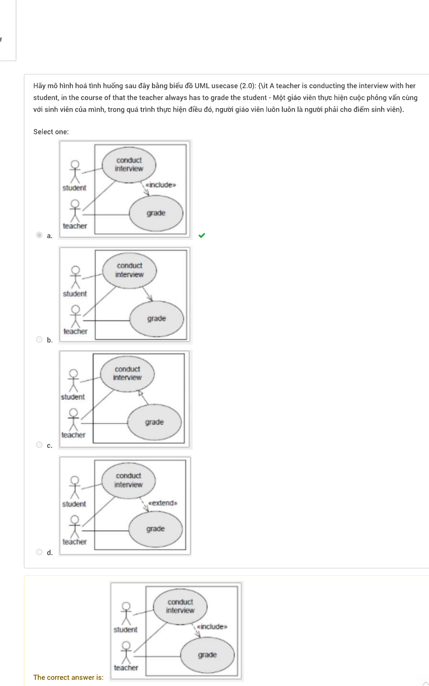

- A. Phương án A trong hình
- B. Phương án B trong hình
- C. Phương án C trong hình
- D. Phương án D trong hình

Hiện đáp án và giải thích

**Đáp án:** A

**Giải thích:** Với hình use case, cần đọc actor, use case và kiểu mũi tên trước khi kết luận quan hệ. Use case mô tả mục tiêu tương tác giữa actor và hệ thống; actor là vai trò bên ngoài chứ không phải lớp nội bộ. Include biểu diễn hành vi bắt buộc dùng chung, extend là hành vi mở rộng có điều kiện, generalization biểu diễn chuyên biệt hóa. Generalization là kế thừa quan hệ, include là hành vi bắt buộc dùng chung, còn extend là hành vi mở rộng có điều kiện.

### Câu 11
Nguồn: c6

Hãy lựa chọn phát biểu đúng cho biểu đồ sau đây 1; 8

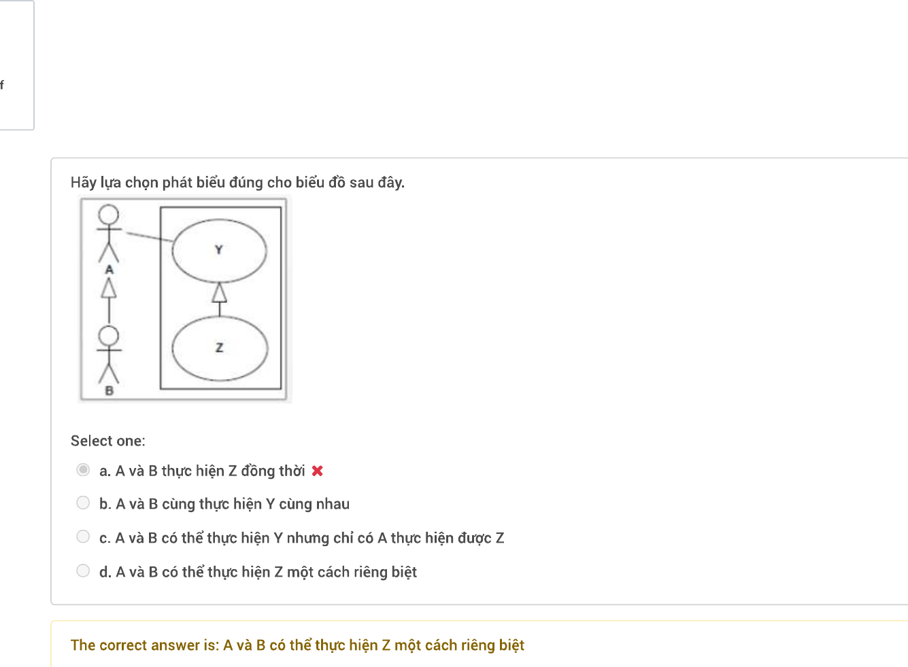

- A. A và B thực hiện Z đồng thời A và B cùng thực hiện Y cùng nhau
- C. A và B có thể thực hiện Y nhung chỉ có A thực hiện được Z
- D. A và B có thể thực hiện Z một cách riêng biệt

Hiện đáp án và giải thích

**Đáp án:** A và B có thể thực hiện Z một cách riêng biệt

**Giải thích:** Với câu có hình, phần ảnh đang cung cấp dấu hiệu chính để nhận ra kỹ nghệ yêu cầu và mô hình UML; phần chữ OCR chỉ nên dùng để đối chiếu. Trọng tâm là mô tả đúng yêu cầu, tác nhân, luồng dữ liệu hoặc quan hệ trên mô hình. Cần tách mô hình yêu cầu khỏi thiết kế chi tiết hoặc cài đặt. Nhãn, mũi tên và vị trí phần tử trong sơ đồ thường quyết định đáp án hơn phần mô tả OCR bị thiếu.

### Câu 12
Nguồn: c6

Hãy lựa chọn phát biểu đúng cho biểu đồ sau đây

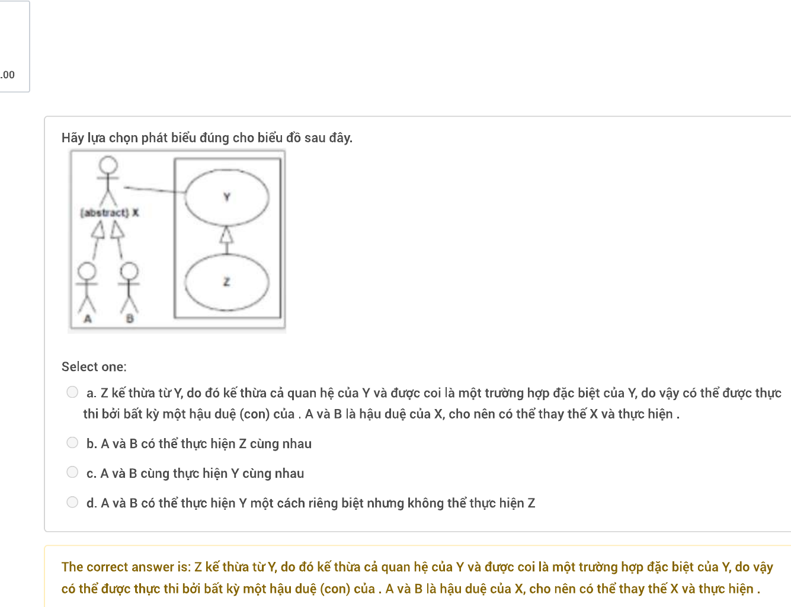

- A. Zkế thừa từ Y, do đó kế thừa cả quan hệ của Y và được coi là một trường hợp đặc biệt của Y, do vậy có thể được thực
- B. thi bởi bất kỳ một hậu duệ (con) của A và B là hậu duệ của X, cho nên có thể thay thế X và thực hiện A và B có thể thực hiện Z cùng nhau A và B cùng thực hiện Y cùng nhau
- E. A và B có thể thực hiện Y một cách riêng biệt nhưng không thể thực hiện Z

Hiện đáp án và giải thích

**Đáp án:** Z kế thừa từ Y, do đó kế thừa cả quan hệ của Y và được coi là một trường hợp đặc biệt của Y; do vậy có thể được thực thi bởi bất kỳ một hậu duệ (con) của A và B là hậu duệ của X, cho nên có thể thay thế X và thực hiện

**Giải thích:** Với câu có hình, phần ảnh đang cung cấp dấu hiệu chính để nhận ra kỹ nghệ yêu cầu và mô hình UML; phần chữ OCR chỉ nên dùng để đối chiếu. Trọng tâm là mô tả đúng yêu cầu, tác nhân, luồng dữ liệu hoặc quan hệ trên mô hình. Cần tách mô hình yêu cầu khỏi thiết kế chi tiết hoặc cài đặt. Nhãn, mũi tên và vị trí phần tử trong sơ đồ thường quyết định đáp án hơn phần mô tả OCR bị thiếu.

### Câu 13
Nguồn: c6

Hãy mô hình hoá tình huống sau đây bằng biểu đồ UML usecase (2.0): {\it The director or his secretary are allowed to make an appointment; but nobody else Chỉ giám đốc và thưký của anh ta là có thể được phép đặt hẹn ngoài ra không có người nào khác có thế}

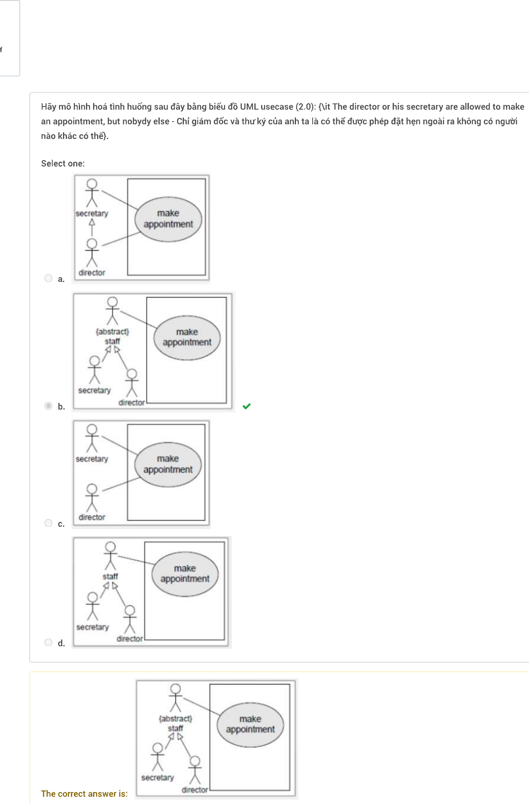

- A. Phương án A trong hình
- B. Phương án B trong hình
- C. Phương án C trong hình
- D. Phương án D trong hình

Hiện đáp án và giải thích

**Đáp án:** B

**Giải thích:** Với hình use case, cần đọc actor, use case và kiểu mũi tên trước khi kết luận quan hệ. Use case mô tả mục tiêu tương tác giữa actor và hệ thống; actor là vai trò bên ngoài chứ không phải lớp nội bộ. Include biểu diễn hành vi bắt buộc dùng chung, extend là hành vi mở rộng có điều kiện, generalization biểu diễn chuyên biệt hóa. Generalization là kế thừa quan hệ, include là hành vi bắt buộc dùng chung, còn extend là hành vi mở rộng có điều kiện.

### Câu 14
Nguồn: c6

Lựa chọn các kết hợp có thể có của các actor có thể thực hiện use case B- Luu ý: ký hiệu V thể hiện toán tử logic {Ibf or} và ký hiệu thể hiện toán tử logic {Ibf and}. 1; 7

- A. Y X XA Y
- B. XV (Y A Y)

Hiện đáp án và giải thích

**Đáp án:** X ^ Y

**Giải thích:** Use case mô tả mục tiêu tương tác giữa actor và hệ thống; actor là vai trò bên ngoài chứ không phải lớp nội bộ. Include biểu diễn hành vi bắt buộc dùng chung, extend là hành vi mở rộng có điều kiện, generalization biểu diễn chuyên biệt hóa. Actor là vai trò bên ngoài hệ thống; include là dùng chung bắt buộc, extend là mở rộng có điều kiện.

### Câu 15
Nguồn: c6 / c6 p2 / quiz phụ

Lựa chọn nào dưới đây để chỉ một yêu cầu chức năng của hệ thống?

- A. Không lựa chọn nào đúng
- B. Khả năng bảo trì được
- C. Tính đúng đắn của hệ thống
- D. Tính khả chuyển của hệ thống

Hiện đáp án và giải thích

**Đáp án:** A. Không lựa chọn nào đúng

**Giải thích:** Yêu cầu chức năng mô tả hệ thống phải làm gì; yêu cầu phi chức năng mô tả ràng buộc chất lượng như bảo mật, hiệu năng, độ tin cậy. Các câu ngoại lệ thường gài những mô tả về dữ liệu, giao diện hoặc tổ chức không trực tiếp là chức năng hệ thống. Chức năng là hành vi hệ thống phải cung cấp; phi chức năng là ràng buộc chất lượng hoặc môi trường vận hành.

### Câu 16
Nguồn: c6 / quiz phụ

Yêu cầu phi chức năng nào phù hợp với quan điểm của đội phát triển về một sản phẩm phần mềm?

- A. Tính sử dụng được
- B. Tính kiểm thử được
- C. Tính sẵn có Tính linh hoạt

Hiện đáp án và giải thích

**Đáp án:** B. Tính kiểm thử được

**Giải thích:** Yêu cầu chức năng mô tả hệ thống phải làm gì; yêu cầu phi chức năng mô tả ràng buộc chất lượng như bảo mật, hiệu năng, độ tin cậy. Thiết kế và cài đặt dùng yêu cầu làm đầu vào, nhưng không phải hoạt động cốt lõi của kỹ nghệ yêu cầu. Chức năng là hành vi hệ thống phải cung cấp; phi chức năng là ràng buộc chất lượng hoặc môi trường vận hành.

### Câu 17
Nguồn: quiz phụ

Xác định yêu cầu phần mềm rõ ràng đóng vai trò quan trọng trong quá trình phát triển phần mềm. Phát biểu nào sau đây là đúng nhất?

- A. Vì xác định yêu cầu phần mềm phụ thuộc vào khách hàng
- B. Vì khách hàng hay thay đổi yêu cầu
- C. Vì đáp ứng yêu cầu phần mềm quyết định sự thành công của dự án
- D. Vì hiểu rõ yêu cầu của phần mềm giúp đội dự án dễ dàng xây dựng giao diện

Hiện đáp án và giải thích

**Đáp án:** C. Vì đáp ứng yêu cầu phần mềm quyết định sự thành công của dự án

**Giải thích:** Yêu cầu chức năng mô tả hệ thống phải làm gì; yêu cầu phi chức năng mô tả ràng buộc chất lượng như bảo mật, hiệu năng, độ tin cậy. Thiết kế và cài đặt dùng yêu cầu làm đầu vào, nhưng không phải hoạt động cốt lõi của kỹ nghệ yêu cầu. Chức năng là hành vi hệ thống phải cung cấp; phi chức năng là ràng buộc chất lượng hoặc môi trường vận hành.

### Câu 18
Nguồn: quiz phụ

Thế nào là yêu cầu chức năng?

- A. Là yêu cầu về khả năng mã nguồn phải dễ đọc dễ hiểu
- B. Là yêu cầu về giao diện và trải nghiệm người dùng
- C. Là yêu cầu về hiệu năng và độ tin cậy của một hệ thống
- D. Là yêu cầu về các tính năng của hệ thống tương tác với người dùng và các tác nhân trong hệ thống

Hiện đáp án và giải thích

**Đáp án:** D. Là yêu cầu về các tính năng của hệ thống tương tác với người dùng và các tác nhân trong hệ thống

**Giải thích:** Yêu cầu chức năng mô tả hệ thống phải làm gì; yêu cầu phi chức năng mô tả ràng buộc chất lượng như bảo mật, hiệu năng, độ tin cậy. Các câu ngoại lệ thường gài những mô tả về dữ liệu, giao diện hoặc tổ chức không trực tiếp là chức năng hệ thống. Chức năng là hành vi hệ thống phải cung cấp; phi chức năng là ràng buộc chất lượng hoặc môi trường vận hành.

### Câu 19
Nguồn: c6 p2 / quiz phụ

Yêu cầu phi chức năng nào sau đây là đúng?

- A. Tính kiểm thử được
- B. Tính dễ sử dụng được
- C. Tính tái sử dụng
- D. Tính bảo trì được

Hiện đáp án và giải thích

**Đáp án:** B. Tính dễ sử dụng được

**Giải thích:** Yêu cầu chức năng mô tả hệ thống phải làm gì; yêu cầu phi chức năng mô tả ràng buộc chất lượng như bảo mật, hiệu năng, độ tin cậy. Thiết kế và cài đặt dùng yêu cầu làm đầu vào, nhưng không phải hoạt động cốt lõi của kỹ nghệ yêu cầu. Chức năng là hành vi hệ thống phải cung cấp; phi chức năng là ràng buộc chất lượng hoặc môi trường vận hành.

### Câu 20
Nguồn: quiz phụ

Việc tìm hiểu yêu cầu của phần mềm thông qua khảo sát các hệ thống đang tồn tại nhằm:

- A. Tận dụng các yêu cầu của các hệ thống đó
- B. Phân tích các yêu cầu dư thừa mà các hệ thống đó thực hiện
- C. Hiểu rõ nghiệp vụ của các yêu cầu chung và tái sử dụng các thành phần sẵn có nếu có thể
- D. Tìm hiểu các yêu cầu của khách hàng

Hiện đáp án và giải thích

**Đáp án:** C. Hiểu rõ nghiệp vụ của các yêu cầu chung và tái sử dụng các thành phần sẵn có nếu có thể

**Giải thích:** Yêu cầu chức năng mô tả hệ thống phải làm gì; yêu cầu phi chức năng mô tả ràng buộc chất lượng như bảo mật, hiệu năng, độ tin cậy. Các câu ngoại lệ thường gài những mô tả về dữ liệu, giao diện hoặc tổ chức không trực tiếp là chức năng hệ thống. Chức năng là hành vi hệ thống phải cung cấp; phi chức năng là ràng buộc chất lượng hoặc môi trường vận hành.

### Câu 21
Nguồn: quiz phụ

Mục đích của việc phỏng vấn khách hàng khi phân tích yêu cầu phần mềm?

- A. Để chưng cầu ý kiến của khách hàng về giao diện của hệ thống
- B. Để yêu cầu khách hàng lựa chọn những yêu cầu cụ thể do đội dự án đưa ra
- C. Để làm rõ các mong đợi của khách hàng đối với dự án phần mềm
- D. Để hiểu khách hàng muốn phát triển hệ thống dựa trên nền tảng kỹ thuật nào

Hiện đáp án và giải thích

**Đáp án:** C. Để làm rõ các mong đợi của khách hàng đối với dự án phần mềm

**Giải thích:** Yêu cầu chức năng mô tả hệ thống phải làm gì; yêu cầu phi chức năng mô tả ràng buộc chất lượng như bảo mật, hiệu năng, độ tin cậy. Thiết kế và cài đặt dùng yêu cầu làm đầu vào, nhưng không phải hoạt động cốt lõi của kỹ nghệ yêu cầu. Chức năng là hành vi hệ thống phải cung cấp; phi chức năng là ràng buộc chất lượng hoặc môi trường vận hành.

### Câu 22
Nguồn: quiz phụ

Lựa chọn nào sau đây không phải là một nội dung của kỹ nghệ yêu cầu phần mềm?

- A. Đánh giá (Validation)
- B. Đặc tả (Specification)
- C. Thiết kế (Design)
- D. Khám phá (Elicitation)

Hiện đáp án và giải thích

**Đáp án:** C. Thiết kế (Design)

**Giải thích:** Câu hỏi đang tìm ngoại lệ của yêu cầu phần mềm; hãy giữ lại các lựa chọn đúng chuẩn rồi xét lựa chọn còn nằm ngoài phạm vi. Yêu cầu chức năng mô tả hệ thống phải làm gì; yêu cầu phi chức năng mô tả ràng buộc chất lượng như bảo mật, hiệu năng, độ tin cậy. Thiết kế và cài đặt dùng yêu cầu làm đầu vào, nhưng không phải hoạt động cốt lõi của kỹ nghệ yêu cầu. Các phương án còn lại thường đúng nhưng thuộc cùng nhóm chuẩn; đáp án cần chọn là ý nhầm pha, nhầm phạm vi hoặc không thuộc danh sách đang hỏi.

### Câu 23
Nguồn: c6 / quiz phụ

Một trong các đầu ra của bước phát hiện yêu cầu phần mềm?

- A. Bảng kê (statement) các đòi hỏi và chức năng khả thi của
- B. Phần mềm Kế hoạch thực hiện dự án
- C. Phần mềm Hướng dẫn triển khai cài đặt của
- D. Phần mềm
- E. Thiết kế chi tiết của
- F. Phần mềm

Hiện đáp án và giải thích

**Đáp án:** Bảng kê (statement) các đòi hỏi và chức năng khả thi của phần mềm

**Giải thích:** Yêu cầu chức năng mô tả hệ thống phải làm gì; yêu cầu phi chức năng mô tả ràng buộc chất lượng như bảo mật, hiệu năng, độ tin cậy. Thiết kế và cài đặt dùng yêu cầu làm đầu vào, nhưng không phải hoạt động cốt lõi của kỹ nghệ yêu cầu. Chức năng là hành vi hệ thống phải cung cấp; phi chức năng là ràng buộc chất lượng hoặc môi trường vận hành.

### Câu 24
Nguồn: quiz phụ

Tiêu chí đánh giá chất lượng của hồ sơ đặc tả yêu cầu phần mềm?

- A. Tính rõ ràng, chính xác
- B. Tính đầy đủ, hoàn thiện
- C. Tính phù hợp
- D. Tất cả các đáp án

Hiện đáp án và giải thích

**Đáp án:** D. Tất cả các đáp án

**Giải thích:** Các lựa chọn đang mô tả những mặt khác nhau của yêu cầu phần mềm, nên câu trả lời phải bao quát cả nhóm. Yêu cầu chức năng mô tả hệ thống phải làm gì; yêu cầu phi chức năng mô tả ràng buộc chất lượng như bảo mật, hiệu năng, độ tin cậy. Thiết kế và cài đặt dùng yêu cầu làm đầu vào, nhưng không phải hoạt động cốt lõi của kỹ nghệ yêu cầu. Dạng 'tất cả' hợp lý khi từng lựa chọn là một lát cắt hợp lệ của cùng tiêu chí, không có ý nào phá vỡ phạm vi câu hỏi.

### Câu 25
Nguồn: quiz phụ

Mô hình hoá các hệ thống phức tạp là gì?

- A. Là việc đơn giản hoá một hệ thống phức tạp bằng nhiều mô hình khác nhau, mỗi mô hình thể hiện một khía cạnh của hệ thống
- B. Là việc thể hiện các yêu cầu của một hệ thống bằng các biểu đồ
- C. Là trực quan hoá một hệ thống theo các chiều không gian
- D. Xây dựng bản thiết kế của hệ thống

Hiện đáp án và giải thích

**Đáp án:** Là việc đơn giản hoá một hệ thống phức tạp bằng nhiều mô hình khác nhau, mỗi mô hình thể hiện một khía cạnh của hệ thống

**Giải thích:** Yêu cầu chức năng mô tả hệ thống phải làm gì; yêu cầu phi chức năng mô tả ràng buộc chất lượng như bảo mật, hiệu năng, độ tin cậy. Các câu ngoại lệ thường gài những mô tả về dữ liệu, giao diện hoặc tổ chức không trực tiếp là chức năng hệ thống. Chức năng là hành vi hệ thống phải cung cấp; phi chức năng là ràng buộc chất lượng hoặc môi trường vận hành.

### Câu 26
Nguồn: quiz phụ

Mục đích của việc sử dụng ngôn ngữ mô hình hoá UML trong quá trình mô hình hoá hệ thống phần mềm là gì?

- A. Giúp tương tác giữa các đối tượng tham gia dự án
- B. Tất cả các đáp án Giúp xây dựng tài liệu hệ thống
- C. Giúp mô hình hoá yêu cầu
- D. Phần mềm và các thành phần của hệ thống bằng một hệ thống các biểu đồ trực quan ở nhiều mức độ chi tiết khác nhau

Hiện đáp án và giải thích

**Đáp án:** Tất cả các đáp án

**Giải thích:** Các lựa chọn đang mô tả những mặt khác nhau của yêu cầu phần mềm, nên câu trả lời phải bao quát cả nhóm. Yêu cầu chức năng mô tả hệ thống phải làm gì; yêu cầu phi chức năng mô tả ràng buộc chất lượng như bảo mật, hiệu năng, độ tin cậy. Thiết kế và cài đặt dùng yêu cầu làm đầu vào, nhưng không phải hoạt động cốt lõi của kỹ nghệ yêu cầu. Dạng 'tất cả' hợp lý khi từng lựa chọn là một lát cắt hợp lệ của cùng tiêu chí, không có ý nào phá vỡ phạm vi câu hỏi.

### Câu 27
Nguồn: quiz phụ

Các biểu đồ nào của UML thể hiện góc nhìn động của hệ thống?

- A. Biểu đồ lớp Biểu đồ cộng tác
- B. Biểu đồ gói Biểu đồ thành phần và biểu đồ triển khai

Hiện đáp án và giải thích

**Đáp án:** Biểu đồ cộng tác

**Giải thích:** Trọng tâm là mô tả đúng yêu cầu, tác nhân, luồng dữ liệu hoặc quan hệ trên mô hình. Cần tách mô hình yêu cầu khỏi thiết kế chi tiết hoặc cài đặt. Các mệnh đề đúng/sai hay sai ở từ tuyệt đối như 'luôn luôn', 'chỉ', 'không' hoặc do mở rộng phạm vi vượt quá định nghĩa.

### Câu 28
Nguồn: quiz phụ

Biểu đồ nào giúp mô hình hoá nghiệp vụ của hệ thống?

- A. Biểu đồ máy trạng thái
- B. Biểu đồ ca sử dụng
- C. Biểu đồ hoạt động
- D. Biểu đồ tuần tự

Hiện đáp án và giải thích

**Đáp án:** Biểu đồ ca sử dụng, Biểu đồ hoạt động, Biểu đồ máy trạng thái

**Giải thích:** Trọng tâm là mô tả đúng yêu cầu, tác nhân, luồng dữ liệu hoặc quan hệ trên mô hình. Cần tách mô hình yêu cầu khỏi thiết kế chi tiết hoặc cài đặt. Loại các phương án chỉ nói về công cụ, pha khác hoặc hệ quả phụ; đáp án đúng phải giữ đúng phạm vi khái niệm.

### Câu 29
Nguồn: quiz phụ

Các biểu đồ nào của UML thể hiện góc nhìn tĩnh (static view) của hệ thống?

- A. Biểu đồ ca sử dụng
- B. Biểu đồ lớp và biểu đồ triển khai
- C. Biểu đồ cộng tác
- D. Biểu đồ máy hữu hạn

Hiện đáp án và giải thích

**Đáp án:** B. Biểu đồ lớp và biểu đồ triển khai

**Giải thích:** MVC tách dữ liệu/nghiệp vụ, giao diện hiển thị và điều phối tương tác để giảm phụ thuộc. Nếu câu hỏi nhắc V thì trọng tâm là phần hiển thị, không phải nơi lưu dữ liệu hay xử lý nghiệp vụ chính. Model giữ dữ liệu/nghiệp vụ, View hiển thị, Controller điều phối tương tác; nhầm ba vai trò này sẽ làm sai câu MVC.

### Câu 30
Nguồn: c6 p2 / quiz phụ

Trong lược đồ DFDs, các tương tác giữa người dùng với hệ thống được biểu thị bằng:

- A. Khoanh tròn Mũi tên
- B. Tam giác Hình chữ nhật

Hiện đáp án và giải thích

**Đáp án:** Khoanh tròn

**Giải thích:** Với câu có hình, phần ảnh đang cung cấp dấu hiệu chính để nhận ra kỹ nghệ yêu cầu và mô hình UML; phần chữ OCR chỉ nên dùng để đối chiếu. Trọng tâm là mô tả đúng yêu cầu, tác nhân, luồng dữ liệu hoặc quan hệ trên mô hình. Cần tách mô hình yêu cầu khỏi thiết kế chi tiết hoặc cài đặt. Nhãn, mũi tên và vị trí phần tử trong sơ đồ thường quyết định đáp án hơn phần mô tả OCR bị thiếu.

### Câu 31
Nguồn: c6

Đâu là phát biểu đúng? 1; acxtcnd

- A. Khi thực hiện B có thể hoặc không gọi tới
- B. A B mở rộng
- C. A luôn luôn gọi tới
- D. A A không thể thực hiện mà không có

Hiện đáp án và giải thích

**Đáp án:** Khi thực hiện B có thể hoặc không gọi tới A

**Giải thích:** Trọng tâm là mô tả đúng yêu cầu, tác nhân, luồng dữ liệu hoặc quan hệ trên mô hình. Cần tách mô hình yêu cầu khỏi thiết kế chi tiết hoặc cài đặt. Loại các phương án chỉ nói về công cụ, pha khác hoặc hệ quả phụ; đáp án đúng phải giữ đúng phạm vi khái niệm.

### Câu 32
Nguồn: quiz phụ

Biểu đồ máy hữu hạn trạng thái mô hình hoá khía cạnh nào của hệ thống phần mềm?

- A. Mô hình hoá các trạng thái khác nhau của một đối tượng dữ liệu cụ thể trong hệ thống và các sự kiện/bộ kích hoạt dẫn tới sự chuyển trạng thái đó
- B. Mô hình hoá sự chuyển trạng thái của các đối tượng khác nhau trong hệ thống
- C. Mô hình hoá các ràng buộc và điều kiện dẫn tới sự chuyển trạng thái của một đối tượng dữ liệu cụ thể
- D. Mô hình hoá các sự kiện dẫn tới một chức năng nào đó được thực hiện

Hiện đáp án và giải thích

**Đáp án:** A. Mô hình hoá các trạng thái khác nhau của một đối tượng dữ liệu cụ thể trong hệ thống và các sự kiện/bộ kích hoạt dẫn tới sự chuyển trạng thái đó

**Giải thích:** Trọng tâm là mô tả đúng yêu cầu, tác nhân, luồng dữ liệu hoặc quan hệ trên mô hình. Cần tách mô hình yêu cầu khỏi thiết kế chi tiết hoặc cài đặt. Loại các phương án chỉ nói về công cụ, pha khác hoặc hệ quả phụ; đáp án đúng phải giữ đúng phạm vi khái niệm.

### Câu 33
Nguồn: c6

Đâu là phát biểu đúng về quan hệ association giữa một actor và usecase trong biểu đồ UML?

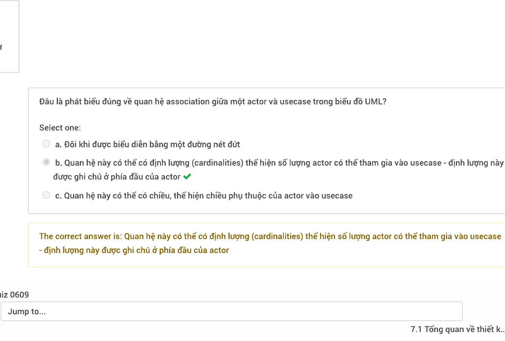

- A. Đôi khi được Biểu diễn bằng một đường nét đứt
- B. Quan hệ này có thể có định lượng (cardinalities) thể hiện số lượng actor có thể tham gia vào usecase định lượng này được ghi chú ở phía đầu của actor
- C. Quan hệ này có thể có chiều; thể hiện chiều phụ thuộc của actor vào usecase

Hiện đáp án và giải thích

**Đáp án:** Quan hệ này có thể có định lượng (cardinalities) thể hiện số lượng actor có thể tham gia vào usecase định lượng này được ghi chú ở phía đầu của actor Quiz 0609 7,1 Tổng quan về thiết k.

**Giải thích:** Với hình use case, cần đọc actor, use case và kiểu mũi tên trước khi kết luận quan hệ. Use case mô tả mục tiêu tương tác giữa actor và hệ thống; actor là vai trò bên ngoài chứ không phải lớp nội bộ. Include biểu diễn hành vi bắt buộc dùng chung, extend là hành vi mở rộng có điều kiện, generalization biểu diễn chuyên biệt hóa. Generalization là kế thừa quan hệ, include là hành vi bắt buộc dùng chung, còn extend là hành vi mở rộng có điều kiện.

### Câu 34
Nguồn: c6 / c6 p2 / quiz phụ

Trong các lựa chọn dưới đây, đâu là các phần trong báo cáo khả thi?

- A. Khả năng triển khai được
- B. Tính khả thi về mặt ngân sách
- C. Tính khả thi về mặt kỹ thuật
- D. Tất cả các đáp án đều đúng

Hiện đáp án và giải thích

**Đáp án:** D. Tất cả các đáp án đều đúng

**Giải thích:** Các lựa chọn đang mô tả những mặt khác nhau của kỹ nghệ yêu cầu và mô hình UML, nên câu trả lời phải bao quát cả nhóm. Trọng tâm là mô tả đúng yêu cầu, tác nhân, luồng dữ liệu hoặc quan hệ trên mô hình. Cần tách mô hình yêu cầu khỏi thiết kế chi tiết hoặc cài đặt. Dạng 'tất cả' hợp lý khi từng lựa chọn là một lát cắt hợp lệ của cùng tiêu chí, không có ý nào phá vỡ phạm vi câu hỏi.

### Câu 35
Nguồn: quiz phụ

Chọn phát biểu đúng nhất của Kho dữ liệu trong mô hình hướng luồng dữ liệu DFD

- A. Là nơi lưu trữ dữ liệu cần thiết, lâu dài cho các tiến trình xử lý của hệ thống Là 1 trong 5 thành phần của mô hình DFD Là nơi lưu trữ dữ liệu cho Hệ thống
- D. Là tiền đề để xây dựng các thực thể dữ liệu khi PT Hệ thống về dữ liệu

Hiện đáp án và giải thích

**Đáp án:** Là nơi lưu trữ dữ liệu cần thiết, lâu dài cho các tiến trình xử lý của hệ thống

**Giải thích:** DFD tập trung vào luồng dữ liệu giữa tiến trình, kho dữ liệu và tác nhân ngoài. Nó không mô tả thứ tự điều khiển chi tiết như lưu đồ thuật toán hay mã chương trình. DFD nói về dữ liệu đi đâu và qua tiến trình nào, không phải thứ tự điều khiển chi tiết như lưu đồ thuật toán.

### Câu 36
Nguồn: c6 p2 / quiz phụ

Công cụ đặc tả hình thức các yêu cầu chức năng của phần mềm theo tiếp cận cấu trúc. Chọn phát biểu đúng nhất.

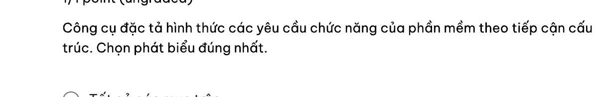

- A. Biểu đồ luồng dữ liệu DFD, Máy trạng thái hữu hạn FSM, Mạng Petri, ngôn ngữ đặc tả Z Tất cả các mục trên
- C. Biểu đồ luồng dữ liệu DFD, Máy trạng thái hữu hạn FSM, Mạng Petri Đặc tả bằng ngôn ngữ tự nhiên có cấu trúc

Hiện đáp án và giải thích

**Đáp án:** Biểu đồ luồng dữ liệu DFD, Máy trạng thái hữu hạn FSM, Mạng Petri

**Giải thích:** Với câu có hình, phần ảnh đang cung cấp dấu hiệu chính để nhận ra DFD; phần chữ OCR chỉ nên dùng để đối chiếu. DFD tập trung vào luồng dữ liệu giữa tiến trình, kho dữ liệu và tác nhân ngoài. Nó không mô tả thứ tự điều khiển chi tiết như lưu đồ thuật toán hay mã chương trình. Nhãn, mũi tên và vị trí phần tử trong sơ đồ thường quyết định đáp án hơn phần mô tả OCR bị thiếu.

### Câu 37
Nguồn: quiz phụ

Trong hình vẽ dưới đây, đâu là phát biểu đúng?

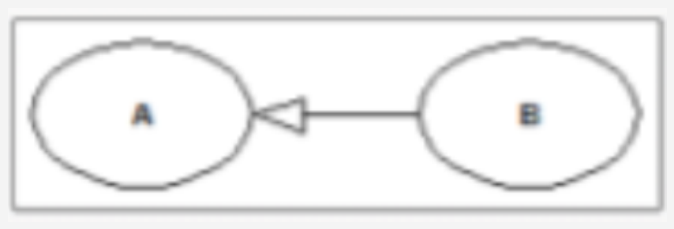

- A. A kế thừa mọi quan hệ từ
- B. B A không được là abstract
- C. B kế thừa mọi quan hệ từ
- D. A B được gọi là base-use-case

Hiện đáp án và giải thích

**Đáp án:** B kế thừa mọi quan hệ từ A

**Giải thích:** Với hình use case, cần đọc actor, use case và kiểu mũi tên trước khi kết luận quan hệ. Use case mô tả mục tiêu tương tác giữa actor và hệ thống; actor là vai trò bên ngoài chứ không phải lớp nội bộ. Include biểu diễn hành vi bắt buộc dùng chung, extend là hành vi mở rộng có điều kiện, generalization biểu diễn chuyên biệt hóa. Generalization là kế thừa quan hệ, include là hành vi bắt buộc dùng chung, còn extend là hành vi mở rộng có điều kiện.

### Câu 38
Nguồn: quiz phụ

Đâu là phát biểu đúng về quan hệ association giữa một actor và usecase trong biểu đồ UML?

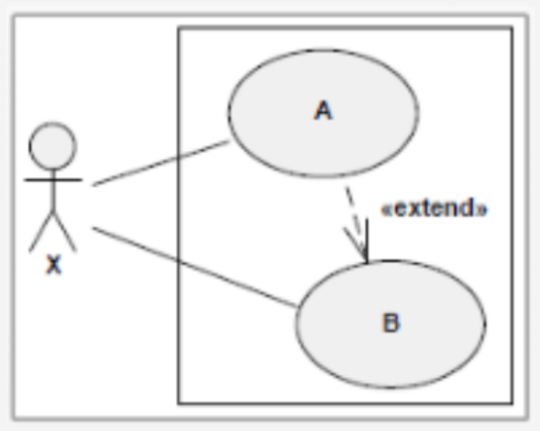

- A. Quan hệ này có thể có chiều, thể hiện chiều phụ thuộc của actor vào usecase
- B. Đôi khi được Biểu diễn bằng một đường nét đứt
- C. Quan hệ này có thể có định lượng (cardinalities) thể hiện số lượng actor có thể tham gia vào usecase - định lượng này được ghi chú ở phía đầu của actor

Hiện đáp án và giải thích

**Đáp án:** C. Quan hệ này có thể có định lượng (cardinalities) thể hiện số lượng actor có thể tham gia vào usecase - định lượng này được ghi chú ở phía đầu của actor

**Giải thích:** Với hình use case, cần đọc actor, use case và kiểu mũi tên trước khi kết luận quan hệ. Use case mô tả mục tiêu tương tác giữa actor và hệ thống; actor là vai trò bên ngoài chứ không phải lớp nội bộ. Include biểu diễn hành vi bắt buộc dùng chung, extend là hành vi mở rộng có điều kiện, generalization biểu diễn chuyên biệt hóa. Generalization là kế thừa quan hệ, include là hành vi bắt buộc dùng chung, còn extend là hành vi mở rộng có điều kiện.

### Câu 39
Nguồn: quiz phụ

Hãy mô hình hoá tình huống sau đây bằng biểu đồ UML usecase (2.0): {\it The director or his secretary are allowed to make an appointment, but nobody else - Chỉ giám đốc và thư ký của anh ta là có thể được phép đặt hẹn ngoài ra không có người nào khác có thể}.

- A.
  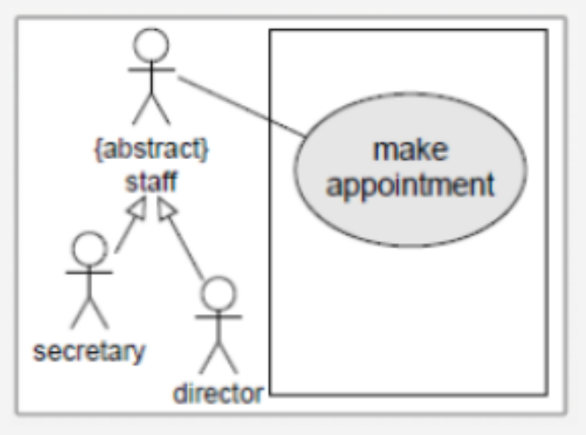
- B.
  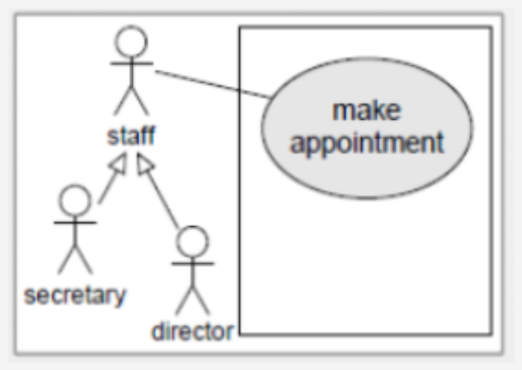
- C.
  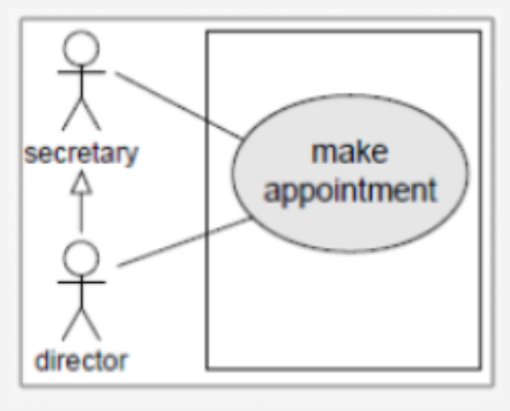
- D.
  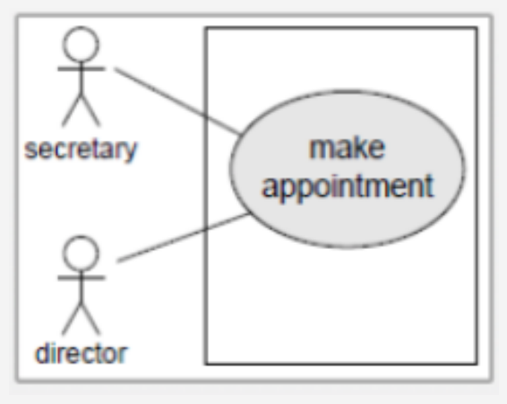

Hiện đáp án và giải thích

**Đáp án:** A

**Giải thích:** Với hình use case, cần đọc actor, use case và kiểu mũi tên trước khi kết luận quan hệ. Use case mô tả mục tiêu tương tác giữa actor và hệ thống; actor là vai trò bên ngoài chứ không phải lớp nội bộ. Include biểu diễn hành vi bắt buộc dùng chung, extend là hành vi mở rộng có điều kiện, generalization biểu diễn chuyên biệt hóa. Generalization là kế thừa quan hệ, include là hành vi bắt buộc dùng chung, còn extend là hành vi mở rộng có điều kiện.

### Câu 40
Nguồn: c6 p2 / quiz phụ

∨ Lựa chọn các kết hợp có thể có của các actor có thể thực hiện use case B. Lưu ý: ký hiệu thể hiện toán tử logic {\bf or} và ∧ ký hiệu thể hiện toán tử logic {\bf and}.

- A. X (Y Y) Y ∧
- B. X Y X ∧

Hiện đáp án và giải thích

**Đáp án:** X Y Video 0606 Các công c…

**Giải thích:** Use case mô tả mục tiêu tương tác giữa actor và hệ thống; actor là vai trò bên ngoài chứ không phải lớp nội bộ. Include biểu diễn hành vi bắt buộc dùng chung, extend là hành vi mở rộng có điều kiện, generalization biểu diễn chuyên biệt hóa. Actor là vai trò bên ngoài hệ thống; include là dùng chung bắt buộc, extend là mở rộng có điều kiện.

### Câu 41
Nguồn: quiz phụ

Đâu là phát biểu đúng về biểu đồ hoạt động trong UML? (1) Nút chia của sơ đồ hoạt động UML2 được sử dụng để mô hình hóa các luồng song song và tạo mã thông báo cho tất cả các cạnh đi ra. (2) Nút chia là một nút thay thế cho nút quyết định và chỉ hợp lệ khi được kết hợp với nút nối. (3) Một nút ghép giúp đồng bộ hóa nhiều luồng thay thế. (4) Nút ghép hợp nhất các mã thông báo ngay khi chúng có sẵn trên tất cả các cạnh đến (5) Nút cuối cùng của hoạt động chỉ có thể được mô hình hóa một lần trong mỗi mô hình (6) Các phân vùng không được có độ sâu phân cấp nhiều hơn một.

- A. 1 và 4
- B. 1 và 2
- C. 5 và 6
- D. 2 và 3
- E. 1, 3 và 4

Hiện đáp án và giải thích

**Đáp án:** A. 1 và 4

**Giải thích:** Câu hỏi đang tìm ngoại lệ của biểu đồ hoạt động UML; hãy giữ lại các lựa chọn đúng chuẩn rồi xét lựa chọn còn nằm ngoài phạm vi. Biểu đồ hoạt động mô tả luồng xử lý, rẽ nhánh, đồng bộ và phân vùng trách nhiệm. Nút chia/tách luồng song song khác với nút quyết định chọn một nhánh thay thế. Các phương án còn lại thường đúng nhưng thuộc cùng nhóm chuẩn; đáp án cần chọn là ý nhầm pha, nhầm phạm vi hoặc không thuộc danh sách đang hỏi.

### Câu 42
Nguồn: c6 p2 / quiz phụ

Mục đích của biểu đồ hoạt động trong mô hình hoá phần mềm?

- A. Biểu diễn các tương tác giữa các thành phần khác nhau trong hệ thống
- B. Mô hình hoá thuật toán
- C. Biểu diễn khía cạnh động trong đó tác nhân tương tác với nhau và tương tác với hệ thống
- D. Phần mềm
- E. Mô hình hoá nghiệp vụ của hệ thống
- F. Phần mềm và giúp đặc tả trực quan luồng sự kiện của các ca sử dụng

Hiện đáp án và giải thích

**Đáp án:** Mô hình hoá nghiệp vụ của hệ thống phần mềm và giúp đặc tả trực quan luồng sự kiện của các ca sử dụng

**Giải thích:** Với câu có hình, phần ảnh đang cung cấp dấu hiệu chính để nhận ra kỹ nghệ yêu cầu và mô hình UML; phần chữ OCR chỉ nên dùng để đối chiếu. Trọng tâm là mô tả đúng yêu cầu, tác nhân, luồng dữ liệu hoặc quan hệ trên mô hình. Cần tách mô hình yêu cầu khỏi thiết kế chi tiết hoặc cài đặt. Nhãn, mũi tên và vị trí phần tử trong sơ đồ thường quyết định đáp án hơn phần mô tả OCR bị thiếu.

### Câu 43
Nguồn: quiz phụ

Đâu là phát biểu đúng về nút quyết định trong biểu đồ hoạt động UML2?

- A. Mỗi nút quyết định chỉ có thể Biểu diễn với 1 ràng buộc hoặc điều kiện để kiểm chứng
- B. Một nút quyết định cũng chính là một nút hoạt động của biểu đồ hoạt động tại đó có điều kiện cần phải kiểm chứng
- C. Giúp Biểu diễn các luồng khác nhau của 1 sự kiện cụ thể
- D. Giúp phân nhánh các luồng sự kiện tuỳ theo một giá trị cụ thể của các ràng buộc tại nút quyết định

Hiện đáp án và giải thích

**Đáp án:** Giúp phân nhánh các luồng sự kiện tuỳ theo một giá trị cụ thể của các ràng buộc tại nút quyết định, Một nút quyết định cũng chính là một nút hoạt động của biểu đồ hoạt động tại đó có điều kiện cần phải kiểm chứng

**Giải thích:** Trọng tâm là mô tả đúng yêu cầu, tác nhân, luồng dữ liệu hoặc quan hệ trên mô hình. Cần tách mô hình yêu cầu khỏi thiết kế chi tiết hoặc cài đặt. Loại các phương án chỉ nói về công cụ, pha khác hoặc hệ quả phụ; đáp án đúng phải giữ đúng phạm vi khái niệm.

### Câu 44
Nguồn: c6 p2 / quiz phụ

Mục đích của sự phân làn trong biểu đồ hoạt động là gì

- A. Giúp phân biệt một cách cụ thể sự tham gia của từng thành phần khác nhau của hệ thống
- B. Giúp phân định một cách rõ ràng giữa hệ thống và các tác nhân
- C. Giúp cấu trúc hoá biểu đồ hoạt động thành các thành phần khác nhau
- D. Giúp trực quan hoá từng đối tượng cụ thể với các hoạt động riêng biệt

Hiện đáp án và giải thích

**Đáp án:** D. Giúp trực quan hoá từng đối tượng cụ thể với các hoạt động riêng biệt

**Giải thích:** Với câu có hình, phần ảnh đang cung cấp dấu hiệu chính để nhận ra kỹ nghệ yêu cầu và mô hình UML; phần chữ OCR chỉ nên dùng để đối chiếu. Trọng tâm là mô tả đúng yêu cầu, tác nhân, luồng dữ liệu hoặc quan hệ trên mô hình. Cần tách mô hình yêu cầu khỏi thiết kế chi tiết hoặc cài đặt. Nhãn, mũi tên và vị trí phần tử trong sơ đồ thường quyết định đáp án hơn phần mô tả OCR bị thiếu.

### Câu 45
Nguồn: quiz phụ

Đâu không phải là quan hệ đúng giữa các ca sử dụng trong biểu đồ ca sử dụng UML2?

- A. Quan hệ liên kết giữa ca sử dụng và ca sử dụng
- B. Quan hệ kế thừa giữa các ca sử dụng
- C. Quan hệ bao gồm giữa các ca sử dụng
- D. Quan hệ mở rộng giữa các ca sử dụng

Hiện đáp án và giải thích

**Đáp án:** A. Quan hệ liên kết giữa ca sử dụng và ca sử dụng

**Giải thích:** Câu hỏi đang tìm ngoại lệ của coupling/cohesion; hãy giữ lại các lựa chọn đúng chuẩn rồi xét lựa chọn còn nằm ngoài phạm vi. Cohesion đo mức các phần trong một mô-đun cùng phục vụ một trách nhiệm, còn coupling đo mức phụ thuộc giữa mô-đun/lớp. Thiết kế tốt thường muốn cohesion cao và coupling thấp. Các phương án còn lại thường đúng nhưng thuộc cùng nhóm chuẩn; đáp án cần chọn là ý nhầm pha, nhầm phạm vi hoặc không thuộc danh sách đang hỏi.

### Câu 46
Nguồn: quiz phụ

Đâu là quan hệ đúng trong biểu đồ ca sử dụng của UML2?

- A. Quan hệ bao gồm giữa tác nhân và ca sử dụng
- B. Quan hệ liên kết giữa các ca sử dụng
- C. Quan hệ liên kết giữa một hoặc nhiều tác nhân với ca sử dụng
- D. Quan hệ kế thừa giữa tác nhân và ca sử dụng

Hiện đáp án và giải thích

**Đáp án:** C. Quan hệ liên kết giữa một hoặc nhiều tác nhân với ca sử dụng

**Giải thích:** Cohesion đo mức các phần trong một mô-đun cùng phục vụ một trách nhiệm, còn coupling đo mức phụ thuộc giữa mô-đun/lớp. Thiết kế tốt thường muốn cohesion cao và coupling thấp. Thiết kế tốt thường muốn cohesion cao trong mô-đun và coupling thấp giữa các mô-đun.

### Câu 47
Nguồn: quiz phụ

Hãy mô hình hoá tình huống sau đây bằng biểu đồ UML usecase (2.0): {\it A mother cooks dinner together with her daughter. In the course of that, the mother always has to mix the cocktail - Một người mẹ nấu bữa tối cùng với con gái, trong quá trình thực hiện điều đó, người mẹ luôn luôn là người thực hiện việc pha chế cốc-tai}.

- A.
  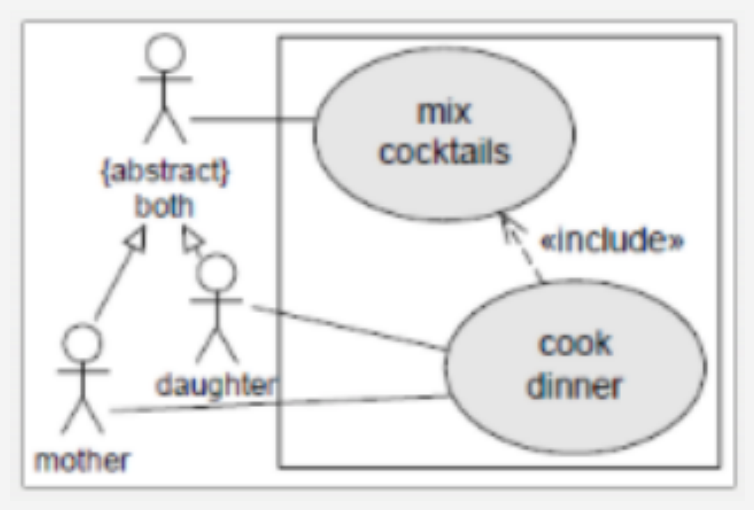
- B.
  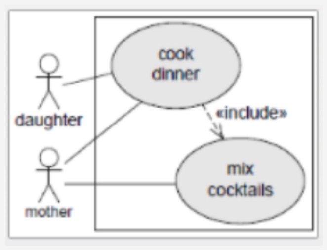
- C.
  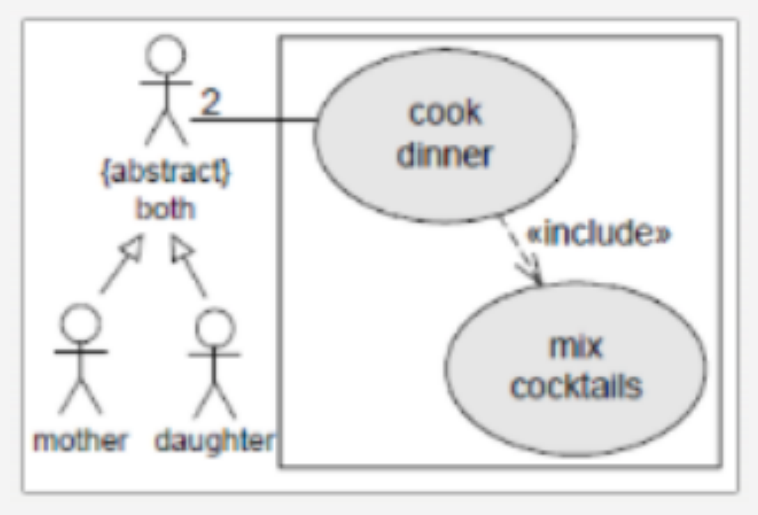
- D.
  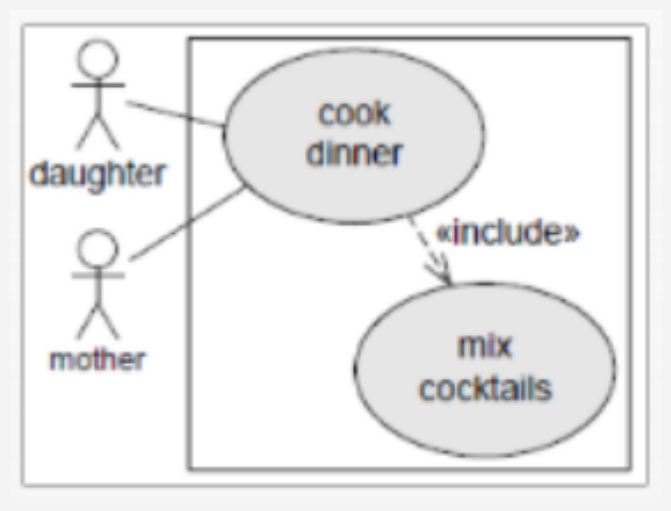

Hiện đáp án và giải thích

**Đáp án:** B

**Giải thích:** Với hình use case, cần đọc actor, use case và kiểu mũi tên trước khi kết luận quan hệ. Use case mô tả mục tiêu tương tác giữa actor và hệ thống; actor là vai trò bên ngoài chứ không phải lớp nội bộ. Include biểu diễn hành vi bắt buộc dùng chung, extend là hành vi mở rộng có điều kiện, generalization biểu diễn chuyên biệt hóa. Generalization là kế thừa quan hệ, include là hành vi bắt buộc dùng chung, còn extend là hành vi mở rộng có điều kiện.

### Câu 48
Nguồn: quiz phụ

Hãy mô hình hoá tình huống sau đây bằng biểu đồ UML usecase (2.0): Một giáo viên thực hiện cuộc phỏng vấn cùng với sinh viên của mình, trong quá trình thực hiện điều đó, người giáo viên luôn luôn là người phải cho điểm sinh viên.

- A.
  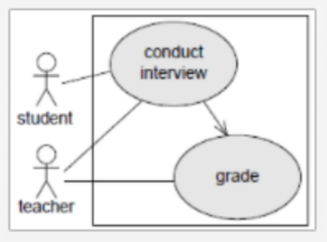
- B.
  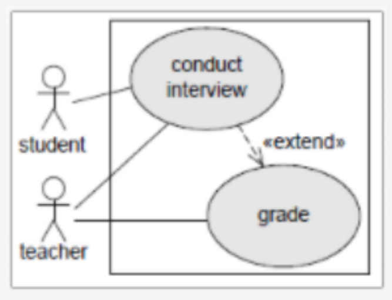
- C.
  
- D.
  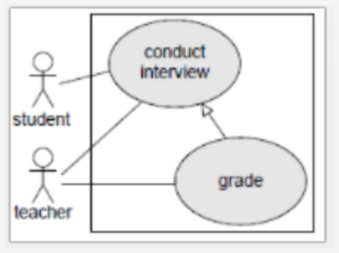

Hiện đáp án và giải thích

**Đáp án:** A

**Giải thích:** Với hình use case, cần đọc actor, use case và kiểu mũi tên trước khi kết luận quan hệ. Use case mô tả mục tiêu tương tác giữa actor và hệ thống; actor là vai trò bên ngoài chứ không phải lớp nội bộ. Include biểu diễn hành vi bắt buộc dùng chung, extend là hành vi mở rộng có điều kiện, generalization biểu diễn chuyên biệt hóa. Generalization là kế thừa quan hệ, include là hành vi bắt buộc dùng chung, còn extend là hành vi mở rộng có điều kiện.

### Câu 49
Nguồn: quiz phụ

Trong các lựa chọn dưới đây, đâu là một ví dụ cụ thể về ca sử dụng trong hệ thống quản lý thư viện?

- A. Trả sách Xác nhận mượn sách
- B. Mượn sách Lựa chọn một quyển sách để xem thông tin chi tiết

Hiện đáp án và giải thích

**Đáp án:** Mượn sách, Trả sách Video 0609 Hướng dẫn…

**Giải thích:** Trọng tâm là mô tả đúng yêu cầu, tác nhân, luồng dữ liệu hoặc quan hệ trên mô hình. Cần tách mô hình yêu cầu khỏi thiết kế chi tiết hoặc cài đặt. Các mệnh đề đúng/sai hay sai ở từ tuyệt đối như 'luôn luôn', 'chỉ', 'không' hoặc do mở rộng phạm vi vượt quá định nghĩa.

### Câu 50
Nguồn: c6 / c6 p2 / quiz phụ

Đâu là bước đầu tiên trong quá trình phân tích yêu cầu phần mềm?

- A. Xác định các bên liên quan trong hệ thống
- B. Tất cả các lựa chọn trên đều đúng
- C. Thu thập các yêu cầu
- D. Liệt kê các yêu cầu

Hiện đáp án và giải thích

**Đáp án:** A. Xác định các bên liên quan trong hệ thống

**Giải thích:** Yêu cầu chức năng mô tả hệ thống phải làm gì; yêu cầu phi chức năng mô tả ràng buộc chất lượng như bảo mật, hiệu năng, độ tin cậy. Thiết kế và cài đặt dùng yêu cầu làm đầu vào, nhưng không phải hoạt động cốt lõi của kỹ nghệ yêu cầu. Chức năng là hành vi hệ thống phải cung cấp; phi chức năng là ràng buộc chất lượng hoặc môi trường vận hành.

### Câu 51
Nguồn: c6 p2 / quiz phụ

Trong sơ đồ use-case của UML, một usecase A bao gồm (includes) một usecase B có nghĩa là:

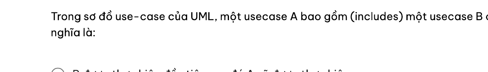

- A. Hành vi của A luôn phải được chèn vào hành vi của
- B. B
- C. Hành vi của B luôn phải được chèn vào hành vi của
- D. A B không thể được thực hiện mà không có
- E. A B được thực hiện đầu tiên sau đó
- F. A sẽ được thực hiện

Hiện đáp án và giải thích

**Đáp án:** B không thể được thực hiện mà không có A

**Giải thích:** Với hình use case, cần đọc actor, use case và kiểu mũi tên trước khi kết luận quan hệ. Use case mô tả mục tiêu tương tác giữa actor và hệ thống; actor là vai trò bên ngoài chứ không phải lớp nội bộ. Include biểu diễn hành vi bắt buộc dùng chung, extend là hành vi mở rộng có điều kiện, generalization biểu diễn chuyên biệt hóa. Generalization là kế thừa quan hệ, include là hành vi bắt buộc dùng chung, còn extend là hành vi mở rộng có điều kiện.

### Câu 52
Nguồn: c6 p2 / quiz phụ

Trong sơ đồ use-case của UML, mối quan hệ tổng quát hoá (generalization relationship) giữa usecase A và usecase B (được hiểu là B là một trường hợp đặc biệt của A) có nghĩa là:

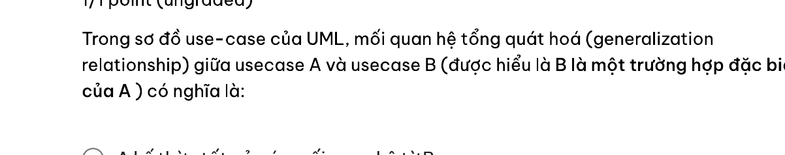

- A. B kế thừa tất cả các mối quan hệ từ
- B. A A không được trừu tượng
- C. B có thể được thực thi thay vì
- D. A A kế thừa tất cả các mối quan hệ từ
- E. B

Hiện đáp án và giải thích

**Đáp án:** B kế thừa tất cả các mối quan hệ từ A

**Giải thích:** Với hình use case, cần đọc actor, use case và kiểu mũi tên trước khi kết luận quan hệ. Use case mô tả mục tiêu tương tác giữa actor và hệ thống; actor là vai trò bên ngoài chứ không phải lớp nội bộ. Include biểu diễn hành vi bắt buộc dùng chung, extend là hành vi mở rộng có điều kiện, generalization biểu diễn chuyên biệt hóa. Generalization là kế thừa quan hệ, include là hành vi bắt buộc dùng chung, còn extend là hành vi mở rộng có điều kiện.

### Câu 53
Nguồn: c6 / quiz phụ

Actor T có thể thực hiện use-case nào?

- A. J
- B. B
- C. C

Hiện đáp án và giải thích

**Đáp án:** A. J

**Giải thích:** Use case mô tả mục tiêu tương tác giữa actor và hệ thống; actor là vai trò bên ngoài chứ không phải lớp nội bộ. Include biểu diễn hành vi bắt buộc dùng chung, extend là hành vi mở rộng có điều kiện, generalization biểu diễn chuyên biệt hóa. Actor là vai trò bên ngoài hệ thống; include là dùng chung bắt buộc, extend là mở rộng có điều kiện.

### Câu 54
Nguồn: c6 / c6 p2 / quiz phụ

Đâu là phát biểu đúng?

- A. B kế thừa mọi quan hệ từ
- B. A B được gọi là base-use-case
- C. A không được là abstract
- D. A kế thừa mọi quan hệ từ
- E. B

Hiện đáp án và giải thích

**Đáp án:** B kế thừa mọi quan hệ từ A

**Giải thích:** Use case mô tả mục tiêu tương tác giữa actor và hệ thống; actor là vai trò bên ngoài chứ không phải lớp nội bộ. Include biểu diễn hành vi bắt buộc dùng chung, extend là hành vi mở rộng có điều kiện, generalization biểu diễn chuyên biệt hóa. Actor là vai trò bên ngoài hệ thống; include là dùng chung bắt buộc, extend là mở rộng có điều kiện.

## Chương 7: Thiết kế phần mềm

### Câu 1
Nguồn: c7 p2

Một node trên biểu đổ deployment có thể là những lựa chọn nào sau đây?

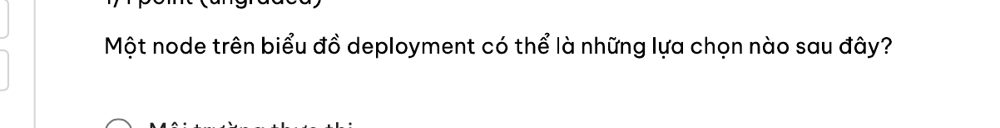

- A. Môi trường thực thi
- B. Tất cả các đáp án Máy tính
- C. Các tệp mã máy (binary files)
- D. Thiết bị (device)

Hiện đáp án và giải thích

**Đáp án:** B. Tất cả các đáp án

**Giải thích:** Với hình kiến trúc hoặc deployment, dấu hiệu chính là node, component, tầng và quan hệ phụ thuộc. Thiết kế kiến trúc chia hệ thống thành thành phần, nút triển khai và quan hệ phụ thuộc để dễ thay đổi, triển khai và kiểm thử. Các lựa chọn sai thường nhầm phần tử triển khai vật lý với lớp, hàm hoặc hoạt động quản lý dự án. Layered đi theo tầng trách nhiệm, pipes-and-filters đi theo chuỗi biến đổi dữ liệu, deployment thể hiện nút chạy vật lý hoặc môi trường thực thi.

### Câu 2
Nguồn: c7 p2

Phát biểu phù hợp cho các lớp phân tích thuộc nhóm lớp thực thể (entity class)?

- A. Tất cả các lựa chọn còn lại đêu sai
- B. Đóng gói thông tin hệ thống sử dụng
- C. Ranh giới giữa hệ thống và các tác nhân
- D. Lớp chứa logic điêu khiển của ca sử dụng

Hiện đáp án và giải thích

**Đáp án:** B. Đóng gói thông tin hệ thống sử dụng

**Giải thích:** Thiết kế tốt làm rõ trách nhiệm, giao diện và phụ thuộc giữa các thành phần. Các lựa chọn sai thường làm tăng coupling, trộn trách nhiệm hoặc nhầm loại biểu đồ/pattern. Loại các phương án chỉ nói về công cụ, pha khác hoặc hệ quả phụ; đáp án đúng phải giữ đúng phạm vi khái niệm.

### Câu 3
Nguồn: c7 p2

Giả sửbạn cân thiết kế một hệ thống quản lý tệp tin đơn giản. Hai thành phần chính cẩn quản lý trong thiết kế là các tập tin và thư mục. Thư mục có thể chứa 0 hoặc nhiều tập tin hoặc thư mục con khác. Các thư mục và tệp tin cẩn được xử lý một cách thống nhất, ví dụ: cả hai đểu có tên và cung cấp các thao tác để truyền nội dung vào (streamln) và ra (streamOut) cũng như liệt kê các phân tử con (listChildren). Lựa chọn nào là thiết kế phù hợp với mô tả trên?

- A. Node # name String streamino voi streamouto void listChilcreno void
- B. Node name String streamino voi streamouto void listChilcireno void
- C. Directory File name String name String streamlno void streamlno void streamouto void streamouto void listchildreno void listChilreno void
- D. Node name String streamino voi streamOuto void listChildreno void

Hiện đáp án và giải thích

**Đáp án:** A. Node # name String streamino voi streamouto void listChilcreno void

**Giải thích:** Với hình kiến trúc hoặc deployment, dấu hiệu chính là node, component, tầng và quan hệ phụ thuộc. Thiết kế kiến trúc chia hệ thống thành thành phần, nút triển khai và quan hệ phụ thuộc để dễ thay đổi, triển khai và kiểm thử. Các lựa chọn sai thường nhầm phần tử triển khai vật lý với lớp, hàm hoặc hoạt động quản lý dự án. Layered đi theo tầng trách nhiệm, pipes-and-filters đi theo chuỗi biến đổi dữ liệu, deployment thể hiện nút chạy vật lý hoặc môi trường thực thi.

### Câu 4
Nguồn: c7 p2

Các kết quả trong giai đoạn thiết kế Biểu diễn một bức tranh hoàn chỉnh của phần mềm, bao gôm:

- A. Tất cả các đáp án Dữ liệu Giao diện
- B. Kiến trúc

Hiện đáp án và giải thích

**Đáp án:** A. Tất cả các đáp án

**Giải thích:** Với hình kiến trúc hoặc deployment, dấu hiệu chính là node, component, tầng và quan hệ phụ thuộc. Thiết kế kiến trúc chia hệ thống thành thành phần, nút triển khai và quan hệ phụ thuộc để dễ thay đổi, triển khai và kiểm thử. Các lựa chọn sai thường nhầm phần tử triển khai vật lý với lớp, hàm hoặc hoạt động quản lý dự án. Layered đi theo tầng trách nhiệm, pipes-and-filters đi theo chuỗi biến đổi dữ liệu, deployment thể hiện nút chạy vật lý hoặc môi trường thực thi.

### Câu 5
Nguồn: c7 p2

Đây là một đoạn giả mã thiết kế thuật toán xử lý cấu hình hiển thị trên một trang web thương mại điện tử. Hãy lựa chọn phương án cải thiện thiết kế thuật toán mà không làm thay đổi hành vi của nó. Procedure setProductDisplaylype (type) If type equals compact Then Set maxDescriptionLength to 140 Set numSimilarProductsToShow to 2 Set numReviewsToShow to 1 Else If type equals "detailed" Then Set maxDescriptionlength to 500 Set numSimilarProductsToShow to 5 Set numReviewsToShow to 7 End If End Procedure

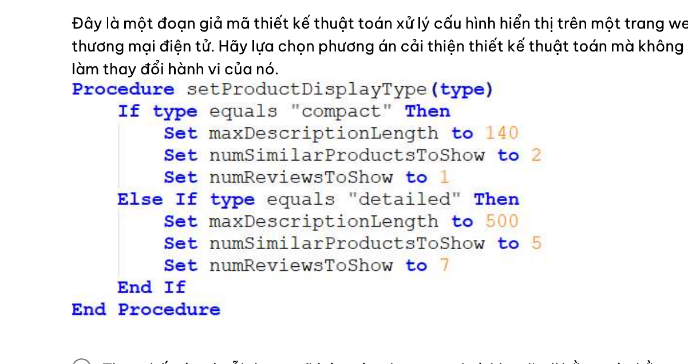

- A. Thay thế các chuỗi được mã hóa cứng 'compact' và 'detailed' bằng các hằng chuỗi hoặc dưới dạng enum
- B. Sử dụng cấu trúc switch thay cho if else
- C. Các giá trị hằng chuyển thành các giá trị tham số được truyền vào khi gọi phương thức
- D. Đóng gói
- E. 3 giá trị được truyền cho các thuộc tính maxDescriptionLength; numSimilarProductsToShow và numReviewsToShow thành lớp
- F. ProductDisplay Type

Hiện đáp án và giải thích

**Đáp án:** D. Đóng gói 3 giá trị được truyền cho các thuộc tính maxDescriptionLength; numSimilarProductsToShow và numReviewsToShow thành lớp ProductDisplay Type

**Giải thích:** Với hình quản lý cấu hình, cần xác định mục cấu hình, phiên bản, baseline và quan hệ thay đổi giữa các thành phần. SCM kiểm soát các mục cấu hình, phiên bản, baseline và thay đổi trong suốt vòng đời phần mềm. Mấu chốt là khả năng truy vết: biết thành phần nào đổi, đổi khi nào và thuộc phiên bản nào. Check-out là lấy về để sửa, check-in là đưa thay đổi vào kho; baseline là mốc đã được kiểm soát thay đổi.

### Câu 6
Nguồn: c7 p2

Trong thiết kế hướng đối tượng, cơ chế nào sau đây cho phép một số lớp đối tượng trong hệ thống phân cấp lớp có các phương thức khác nhau có cùng tên??

- A. Tất cả các lựa chọn còn lại đêu sai
- B. Polymorphism Composition Aggregation

Hiện đáp án và giải thích

**Đáp án:** B. Polymorphism

**Giải thích:** Thiết kế tốt làm rõ trách nhiệm, giao diện và phụ thuộc giữa các thành phần. Các lựa chọn sai thường làm tăng coupling, trộn trách nhiệm hoặc nhầm loại biểu đồ/pattern. Các mệnh đề đúng/sai hay sai ở từ tuyệt đối như 'luôn luôn', 'chỉ', 'không' hoặc do mở rộng phạm vi vượt quá định nghĩa.

### Câu 7
Nguồn: c7 p2

Lựa chọn nào không phải là quy tắc vàng trong thiết kế giao diện?

- A. Làm cho giao diện nhất quán
- B. Đặt Người dùng trong sự kiểm soát
- C. Giảm tải bộ nhớ cho
- D. Người dùng Làm theo yêu cầu
- E. Người dùng

Hiện đáp án và giải thích

**Đáp án:** D. Làm theo yêu cầu người dùng

**Giải thích:** Câu hỏi đang tìm ngoại lệ của thiết kế giao diện; hãy giữ lại các lựa chọn đúng chuẩn rồi xét lựa chọn còn nằm ngoài phạm vi. Thiết kế giao diện tốt dựa trên tính nhất quán, khả năng nhận biết và giảm gánh nặng ghi nhớ cho người dùng. Phương án sai thường nhầm loại control, luồng thao tác hoặc nguyên tắc usability đang bị vi phạm. Các phương án còn lại thường đúng nhưng thuộc cùng nhóm chuẩn; đáp án cần chọn là ý nhầm pha, nhầm phạm vi hoặc không thuộc danh sách đang hỏi.

### Câu 8
Nguồn: c7 p2

Trong mô hình kiến trúc MVC, thành phần tương ứng với V là?

- A. Tất cả các lựa chọn còn lại đêu sai
- B. Giao diện hiển thị, tương tác
- C. Người dùng Đóng gói thông tin hay dữ liệu nghiệp vụ
- D. Xử lý logic nghiệp vụ, phối hợp các thành phần khác

Hiện đáp án và giải thích

**Đáp án:** B. Giao diện hiển thị, tương tác người dùng

**Giải thích:** Với hình kiến trúc hoặc deployment, dấu hiệu chính là node, component, tầng và quan hệ phụ thuộc. Thiết kế kiến trúc chia hệ thống thành thành phần, nút triển khai và quan hệ phụ thuộc để dễ thay đổi, triển khai và kiểm thử. Các lựa chọn sai thường nhầm phần tử triển khai vật lý với lớp, hàm hoặc hoạt động quản lý dự án. Layered đi theo tầng trách nhiệm, pipes-and-filters đi theo chuỗi biến đổi dữ liệu, deployment thể hiện nút chạy vật lý hoặc môi trường thực thi.

### Câu 9
Nguồn: c7 p2

Trong thiết kế hướng đối tượng, phát biểu nào sau đây không thể hiện sự liên kết (coupling) giữa hai class A và B?

- A. Phương thức của A có tham số tham chiếu tới B
- B. Không lựa chọn nào đúng
- C. A có một thuộc tính tham chiếu tới B
- D. A có gọi tới một phương thức của B thông qua một biến cục bộ tham chiếu tới B
- E. A là lớp con của B

Hiện đáp án và giải thích

**Đáp án:** B. Không lựa chọn nào đúng

**Giải thích:** Câu hỏi đang tìm ngoại lệ của nguyên lý/pattern thiết kế; hãy giữ lại các lựa chọn đúng chuẩn rồi xét lựa chọn còn nằm ngoài phạm vi. Nguyên lý và pattern thiết kế giúp giảm phụ thuộc, tách trách nhiệm và làm hệ thống dễ mở rộng. Dấu hiệu phân biệt thường nằm ở quan hệ giữa lớp/thành phần, không nằm ở tên gọi bề mặt của đáp án. Các phương án còn lại thường đúng nhưng thuộc cùng nhóm chuẩn; đáp án cần chọn là ý nhầm pha, nhầm phạm vi hoặc không thuộc danh sách đang hỏi.

### Câu 10
Nguồn: c7

Khảo sát một hệ thống thương mại điện tử, trong đó chức năng đặt hàng mới được gửi đến xử lý dưới dạng một thông điệp. Các đơn hàng được mã hóa để ngăn chặn những kẻ nghe trộm theo dõi đơn đặt hàng của khách hàng. Đơn hàng cũng chứa thông tin xác thực dưới dạng chứng chỉ số để đảm bảo rằng các đơn hàng chỉ được đặt bởi những khách hàng đáng tin cậỵ Ngoài ra các đơn hàng trùng lặp (có thể do khách hàng vô tình nhấp vào nút 'Đặt hàng ngay' nhiều lân) cũng cần xửlý loại bỏ. Chức năng này được thiết kế như hình minh họa dưới đây. Hãy xác định kiểu kiến trúc phù hợp? Decrypt Authenticate De- 'Dup Incoming 'Clean' Order Order

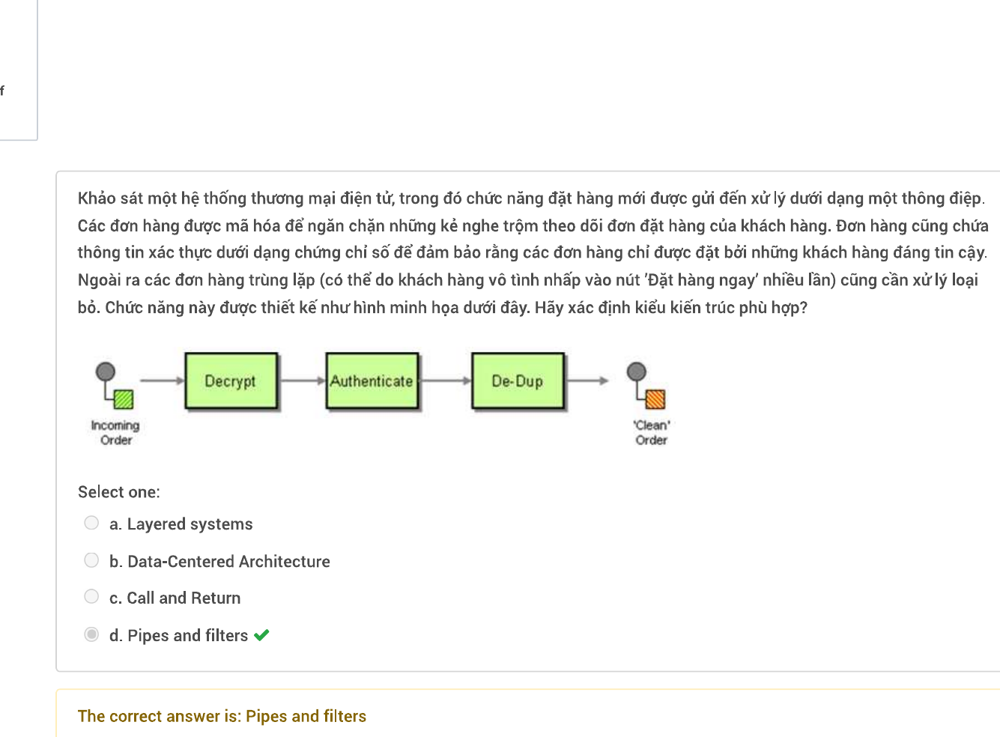

- A. Layered systems Data-Centered Architecture all and
- B. Return Pipes and filters

Hiện đáp án và giải thích

**Đáp án:** Pipes and filters

**Giải thích:** Với hình kiến trúc hoặc deployment, dấu hiệu chính là node, component, tầng và quan hệ phụ thuộc. Thiết kế kiến trúc chia hệ thống thành thành phần, nút triển khai và quan hệ phụ thuộc để dễ thay đổi, triển khai và kiểm thử. Các lựa chọn sai thường nhầm phần tử triển khai vật lý với lớp, hàm hoặc hoạt động quản lý dự án. Layered đi theo tầng trách nhiệm, pipes-and-filters đi theo chuỗi biến đổi dữ liệu, deployment thể hiện nút chạy vật lý hoặc môi trường thực thi.

### Câu 11
Nguồn: c7

Đây là một đoạn giả mã thiết kế thuật toán xử lý cấu hình hiển thị trên một trang web thương mại điện tử. Hãy lựa chọn phương án cải thiện thiết kế thuật toán mà không làm thay đổi hành vi của nó. Procedure setProductDisplaylype (type) If type equals compact Then Set maxDescriptionLength to 140 Set numSimilarProductsToShow to 2 Set numReviewsToShow to 1 Else If type equals detailed Then Set maxDescriptionLength to 500 Set numSimilarProductsToShow to 5 Set numReviewsToShow to 7 End If End Procedure

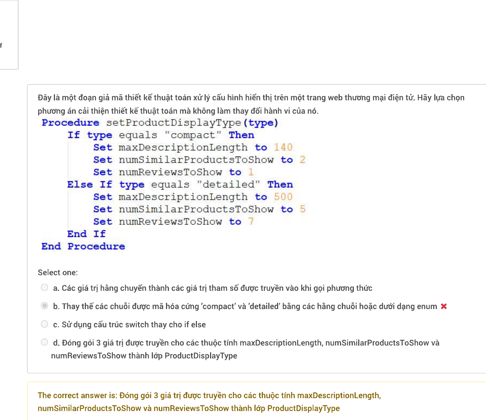

- A. Các giá trị hẳng chuyển thành các giá trị tham số được truyền vào khi gọi phương thức
- B. Thay thế các chuỗi được mã hóa cứng 'compact' và 'detailed' bằng các hằng chuỗi hoặc dưới dạng enum Sử 'dụng cấu trúc switch thay cho if else
- D. Đóng gói 3 giá trị được truyền cho các thuộc tính maxDescriptionLength; numSimilarProductsToShow và
- E. numReviewsToShow thành lớp ProductDisplayType

Hiện đáp án và giải thích

**Đáp án:** Đóng gói 3 giá trị được truyền cho các thuộc tính maxDescriptionLength; numSimilarProductsToShow và numReviewsToShow thành lớp ProductDisplayType

**Giải thích:** Với hình quản lý cấu hình, cần xác định mục cấu hình, phiên bản, baseline và quan hệ thay đổi giữa các thành phần. SCM kiểm soát các mục cấu hình, phiên bản, baseline và thay đổi trong suốt vòng đời phần mềm. Mấu chốt là khả năng truy vết: biết thành phần nào đổi, đổi khi nào và thuộc phiên bản nào. Check-out là lấy về để sửa, check-in là đưa thay đổi vào kho; baseline là mốc đã được kiểm soát thay đổi.

### Câu 12
Nguồn: c7 / c7 p2 / quiz phụ

Phương án mô tả phù hợp cho một thành phần phần mềm?

- A. 1
- B. Một phần có tính mô-đun; có thể triển khai và thay thế của một hệ thống.
- C. Nó đóng gói việc thực thi và đưa ra một tập; các giao diện.
- D. Theo góc nhìn hướng đối tượng, một thành phần bao gồm logic xử lý, cấu trúc dữ liệu bên trong cần thiết để triển khai logic đó và một giao diện cho phép thành phần được gọi và dữ liệu được truyền đến nó.
- E. Theo góc nhìn quy ước, một thành phần bao gồm một tập các lớp cộng tác

Hiện đáp án và giải thích

**Đáp án:** Một phần có tính mô-đun, có thể triển khai và thay thế của một hệ thống: Nó đóng gói việc thực thi và đưa ra một tập các giao diện.

**Giải thích:** Thiết kế giao diện tốt dựa trên tính nhất quán, khả năng nhận biết và giảm gánh nặng ghi nhớ cho người dùng. Phương án sai thường nhầm loại control, luồng thao tác hoặc nguyên tắc usability đang bị vi phạm. Ưu tiên nhận diện control và nguyên tắc usability; tên gọi đẹp nhưng làm người dùng nhớ nhiều hoặc thao tác không nhất quán thường là sai.

### Câu 13
Nguồn: c7

Phát biểu "Một mô đun (thành phần) nên được mở cho sựmở rộng nhưng nên đóng cho các thay đổi" phù hợp với nguyên lý thiết kế nào?

- A. Nguyên lý mở-đóng (OCP)
- B. Nguyên lý đóng chung (CCP)
- C. Nguyên lý tái sử dụng chung (CRP)
- D. Nguyên lý tráo đổi phụ thuộc (DIP)

Hiện đáp án và giải thích

**Đáp án:** A. Nguyên lý mở-đóng (OCP)

**Giải thích:** Nguyên lý và pattern thiết kế giúp giảm phụ thuộc, tách trách nhiệm và làm hệ thống dễ mở rộng. Dấu hiệu phân biệt thường nằm ở quan hệ giữa lớp/thành phần, không nằm ở tên gọi bề mặt của đáp án. Loại các phương án chỉ nói về công cụ, pha khác hoặc hệ quả phụ; đáp án đúng phải giữ đúng phạm vi khái niệm.

### Câu 14
Nguồn: c7 / quiz phụ

Trong thiết kế dữ liệu, kết quả thiết kế có thể được Biểu diễn ở mức trừu tượng nào?

- A. 1
- B. Mô hình dữ liệu logic
- C. Mô hình dữ liệu vật lý
- D. Mô hình dữ liệu quan niệm
- E. Tất cả các lựa chọn còn lại đều đúng

Hiện đáp án và giải thích

**Đáp án:** E. Tất cả các lựa chọn còn lại đều đúng

**Giải thích:** Các lựa chọn đang mô tả những mặt khác nhau của thiết kế phần mềm, nên câu trả lời phải bao quát cả nhóm. Thiết kế tốt làm rõ trách nhiệm, giao diện và phụ thuộc giữa các thành phần. Các lựa chọn sai thường làm tăng coupling, trộn trách nhiệm hoặc nhầm loại biểu đồ/pattern. Dạng 'tất cả' hợp lý khi từng lựa chọn là một lát cắt hợp lệ của cùng tiêu chí, không có ý nào phá vỡ phạm vi câu hỏi.

### Câu 15
Nguồn: c7

Giả sửbạn cần thiết kế một hệ thống quản lý tệp tin đơn giản. Hai thành phần chính cần quản lý trong thiết kế là các tập tin và thư mục. Thưmục có thể chứa 0 hoặc nhiều tập tin hoặc thư mục con khác. Các thư mục và tệp tin cần được xử lý một cách thống nhất; ví dụ: cả hai đều có tên và cung cấp các thao tác để truyền nội dung vào (streamln) và ra (streamOut) cũng 1 nhưliệt kê các phần tử con (listChildren). Lựa chọn nào là thiết kế phù hợp với mô tả trên?;

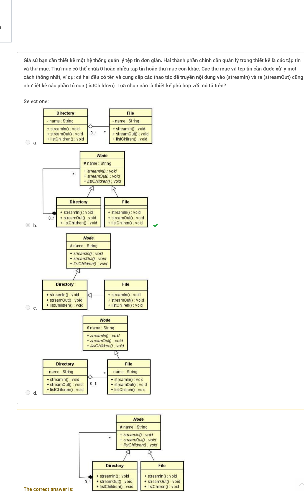

- A. irectory File name String name
- B. String streamlno void streamlno void streamouto void streamouto voỈd listchildreno void listChilreno void
- C. Node

Hiện đáp án và giải thích

**Đáp án:** A

**Giải thích:** Với hình kiến trúc hoặc deployment, dấu hiệu chính là node, component, tầng và quan hệ phụ thuộc. Thiết kế kiến trúc chia hệ thống thành thành phần, nút triển khai và quan hệ phụ thuộc để dễ thay đổi, triển khai và kiểm thử. Các lựa chọn sai thường nhầm phần tử triển khai vật lý với lớp, hàm hoặc hoạt động quản lý dự án. Layered đi theo tầng trách nhiệm, pipes-and-filters đi theo chuỗi biến đổi dữ liệu, deployment thể hiện nút chạy vật lý hoặc môi trường thực thi.

### Câu 16
Nguồn: c7

Các minh họa (mockup) của 3 màn hình trong một ứng dụng sau mắc phải lỗi thiết kế giao diện nào? Main Nav bar Page 2 Page 3 Page Main; Main Main body body body g z 9 @thernav Main Nav bar @thernay

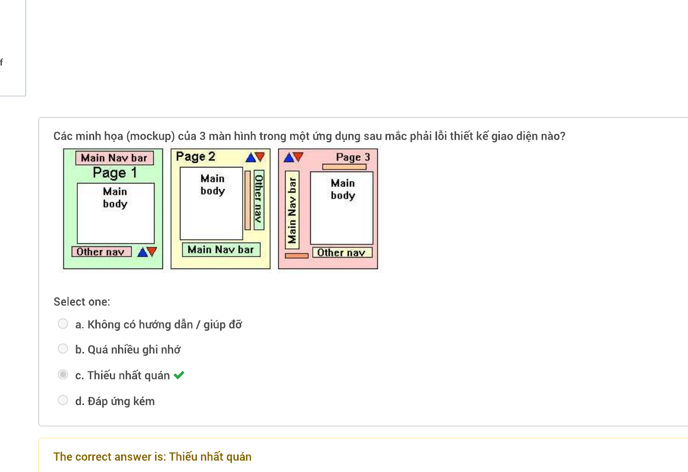

- A. Không có hướng dẫn / giúp đỡ
- B. Quá nhiều ghi nhớ
- C. Thiếu nhất quán
- D. Đáp ứng kém

Hiện đáp án và giải thích

**Đáp án:** C. Thiếu nhất quán

**Giải thích:** Với hình giao diện, cần nhìn loại control, nhãn, vị trí và tính nhất quán giữa các màn hình. Thiết kế giao diện tốt dựa trên tính nhất quán, khả năng nhận biết và giảm gánh nặng ghi nhớ cho người dùng. Phương án sai thường nhầm loại control, luồng thao tác hoặc nguyên tắc usability đang bị vi phạm. Các lỗi giao diện thường lộ ra ở nhãn mơ hồ, vị trí control không nhất quán hoặc thao tác bắt người dùng nhớ quá nhiều.

### Câu 17
Nguồn: c7

Đâu là mô tả đúng nhất cho thứtự duyệt tin bằng mắt của con người?

- A. Trên dưới, trái phải, ngược chiều kim đồng hồ
- B. Trái phải, trên dưới, ngược chiều kim đồng hồ
- C. Trên dưới, trái - phải, theo chiều kim đông hồ
- D. Trái phải, trên dưới, theo chiều kim đồng hồ

Hiện đáp án và giải thích

**Đáp án:** Trái - phải, trên dưới, theo chiều kim đông hồ

**Giải thích:** Thiết kế tốt làm rõ trách nhiệm, giao diện và phụ thuộc giữa các thành phần. Các lựa chọn sai thường làm tăng coupling, trộn trách nhiệm hoặc nhầm loại biểu đồ/pattern. Loại các phương án chỉ nói về công cụ, pha khác hoặc hệ quả phụ; đáp án đúng phải giữ đúng phạm vi khái niệm.

### Câu 18
Nguồn: c7

Quan sát màn hình giao diện đăng ký tài khoản Google dưới đây. Các phần tử giao diện được khoanh đỏ trong hình thuộc loại nào? 1; Google Create a Google Account Enter your name First name Surname (optional) Next

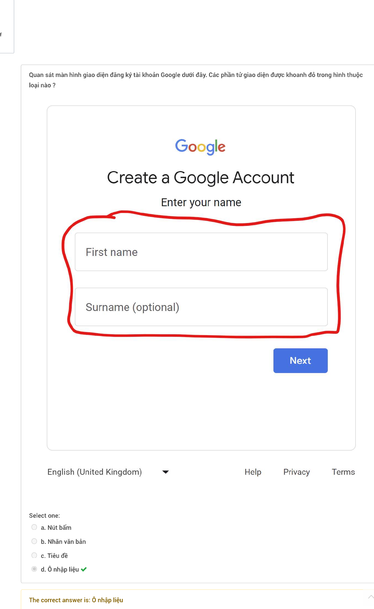

- A. Nhãn văn bản
- B. Nút bấm
- C. Ô nhập liệu
- D. Tiêu đề

Hiện đáp án và giải thích

**Đáp án:** C. Ô nhập liệu

**Giải thích:** Với hình giao diện, cần nhìn loại control, nhãn, vị trí và tính nhất quán giữa các màn hình. Thiết kế giao diện tốt dựa trên tính nhất quán, khả năng nhận biết và giảm gánh nặng ghi nhớ cho người dùng. Phương án sai thường nhầm loại control, luồng thao tác hoặc nguyên tắc usability đang bị vi phạm. Các lỗi giao diện thường lộ ra ở nhãn mơ hồ, vị trí control không nhất quán hoặc thao tác bắt người dùng nhớ quá nhiều.

### Câu 19
Nguồn: c7 / quiz phụ

Một số lớp được phát hiện trong giai đoan phân tích có thể được lược bỏ trong giai đoạn thiết kế.

- A. Sai
- B. Đúng

Hiện đáp án và giải thích

**Đáp án:** C. Đúng

**Giải thích:** Mệnh đề được đánh giá là đúng vì phạm vi của nó phải khớp với cách thiết kế phần mềm được định nghĩa trong chương. Thiết kế tốt làm rõ trách nhiệm, giao diện và phụ thuộc giữa các thành phần. Các lựa chọn sai thường làm tăng coupling, trộn trách nhiệm hoặc nhầm loại biểu đồ/pattern. Các mệnh đề đúng/sai hay sai ở từ tuyệt đối như 'luôn luôn', 'chỉ', 'không' hoặc do mở rộng phạm vi vượt quá định nghĩa.

### Câu 20
Nguồn: c7

Trong phân tích và thiết kế hướng đối tượng, các lớp đối tượng được xác định bẳng 3 cách

- A. Xem xét các đối tượng trong miền ứng dụng
- B. Phân tích các trường hợp sử dụng để xác định các lớp đối tượng
- C. Phân tích theo khía cạnh ngữ pháp mô tả hệ thống (lớp đối tượng và thuộc tính thường là các danh từ)
- D. Tất cả các lựa chọn còn lại

Hiện đáp án và giải thích

**Đáp án:** D. Tất cả các lựa chọn còn lại

**Giải thích:** Các lựa chọn đang mô tả những mặt khác nhau của thiết kế phần mềm, nên câu trả lời phải bao quát cả nhóm. Thiết kế tốt làm rõ trách nhiệm, giao diện và phụ thuộc giữa các thành phần. Các lựa chọn sai thường làm tăng coupling, trộn trách nhiệm hoặc nhầm loại biểu đồ/pattern. Dạng 'tất cả' hợp lý khi từng lựa chọn là một lát cắt hợp lệ của cùng tiêu chí, không có ý nào phá vỡ phạm vi câu hỏi.

### Câu 21
Nguồn: c7

Việc đo "độ mạnh" của sựkết nối giữa hai thành phần hệ thống được biết như là?

- A. ggregation (kết tập)
- B. Inheritance (kế thừa)
- C. oupling (liên kết)
- D. Cohesion (gắn kết)

Hiện đáp án và giải thích

**Đáp án:** Coupling (liên kết)

**Giải thích:** Nguyên lý và pattern thiết kế giúp giảm phụ thuộc, tách trách nhiệm và làm hệ thống dễ mở rộng. Dấu hiệu phân biệt thường nằm ở quan hệ giữa lớp/thành phần, không nằm ở tên gọi bề mặt của đáp án. Loại các phương án chỉ nói về công cụ, pha khác hoặc hệ quả phụ; đáp án đúng phải giữ đúng phạm vi khái niệm.

### Câu 22
Nguồn: c7

Những phần tử mô hình thiết kế nào được sử dụng để mô tả mô hình thông tin được trình bày từ góc nhìn của người dùng?

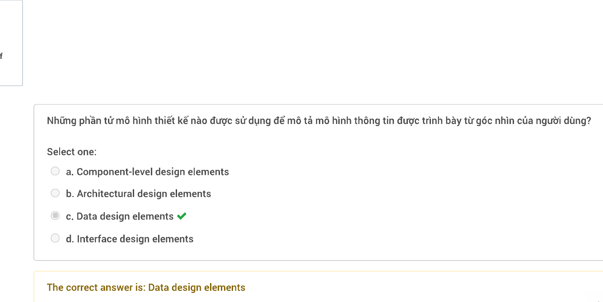

- A. omponent-level design elements Architectural design elements ata design elements
- B. Interface design elements

Hiện đáp án và giải thích

**Đáp án:** Data design elements

**Giải thích:** Với hình giao diện, cần nhìn loại control, nhãn, vị trí và tính nhất quán giữa các màn hình. Thiết kế giao diện tốt dựa trên tính nhất quán, khả năng nhận biết và giảm gánh nặng ghi nhớ cho người dùng. Phương án sai thường nhầm loại control, luồng thao tác hoặc nguyên tắc usability đang bị vi phạm. Các lỗi giao diện thường lộ ra ở nhãn mơ hồ, vị trí control không nhất quán hoặc thao tác bắt người dùng nhớ quá nhiều.

### Câu 23
Nguồn: c4 p2 / c7 / quiz phụ

Mệnh đề nào sau đây không đúng với quy trình thiết kế giao diện?

- A. 1
- B. Hệ tương tác là trung tâm trong các hoạt động của quy trình thiết kế giao diện
- C. Tạo mẫu thử là một bước của quy trình thiết kế giao diện
- D. Xác định bối cảnh và yêu cầu sử dụng là một bước của quy trình thiết kế giao diện
- E. Quy trinh thiết kế giao diện là quy trinh lặp

Hiện đáp án và giải thích

**Đáp án:** B. Hệ tương tác là trung tâm trong các hoạt động của quy trình thiết kế giao diện

**Giải thích:** Câu hỏi đang tìm ngoại lệ của thiết kế giao diện; hãy giữ lại các lựa chọn đúng chuẩn rồi xét lựa chọn còn nằm ngoài phạm vi. Thiết kế giao diện tốt dựa trên tính nhất quán, khả năng nhận biết và giảm gánh nặng ghi nhớ cho người dùng. Phương án sai thường nhầm loại control, luồng thao tác hoặc nguyên tắc usability đang bị vi phạm. Các phương án còn lại thường đúng nhưng thuộc cùng nhóm chuẩn; đáp án cần chọn là ý nhầm pha, nhầm phạm vi hoặc không thuộc danh sách đang hỏi.

### Câu 24
Nguồn: c7

Hoàn chỉnh phát biểu sau: là cách Biểu diễn tốt để mô tả hành vi của một số đối tượng. Nó rất tốt để mô tả hành vi liên quan đến một số đối tượng hợp tác với nhau không cần Biểu diễn rõ trình tựthời gian"

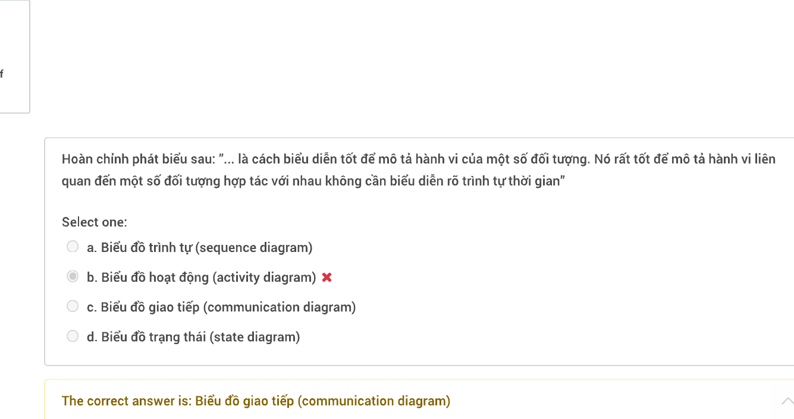

- A. Biểu đồ trình tự (sequence diagram)
- B. Biểu đồ hoạt động (activity diagram)
- C. iểu đồ giao tiếp (communication diagram)
- D. Biểu đồ trạng thái (state diagram)

Hiện đáp án và giải thích

**Đáp án:** Biểu đồ giao tiếp (communication diagram)

**Giải thích:** Với câu có hình, phần ảnh đang cung cấp dấu hiệu chính để nhận ra biểu đồ tương tác UML; phần chữ OCR chỉ nên dùng để đối chiếu. Biểu đồ tương tác mô tả cách các đối tượng trao đổi thông điệp để thực hiện một hành vi. Sequence diagram nhấn mạnh thứ tự theo thời gian, còn communication diagram nhấn mạnh liên kết giữa các đối tượng. Communication diagram nhấn mạnh các liên kết và thông điệp giữa đối tượng; sequence diagram nhấn mạnh thứ tự thời gian của thông điệp.

### Câu 25
Nguồn: c7 p2 / quiz phụ

Thiết kế nên cung cấp một bức tranh hoàn chỉnh của phần mềm. Các mô hình thiết kế thể hiện các nội dung nào của phần mềm?

- A. Dữ liệu Kiến trúc
- B. Giao diện
- C. Tất cả các phương án còn lại

Hiện đáp án và giải thích

**Đáp án:** C. Tất cả các phương án còn lại

**Giải thích:** Với hình kiến trúc hoặc deployment, dấu hiệu chính là node, component, tầng và quan hệ phụ thuộc. Thiết kế kiến trúc chia hệ thống thành thành phần, nút triển khai và quan hệ phụ thuộc để dễ thay đổi, triển khai và kiểm thử. Các lựa chọn sai thường nhầm phần tử triển khai vật lý với lớp, hàm hoặc hoạt động quản lý dự án. Layered đi theo tầng trách nhiệm, pipes-and-filters đi theo chuỗi biến đổi dữ liệu, deployment thể hiện nút chạy vật lý hoặc môi trường thực thi.

### Câu 26
Nguồn: quiz phụ

Một đặc trưng của thiết kế tốt là?

- A. Thực hiện tất cả các yêu cầu rõ ràng chứa trong mô hình phân tích
- B. Bao gồm đầy đủ các testcase cho tất cả thành phần
- C. Phần mềm Cho thấy sự liên kết mạnh giữa các mô-đun
- D. Thiết kế được Biểu diễn bằng mã nguồn nhằm mục đích mô tả

Hiện đáp án và giải thích

**Đáp án:** A. Thực hiện tất cả các yêu cầu rõ ràng chứa trong mô hình phân tích

**Giải thích:** Các lựa chọn đang mô tả những mặt khác nhau của yêu cầu phần mềm, nên câu trả lời phải bao quát cả nhóm. Yêu cầu chức năng mô tả hệ thống phải làm gì; yêu cầu phi chức năng mô tả ràng buộc chất lượng như bảo mật, hiệu năng, độ tin cậy. Các câu ngoại lệ thường gài những mô tả về dữ liệu, giao diện hoặc tổ chức không trực tiếp là chức năng hệ thống. Dạng 'tất cả' hợp lý khi từng lựa chọn là một lát cắt hợp lệ của cùng tiêu chí, không có ý nào phá vỡ phạm vi câu hỏi.

### Câu 27
Nguồn: c7 p2 / quiz phụ

Lựa chọn nào không phải là một nguyên tắc của thiết kế phần mềm?

- A. Thiết kế chính là lập trình, kết quả thiết kế được Biểu diễn bằng mã nguồn
- B. Thiết kế nên được cấu trúc để thích ứng với thay đổi
- C. Thiết kế nên có thể truy ngược về mô hình phân tích
- D. Thiết kế không nên ”phát minh lại bánh xe”

Hiện đáp án và giải thích

**Đáp án:** Thiết kế chính là lập trình, kết quả thiết kế được Biểu diễn bằng mã nguồn

**Giải thích:** Câu hỏi đang tìm ngoại lệ của mô thức lập trình; hãy giữ lại các lựa chọn đúng chuẩn rồi xét lựa chọn còn nằm ngoài phạm vi. Mô thức lập trình quy định cách tổ chức dữ liệu, lệnh và trách nhiệm trong chương trình. Imperative nhấn mạnh cách làm từng bước, declarative nhấn mạnh mô tả kết quả mong muốn. Các phương án còn lại thường đúng nhưng thuộc cùng nhóm chuẩn; đáp án cần chọn là ý nhầm pha, nhầm phạm vi hoặc không thuộc danh sách đang hỏi.

### Câu 28
Nguồn: quiz phụ

Sự quan trọng của thiết kế phần mềm được thể hiển qua sự ảnh hưởng của thiết kế đối với?

- A. Chất lượng (Quality) của
- B. Phần mềm Độ phức tạp
- C. (Complexity) của Phần mềm Hiệu quả
- D. (Efficiency) của Phần mềm Sự chính xác
- E. (Accuracy) của Phần mềm

Hiện đáp án và giải thích

**Đáp án:** Chất lượng (Quality) của phần mềm

**Giải thích:** Chất lượng phần mềm được nhìn từ mức đáp ứng yêu cầu, độ tin cậy, khả năng dùng và giá trị với người dùng. QA là hoạt động có hệ thống để ngăn lỗi và kiểm soát quy trình, không chỉ là chạy test sau cùng. QA nghiêng về ngăn lỗi và kiểm soát quy trình; testing nghiêng về phát hiện lỗi trong sản phẩm.

### Câu 29
Nguồn: c7 p2 / quiz phụ

Lựa chọn nào không phải là đặc trưng của một thiết kế tốt?

- A. Thiết kế phải thực hiện tất cả các yêu cầu rõ ràng chứa trong mô hình phân tích
- B. Thiết kế phải là một hướng dẫn dễ hiểu, dễ đọc cho lập trình viên, người kiểm thử và người triển khai, vận hành phần mềm
- C. Thiết kế không nên mô-đun hóa, phần mềm nên được xem xét như một khối tổng thể để đảm bảo nhất quán
- D. Thiết kế nên cung cấp một bức tranh hoàn chỉnh của phần mềm

Hiện đáp án và giải thích

**Đáp án:** Thiết kế không nên mô-đun hóa, phần mềm nên được xem xét như một khối tổng thể để đảm bảo nhất quán

**Giải thích:** Câu hỏi đang tìm ngoại lệ của yêu cầu phần mềm; hãy giữ lại các lựa chọn đúng chuẩn rồi xét lựa chọn còn nằm ngoài phạm vi. Yêu cầu chức năng mô tả hệ thống phải làm gì; yêu cầu phi chức năng mô tả ràng buộc chất lượng như bảo mật, hiệu năng, độ tin cậy. Các câu ngoại lệ thường gài những mô tả về dữ liệu, giao diện hoặc tổ chức không trực tiếp là chức năng hệ thống. Các phương án còn lại thường đúng nhưng thuộc cùng nhóm chuẩn; đáp án cần chọn là ý nhầm pha, nhầm phạm vi hoặc không thuộc danh sách đang hỏi.

### Câu 30
Nguồn: quiz phụ

Phát biểu sau phù hợp với lựa chọn nào: ”Cấu trúc hoặc tổ chức của các thành phần phần mềm (mô-đun), cách thức mà các thành phần này tương tác và cấu trúc dữ liệu được các thành phần sử dụng”

- A. Kiến trúc (Architecture)
- B. Che giấu thông tin (Information hiding)
- C. Mẫu thiết kế (Design patterns)
- D. Tái cấu trúc (Refactoring)

Hiện đáp án và giải thích

**Đáp án:** A. Kiến trúc (Architecture)

**Giải thích:** Thiết kế kiến trúc chia hệ thống thành thành phần, nút triển khai và quan hệ phụ thuộc để dễ thay đổi, triển khai và kiểm thử. Các lựa chọn sai thường nhầm phần tử triển khai vật lý với lớp, hàm hoặc hoạt động quản lý dự án. Layered, pipes-and-filters, deployment và component khác nhau ở cách chia trách nhiệm và luồng phụ thuộc.

### Câu 31
Nguồn: quiz phụ

Nhận xét nào là không phù hợp liên quan đến việc phân hoạch mô-đun trong giai đoạn thiết kế chương trình?

- A. Số các mô-đun thành phần mà một mô-đun có thể gọi đến phải giới hạn
- B. Số lượng mô-đun không giới hạn, kích thước một mô-đun càng nhỏ càng tốt
- C. Giao diện giữa các mô-đun phải được đơn giản hóa
- D. Trong thiết kế cấu trúc phân tầng, một mô-đun gọi đến mô-đun khác, cần chú ý tới độ sâu ở một giới hạn xác định

Hiện đáp án và giải thích

**Đáp án:** Số lượng mô-đun không giới hạn, kích thước một mô-đun càng nhỏ càng tốt

**Giải thích:** Thiết kế giao diện tốt dựa trên tính nhất quán, khả năng nhận biết và giảm gánh nặng ghi nhớ cho người dùng. Phương án sai thường nhầm loại control, luồng thao tác hoặc nguyên tắc usability đang bị vi phạm. Ưu tiên nhận diện control và nguyên tắc usability; tên gọi đẹp nhưng làm người dùng nhớ nhiều hoặc thao tác không nhất quán thường là sai.

### Câu 32
Nguồn: quiz phụ

Thuật ngữ nào mô tả một vấn đề xảy ra hết lần này đến lần khác trong môi trường của chúng ta và sau đó mô tả cốt lõi của giải pháp cho vấn đề đó theo một cách mà bạn có thể sử dụng nó hàng triệu lần mà không bao giờ phải làm lại một việc lần thứ hai?

- A. Mẫu thiết kế (Design patterns)
- B. Mô đun hoá (Modularity)
- C. Phân tách mối quan tâm (Separation of concerns)
- D. Trừu tượng hóa (Abstraction)

Hiện đáp án và giải thích

**Đáp án:** A. Mẫu thiết kế (Design patterns)

**Giải thích:** Thiết kế tốt làm rõ trách nhiệm, giao diện và phụ thuộc giữa các thành phần. Các lựa chọn sai thường làm tăng coupling, trộn trách nhiệm hoặc nhầm loại biểu đồ/pattern. Loại các phương án chỉ nói về công cụ, pha khác hoặc hệ quả phụ; đáp án đúng phải giữ đúng phạm vi khái niệm.

### Câu 33
Nguồn: c7 p2 / quiz phụ

Lựa chọn nào không phải là một phần của các yếu tố thiết kế giao diện (Interface design elements)

- A. Thông tin về miền ứng dụng của
- B. Phần mềm được xây dựng
- C. Đặc tả tương tác nội bộ giữa các thành phần
- D. Đặc tả giao thức bên ngoài đến các hệ thống khác
- E. Các màn hình tương tác của
- F. Người dùng

Hiện đáp án và giải thích

**Đáp án:** Thông tin về miền ứng dụng của phần mềm được xây dựng

**Giải thích:** Câu hỏi đang tìm ngoại lệ của thiết kế giao diện; hãy giữ lại các lựa chọn đúng chuẩn rồi xét lựa chọn còn nằm ngoài phạm vi. Thiết kế giao diện tốt dựa trên tính nhất quán, khả năng nhận biết và giảm gánh nặng ghi nhớ cho người dùng. Phương án sai thường nhầm loại control, luồng thao tác hoặc nguyên tắc usability đang bị vi phạm. Các phương án còn lại thường đúng nhưng thuộc cùng nhóm chuẩn; đáp án cần chọn là ý nhầm pha, nhầm phạm vi hoặc không thuộc danh sách đang hỏi.

### Câu 34
Nguồn: c7 p2 / quiz phụ

Thiết kế hướng đối tượng dẫn đến sự liên kết lỏng (low coupling) giữa các đối tượng vì một đối tượng không cần thiết phải biết bất cứ điều gì về cách thức mà một đối tượng khác sẽ cung cấp dịch vụ.

- A. Đúng
- B. Sai

Hiện đáp án và giải thích

**Đáp án:** A. Đúng

**Giải thích:** Mệnh đề được đánh giá là đúng vì phạm vi của nó phải khớp với cách nguyên lý/pattern thiết kế được định nghĩa trong chương. Nguyên lý và pattern thiết kế giúp giảm phụ thuộc, tách trách nhiệm và làm hệ thống dễ mở rộng. Dấu hiệu phân biệt thường nằm ở quan hệ giữa lớp/thành phần, không nằm ở tên gọi bề mặt của đáp án. Các mệnh đề đúng/sai hay sai ở từ tuyệt đối như 'luôn luôn', 'chỉ', 'không' hoặc do mở rộng phạm vi vượt quá định nghĩa.

### Câu 35
Nguồn: quiz phụ

Phát biểu ”Phụ thuộc vào trừu tượng hóa, không phụ thuộc vào thực thi” phù hợp với nguyên lý thiết kế cơ bản nào?

- A. Nguyên lý thay thế Liskov (LSP)
- B. Nguyên lý tách biệt giao diện (ISP)
- C. Nguyên lý mở-đóng (OCP)
- D. Nguyên lý tráo đổi phụ thuộc (DIP)

Hiện đáp án và giải thích

**Đáp án:** D. Nguyên lý tráo đổi phụ thuộc (DIP)

**Giải thích:** Thiết kế giao diện tốt dựa trên tính nhất quán, khả năng nhận biết và giảm gánh nặng ghi nhớ cho người dùng. Phương án sai thường nhầm loại control, luồng thao tác hoặc nguyên tắc usability đang bị vi phạm. Ưu tiên nhận diện control và nguyên tắc usability; tên gọi đẹp nhưng làm người dùng nhớ nhiều hoặc thao tác không nhất quán thường là sai.

### Câu 36
Nguồn: c7 p2 / quiz phụ

Mỗi kiểu kiến trúc hay phong cách kiến trúc bao gồm?

- A. Một tập hợp các thành phần
- B. Các ràng buộc và các mô hình ngữ nghĩa
- C. Tất cả các phương án còn lại
- D. Một tập hợp các kết nối

Hiện đáp án và giải thích

**Đáp án:** C. Tất cả các phương án còn lại

**Giải thích:** Các lựa chọn đang mô tả những mặt khác nhau của kiến trúc/thiết kế phần mềm, nên câu trả lời phải bao quát cả nhóm. Thiết kế kiến trúc chia hệ thống thành thành phần, nút triển khai và quan hệ phụ thuộc để dễ thay đổi, triển khai và kiểm thử. Các lựa chọn sai thường nhầm phần tử triển khai vật lý với lớp, hàm hoặc hoạt động quản lý dự án. Dạng 'tất cả' hợp lý khi từng lựa chọn là một lát cắt hợp lệ của cùng tiêu chí, không có ý nào phá vỡ phạm vi câu hỏi.

### Câu 37
Nguồn: quiz phụ

Hình sau minh họa các thành phần của một hệ thống phần mềm được phát triển và triển khai trên nền tảng điện toán đám mây (cloud computing). Hãy xác định kiểu kiến trúc phù hợp?

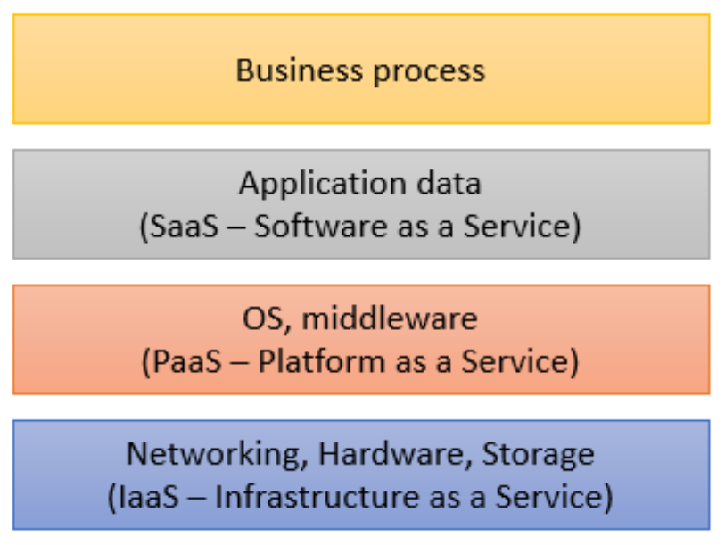

- A. Layered Architecture Data-Flow Architecture
- B. Data-Centered Architecture Call and
- C. Return Architecture

Hiện đáp án và giải thích

**Đáp án:** Layered Architecture

**Giải thích:** Với hình kiến trúc hoặc deployment, dấu hiệu chính là node, component, tầng và quan hệ phụ thuộc. Thiết kế kiến trúc chia hệ thống thành thành phần, nút triển khai và quan hệ phụ thuộc để dễ thay đổi, triển khai và kiểm thử. Các lựa chọn sai thường nhầm phần tử triển khai vật lý với lớp, hàm hoặc hoạt động quản lý dự án. Layered đi theo tầng trách nhiệm, pipes-and-filters đi theo chuỗi biến đổi dữ liệu, deployment thể hiện nút chạy vật lý hoặc môi trường thực thi.

### Câu 38
Nguồn: quiz phụ

Mô tả về việc chỉ ra chi tiết và đầy đủ về thành phần, tạo điều kiện xây dựng phần mềm trong pha sau, được gọi là?

- A. Thiết kế kiến trúc
- B. Thiết kế hệ thống
- C. Thiết kế mức thành phần
- D. Thiết kế hướng đối tượng

Hiện đáp án và giải thích

**Đáp án:** C. Thiết kế mức thành phần

**Giải thích:** Thiết kế kiến trúc chia hệ thống thành thành phần, nút triển khai và quan hệ phụ thuộc để dễ thay đổi, triển khai và kiểm thử. Các lựa chọn sai thường nhầm phần tử triển khai vật lý với lớp, hàm hoặc hoạt động quản lý dự án. Layered, pipes-and-filters, deployment và component khác nhau ở cách chia trách nhiệm và luồng phụ thuộc.

### Câu 39
Nguồn: quiz phụ

Kiểu kiến trúc nào hỗ trợ tốt nhất cho sự thay đổi trong thuật toán (cách thực hiện tính toán)?

- A. Data store or repository
- B. Pipes & filters Call and return
- C. Data abstraction

Hiện đáp án và giải thích

**Đáp án:** Pipes & filters 7.5 Thiết kế chi tiết ►

**Giải thích:** Thiết kế kiến trúc chia hệ thống thành thành phần, nút triển khai và quan hệ phụ thuộc để dễ thay đổi, triển khai và kiểm thử. Các lựa chọn sai thường nhầm phần tử triển khai vật lý với lớp, hàm hoặc hoạt động quản lý dự án. Layered, pipes-and-filters, deployment và component khác nhau ở cách chia trách nhiệm và luồng phụ thuộc.

### Câu 40
Nguồn: quiz phụ

Lựa chọn nào không được ngụ ý bởi sơ đồ lớp minh họa dưới đây?

- A. Mỗi khóa học được giảng dạy bởi chính xác hai giáo viên
- B. Một số giáo viên có thể dạy ba khóa học
- C. Một giáo viên chỉ dạy hai khóa học
- D. Một số giáo viên có thể không dạy bất kỳ khóa học nào

Hiện đáp án và giải thích

**Đáp án:** C. Một giáo viên chỉ dạy hai khóa học

**Giải thích:** Câu hỏi đang tìm ngoại lệ của thiết kế phần mềm; hãy giữ lại các lựa chọn đúng chuẩn rồi xét lựa chọn còn nằm ngoài phạm vi. Thiết kế tốt làm rõ trách nhiệm, giao diện và phụ thuộc giữa các thành phần. Các lựa chọn sai thường làm tăng coupling, trộn trách nhiệm hoặc nhầm loại biểu đồ/pattern. Các phương án còn lại thường đúng nhưng thuộc cùng nhóm chuẩn; đáp án cần chọn là ý nhầm pha, nhầm phạm vi hoặc không thuộc danh sách đang hỏi.

### Câu 41
Nguồn: quiz phụ

Hai lớp B và C có quan hệ như trong hình minh họa. Phát biểu nào là đúng về mối quan hệ giữa hai lớp này?

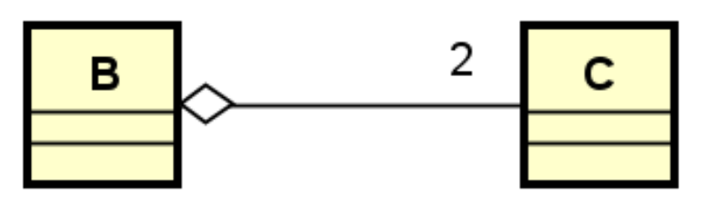

- A. Khi lớp B bị hủy, lớp C được tham chiếu cũng bị hủy
- B. Khi một đối tượng của lớp B bị hủy, các đối tượng được tham chiếu của lớp C cũng bị hủy
- C. Một đối tượng của lớp B chứa các tham chiếu đến hai đối tượng của lớp C Lớp B chứa một tham chiếu đến hai lớp kiểu C

Hiện đáp án và giải thích

**Đáp án:** Một đối tượng của lớp B chứa các tham chiếu đến hai đối tượng của lớp C

**Giải thích:** Với câu có hình, phần ảnh đang cung cấp dấu hiệu chính để nhận ra thiết kế phần mềm; phần chữ OCR chỉ nên dùng để đối chiếu. Thiết kế tốt làm rõ trách nhiệm, giao diện và phụ thuộc giữa các thành phần. Các lựa chọn sai thường làm tăng coupling, trộn trách nhiệm hoặc nhầm loại biểu đồ/pattern. Nhãn, mũi tên và vị trí phần tử trong sơ đồ thường quyết định đáp án hơn phần mô tả OCR bị thiếu.

### Câu 42
Nguồn: quiz phụ

Liên kết (Coupling) là một chỉ báo chất lượng cho biết mức độ một mô-đun...?

- A. Tập trung vào một nhiệm vụ duy nhất
- B. Kết nối với mô-đun khác và môi trường bên ngoài
- C. Có thể được xây dựng một cách vững chắc
- D. Có thể hoàn thành chức năng của nó trong một cách thức phù hợp về thời gian

Hiện đáp án và giải thích

**Đáp án:** B. Kết nối với mô-đun khác và môi trường bên ngoài

**Giải thích:** Nguyên lý và pattern thiết kế giúp giảm phụ thuộc, tách trách nhiệm và làm hệ thống dễ mở rộng. Dấu hiệu phân biệt thường nằm ở quan hệ giữa lớp/thành phần, không nằm ở tên gọi bề mặt của đáp án. Loại các phương án chỉ nói về công cụ, pha khác hoặc hệ quả phụ; đáp án đúng phải giữ đúng phạm vi khái niệm.

### Câu 43
Nguồn: quiz phụ

Để Biểu diễn các quan hệ vật lý giữa phần mềm và các thành phần phần cứng trong một hệ thống bạn sẽ dụng sơ đồ nào của UML?

- A. Sơ đồ hoạt động (Activity Diagram)
- B. Sơ đồ trạng thái (State Diagram)
- C. Sơ đồ triển khai (Deployment Diagram)
- D. Sơ đồ lớp (Class Diagram)

Hiện đáp án và giải thích

**Đáp án:** C. Sơ đồ triển khai (Deployment Diagram)

**Giải thích:** Thiết kế kiến trúc chia hệ thống thành thành phần, nút triển khai và quan hệ phụ thuộc để dễ thay đổi, triển khai và kiểm thử. Các lựa chọn sai thường nhầm phần tử triển khai vật lý với lớp, hàm hoặc hoạt động quản lý dự án. Layered, pipes-and-filters, deployment và component khác nhau ở cách chia trách nhiệm và luồng phụ thuộc.

### Câu 44
Nguồn: c7 p2 / quiz phụ

Trong thiết kế dữ liệu theo mô hình dữ liệu quan hệ khi gặp quan hệ nhiều - nhiều, giải pháp thường thực hiện là?

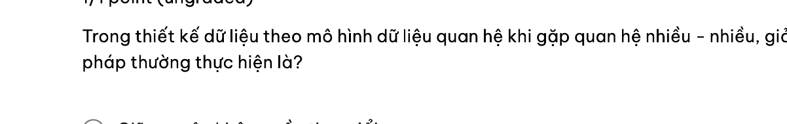

- A. Giữ nguyên không cần thay đổi
- B. Tách thành hai quan hệ một - nhiều và nhiều - một
- C. Gộp hai tập thực thể thành một tập thực thể
- D. Xoá đi một quan hệ

Hiện đáp án và giải thích

**Đáp án:** B. Tách thành hai quan hệ một - nhiều và nhiều - một

**Giải thích:** Với câu có hình, phần ảnh đang cung cấp dấu hiệu chính để nhận ra thiết kế phần mềm; phần chữ OCR chỉ nên dùng để đối chiếu. Thiết kế tốt làm rõ trách nhiệm, giao diện và phụ thuộc giữa các thành phần. Các lựa chọn sai thường làm tăng coupling, trộn trách nhiệm hoặc nhầm loại biểu đồ/pattern. Nhãn, mũi tên và vị trí phần tử trong sơ đồ thường quyết định đáp án hơn phần mô tả OCR bị thiếu.

### Câu 45
Nguồn: quiz phụ

Tìm cụm từ điền vào chỗ trống: ”..... có thể có nhiều dạng nhưng luôn hoàn thành hai nhiệm vụ cơ bản: truyền đạt thông tin từ hệ tương tác tới người dùng, và truyền đạt thông tin từ người dùng đến hệ tương tác.”

- A. Giao diện
- B. Người dùng Công cụ hỗ trợ thiết kế giao diện
- C. Nguyên tắc thiết kế giao diện
- D. Quy trình thiết kế giao diện

Hiện đáp án và giải thích

**Đáp án:** Giao diện người dùng

**Giải thích:** Thiết kế giao diện tốt dựa trên tính nhất quán, khả năng nhận biết và giảm gánh nặng ghi nhớ cho người dùng. Phương án sai thường nhầm loại control, luồng thao tác hoặc nguyên tắc usability đang bị vi phạm. Ưu tiên nhận diện control và nguyên tắc usability; tên gọi đẹp nhưng làm người dùng nhớ nhiều hoặc thao tác không nhất quán thường là sai.

### Câu 46
Nguồn: c4 p2 / c7 / quiz phụ

Đâu không phải là một đặc tính mong muốn của giao diện?

- A. Tính bí mật Tính dùng được
- B. Tính dễ truy cập
- C. Trải nghiệm
- D. Người dùng

Hiện đáp án và giải thích

**Đáp án:** Tính bí mật

**Giải thích:** Câu hỏi đang tìm ngoại lệ của thiết kế giao diện; hãy giữ lại các lựa chọn đúng chuẩn rồi xét lựa chọn còn nằm ngoài phạm vi. Thiết kế giao diện tốt dựa trên tính nhất quán, khả năng nhận biết và giảm gánh nặng ghi nhớ cho người dùng. Phương án sai thường nhầm loại control, luồng thao tác hoặc nguyên tắc usability đang bị vi phạm. Các phương án còn lại thường đúng nhưng thuộc cùng nhóm chuẩn; đáp án cần chọn là ý nhầm pha, nhầm phạm vi hoặc không thuộc danh sách đang hỏi.

### Câu 47
Nguồn: quiz phụ

Đâu không phải là một thành phần của đặc tả giao diện người dùng?

- A. Đặc tính, hành vi, mối quan hệ giữa các nhiệm vụ và hệ thống
- B. Phần tử giao diện Biểu diễn nhiệm vụ và hệ thống
- C. Phương thức Biểu diễn các phần tử giao diện
- D. Mục tiêu khả năng sử dụng chi tiết theo nhiệm vụ cụ thể

Hiện đáp án và giải thích

**Đáp án:** D. Mục tiêu khả năng sử dụng chi tiết theo nhiệm vụ cụ thể

**Giải thích:** Câu hỏi đang tìm ngoại lệ của thiết kế giao diện; hãy giữ lại các lựa chọn đúng chuẩn rồi xét lựa chọn còn nằm ngoài phạm vi. Thiết kế giao diện tốt dựa trên tính nhất quán, khả năng nhận biết và giảm gánh nặng ghi nhớ cho người dùng. Phương án sai thường nhầm loại control, luồng thao tác hoặc nguyên tắc usability đang bị vi phạm. Các phương án còn lại thường đúng nhưng thuộc cùng nhóm chuẩn; đáp án cần chọn là ý nhầm pha, nhầm phạm vi hoặc không thuộc danh sách đang hỏi.

### Câu 48
Nguồn: quiz phụ

Đâu không phải là một thành phần của đặc tả tương tác người dùng?

- A. Phần tử giao diện Biểu diễn nhiệm vụ và hệ thống
- B. Mục tiêu khả năng sử dụng chi tiết theo nhiệm vụ cụ thể
- C. Thiết kế quy trình làm việc của
- D. Người dùng Kiến trúc thông tin

Hiện đáp án và giải thích

**Đáp án:** A. Phần tử giao diện Biểu diễn nhiệm vụ và hệ thống

**Giải thích:** Câu hỏi đang tìm ngoại lệ của kiến trúc/thiết kế phần mềm; hãy giữ lại các lựa chọn đúng chuẩn rồi xét lựa chọn còn nằm ngoài phạm vi. Thiết kế kiến trúc chia hệ thống thành thành phần, nút triển khai và quan hệ phụ thuộc để dễ thay đổi, triển khai và kiểm thử. Các lựa chọn sai thường nhầm phần tử triển khai vật lý với lớp, hàm hoặc hoạt động quản lý dự án. Các phương án còn lại thường đúng nhưng thuộc cùng nhóm chuẩn; đáp án cần chọn là ý nhầm pha, nhầm phạm vi hoặc không thuộc danh sách đang hỏi.

### Câu 49
Nguồn: quiz phụ

Đâu không phải là một thành phần của bản mô tả bối cảnh sử dụng?

- A. Tiêu chuẩn, hướng dẫn, kiến thức về công thái học và giao diện
- B. Người dùng Môi trường kỹ thuật (phần cứng,
- C. Phần mềm và thiết bị)
- D. Mục tiêu và đặc điểm của nhiệm vụ
- E. Đặc điểm của Người dùng

Hiện đáp án và giải thích

**Đáp án:** Tiêu chuẩn, hướng dẫn, kiến thức về công thái học và giao diện người dùng

**Giải thích:** Câu hỏi đang tìm ngoại lệ của thiết kế giao diện; hãy giữ lại các lựa chọn đúng chuẩn rồi xét lựa chọn còn nằm ngoài phạm vi. Thiết kế giao diện tốt dựa trên tính nhất quán, khả năng nhận biết và giảm gánh nặng ghi nhớ cho người dùng. Phương án sai thường nhầm loại control, luồng thao tác hoặc nguyên tắc usability đang bị vi phạm. Các phương án còn lại thường đúng nhưng thuộc cùng nhóm chuẩn; đáp án cần chọn là ý nhầm pha, nhầm phạm vi hoặc không thuộc danh sách đang hỏi.

### Câu 50
Nguồn: c7 / quiz phụ

Đâu không phải là yêu cầu người dùng về giao diện?

- A. Yêu cầu của tổ chức / cộng đồng, có ảnh hưởng trực tiếp đến
- B. Người dùng
- C. Yêu cầu xuất phát từ nhu cầu của
- D. Người dùng và bối cảnh sử dụng
- E. Yêu cầu và mục tiêu về tính dùng được
- F. Yêu cầu về an toàn thông tin

Hiện đáp án và giải thích

**Đáp án:** F. Yêu cầu về an toàn thông tin

**Giải thích:** Câu hỏi đang tìm ngoại lệ của thiết kế giao diện; hãy giữ lại các lựa chọn đúng chuẩn rồi xét lựa chọn còn nằm ngoài phạm vi. Thiết kế giao diện tốt dựa trên tính nhất quán, khả năng nhận biết và giảm gánh nặng ghi nhớ cho người dùng. Phương án sai thường nhầm loại control, luồng thao tác hoặc nguyên tắc usability đang bị vi phạm. Các phương án còn lại thường đúng nhưng thuộc cùng nhóm chuẩn; đáp án cần chọn là ý nhầm pha, nhầm phạm vi hoặc không thuộc danh sách đang hỏi.

### Câu 51
Nguồn: quiz phụ

Yêu cầu sau đây thuộc loại nào: Nhân viên quản lý có thể xuất báo cáo thống kê theo tháng một cách nhanh chóng theo các tiêu chí sau: Về thời gian: Trung bình, thời gian cần thiết để xuất báo cáo không được vượt quá 1 phút. Về số hành động tương tác cần thực hiện: Quá trình xuất báo cáo sẽ được hoàn thành trong vòng 3 lần nhấp chuột.

- A. Yêu cầu xuất phát từ nhu cầu của người dùng và bối cảnh sử dụng
- B. Yêu cầu phát sinh từ các tiêu chuẩn, hướng dẫn, kiến thức về công thái học và giao diện người dùng
- C. Yêu cầu của tổ chức / cộng đồng, có ảnh hưởng trực tiếp đến người dùng
- D. Yêu cầu và mục tiêu về tính dùng được

Hiện đáp án và giải thích

**Đáp án:** D. Yêu cầu và mục tiêu về tính dùng được

**Giải thích:** Câu hỏi đang tìm ngoại lệ của thiết kế giao diện; hãy giữ lại các lựa chọn đúng chuẩn rồi xét lựa chọn còn nằm ngoài phạm vi. Thiết kế giao diện tốt dựa trên tính nhất quán, khả năng nhận biết và giảm gánh nặng ghi nhớ cho người dùng. Phương án sai thường nhầm loại control, luồng thao tác hoặc nguyên tắc usability đang bị vi phạm. Các phương án còn lại thường đúng nhưng thuộc cùng nhóm chuẩn; đáp án cần chọn là ý nhầm pha, nhầm phạm vi hoặc không thuộc danh sách đang hỏi.

### Câu 52
Nguồn: quiz phụ

Báo cáo về nhu cầu của từng nhóm người dùng liên quan đến các khía cạnh nhận thức, sinh lý, xã hội là một thành phần của:

- A. Bản mô tả bối cảnh sử dụng
- B. Hồ sơ Người dùng
- C. Báo cáo về nhu cầu
- D. Người dùng Bản mô tả yêu cầu xuất phát từ nhu cầu của
- E. Người dùng và bối cảnh sử dụng

Hiện đáp án và giải thích

**Đáp án:** Báo cáo về nhu cầu người dùng Dịch

**Giải thích:** Yêu cầu chức năng mô tả hệ thống phải làm gì; yêu cầu phi chức năng mô tả ràng buộc chất lượng như bảo mật, hiệu năng, độ tin cậy. Các câu ngoại lệ thường gài những mô tả về dữ liệu, giao diện hoặc tổ chức không trực tiếp là chức năng hệ thống. Chức năng là hành vi hệ thống phải cung cấp; phi chức năng là ràng buộc chất lượng hoặc môi trường vận hành.

### Câu 53
Nguồn: quiz phụ

Quan sát màn hình giao diện trang web dantri.com.vn dưới đây. Các nội dung được khoanh đỏ trong hình thuộc loại nào?

- A. Kiến trúc thông tin
- B. Nội dung tương tác
- C. Nội dung một chiều
- D. Lưới thông tin

Hiện đáp án và giải thích

**Đáp án:** C. Nội dung một chiều

**Giải thích:** Với hình kiến trúc hoặc deployment, dấu hiệu chính là node, component, tầng và quan hệ phụ thuộc. Thiết kế kiến trúc chia hệ thống thành thành phần, nút triển khai và quan hệ phụ thuộc để dễ thay đổi, triển khai và kiểm thử. Các lựa chọn sai thường nhầm phần tử triển khai vật lý với lớp, hàm hoặc hoạt động quản lý dự án. Layered đi theo tầng trách nhiệm, pipes-and-filters đi theo chuỗi biến đổi dữ liệu, deployment thể hiện nút chạy vật lý hoặc môi trường thực thi.

### Câu 54
Nguồn: quiz phụ

Quan sát màn hình giao diện đăng ký tài khoản Google dưới đây. Các phần tử giao diện được khoanh đỏ trong hình thuộc loại nào?

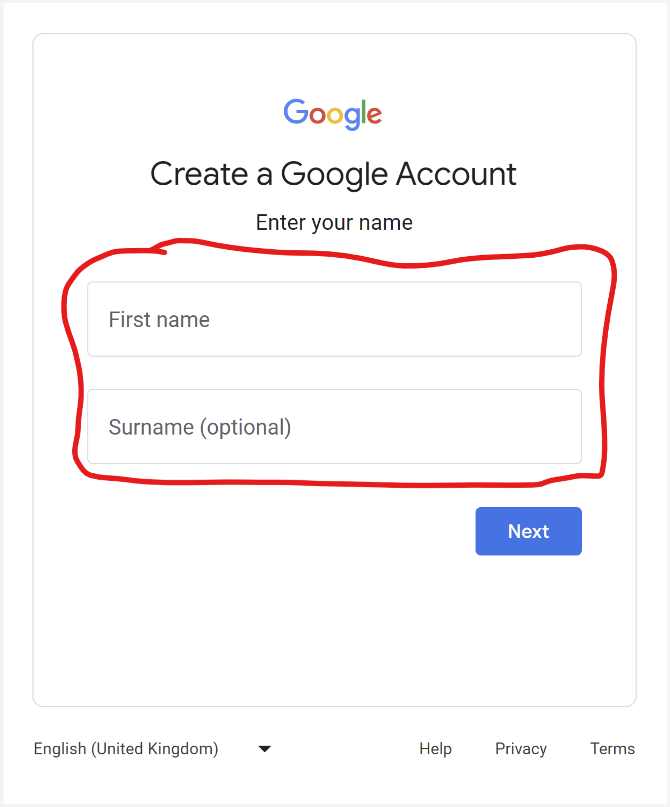

- A. Nhãn văn bản
- B. Nút bấm
- C. Ô nhập liệu
- D. Tiêu đề

Hiện đáp án và giải thích

**Đáp án:** C. Ô nhập liệu

**Giải thích:** Với hình giao diện, cần nhìn loại control, nhãn, vị trí và tính nhất quán giữa các màn hình. Thiết kế giao diện tốt dựa trên tính nhất quán, khả năng nhận biết và giảm gánh nặng ghi nhớ cho người dùng. Phương án sai thường nhầm loại control, luồng thao tác hoặc nguyên tắc usability đang bị vi phạm. Các lỗi giao diện thường lộ ra ở nhãn mơ hồ, vị trí control không nhất quán hoặc thao tác bắt người dùng nhớ quá nhiều.

### Câu 55
Nguồn: quiz phụ

Cô A. cần thiết kế một cửa sổ thông báo có kích thước tuân thủ tỉ lệ vàng. Tỉ lệ kích thước của cửa số đó là:

- A. (1:1)
- B. (1:2)
- C. (1:1.732)
- D. (1:1.618)

Hiện đáp án và giải thích

**Đáp án:** D. (1:1.618)

**Giải thích:** Thiết kế tốt làm rõ trách nhiệm, giao diện và phụ thuộc giữa các thành phần. Các lựa chọn sai thường làm tăng coupling, trộn trách nhiệm hoặc nhầm loại biểu đồ/pattern. Loại các phương án chỉ nói về công cụ, pha khác hoặc hệ quả phụ; đáp án đúng phải giữ đúng phạm vi khái niệm.

### Câu 56
Nguồn: quiz phụ

Loại mẫu thử nào sau đây được tạo lập với mục đích định hình bố cục màn hình giao diện?

- A. Bản phác thảo Bản đơn sắc
- B. Bản phối máu Lưới thông tin

Hiện đáp án và giải thích

**Đáp án:** Bản phác thảo

**Giải thích:** Thiết kế giao diện tốt dựa trên tính nhất quán, khả năng nhận biết và giảm gánh nặng ghi nhớ cho người dùng. Phương án sai thường nhầm loại control, luồng thao tác hoặc nguyên tắc usability đang bị vi phạm. Ưu tiên nhận diện control và nguyên tắc usability; tên gọi đẹp nhưng làm người dùng nhớ nhiều hoặc thao tác không nhất quán thường là sai.

### Câu 57
Nguồn: quiz phụ

Loại mẫu thử nào sau đây được tạo lập với mục đích phối màu cho các thành phần đơn sắc?

- A. Bản phác thảo Bản phối máu
- B. Lưới thông tin Bản đơn sắc

Hiện đáp án và giải thích

**Đáp án:** Bản phối máu

**Giải thích:** Prototype dùng mẫu thử để làm rõ yêu cầu và nhận phản hồi sớm từ người dùng. Throwaway prototype phục vụ học yêu cầu rồi bỏ đi, còn evolutionary prototype được cải tiến dần thành sản phẩm. Nếu đề nói bản phác thảo hoặc khung để nhận phản hồi, trọng tâm là prototype chứ không phải một quy trình tuyến tính hoàn chỉnh.

### Câu 58
Nguồn: quiz phụ

Đâu là mô tả đúng nhất cho luồng người dùng (user flows)?

- A. Biểu diễn trình tự tương tác người dùng cần thực hiện để hoàn thành một nhiệm vụ hoặc mục tiêu cụ thể trong hệ thống
- B. Biểu diễn một nhóm các thông tin bị hiện thị trên vài màn hình khác nhau
- C. Biểu diễn tất cả các điều hướng được phép thực hiện giữa các màn hình của ứng dụng
- D. Biểu diễn lộ trình của một cá nhân cụ thể thông qua thiết kế hiện có.

Hiện đáp án và giải thích

**Đáp án:** D. Biểu diễn lộ trình của một cá nhân cụ thể thông qua thiết kế hiện có.

**Giải thích:** Thiết kế giao diện tốt dựa trên tính nhất quán, khả năng nhận biết và giảm gánh nặng ghi nhớ cho người dùng. Phương án sai thường nhầm loại control, luồng thao tác hoặc nguyên tắc usability đang bị vi phạm. Ưu tiên nhận diện control và nguyên tắc usability; tên gọi đẹp nhưng làm người dùng nhớ nhiều hoặc thao tác không nhất quán thường là sai.

### Câu 59
Nguồn: quiz phụ

Đâu là mô tả đúng nhất cho cơ chế hỗ trợ định vị khi người dùng tương tác?

- A. Có dịch vụ tìm kiếm nội dung
- B. Có cơ chế để có thể thay đổi, hủy bỏ thao tác điều hướng trước đó
- C. Có cơ chế giúp người dùng xác định được vị trí màn hình hiện tại và quan hệ với các màn hình khác
- D. Có cơ chế liên kết đến các màn hình có liên quan theo quy trình nghiệp vụ

Hiện đáp án và giải thích

**Đáp án:** C. Có cơ chế giúp người dùng xác định được vị trí màn hình hiện tại và quan hệ với các màn hình khác

**Giải thích:** Thiết kế giao diện tốt dựa trên tính nhất quán, khả năng nhận biết và giảm gánh nặng ghi nhớ cho người dùng. Phương án sai thường nhầm loại control, luồng thao tác hoặc nguyên tắc usability đang bị vi phạm. Ưu tiên nhận diện control và nguyên tắc usability; tên gọi đẹp nhưng làm người dùng nhớ nhiều hoặc thao tác không nhất quán thường là sai.

### Câu 60
Nguồn: quiz phụ

Phần bôi đỏ trong hình dưới đây tương ứng với hình thức hỗ trợ tương tác nào?

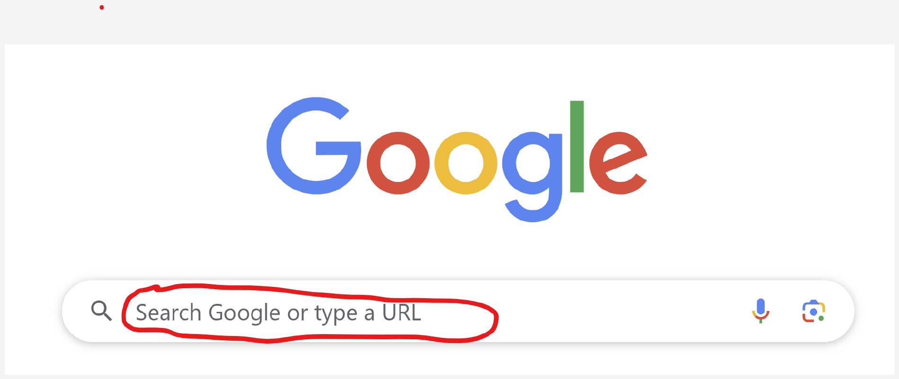

- A. Liên kết thông tin
- B. Chỉ dẫn Trợ giúp
- C. Định vị

Hiện đáp án và giải thích

**Đáp án:** Chỉ dẫn

**Giải thích:** Với câu có hình, phần ảnh đang cung cấp dấu hiệu chính để nhận ra bảo trì phần mềm; phần chữ OCR chỉ nên dùng để đối chiếu. Bảo trì chiếm chi phí lớn vì phần mềm luôn phải sửa lỗi, thích nghi môi trường và đáp ứng yêu cầu mới. Đừng hiểu bảo trì chỉ là sửa lỗi sau phát hành; nó còn bao gồm cải tiến và thích nghi. Nhãn, mũi tên và vị trí phần tử trong sơ đồ thường quyết định đáp án hơn phần mô tả OCR bị thiếu.

### Câu 61
Nguồn: quiz phụ

Cho bố cục màn hình như sau. Vùng nào trên màn hình dễ tìm thấy thông tin nhất và dễ truy cập nhất?

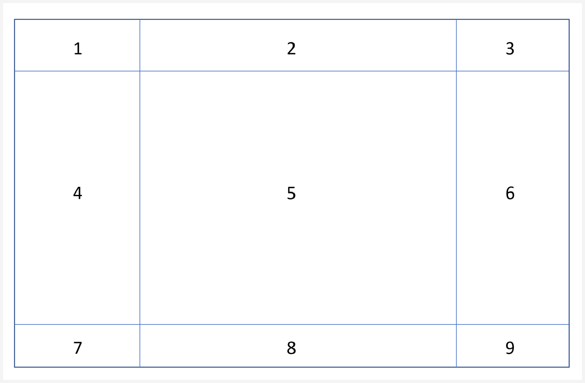

- A. Phương án A trong hình
- B. Phương án B trong hình
- C. Phương án C trong hình
- D. Phương án D trong hình

Hiện đáp án và giải thích

**Đáp án:** 5

**Giải thích:** Với hình giao diện, cần nhìn loại control, nhãn, vị trí và tính nhất quán giữa các màn hình. Thiết kế giao diện tốt dựa trên tính nhất quán, khả năng nhận biết và giảm gánh nặng ghi nhớ cho người dùng. Phương án sai thường nhầm loại control, luồng thao tác hoặc nguyên tắc usability đang bị vi phạm. Các lỗi giao diện thường lộ ra ở nhãn mơ hồ, vị trí control không nhất quán hoặc thao tác bắt người dùng nhớ quá nhiều.

### Câu 62
Nguồn: quiz phụ

Đâu là mô tả đúng nhất cho thứ tự duyệt tin bằng mắt của con người?

- A. Trái - phải, trên - dưới, ngược chiều kim đồng hồ
- B. Trên - dưới, trái - phải, ngược chiều kim đồng hồ
- C. Trái - phải, trên - dưới, theo chiều kim đồng hồ
- D. Trên - dưới, trái - phải, theo chiều kim đồng hồ

Hiện đáp án và giải thích

**Đáp án:** Trái - phải, trên - dưới, theo chiều kim đồng hồ

**Giải thích:** Thiết kế tốt làm rõ trách nhiệm, giao diện và phụ thuộc giữa các thành phần. Các lựa chọn sai thường làm tăng coupling, trộn trách nhiệm hoặc nhầm loại biểu đồ/pattern. Loại các phương án chỉ nói về công cụ, pha khác hoặc hệ quả phụ; đáp án đúng phải giữ đúng phạm vi khái niệm.

### Câu 63
Nguồn: quiz phụ

Khảo sát một hệ thống thương mại điện tử, trong đó chức năng đặt hàng mới được gửi đến xử lý dưới dạng một thông điệp. Các đơn hàng được mã hóa để ngăn chặn những kẻ nghe trộm theo dõi đơn đặt hàng của khách hàng. Đơn hàng cũng chứa thông tin xác thực dưới dạng chứng chỉ số để đảm bảo rằng các đơn hàng chỉ được đặt bởi những khách hàng đáng tin cậy. Ngoài ra các đơn hàng trùng lặp (có thể do khách hàng vô tình nhấp vào nút ’Đặt hàng ngay’ nhiều lần) cũng cần xử lý loại bỏ. Chức năng này được thiết kế như hình minh họa dưới đây. Hãy xác định kiểu kiến trúc phù hợp?

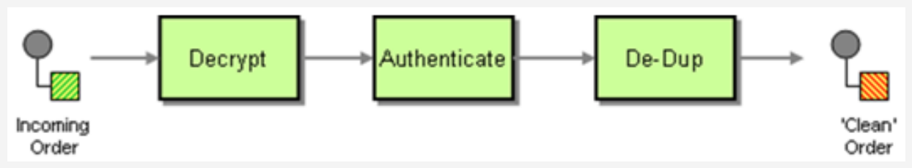

- A. Layered systems Call and
- B. Return Data-Centered Architecture Pipes and filters

Hiện đáp án và giải thích

**Đáp án:** Pipes and filters

**Giải thích:** Với hình kiến trúc hoặc deployment, dấu hiệu chính là node, component, tầng và quan hệ phụ thuộc. Thiết kế kiến trúc chia hệ thống thành thành phần, nút triển khai và quan hệ phụ thuộc để dễ thay đổi, triển khai và kiểm thử. Các lựa chọn sai thường nhầm phần tử triển khai vật lý với lớp, hàm hoặc hoạt động quản lý dự án. Layered đi theo tầng trách nhiệm, pipes-and-filters đi theo chuỗi biến đổi dữ liệu, deployment thể hiện nút chạy vật lý hoặc môi trường thực thi.

### Câu 64
Nguồn: quiz phụ

Đây là một đoạn giả mã thiết kế thuật toán xử lý cấu hình hiển thị trên một trang web thương mại điện tử. Hãy lựa chọn phương án cải thiện thiết kế thuật toán mà không làm thay đổi hành vi của nó.

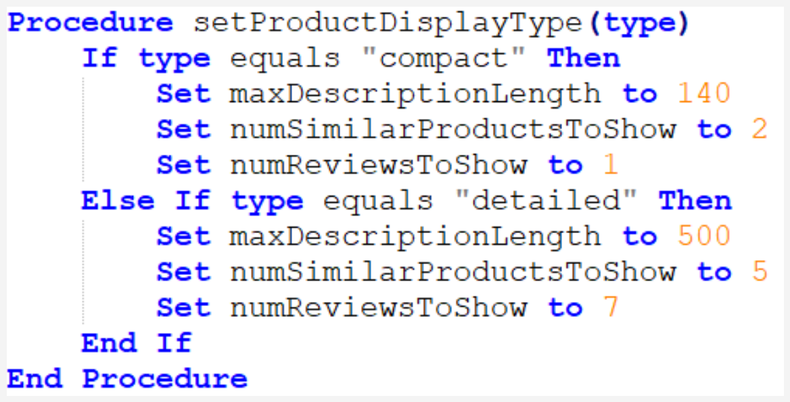

- A. Các giá trị hằng chuyển thành các giá trị tham số được truyền vào khi gọi phương thức
- B. Thay thế các chuỗi được mã hóa cứng ’compact’ và ’detailed’ bằng các hằng chuỗi hoặc dưới dạng enum
- C. Sử dụng cấu trúc switch thay cho if else
- D. Đóng gói
- E. 3 giá trị được truyền cho các thuộc tính maxDescriptionLength, numSimilarProductsToShow và numReviewsToShow thành lớp
- F. ProductDisplayType

Hiện đáp án và giải thích

**Đáp án:** Đóng gói 3 giá trị được truyền cho các thuộc tính maxDescriptionLength, numSimilarProductsToShow và numReviewsToShow thành lớp ProductDisplayType

**Giải thích:** Với hình quản lý cấu hình, cần xác định mục cấu hình, phiên bản, baseline và quan hệ thay đổi giữa các thành phần. SCM kiểm soát các mục cấu hình, phiên bản, baseline và thay đổi trong suốt vòng đời phần mềm. Mấu chốt là khả năng truy vết: biết thành phần nào đổi, đổi khi nào và thuộc phiên bản nào. Check-out là lấy về để sửa, check-in là đưa thay đổi vào kho; baseline là mốc đã được kiểm soát thay đổi.

### Câu 65
Nguồn: quiz phụ

Phát biểu ”Một mô đun (thành phần) nên được mở cho sự mở rộng nhưng nên đóng cho các thay đổi” phù hợp với nguyên lý thiết kế nào?

- A. Nguyên lý tráo đổi phụ thuộc (DIP)
- B. Nguyên lý đóng chung (CCP)
- C. Nguyên lý tái sử dụng chung (CRP)
- D. Nguyên lý mở-đóng (OCP)

Hiện đáp án và giải thích

**Đáp án:** D. Nguyên lý mở-đóng (OCP)

**Giải thích:** Nguyên lý và pattern thiết kế giúp giảm phụ thuộc, tách trách nhiệm và làm hệ thống dễ mở rộng. Dấu hiệu phân biệt thường nằm ở quan hệ giữa lớp/thành phần, không nằm ở tên gọi bề mặt của đáp án. Loại các phương án chỉ nói về công cụ, pha khác hoặc hệ quả phụ; đáp án đúng phải giữ đúng phạm vi khái niệm.

### Câu 66
Nguồn: quiz phụ

Giả sử bạn cần thiết kế một hệ thống quản lý tệp tin đơn giản. Hai thành phần chính cần quản lý trong thiết kế là các tập tin và thư mục. Thư mục có thể chứa 0 hoặc nhiều tập tin hoặc thư mục con khác. Các thư mục và tệp tin cần được xử lý một cách thống nhất, ví dụ: cả hai đều có tên và cung cấp các thao tác để truyền nội dung vào (streamIn) và ra (streamOut) cũng như liệt kê các phần tử con (listChildren). Lựa chọn nào là thiết kế phù hợp với mô tả trên?

- A.
  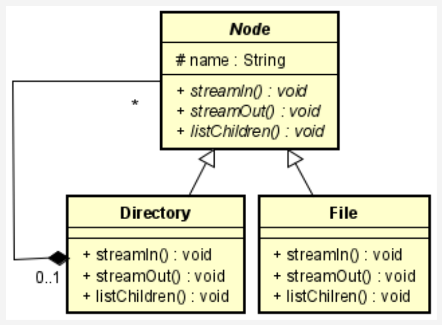
- B.
  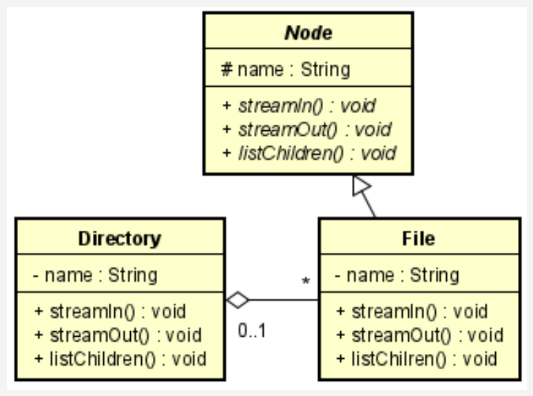
- C.
  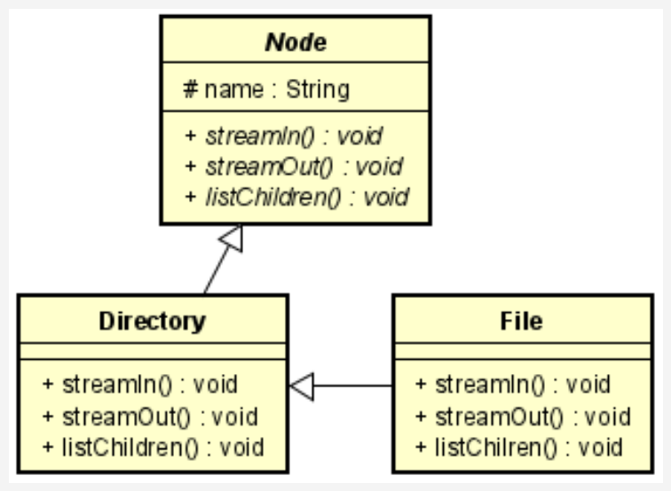
- D.
  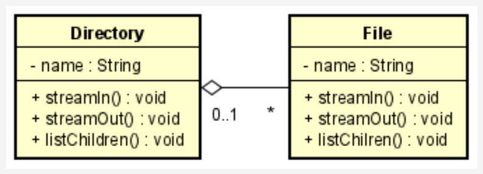

Hiện đáp án và giải thích

**Đáp án:** A

**Giải thích:** Với câu có hình, phần ảnh đang cung cấp dấu hiệu chính để nhận ra Composite pattern; phần chữ OCR chỉ nên dùng để đối chiếu. Composite phù hợp khi đối tượng đơn lẻ và nhóm đối tượng cần được xử lý qua cùng một giao diện. Bài thư mục/tập tin là dấu hiệu kinh điển: file là leaf, folder là composite chứa nhiều phần tử con. Nhãn, mũi tên và vị trí phần tử trong sơ đồ thường quyết định đáp án hơn phần mô tả OCR bị thiếu.

### Câu 67
Nguồn: c7 / quiz phụ

Những nguyên lý thiết kế giao diện cho phép người dùng ít phải ghi nhớ?

- A. Tất cả các lựa chọn còn lại
- B. Thiết lập những trường hợp mặc định có ý nghĩa
- C. Biểu lộ thông tin theo cách diễn tiến (tăng dần)
- D. Xác định những lối tắt trực quan

Hiện đáp án và giải thích

**Đáp án:** A. Tất cả các lựa chọn còn lại

**Giải thích:** Các lựa chọn đang mô tả những mặt khác nhau của thiết kế giao diện, nên câu trả lời phải bao quát cả nhóm. Thiết kế giao diện tốt dựa trên tính nhất quán, khả năng nhận biết và giảm gánh nặng ghi nhớ cho người dùng. Phương án sai thường nhầm loại control, luồng thao tác hoặc nguyên tắc usability đang bị vi phạm. Dạng 'tất cả' hợp lý khi từng lựa chọn là một lát cắt hợp lệ của cùng tiêu chí, không có ý nào phá vỡ phạm vi câu hỏi.

### Câu 68
Nguồn: quiz phụ

Các minh họa (mockup) của 3 màn hình trong một ứng dụng sau mắc phải lỗi thiết kế giao diện nào?

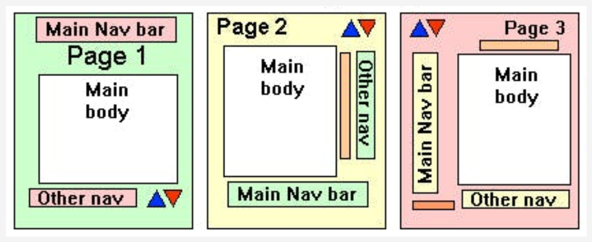

- A. Thiếu nhất quán
- B. Đáp ứng kém Quá nhiều ghi nhớ
- C. Không có hướng dẫn / giúp đỡ

Hiện đáp án và giải thích

**Đáp án:** A. Thiếu nhất quán

**Giải thích:** Với hình giao diện, cần nhìn loại control, nhãn, vị trí và tính nhất quán giữa các màn hình. Thiết kế giao diện tốt dựa trên tính nhất quán, khả năng nhận biết và giảm gánh nặng ghi nhớ cho người dùng. Phương án sai thường nhầm loại control, luồng thao tác hoặc nguyên tắc usability đang bị vi phạm. Các lỗi giao diện thường lộ ra ở nhãn mơ hồ, vị trí control không nhất quán hoặc thao tác bắt người dùng nhớ quá nhiều.

### Câu 69
Nguồn: quiz phụ

Trong phân tích và thiết kế hướng đối tượng, các lớp đối tượng được xác định bằng cách...?

- A. Xem xét các đối tượng trong miền ứng dụng
- B. Phân tích theo khía cạnh ngữ pháp mô tả hệ thống (lớp đối tượng và thuộc tính thường là các danh từ)
- C. Tất cả các lựa chọn còn lại
- D. Phân tích các trường hợp sử dụng để xác định các lớp đối tượng

Hiện đáp án và giải thích

**Đáp án:** C. Tất cả các lựa chọn còn lại

**Giải thích:** Các lựa chọn đang mô tả những mặt khác nhau của thiết kế phần mềm, nên câu trả lời phải bao quát cả nhóm. Thiết kế tốt làm rõ trách nhiệm, giao diện và phụ thuộc giữa các thành phần. Các lựa chọn sai thường làm tăng coupling, trộn trách nhiệm hoặc nhầm loại biểu đồ/pattern. Dạng 'tất cả' hợp lý khi từng lựa chọn là một lát cắt hợp lệ của cùng tiêu chí, không có ý nào phá vỡ phạm vi câu hỏi.

### Câu 70
Nguồn: quiz phụ

Việc đo “độ mạnh” của sự kết nối giữa hai thành phần hệ thống được biết như là?

- A. Aggregation (kết tập)
- B. Inheritance (kế thừa)
- C. Coupling (liên kết)
- D. Cohesion (gắn kết)

Hiện đáp án và giải thích

**Đáp án:** C. Coupling (liên kết)

**Giải thích:** Nguyên lý và pattern thiết kế giúp giảm phụ thuộc, tách trách nhiệm và làm hệ thống dễ mở rộng. Dấu hiệu phân biệt thường nằm ở quan hệ giữa lớp/thành phần, không nằm ở tên gọi bề mặt của đáp án. Loại các phương án chỉ nói về công cụ, pha khác hoặc hệ quả phụ; đáp án đúng phải giữ đúng phạm vi khái niệm.

### Câu 71
Nguồn: c7 / quiz phụ

Tính gắn kết (cohension) là một chỉ số chất lượng để đánh giá thiết kế một mô-đun...?

- A. Hoàn thành chức năng của nó một cách kịp thời
- B. Tập trung vào một nhiệm vụ đơn nhất
- C. Có thể được viết gọn hơn
- D. Được kết nối với các mô-đun khác và thế giới bên ngoài

Hiện đáp án và giải thích

**Đáp án:** B. Tập trung vào một nhiệm vụ đơn nhất

**Giải thích:** Cohesion đo mức các phần trong một mô-đun cùng phục vụ một trách nhiệm, còn coupling đo mức phụ thuộc giữa mô-đun/lớp. Thiết kế tốt thường muốn cohesion cao và coupling thấp. Thiết kế tốt thường muốn cohesion cao trong mô-đun và coupling thấp giữa các mô-đun.

### Câu 72
Nguồn: c7 / c7 p2 / quiz phụ

Các yếu tố thiết kế mức thành phần?

- A. Giao diện cho phép truy cập vào tất cả các hoạt động (hành vi) của thành phần
- B. Tất cả các lựa chọn còn lại
- C. Chi tiết thuật toán xử lý
- D. Cấu trúc dữ liệu

Hiện đáp án và giải thích

**Đáp án:** B. Tất cả các lựa chọn còn lại

**Giải thích:** Các lựa chọn đang mô tả những mặt khác nhau của thiết kế giao diện, nên câu trả lời phải bao quát cả nhóm. Thiết kế giao diện tốt dựa trên tính nhất quán, khả năng nhận biết và giảm gánh nặng ghi nhớ cho người dùng. Phương án sai thường nhầm loại control, luồng thao tác hoặc nguyên tắc usability đang bị vi phạm. Dạng 'tất cả' hợp lý khi từng lựa chọn là một lát cắt hợp lệ của cùng tiêu chí, không có ý nào phá vỡ phạm vi câu hỏi.

### Câu 73
Nguồn: quiz phụ

Những phần tử mô hình thiết kế nào được sử dụng để mô tả mô hình thông tin được trình bày từ góc nhìn của người dùng?

- A. Interface design elements
- B. Architectural design elements
- C. Data design elements
- D. Component-level design elements

Hiện đáp án và giải thích

**Đáp án:** C. Data design elements

**Giải thích:** Thiết kế kiến trúc chia hệ thống thành thành phần, nút triển khai và quan hệ phụ thuộc để dễ thay đổi, triển khai và kiểm thử. Các lựa chọn sai thường nhầm phần tử triển khai vật lý với lớp, hàm hoặc hoạt động quản lý dự án. Layered, pipes-and-filters, deployment và component khác nhau ở cách chia trách nhiệm và luồng phụ thuộc.

### Câu 74
Nguồn: c7 p2 / quiz phụ

Hoàn chỉnh phát biểu sau: ”... là cách Biểu diễn tốt để mô tả hành vi của một số đối tượng. Nó rất tốt để mô tả hành vi liên quan đến một số đối tượng hợp tác với nhau không cần Biểu diễn rõ trình tự thời gian”

- A. Biểu đồ giao tiếp (communication diagram)
- B. Biểu đồ trình tự (sequence diagram)
- C. Biểu đồ trạng thái (state diagram)
- D. Biểu đồ hoạt động (activity diagram)

Hiện đáp án và giải thích

**Đáp án:** A. Biểu đồ giao tiếp (communication diagram)

**Giải thích:** Với câu có hình, phần ảnh đang cung cấp dấu hiệu chính để nhận ra biểu đồ tương tác UML; phần chữ OCR chỉ nên dùng để đối chiếu. Biểu đồ tương tác mô tả cách các đối tượng trao đổi thông điệp để thực hiện một hành vi. Sequence diagram nhấn mạnh thứ tự theo thời gian, còn communication diagram nhấn mạnh liên kết giữa các đối tượng. Communication diagram nhấn mạnh các liên kết và thông điệp giữa đối tượng; sequence diagram nhấn mạnh thứ tự thời gian của thông điệp.

## Chương 8: Xây dựng phần mềm

### Câu 1
Nguồn: c8 p2

Thẻ (tag) nào là bắt buộc đối với phương thức có kiểu trả vê trong Javadoc

- A. @author và @version
- B. @param
- C. @return
- D. @param và @return

Hiện đáp án và giải thích

**Đáp án:** C. @return

**Giải thích:** Javadoc chuẩn hóa chú thích để IDE sinh tài liệu, gợi ý tham số và kiểm tra phần trả về của phương thức. Tag @param dùng cho tham số, @return dùng khi phương thức có giá trị trả về. Cú pháp comment trước phương thức không làm chương trình chạy khác đi; nó phục vụ tài liệu hóa và gợi ý của IDE.

### Câu 2
Nguồn: c8 p2

Mã bốc mùi "Shotgun Surgery" là mã nguồn có dấu hiệu.

- A. Nhiều dữ liệu được truyền qua lại trong mã nguồn mà không được gói lại thành một đối tượng riêng biệt
- B. Khi có một thay đổi, phải thực hiện thay đổi ở nhiều lớp
- C. Có nhiểu đoạn mã bị trùng lặp do thiết kế dạng copy-pasta

Hiện đáp án và giải thích

**Đáp án:** B. Khi có một thay đổi, phải thực hiện thay đổi ở nhiều lớp

**Giải thích:** Refactoring cải thiện cấu trúc mã mà không đổi hành vi quan sát được của chương trình. Code smell là dấu hiệu mã khó bảo trì; Data Clump là nhóm dữ liệu hay đi cùng nhau nhưng chưa được gói thành đối tượng phù hợp. Refactoring không thêm hành vi mới; nó sửa cấu trúc để code smell như Data Clump hoặc mã trùng lặp dễ xử lý hơn.

### Câu 3
Nguồn: c8 p2 / quiz phụ

Trong các loại mô thức lập trình, Procedural paradigm, Structured paradigm; Object - oriented paradigm; và Database oriented paradigm: định nghĩa về Structured paradigm là.

- A. Sử dụng các câu truy vấn; query, để yêu cầu máy tính thực hiện một công việc.
- B. Các câu lệnh được tổ chức một cách có cấu trúc (vd. thành các hàm), tương tự như tư tưởng "chia để trị"
- C. Các thành phần của một chương trình được coi là các đối tượng, và có thể tương tác với nhau bằng cách "truyền thông điệp' Các câu lệnh được đưa ra lân lượt
- E. Mỗi function/method phải có một nhiệm vụ rõ ràng
- F. Tuân thủ quy tắc đặt tên nhất quán, gợi nhớ, có tính miêu tả

Hiện đáp án và giải thích

**Đáp án:** B. Các câu lệnh được tổ chức một cách có cấu trúc (vd. thành các hàm), tương tự như tư tưởng "chia để trị"

**Giải thích:** Viết mã tốt ưu tiên tính dễ đọc, nhất quán và dễ bảo trì hơn là chỉ làm cho chương trình chạy được. Quy ước đặt tên, chú thích và mô thức lập trình đều phục vụ việc hiểu và sửa mã về sau. Loại các phương án chỉ nói về công cụ, pha khác hoặc hệ quả phụ; đáp án đúng phải giữ đúng phạm vi khái niệm.

### Câu 4
Nguồn: c8 p2

Theo quy ước viết mã Java (Java coding convention), tên biến nên là.

- A. Động từ, viết thường chữ cái đầu tiên
- B. Danh từ; viết thường chữ cái đầu tiên
- C. Động từ, viết hoa chữ cái đầu tiên
- D. Danh từ, viết hoa chữ cái đầu tiên

Hiện đáp án và giải thích

**Đáp án:** B. Danh từ; viết thường chữ cái đầu tiên

**Giải thích:** Viết mã tốt ưu tiên tính dễ đọc, nhất quán và dễ bảo trì hơn là chỉ làm cho chương trình chạy được. Quy ước đặt tên, chú thích và mô thức lập trình đều phục vụ việc hiểu và sửa mã về sau. Loại các phương án chỉ nói về công cụ, pha khác hoặc hệ quả phụ; đáp án đúng phải giữ đúng phạm vi khái niệm.

### Câu 5
Nguồn: c8 p2

Tính mô đun hóa chương trình (modularity) là đặc trưng của mô thức lập trình nào?

- A. Mô thức lập trình hướng mệnh lệnh
- B. Mô thức lập trình hướng đối tượng
- C. Mô thức lập trình logic
- D. Mô thức lập trình hướng chức năng

Hiện đáp án và giải thích

**Đáp án:** D. Mô thức lập trình hướng chức năng

**Giải thích:** Viết mã tốt ưu tiên tính dễ đọc, nhất quán và dễ bảo trì hơn là chỉ làm cho chương trình chạy được. Quy ước đặt tên, chú thích và mô thức lập trình đều phục vụ việc hiểu và sửa mã về sau. Loại các phương án chỉ nói về công cụ, pha khác hoặc hệ quả phụ; đáp án đúng phải giữ đúng phạm vi khái niệm.

### Câu 6
Nguồn: c8 p2

Theo quy ước viết mã Java (Java coding convention), tên lớp và tên giao diện nên là.

- A. Động từ, viết thường chữ cái đầu tiên
- B. Danh từ, viết thường chữ cái đầu tiên
- C. Động từ, viết hoa chữ cái đầu tiên
- D. Danh từ, viết hoa chữ cái đầu của từ

Hiện đáp án và giải thích

**Đáp án:** D. Danh từ, viết hoa chữ cái đầu của từ

**Giải thích:** Viết mã tốt ưu tiên tính dễ đọc, nhất quán và dễ bảo trì hơn là chỉ làm cho chương trình chạy được. Quy ước đặt tên, chú thích và mô thức lập trình đều phục vụ việc hiểu và sửa mã về sau. Loại các phương án chỉ nói về công cụ, pha khác hoặc hệ quả phụ; đáp án đúng phải giữ đúng phạm vi khái niệm.

### Câu 7
Nguồn: c8 p2

Quá trình tái cấu trúc mã nguồn nên được thực hiện Khi nhà phát triển có thời gian

- A. Sau khi đã xây dựng các test case
- B. Liên tục trong suốt thời gian xây dựng
- C. Phần mềm Sớm nhất có thể

Hiện đáp án và giải thích

**Đáp án:** A. Sau khi đã xây dựng các test case

**Giải thích:** Refactoring cải thiện cấu trúc mã mà không đổi hành vi quan sát được của chương trình. Code smell là dấu hiệu mã khó bảo trì; Data Clump là nhóm dữ liệu hay đi cùng nhau nhưng chưa được gói thành đối tượng phù hợp. Refactoring không thêm hành vi mới; nó sửa cấu trúc để code smell như Data Clump hoặc mã trùng lặp dễ xử lý hơn.

### Câu 8
Nguồn: c8 p2

Mã bốc mùi "Data Clump" là mã nguồn có dấu hiệu_

- A. Nhiều dữ liệu được truyền qua lại trong mã nguồn mà không được gói lại thành một đối tượng riêng biệt
- B. Khi có một thay đổi, phải thực hiện thay đổi ở nhiều lớp
- C. Có nhiều đoạn mã bị trùng lặp do thiết kế dạng copy-pasta
- D. Có nhiều thay đổi được thực hiện trong một lớp

Hiện đáp án và giải thích

**Đáp án:** A. Nhiều dữ liệu được truyền qua lại trong mã nguồn mà không được gói lại thành một đối tượng riêng biệt

**Giải thích:** Refactoring cải thiện cấu trúc mã mà không đổi hành vi quan sát được của chương trình. Code smell là dấu hiệu mã khó bảo trì; Data Clump là nhóm dữ liệu hay đi cùng nhau nhưng chưa được gói thành đối tượng phù hợp. Refactoring không thêm hành vi mới; nó sửa cấu trúc để code smell như Data Clump hoặc mã trùng lặp dễ xử lý hơn.

### Câu 9
Nguồn: c8 / c8 p2 / quiz phụ

Đầu mỗi tệp mã nguồn, chú thích nên mô tả

- A. Tên người lập trình
- B. Tất cả những mô tả trên
- C. Tên lớp
- D. Mô tả ngắn gọn về những gì chương trình sẽ thực hiện

Hiện đáp án và giải thích

**Đáp án:** B. Tất cả những mô tả trên

**Giải thích:** Các lựa chọn đang mô tả những mặt khác nhau của Javadoc/chú thích mã, nên câu trả lời phải bao quát cả nhóm. Javadoc chuẩn hóa chú thích để IDE sinh tài liệu, gợi ý tham số và kiểm tra phần trả về của phương thức. Tag @param dùng cho tham số, @return dùng khi phương thức có giá trị trả về. Dạng 'tất cả' hợp lý khi từng lựa chọn là một lát cắt hợp lệ của cùng tiêu chí, không có ý nào phá vỡ phạm vi câu hỏi.

### Câu 10
Nguồn: c8 / c8 p2 / quiz phụ

Các khái niệm "lớp lười", "mã trùng lặp", "phương thức dài"_ là dấu hiệu của?

- A. Mã nguồn cần tái cấu trúc
- B. Mã nguồn "bốc mùi"
- C. Mã nguồn có lỗi
- D. Mã nguồn cần rà soát

Hiện đáp án và giải thích

**Đáp án:** B. Mã nguồn "bốc mùi"

**Giải thích:** Refactoring cải thiện cấu trúc mã mà không đổi hành vi quan sát được của chương trình. Code smell là dấu hiệu mã khó bảo trì; Data Clump là nhóm dữ liệu hay đi cùng nhau nhưng chưa được gói thành đối tượng phù hợp. Refactoring không thêm hành vi mới; nó sửa cấu trúc để code smell như Data Clump hoặc mã trùng lặp dễ xử lý hơn.

### Câu 11
Nguồn: c8 / quiz phụ

Vì sao lại ví "phong cách lập trình" tương tự như "thời trang" trong lập trình

- A. Vì các doạn chú thích mã nguồn có thể được sử dụng để minh họa bằng các họa tiết, giúp mã nguồn đẹp mắt hơn.
- B. Việc lập trình theo "phong cách" sẽ giúp phát triển các
- C. Phần mềm hỗ trợ thời trang. húng ta có thể áp dụng các khái niệm trong thiết kế thời trang vào trong phát triển
- D. Phần mềm.
- E. Không bắt buộc phải theo phong cách lập trình hay ăn mặc hợp thời trang; tuy nhiên việc tuân theo các quy ước sẽ mang lại các hiệu quả nhất định.

Hiện đáp án và giải thích

**Đáp án:** Không bắt buộc phải theo phong cách lập trình hay ăn mặc hợp thời trang, tuy nhiên việc tuân theo các quy ước sẽ mang lại các hiệu quả nhất định.

**Giải thích:** Javadoc chuẩn hóa chú thích để IDE sinh tài liệu, gợi ý tham số và kiểm tra phần trả về của phương thức. Tag @param dùng cho tham số, @return dùng khi phương thức có giá trị trả về. Cú pháp comment trước phương thức không làm chương trình chạy khác đi; nó phục vụ tài liệu hóa và gợi ý của IDE.

### Câu 12
Nguồn: c8 / quiz phụ

Việc này sau đây là KHÔNG được khuyến khích khi xây dựng một hệ thống lớn?

- A. Tuân thủ theo các thiết kế
- B. Coi mỗi module như một chương trình độc lập không liên kết đến các module khác
- C. Sử dụng các framework hay thư viện có sẵn
- D. Nắm vững cấu trúc dữ liệu và giải thuật

Hiện đáp án và giải thích

**Đáp án:** B. Coi mỗi module như một chương trình độc lập không liên kết đến các module khác

**Giải thích:** Câu hỏi đang tìm ngoại lệ của coupling/cohesion; hãy giữ lại các lựa chọn đúng chuẩn rồi xét lựa chọn còn nằm ngoài phạm vi. Cohesion đo mức các phần trong một mô-đun cùng phục vụ một trách nhiệm, còn coupling đo mức phụ thuộc giữa mô-đun/lớp. Thiết kế tốt thường muốn cohesion cao và coupling thấp. Các phương án còn lại thường đúng nhưng thuộc cùng nhóm chuẩn; đáp án cần chọn là ý nhầm pha, nhầm phạm vi hoặc không thuộc danh sách đang hỏi.

### Câu 13
Nguồn: c8 / c8 p2 / quiz phụ

Lựa chọn nào sau đây KHÔNG PHẢI là một mục tiêu của việc xây dựng phần mềm?

- A. Thực hiện các tác vụ theo chỉ định của thiết kế
- B. Biên soạn tài liệu đi kèm với mã nguồn
- C. Giảm chi phí của các giai đoạn kiểm thử và bảo trì
- D. Làm cho mã nguồn dễ đọc, dễ hiểu hơn

Hiện đáp án và giải thích

**Đáp án:** B. Biên soạn tài liệu đi kèm với mã nguồn

**Giải thích:** Câu hỏi đang tìm ngoại lệ của xây dựng trong quy trình phát triển; hãy giữ lại các lựa chọn đúng chuẩn rồi xét lựa chọn còn nằm ngoài phạm vi. Trong waterfall, xây dựng là một pha riêng sau thiết kế; trong Scrum hoặc Spiral, việc xây dựng lặp lại và gắn với phản hồi/đánh giá rủi ro. Vì vậy cần phân biệt 'construction' như một pha tách biệt với hoạt động coding lặp lại trong các mô hình linh hoạt. Các phương án còn lại thường đúng nhưng thuộc cùng nhóm chuẩn; đáp án cần chọn là ý nhầm pha, nhầm phạm vi hoặc không thuộc danh sách đang hỏi.

### Câu 14
Nguồn: c8 / quiz phụ

Trong hai loại mô thức lập trình, Imperative Paradigm và Declarative Paradigm, định nghĩa về Declarative Paradigm là...

- A. Lập trình viên đưa ra các đặc điểm của kết quả muốn có
- B. Lập trình viên cung cấp cho máy tính từng bước để hướng dẫn máy tính làm một công việc

Hiện đáp án và giải thích

**Đáp án:** B. Lập trình viên cung cấp cho máy tính từng bước để hướng dẫn máy tính làm một công việc

**Giải thích:** Viết mã tốt ưu tiên tính dễ đọc, nhất quán và dễ bảo trì hơn là chỉ làm cho chương trình chạy được. Quy ước đặt tên, chú thích và mô thức lập trình đều phục vụ việc hiểu và sửa mã về sau. Các mệnh đề đúng/sai hay sai ở từ tuyệt đối như 'luôn luôn', 'chỉ', 'không' hoặc do mở rộng phạm vi vượt quá định nghĩa.

### Câu 15
Nguồn: quiz phụ

Vai trò của bước xây dựng phần mềm trong quy trình thác nước (waterfall) là lớn hơn hay nhỏ hơn các quy trình khác như (Scrum hay Spiral)

- A. Nhỏ hơn Như nhau
- B. Lớn hơn

Hiện đáp án và giải thích

**Đáp án:** Nhỏ hơn

**Giải thích:** Trong waterfall, xây dựng là một pha riêng sau thiết kế; trong Scrum hoặc Spiral, việc xây dựng lặp lại và gắn với phản hồi/đánh giá rủi ro. Vì vậy cần phân biệt 'construction' như một pha tách biệt với hoạt động coding lặp lại trong các mô hình linh hoạt. Trong mô hình lặp, coding xuất hiện nhiều lần trong các vòng phát triển thay vì chỉ là một pha tuyến tính duy nhất.

### Câu 16
Nguồn: c8 / quiz phụ

Việc mã nguồn có phong cách lập trình tốt có thể giúp giảm chi phí phát triển phần mềm?

- A. Đúng
- B. Sai

Hiện đáp án và giải thích

**Đáp án:** A. Đúng

**Giải thích:** Mệnh đề được đánh giá là đúng vì phạm vi của nó phải khớp với cách xây dựng mã nguồn được định nghĩa trong chương. Viết mã tốt ưu tiên tính dễ đọc, nhất quán và dễ bảo trì hơn là chỉ làm cho chương trình chạy được. Quy ước đặt tên, chú thích và mô thức lập trình đều phục vụ việc hiểu và sửa mã về sau. Các mệnh đề đúng/sai hay sai ở từ tuyệt đối như 'luôn luôn', 'chỉ', 'không' hoặc do mở rộng phạm vi vượt quá định nghĩa.

### Câu 17
Nguồn: c8 / quiz phụ

Việc mã nguồn có phong cách lập trình tốt có thể giúp cải thiện hiệu năng của chương trình

- A. Sai
- B. Đúng

Hiện đáp án và giải thích

**Đáp án:** A. Sai

**Giải thích:** Mệnh đề được đánh giá là sai vì phạm vi của nó phải khớp với cách xây dựng mã nguồn được định nghĩa trong chương. Viết mã tốt ưu tiên tính dễ đọc, nhất quán và dễ bảo trì hơn là chỉ làm cho chương trình chạy được. Quy ước đặt tên, chú thích và mô thức lập trình đều phục vụ việc hiểu và sửa mã về sau. Các mệnh đề đúng/sai hay sai ở từ tuyệt đối như 'luôn luôn', 'chỉ', 'không' hoặc do mở rộng phạm vi vượt quá định nghĩa.

### Câu 18
Nguồn: c8 / c8 p2 / quiz phụ

Chú thích cho một hàm nên...

- A. Mô tả hàm làm gì? (WHAT)
- B. Mô tả tại sao phải có hàm này? (WHY)
- C. Mô tả khi nào cần gọi hàm này? (WHEN)
- D. Mô tả hàm làm như thế nào? (HOW)

Hiện đáp án và giải thích

**Đáp án:** A. Mô tả hàm làm gì? (WHAT)

**Giải thích:** Javadoc chuẩn hóa chú thích để IDE sinh tài liệu, gợi ý tham số và kiểm tra phần trả về của phương thức. Tag @param dùng cho tham số, @return dùng khi phương thức có giá trị trả về. Cú pháp comment trước phương thức không làm chương trình chạy khác đi; nó phục vụ tài liệu hóa và gợi ý của IDE.

### Câu 19
Nguồn: c8 / c8 p2 / quiz phụ

Lựa chọn nào sau đây không phải là một quy tắc cơ bản của phong cách lập trình tốt?

- A. Tuân thủ quy tắc đặt tên nhất quán, gợi nhớ, có tính miêu tả
- B. Chú thích cho từng dòng lệnh trong mã nguồn
- C. Cấu trúc chương trình rõ ràng, dễ hiểu, khúc triết
- D. Mỗi function/method phải có một nhiệm vụ rõ ràng

Hiện đáp án và giải thích

**Đáp án:** B. Chú thích cho từng dòng lệnh trong mã nguồn

**Giải thích:** Câu hỏi đang tìm ngoại lệ của Javadoc/chú thích mã; hãy giữ lại các lựa chọn đúng chuẩn rồi xét lựa chọn còn nằm ngoài phạm vi. Javadoc chuẩn hóa chú thích để IDE sinh tài liệu, gợi ý tham số và kiểm tra phần trả về của phương thức. Tag @param dùng cho tham số, @return dùng khi phương thức có giá trị trả về. Các phương án còn lại thường đúng nhưng thuộc cùng nhóm chuẩn; đáp án cần chọn là ý nhầm pha, nhầm phạm vi hoặc không thuộc danh sách đang hỏi.

### Câu 20
Nguồn: c8 / quiz phụ

Lợi ích của việc rà soát mã nguồn?

- A. Giảm thiểu công sức phải làm lại
- B. Phát hiện lỗi sớm
- C. Chia sẻ tri thức
- D. Tất cả các đáp án

Hiện đáp án và giải thích

**Đáp án:** D. Tất cả các đáp án

**Giải thích:** Các lựa chọn đang mô tả những mặt khác nhau của xây dựng mã nguồn, nên câu trả lời phải bao quát cả nhóm. Trọng tâm là viết mã dễ đọc, dễ bảo trì và có cấu trúc nhất quán. Các quy ước đặt tên, chú thích và refactoring đều phục vụ khả năng hiểu/sửa mã lâu dài. Dạng 'tất cả' hợp lý khi từng lựa chọn là một lát cắt hợp lệ của cùng tiêu chí, không có ý nào phá vỡ phạm vi câu hỏi.

### Câu 21
Nguồn: c8 / c8 p2 / quiz phụ

Tái cấu trúc mã nguồn được thực hiện khi mã nguồn chương trình có lỗi hoặc chưa hoàn thiện, cần phải bổ sung thêm các tính năng mới hoặc sửa lỗi cho chương trình?

- A. Sai
- B. Đúng

Hiện đáp án và giải thích

**Đáp án:** A. Sai

**Giải thích:** Mệnh đề được đánh giá là sai vì phạm vi của nó phải khớp với cách refactoring/code smell được định nghĩa trong chương. Refactoring cải thiện cấu trúc mã mà không đổi hành vi quan sát được của chương trình. Code smell là dấu hiệu mã khó bảo trì; Data Clump là nhóm dữ liệu hay đi cùng nhau nhưng chưa được gói thành đối tượng phù hợp. Refactoring không thêm hành vi mới; nó sửa cấu trúc để code smell như Data Clump hoặc mã trùng lặp dễ xử lý hơn.

### Câu 22
Nguồn: c8 / c8 p2 / quiz phụ

Tái cấu trúc mã nguồn có thể tạo ra các lỗi mới cho chương trình

- A. Đúng
- B. Sai

Hiện đáp án và giải thích

**Đáp án:** A. Đúng

**Giải thích:** Mệnh đề được đánh giá là đúng vì phạm vi của nó phải khớp với cách refactoring/code smell được định nghĩa trong chương. Refactoring cải thiện cấu trúc mã mà không đổi hành vi quan sát được của chương trình. Code smell là dấu hiệu mã khó bảo trì; Data Clump là nhóm dữ liệu hay đi cùng nhau nhưng chưa được gói thành đối tượng phù hợp. Refactoring không thêm hành vi mới; nó sửa cấu trúc để code smell như Data Clump hoặc mã trùng lặp dễ xử lý hơn.

### Câu 23
Nguồn: c8 / quiz phụ

Check-list của tái cấu trúc mã nguồn KHÔNG bao gồm yêu cầu nào?

- A. Pass tất cả các kiểm thử
- B. Code đã dễ đọc, dễ hiểu hơn chưa?
- C. Tuân thủ các quy tắc viết mã nguồn
- D. Không có chức năng mới nào được thêm vào

Hiện đáp án và giải thích

**Đáp án:** C. Tuân thủ các quy tắc viết mã nguồn

**Giải thích:** Câu hỏi đang tìm ngoại lệ của refactoring/code smell; hãy giữ lại các lựa chọn đúng chuẩn rồi xét lựa chọn còn nằm ngoài phạm vi. Refactoring cải thiện cấu trúc mã mà không đổi hành vi quan sát được của chương trình. Code smell là dấu hiệu mã khó bảo trì; Data Clump là nhóm dữ liệu hay đi cùng nhau nhưng chưa được gói thành đối tượng phù hợp. Các phương án còn lại thường đúng nhưng thuộc cùng nhóm chuẩn; đáp án cần chọn là ý nhầm pha, nhầm phạm vi hoặc không thuộc danh sách đang hỏi.

### Câu 24
Nguồn: c8 / c8 p2 / quiz phụ

Theo nguyên tắc tái cấu trúc mã nguồn của Java, dấu ngoặc nhọn mở một block mới nên được viết ở...

- A. Dòng tiếp theo sau khai báo, thẳng lề với các khối lệnh của block
- B. Dòng tiếp theo sau khai báo, cùng dòng với các khối lệnh của block
- C. Cùng dòng với khai báo
- D. Dòng tiếp theo sau khai báo, thẳng lề với khai báo

Hiện đáp án và giải thích

**Đáp án:** C. Cùng dòng với khai báo

**Giải thích:** Refactoring cải thiện cấu trúc mã mà không đổi hành vi quan sát được của chương trình. Code smell là dấu hiệu mã khó bảo trì; Data Clump là nhóm dữ liệu hay đi cùng nhau nhưng chưa được gói thành đối tượng phù hợp. Refactoring không thêm hành vi mới; nó sửa cấu trúc để code smell như Data Clump hoặc mã trùng lặp dễ xử lý hơn.

### Câu 25
Nguồn: c8 / quiz phụ

Tên phương thức theo nguyên tắc tái cấu trúc mã nguồn của Java là động từ, và...

- A. viết hoa các chữ cái đầu của từ, riêng từ đầu tiên viết thường được viết toàn bộ bằng chữ thường
- C. viết hoa các chữ cái đầu của từ, thay khoảng trắng bằng dấu gạch dưới viết hoa các chữ cái đầu của từ

Hiện đáp án và giải thích

**Đáp án:** viết hoa các chữ cái đầu của từ, riêng từ đầu tiên viết thường

**Giải thích:** Refactoring cải thiện cấu trúc mã mà không đổi hành vi quan sát được của chương trình. Code smell là dấu hiệu mã khó bảo trì; Data Clump là nhóm dữ liệu hay đi cùng nhau nhưng chưa được gói thành đối tượng phù hợp. Refactoring không thêm hành vi mới; nó sửa cấu trúc để code smell như Data Clump hoặc mã trùng lặp dễ xử lý hơn.

### Câu 26
Nguồn: c8 / quiz phụ

Kỹ thuật tái cấu trúc mã nguồn sử dụng Null Object được sử dụng khi nào?

- A. Trong mã nguồn có rất nhiều đối tượng mang giá trị null
- B. Trong mã nguồn có nhiều phương thức trả về null
- C. Tất cả các trường hợp trên
- D. Trong mã nguồn có rất nhiều kiểm tra đối tượng có phải null hay không

Hiện đáp án và giải thích

**Đáp án:** D. Trong mã nguồn có rất nhiều kiểm tra đối tượng có phải null hay không

**Giải thích:** Refactoring cải thiện cấu trúc mã mà không đổi hành vi quan sát được của chương trình. Code smell là dấu hiệu mã khó bảo trì; Data Clump là nhóm dữ liệu hay đi cùng nhau nhưng chưa được gói thành đối tượng phù hợp. Refactoring không thêm hành vi mới; nó sửa cấu trúc để code smell như Data Clump hoặc mã trùng lặp dễ xử lý hơn.

### Câu 27
Nguồn: c8 / c8 p2 / quiz phụ

Chúng ta sử dụng /// hoặc /** để bắt đầu chú thích trước các phương thức là để...

- A. vô hiệu hóa toàn bộ phương thức đó
- B. các IDE tái cấu trúc mã nguồn cho phương thức
- C. các IDE kiểm tra quy ước viết mã của phương thức
- D. các IDE tự động sinh ra các gợi ý để viết chú thích cho phương thức

Hiện đáp án và giải thích

**Đáp án:** D. các IDE tự động sinh ra các gợi ý để viết chú thích cho phương thức

**Giải thích:** Javadoc chuẩn hóa chú thích để IDE sinh tài liệu, gợi ý tham số và kiểm tra phần trả về của phương thức. Tag @param dùng cho tham số, @return dùng khi phương thức có giá trị trả về. Cú pháp comment trước phương thức không làm chương trình chạy khác đi; nó phục vụ tài liệu hóa và gợi ý của IDE.

## Chương 9: Đảm bảo chất lượng phần mềm

### Câu 1
Nguồn: c9 p2

Một hoạt động cho phép kiểm tra xem liệu chúng ta đã phát triển một sản phẩm đúng hay không.

- A. Quản lý chất lượng
- B. Verification Xác minh
- C. Đảm bảo chất lượng
- D. Validation Kiểm chứng

Hiện đáp án và giải thích

**Đáp án:** B. Verification Xác minh

**Giải thích:** Verification kiểm tra sản phẩm có được xây đúng theo đặc tả không, còn validation kiểm tra có đúng nhu cầu người dùng không. Mẹo phân biệt: verification là 'build the product right', validation là 'build the right product'. Nếu đề hỏi đúng đặc tả hoặc đúng quy trình đã định thì nghiêng về verification; nếu hỏi đúng nhu cầu/thực tế người dùng thì nghiêng về validation.

### Câu 2
Nguồn: c9 p2

Kiểm thử chấp nhận được thực hiện ở phía khách hàng, tại môi trường làm việc của khách hàng được gọi là

- A. Kiểm thử hôi quy
- B. Kiểm thử hộp trắng
- C. Kiểm thử beta
- D. Kiểm thử hộp xám

Hiện đáp án và giải thích

**Đáp án:** C. Kiểm thử beta

**Giải thích:** Hộp đen dựa trên yêu cầu và miền đầu vào/đầu ra; hộp trắng dựa trên cấu trúc mã, nhánh, lệnh và đường đi. Nếu đề nhắc đồ thị điều khiển hoặc bao phủ lệnh/nhánh, đó là dấu hiệu của kỹ thuật hộp trắng. Hộp đen nhìn yêu cầu và miền dữ liệu; hộp trắng nhìn lệnh, nhánh, đường đi và đồ thị điều khiển.

### Câu 3
Nguồn: c9 p2

Kiểm thử phần mềm phi chức năng được thực hiện để kiểm tra xem giao diện hệ thống có dễ sử dụng và dễ hiểu, được gọi là

- A. Kiểm thử khả năng sử dụng được
- B. Kiểm thử hệ thống
- C. Kiểm thử hộp đen
- D. Kiểm thử đơn vị

Hiện đáp án và giải thích

**Đáp án:** A. Kiểm thử khả năng sử dụng được

**Giải thích:** Hộp đen dựa trên yêu cầu và miền đầu vào/đầu ra; hộp trắng dựa trên cấu trúc mã, nhánh, lệnh và đường đi. Nếu đề nhắc đồ thị điều khiển hoặc bao phủ lệnh/nhánh, đó là dấu hiệu của kỹ thuật hộp trắng. Hộp đen nhìn yêu cầu và miền dữ liệu; hộp trắng nhìn lệnh, nhánh, đường đi và đồ thị điều khiển.

### Câu 4
Nguồn: c9 p2

Kiểm thử được thực hiện bằng cách xác thực mã nguồn được gọi là gì?.

- A. Kiểm thử hồi quy
- B. Kiểm thử hộp trắng
- C. Kiểm thử hộp đen
- D. Kiểm thử đơn vị

Hiện đáp án và giải thích

**Đáp án:** B. Kiểm thử hộp trắng

**Giải thích:** Hộp đen dựa trên yêu cầu và miền đầu vào/đầu ra; hộp trắng dựa trên cấu trúc mã, nhánh, lệnh và đường đi. Nếu đề nhắc đồ thị điều khiển hoặc bao phủ lệnh/nhánh, đó là dấu hiệu của kỹ thuật hộp trắng. Hộp đen nhìn yêu cầu và miền dữ liệu; hộp trắng nhìn lệnh, nhánh, đường đi và đồ thị điều khiển.

### Câu 5
Nguồn: c9 p2

Một chu trình động (dynamic process) cho phép kiểm tra xem liệu chúng ta đã phát triển một sản phẩm theo các yêu cầu của khách hàng hay không:

- A. Quản lý chất lượng
- B. Verification Xác minh
- C. Đảm bảo chất lượng
- D. Validation Kiểm chứng

Hiện đáp án và giải thích

**Đáp án:** D. Validation Kiểm chứng

**Giải thích:** Verification kiểm tra sản phẩm có được xây đúng theo đặc tả không, còn validation kiểm tra có đúng nhu cầu người dùng không. Mẹo phân biệt: verification là 'build the product right', validation là 'build the right product'. Nếu đề hỏi đúng đặc tả hoặc đúng quy trình đã định thì nghiêng về verification; nếu hỏi đúng nhu cầu/thực tế người dùng thì nghiêng về validation.

### Câu 6
Nguồn: c9 p2

Thực hiện kiểm thử lại toàn bộ hệ thống phần mềm sau khi một thay đổi được tạo ra được gọi là gì?

- A. Kiểm thử tích hợp
- B. Kiểm thử lại (retesting)
- C. Kiểm thử hệ thống
- D. Kiểm thử hồi quy

Hiện đáp án và giải thích

**Đáp án:** D. Kiểm thử hồi quy

**Giải thích:** QA và kiểm thử giúp phát hiện lỗi, kiểm soát chất lượng và giảm rủi ro khi phần mềm thay đổi. Testing là một phần của QA, nhưng QA còn bao gồm quy trình, tiêu chuẩn và hoạt động phòng ngừa lỗi. Cần tách mức kiểm thử, loại kiểm thử và kỹ thuật thiết kế ca kiểm thử vì ba nhóm này hay bị trộn trong đáp án.

### Câu 7
Nguồn: c9 p2

Một hoạt động cho phép kiểm tra xem liệu chúng ta đã phát triển một sản phẩm đúng và tuân thủ theo các yêu cầu của khách hàng hay không.

- A. Quản lý chất lượng
- B. Verification Xác minh
- C. Đảm bảo chất lượng
- D. Validation Kiểm chứng

Hiện đáp án và giải thích

**Đáp án:** D. Validation Kiểm chứng

**Giải thích:** Verification kiểm tra sản phẩm có được xây đúng theo đặc tả không, còn validation kiểm tra có đúng nhu cầu người dùng không. Mẹo phân biệt: verification là 'build the product right', validation là 'build the right product'. Nếu đề hỏi đúng đặc tả hoặc đúng quy trình đã định thì nghiêng về verification; nếu hỏi đúng nhu cầu/thực tế người dùng thì nghiêng về validation.

### Câu 8
Nguồn: c9 p2

Đâu là phát biểu đúng về mức độ kiểm thử?

- A. Kiểm thử vận hành
- B. Kiểm thử hệ thống và
- C. Kiểm thử tích hợp
- D. Kiểm thử hồi quy
- E. Kiểm thử đơn vị và kiểm thử cấu trúc

Hiện đáp án và giải thích

**Đáp án:** B. Kiểm thử hệ thống và kiểm thử tích hợp

**Giải thích:** QA và kiểm thử giúp phát hiện lỗi, kiểm soát chất lượng và giảm rủi ro khi phần mềm thay đổi. Testing là một phần của QA, nhưng QA còn bao gồm quy trình, tiêu chuẩn và hoạt động phòng ngừa lỗi. Cần tách mức kiểm thử, loại kiểm thử và kỹ thuật thiết kế ca kiểm thử vì ba nhóm này hay bị trộn trong đáp án.

### Câu 9
Nguồn: quiz phụ

Đâu được xem là các vấn đề mấu chốt trong đảm bảo chất lượng phần mềm

- A. Các tiêu chí để đảm bảo cho chương trình tái sử dụng và dễ bảo trì lại mâu thuẫn với tín.
- B. Đặc tả phần mềm không đầy đủ và nhất quán.
- C. Việc phát triển phần mềm không tuân thủ theo một quy trình đầy đủ.
- D. Quan điểm về chất lượng của người dùng và đội phát triển là khác nhau.

Hiện đáp án và giải thích

**Đáp án:** Quan điểm về chất lượng của người dùng và đội phát triển là khác nhau., Các tiêu chí để đảm bảo cho chương trình tái sử dụng và dễ bảo trì lại mâu thuẫn với tín., Đặc tả phần mềm không đầy đủ và nhất quán.

**Giải thích:** QA và kiểm thử giúp phát hiện lỗi, kiểm soát chất lượng và giảm rủi ro khi phần mềm thay đổi. Testing là một phần của QA, nhưng QA còn bao gồm quy trình, tiêu chuẩn và hoạt động phòng ngừa lỗi. Cần tách mức kiểm thử, loại kiểm thử và kỹ thuật thiết kế ca kiểm thử vì ba nhóm này hay bị trộn trong đáp án.

### Câu 10
Nguồn: quiz phụ

Hoạt động quản lý dự án trong quy trình đảm bảo chất lượng phần mềm cần xác định

- A. Các mục tiêu và tiêu chí chất lượng.
- B. Các nguồn lực cần thiết cho đảm bảo chất lượng.
- C. Các thủ tục kiểm thử và đảm bảo chất lượng.
- D. Các kết quả cần đạt được của phần mềm.

Hiện đáp án và giải thích

**Đáp án:** Các mục tiêu và tiêu chí chất lượng., Các thủ tục kiểm thử và đảm bảo chất lượng., Các nguồn lực cần thiết cho đảm bảo chất lượng.

**Giải thích:** QA và kiểm thử giúp phát hiện lỗi, kiểm soát chất lượng và giảm rủi ro khi phần mềm thay đổi. Testing là một phần của QA, nhưng QA còn bao gồm quy trình, tiêu chuẩn và hoạt động phòng ngừa lỗi. Cần tách mức kiểm thử, loại kiểm thử và kỹ thuật thiết kế ca kiểm thử vì ba nhóm này hay bị trộn trong đáp án.

### Câu 11
Nguồn: quiz phụ

Phát biểu nào sau đây là đúng với quy trình đảm bảo chất lượng phần mềm

- A. Là việc phối hợp giữa đội ngũ phát triển và khách hàng.
- B. Quy trình đảm bảo chất lượng là một quy trình mang tính hệ thống.
- C. Phụ thuộc vào yêu cầu cụ thể của khách hàng.
- D. Xác định xem sản phẩm hoặc dịch vụ đang được phát triển có đạt được các yêu cầu theo đặc tả ban đầu hay không.

Hiện đáp án và giải thích

**Đáp án:** Xác định xem sản phẩm hoặc dịch vụ đang được phát triển có đạt được các yêu cầu theo đặc tả ban đầu hay không., Quy trình đảm bảo chất lượng là một quy trình mang tính hệ thống.

**Giải thích:** QA và kiểm thử giúp phát hiện lỗi, kiểm soát chất lượng và giảm rủi ro khi phần mềm thay đổi. Testing là một phần của QA, nhưng QA còn bao gồm quy trình, tiêu chuẩn và hoạt động phòng ngừa lỗi. Cần tách mức kiểm thử, loại kiểm thử và kỹ thuật thiết kế ca kiểm thử vì ba nhóm này hay bị trộn trong đáp án.

### Câu 12
Nguồn: quiz phụ

Quy trình kiểm thử trong đảm bảo chất lượng phần mềm gồm các hoạt động nào sau đây

- A. Thực thi kiểm thử.
- B. Quản lý kiểm thử.
- C. Đánh giá kết quả kiểm thử.
- D. Chuẩn bị, lên kế hoạch kiểm thử.

Hiện đáp án và giải thích

**Đáp án:** Quản lý kiểm thử., Chuẩn bị, lên kế hoạch kiểm thử., Thực thi kiểm thử.

**Giải thích:** QA và kiểm thử giúp phát hiện lỗi, kiểm soát chất lượng và giảm rủi ro khi phần mềm thay đổi. Testing là một phần của QA, nhưng QA còn bao gồm quy trình, tiêu chuẩn và hoạt động phòng ngừa lỗi. Cần tách mức kiểm thử, loại kiểm thử và kỹ thuật thiết kế ca kiểm thử vì ba nhóm này hay bị trộn trong đáp án.

### Câu 13
Nguồn: quiz phụ

Đảm bảo chất lượng phần mềm liên quan đến các quy trình nào trong vòng đời phát triển phần mềm

- A. Quản lý dự án.
- B. Quản lý cấu hình.
- C. Quản lý yêu cầu.
- D. Quản lý mã nguồn.

Hiện đáp án và giải thích

**Đáp án:** Quản lý dự án., Quản lý yêu cầu., Quản lý cấu hình., Quản lý mã nguồn.

**Giải thích:** QA và kiểm thử giúp phát hiện lỗi, kiểm soát chất lượng và giảm rủi ro khi phần mềm thay đổi. Testing là một phần của QA, nhưng QA còn bao gồm quy trình, tiêu chuẩn và hoạt động phòng ngừa lỗi. Cần tách mức kiểm thử, loại kiểm thử và kỹ thuật thiết kế ca kiểm thử vì ba nhóm này hay bị trộn trong đáp án.

### Câu 14
Nguồn: quiz phụ

Bảo trì để thích hợp nhằm mục đích tu chỉnh phần mềm theo các thay đổi đến từ các nguyên nhân

- A. Thay đổi về cấu trúc hệ thống
- B. Thay đổi yêu cầu của khách hàng
- C. Thay đổi Phần mềm (môi trường, hệ thống)
- D. Thay đổi phần cứng

Hiện đáp án và giải thích

**Đáp án:** Thay đổi phần cứng, Thay đổi phần mềm (môi trường, hệ thống), Thay đổi về cấu trúc hệ thống

**Giải thích:** Bảo trì chiếm chi phí lớn vì phần mềm luôn phải sửa lỗi, thích nghi môi trường và đáp ứng yêu cầu mới. Đừng hiểu bảo trì chỉ là sửa lỗi sau phát hành; nó còn bao gồm cải tiến và thích nghi. Bảo trì có thể là sửa lỗi, thích nghi môi trường hoặc cải tiến; không nên đồng nhất nó với một lần vá lỗi đơn lẻ.

### Câu 15
Nguồn: quiz phụ

Các hình thức của bảo trì

- A. Bảo trì để tu sửa.
- B. Bảo trì để thích hợp.
- C. Bảo trì để cải tiến.
- D. Bảo trì để phòng ngừa.

Hiện đáp án và giải thích

**Đáp án:** Bảo trì để tu sửa., Bảo trì để thích hợp.

**Giải thích:** Bảo trì chiếm chi phí lớn vì phần mềm luôn phải sửa lỗi, thích nghi môi trường và đáp ứng yêu cầu mới. Đừng hiểu bảo trì chỉ là sửa lỗi sau phát hành; nó còn bao gồm cải tiến và thích nghi. Bảo trì có thể là sửa lỗi, thích nghi môi trường hoặc cải tiến; không nên đồng nhất nó với một lần vá lỗi đơn lẻ.

### Câu 16
Nguồn: quiz phụ

Mục đích của bảo trì là

- A. Sửa đổi một phần mềm đã được phát triển.
- B. Hiệu chỉnh lỗi của phần mềm.
- C. Thay đổi phần mềm theo yêu cầu mới của khách hàng.
- D. Cải thiện hiệu quả của sản phẩm.

Hiện đáp án và giải thích

**Đáp án:** Sửa đổi một phần mềm đã được phát triển., Hiệu chỉnh lỗi của phần mềm., Cải thiện hiệu quả của sản phẩm.

**Giải thích:** Bảo trì chiếm chi phí lớn vì phần mềm luôn phải sửa lỗi, thích nghi môi trường và đáp ứng yêu cầu mới. Đừng hiểu bảo trì chỉ là sửa lỗi sau phát hành; nó còn bao gồm cải tiến và thích nghi. Bảo trì có thể là sửa lỗi, thích nghi môi trường hoặc cải tiến; không nên đồng nhất nó với một lần vá lỗi đơn lẻ.

### Câu 17
Nguồn: quiz phụ

Bảo trì cải tiến nhằm mục đích thay đổi phần mềm ngày càng hoàn thiện, hợp lý và đầy đủ hơn theo các nguyên nhân

- A. Nâng cao hiệu suất
- B. Thay đổi môi trường
- C. Cải tiến nghiệp vụ
- D. Mở rộng chức năng

Hiện đáp án và giải thích

**Đáp án:** Nâng cao hiệu suất, Mở rộng chức năng, Cải tiến nghiệp vụ

**Giải thích:** Bảo trì chiếm chi phí lớn vì phần mềm luôn phải sửa lỗi, thích nghi môi trường và đáp ứng yêu cầu mới. Đừng hiểu bảo trì chỉ là sửa lỗi sau phát hành; nó còn bao gồm cải tiến và thích nghi. Bảo trì có thể là sửa lỗi, thích nghi môi trường hoặc cải tiến; không nên đồng nhất nó với một lần vá lỗi đơn lẻ.

### Câu 18
Nguồn: quiz phụ

Bảo trì sửa lỗi là khắc phục các khiếm khuyết trong phần mềm đến từ các nguyên nhân

- A. Sơ ý của người lập trình hoặc kiểm thử viên
- B. Dự phòng các trường hợp có thể xảy ra
- C. Thiết kế sai Hiểu nhầm giữa khách hàng và kĩ sư
- D. Phần mềm

Hiện đáp án và giải thích

**Đáp án:** Hiểu nhầm giữa khách hàng và kĩ sư phần mềm, Thiết kế sai, Sơ ý của người lập trình hoặc kiểm thử viên

**Giải thích:** QA và kiểm thử giúp phát hiện lỗi, kiểm soát chất lượng và giảm rủi ro khi phần mềm thay đổi. Testing là một phần của QA, nhưng QA còn bao gồm quy trình, tiêu chuẩn và hoạt động phòng ngừa lỗi. Cần tách mức kiểm thử, loại kiểm thử và kỹ thuật thiết kế ca kiểm thử vì ba nhóm này hay bị trộn trong đáp án.

### Câu 19
Nguồn: quiz phụ

Phát biểu nào là sai cho hoạt động kiểm thử

- A. Thực hiện thao tác kiểm thử có thể khẳng định được phần mềm không có lỗi
- B. Hoạt động kiểm thử cần được tiến hành trực tiếp trên chương trình
- C. Có hai kĩ thuật kiểm thử cơ bản, đó là: kiểm thử hộp đen và kiểm thử hộp trắng
- D. Cần thiết kế các ca kiểm thử để phát hiện nhiều lỗi có thể nhất có thể

Hiện đáp án và giải thích

**Đáp án:** A. Thực hiện thao tác kiểm thử có thể khẳng định được phần mềm không có lỗi

**Giải thích:** Hộp đen dựa trên yêu cầu và miền đầu vào/đầu ra; hộp trắng dựa trên cấu trúc mã, nhánh, lệnh và đường đi. Nếu đề nhắc đồ thị điều khiển hoặc bao phủ lệnh/nhánh, đó là dấu hiệu của kỹ thuật hộp trắng. Hộp đen nhìn yêu cầu và miền dữ liệu; hộp trắng nhìn lệnh, nhánh, đường đi và đồ thị điều khiển.

### Câu 20
Nguồn: quiz phụ

Hiểu về phần mềm đã có để bảo trì phần mềm có nghĩa là

- A. Cần nắm vững các chức năng của hệ thống
- B. Hiểu về đối tượng
- C. Người dùng Nắm bắt đặc tả và điều kiện kiểm thử
- D. Hiểu về mã nguồn của chương trình

Hiện đáp án và giải thích

**Đáp án:** Cần nắm vững các chức năng của hệ thống, Nắm bắt đặc tả và điều kiện kiểm thử, Hiểu về mã nguồn của chương trình

**Giải thích:** QA và kiểm thử giúp phát hiện lỗi, kiểm soát chất lượng và giảm rủi ro khi phần mềm thay đổi. Testing là một phần của QA, nhưng QA còn bao gồm quy trình, tiêu chuẩn và hoạt động phòng ngừa lỗi. Cần tách mức kiểm thử, loại kiểm thử và kỹ thuật thiết kế ca kiểm thử vì ba nhóm này hay bị trộn trong đáp án.

### Câu 21
Nguồn: quiz phụ

Các mục đích chính của quản lý kiểm thử trong đảm bảo chất lượng phần mềm

- A. Lên kế hoạch kiểm thử và xác định rủi ro
- B. Xác định các chiến lược kiểm thử
- C. Đánh giá chất lượng và viết báo cáo
- D. Phân công công việc và đào tạo

Hiện đáp án và giải thích

**Đáp án:** Xác định các chiến lược kiểm thử, Lên kế hoạch kiểm thử và xác định rủi ro, Đánh giá chất lượng và viết báo cáo, Phân công công việc và đào tạo

**Giải thích:** QA và kiểm thử giúp phát hiện lỗi, kiểm soát chất lượng và giảm rủi ro khi phần mềm thay đổi. Testing là một phần của QA, nhưng QA còn bao gồm quy trình, tiêu chuẩn và hoạt động phòng ngừa lỗi. Cần tách mức kiểm thử, loại kiểm thử và kỹ thuật thiết kế ca kiểm thử vì ba nhóm này hay bị trộn trong đáp án.

### Câu 22
Nguồn: quiz phụ

Mô hình chữ V cho phép đánh giá chất lượng phần mềm qua

- A. Các pha phát triển bởi các hoạt động kiểm thử tương ứng
- B. Các hoạt động trong tiến trình xây dựng
- C. Phần mềm
- D. Các hoạt động kiểm chứng và xác nhận
- E. Các hoạt động phân tích và kiểm thử

Hiện đáp án và giải thích

**Đáp án:** A. Các pha phát triển bởi các hoạt động kiểm thử tương ứng

**Giải thích:** QA và kiểm thử giúp phát hiện lỗi, kiểm soát chất lượng và giảm rủi ro khi phần mềm thay đổi. Testing là một phần của QA, nhưng QA còn bao gồm quy trình, tiêu chuẩn và hoạt động phòng ngừa lỗi. Cần tách mức kiểm thử, loại kiểm thử và kỹ thuật thiết kế ca kiểm thử vì ba nhóm này hay bị trộn trong đáp án.

### Câu 23
Nguồn: quiz phụ

Quản lý mã nguồn làm tăng hiệu quả cho đảm bảo chất lượng phần mềm vì

- A. Cải tiến được kĩ năng thành viên của đội dự án
- B. Mã nguồn thống nhất sẽ giúp cho việc bảo trì sản phẩm sẽ dễ dàng hơn
- C. Các nhóm/thành viên có thể làm việc một cách độc lập
- D. Cho phép phát hiện lỗi sớm và giảm thiểu tác động của lỗi lên các thành phần phụ thuộc khác

Hiện đáp án và giải thích

**Đáp án:** Mã nguồn thống nhất sẽ giúp cho việc bảo trì sản phẩm sẽ dễ dàng hơn, Cho phép phát hiện lỗi sớm và giảm thiểu tác động của lỗi lên các thành phần phụ thuộc khác, Cải tiến được kĩ năng thành viên của đội dự án

**Giải thích:** QA và kiểm thử giúp phát hiện lỗi, kiểm soát chất lượng và giảm rủi ro khi phần mềm thay đổi. Testing là một phần của QA, nhưng QA còn bao gồm quy trình, tiêu chuẩn và hoạt động phòng ngừa lỗi. Cần tách mức kiểm thử, loại kiểm thử và kỹ thuật thiết kế ca kiểm thử vì ba nhóm này hay bị trộn trong đáp án.

### Câu 24
Nguồn: quiz phụ

Chất lượng của sản phẩm phần mềm cần

- A. Thõa mãn tất cả các yêu cầu của khách hàng
- B. Đáp ứng được các yêu cầu kĩ thuật của nó
- C. Mang lại lợi ích cho
- D. Người phát triển.
- E. Phù hợp với các mục đích đặt ra

Hiện đáp án và giải thích

**Đáp án:** B. Đáp ứng được các yêu cầu kĩ thuật của nó

**Giải thích:** QA và kiểm thử giúp phát hiện lỗi, kiểm soát chất lượng và giảm rủi ro khi phần mềm thay đổi. Testing là một phần của QA, nhưng QA còn bao gồm quy trình, tiêu chuẩn và hoạt động phòng ngừa lỗi. Cần tách mức kiểm thử, loại kiểm thử và kỹ thuật thiết kế ca kiểm thử vì ba nhóm này hay bị trộn trong đáp án.

### Câu 25
Nguồn: quiz phụ

Quản lý cấu hình trong đảm bảo chất lượng phần mềm nhằm mục đích

- A. Xác định lỗi xuất hiện ở mã nguồn nào
- B. Đảm bảo cho các nhóm phát triển có thể làm việc trên cùng mã nguồn
- C. Các phiên bản không bị ảnh hưởng bởi lỗi cấu trúc
- D. Tạo điều kiện cho việc kiểm thử tự động

Hiện đáp án và giải thích

**Đáp án:** Đảm bảo cho các nhóm phát triển có thể làm việc trên cùng mã nguồn, Các phiên bản không bị ảnh hưởng bởi lỗi cấu trúc, Xác định lỗi xuất hiện ở mã nguồn nào, Tạo điều kiện cho việc kiểm thử tự động

**Giải thích:** QA và kiểm thử giúp phát hiện lỗi, kiểm soát chất lượng và giảm rủi ro khi phần mềm thay đổi. Testing là một phần của QA, nhưng QA còn bao gồm quy trình, tiêu chuẩn và hoạt động phòng ngừa lỗi. Cần tách mức kiểm thử, loại kiểm thử và kỹ thuật thiết kế ca kiểm thử vì ba nhóm này hay bị trộn trong đáp án.

### Câu 26
Nguồn: quiz phụ

Đối với các loại hình bảo trì khác nhau

- A. Để tu sửa phần mềm cần thực hiện thao tác lập trình và kiểm thử
- B. Các thành phần của hệ thống có thể bảo trì một cách độc lập
- C. Khi thêm chức năng trong bảo trì cần phải tiến hành các bước thiết kế, lập trình, kiểm thử
- D. Cần sử dụng và cập nhật các tài liệu đặc tả trong quá trình bảo trì

Hiện đáp án và giải thích

**Đáp án:** Khi thêm chức năng trong bảo trì cần phải tiến hành các bước thiết kế, lập trình, kiểm thử, Để tu sửa phần mềm cần thực hiện thao tác lập trình và kiểm thử, Cần sử dụng và cập nhật các tài liệu đặc tả trong quá trình bảo trì

**Giải thích:** QA và kiểm thử giúp phát hiện lỗi, kiểm soát chất lượng và giảm rủi ro khi phần mềm thay đổi. Testing là một phần của QA, nhưng QA còn bao gồm quy trình, tiêu chuẩn và hoạt động phòng ngừa lỗi. Cần tách mức kiểm thử, loại kiểm thử và kỹ thuật thiết kế ca kiểm thử vì ba nhóm này hay bị trộn trong đáp án.

### Câu 27
Nguồn: quiz phụ

Quá trình bảo trì phần mềm cần

- A. Sử dụng môi trường cũ để thực hiện việc kiểm thử
- B. Sử dụng các ca kiểm thử và dữ liệu kiểm thử trước để kiểm thử lại hệ thống
- C. Cập nhật các tài liệu mô tả tương ứng với công tác bảo trì
- D. Kiểm thử tính nhất quán của các thành phần bằng kiểm thử tích hợp

Hiện đáp án và giải thích

**Đáp án:** Kiểm thử tính nhất quán của các thành phần bằng kiểm thử tích hợp, Sử dụng các ca kiểm thử và dữ liệu kiểm thử trước để kiểm thử lại hệ thống, Cập nhật các tài liệu mô tả tương ứng với công tác bảo trì

**Giải thích:** QA và kiểm thử giúp phát hiện lỗi, kiểm soát chất lượng và giảm rủi ro khi phần mềm thay đổi. Testing là một phần của QA, nhưng QA còn bao gồm quy trình, tiêu chuẩn và hoạt động phòng ngừa lỗi. Cần tách mức kiểm thử, loại kiểm thử và kỹ thuật thiết kế ca kiểm thử vì ba nhóm này hay bị trộn trong đáp án.

### Câu 28
Nguồn: quiz phụ

Thứ tự các bước để giải quyết bài toán kiểm thử hộp trắng với luồng điều khiển là

- A. Thiết kế các test case. Vẽ đồ thị CFG tương ứng với đoạn chương trình đã cho. Xác định các đường đi (nhánh rẽ/câu lệnh) tương ứng theo yêu cầu. Xác định các giá trị đầu vào tương ứng theo các đường đi (nhánh rẽ/câu lệnh).
- B. Vẽ đồ thị CFG tương ứng với đoạn chương trình đã cho. Xác định các đường đi (nhánh rẽ/câu lệnh) tương ứng theo yêu cầu. Xác định các giá trị đầu vào tương ứng theo các đường đi (nhánh rẽ/câu lệnh). Thực hiện các test case.
- C. Vẽ đồ thị CFG tương ứng với đoạn chương trình đã cho. Thiết kế các test case. Xác định các đường đi (nhánh rẽ/câu lệnh) tương ứng theo yêu cầu. Xác định các giá trị đầu vào tương ứng theo các đường đi (nhánh rẽ/câu lệnh).
- D. Vẽ đồ thị CFG tương ứng với đoạn chương trình đã cho. Xác định các đường đi (nhánh rẽ/câu lệnh) tương ứng theo yêu cầu. Xác định các giá trị đầu vào tương ứng theo các đường đi (nhánh rẽ/câu lệnh). Xác định các test case.

Hiện đáp án và giải thích

**Đáp án:** D. Vẽ đồ thị CFG tương ứng với đoạn chương trình đã cho. Xác định các đường đi (nhánh rẽ/câu lệnh) tương ứng theo yêu cầu. Xác định các giá trị đầu vào tương ứng theo các đường đi (nhánh rẽ/câu lệnh). Xác định các test case.

**Giải thích:** Tiêu chí bao phủ đo mức câu lệnh, nhánh hoặc đường đi đã được thực thi bởi test case. Bao phủ nhánh mạnh hơn bao phủ lệnh vì phải xét cả kết quả đúng/sai của điều kiện. Các tiêu chí lệnh, nhánh và đường dẫn khác nhau về độ mạnh; câu hỏi về nhánh luôn xoay quanh điểm quyết định.

### Câu 29
Nguồn: quiz phụ

Thực hiện kiểm thử bao gồm

- A. Thực thi các ca kiểm thử
- B. Thiết kế ca kiểm thử theo yêu cầu
- C. Phân tích các kết quả thực thi
- D. Thu thập và ghi nhận lỗi

Hiện đáp án và giải thích

**Đáp án:** Thực thi các ca kiểm thử, Phân tích các kết quả thực thi, Thu thập và ghi nhận lỗi

**Giải thích:** QA và kiểm thử giúp phát hiện lỗi, kiểm soát chất lượng và giảm rủi ro khi phần mềm thay đổi. Testing là một phần của QA, nhưng QA còn bao gồm quy trình, tiêu chuẩn và hoạt động phòng ngừa lỗi. Cần tách mức kiểm thử, loại kiểm thử và kỹ thuật thiết kế ca kiểm thử vì ba nhóm này hay bị trộn trong đáp án.

### Câu 30
Nguồn: quiz phụ

Bài toán kiểm thử hộp đen với kĩ thuật phân lớp tương đương có

- A. Sơ đồ luồng điều khiển
- B. Yêu cầu kết quả đầu ra
- C. Miền dữ liệu đầu vào
- D. Mã nguồn của chương trình

Hiện đáp án và giải thích

**Đáp án:** Miền dữ liệu đầu vào, Yêu cầu kết quả đầu ra

**Giải thích:** Tiêu chí bao phủ đo mức câu lệnh, nhánh hoặc đường đi đã được thực thi bởi test case. Bao phủ nhánh mạnh hơn bao phủ lệnh vì phải xét cả kết quả đúng/sai của điều kiện. Các tiêu chí lệnh, nhánh và đường dẫn khác nhau về độ mạnh; câu hỏi về nhánh luôn xoay quanh điểm quyết định.

### Câu 31
Nguồn: quiz phụ

Quy trình bảo trì được tiến hành như thế nào

- A. Chú ý đến thiết kế hệ thống và lập trình
- B. Tập trung vào bước kiểm thử và sửa lỗi
- C. Tuân theo các pha như quá trình phát triển
- D. Phần mềm
- E. Cần thiết kế lại trước khi lập trình

Hiện đáp án và giải thích

**Đáp án:** Tuân theo các pha như quá trình phát triển phần mềm

**Giải thích:** QA và kiểm thử giúp phát hiện lỗi, kiểm soát chất lượng và giảm rủi ro khi phần mềm thay đổi. Testing là một phần của QA, nhưng QA còn bao gồm quy trình, tiêu chuẩn và hoạt động phòng ngừa lỗi. Cần tách mức kiểm thử, loại kiểm thử và kỹ thuật thiết kế ca kiểm thử vì ba nhóm này hay bị trộn trong đáp án.

### Câu 32
Nguồn: quiz phụ

Phát biểu nào sau đây là đúng đối với bảo trì phòng ngừa

- A. Cần hiểu về thiết kế và lập trình lại
- B. Tính đến việc mở rộng hoặc thay đổi trong tương lai
- C. Sửa dổi để thích hợp với các yêu cầu có thể có trong tương lai của
- D. Người dùng
- E. Sửa lỗi của hệ thống

Hiện đáp án và giải thích

**Đáp án:** Tính đến việc mở rộng hoặc thay đổi trong tương lai, Sửa dổi để thích hợp với các yêu cầu có thể có trong tương lai của người dùng, Cần hiểu về thiết kế và lập trình lại

**Giải thích:** Bảo trì chiếm chi phí lớn vì phần mềm luôn phải sửa lỗi, thích nghi môi trường và đáp ứng yêu cầu mới. Đừng hiểu bảo trì chỉ là sửa lỗi sau phát hành; nó còn bao gồm cải tiến và thích nghi. Bảo trì có thể là sửa lỗi, thích nghi môi trường hoặc cải tiến; không nên đồng nhất nó với một lần vá lỗi đơn lẻ.

### Câu 33
Nguồn: quiz phụ

Việc kiểm thử trong đảm bảo chất lượng phần mềm

- A. Có thể thực hiện trong các pha riêng biệt hoặc lồng nhau
- B. Cho các khía cạnh như hiệu năng, độ ổn định, khả năng tương tác
- C. Là nền tảng của quy trình
- D. Đảm bảo chất lượng Ở nhiều mức độ khác nhau của sản phẩm

Hiện đáp án và giải thích

**Đáp án:** Có thể thực hiện trong các pha riêng biệt hoặc lồng nhau, Ở nhiều mức độ khác nhau của sản phẩm, Cho các khía cạnh như hiệu năng, độ ổn định, khả năng tương tác, Là nền tảng của quy trình đảm bảo chất lượng

**Giải thích:** QA và kiểm thử giúp phát hiện lỗi, kiểm soát chất lượng và giảm rủi ro khi phần mềm thay đổi. Testing là một phần của QA, nhưng QA còn bao gồm quy trình, tiêu chuẩn và hoạt động phòng ngừa lỗi. Cần tách mức kiểm thử, loại kiểm thử và kỹ thuật thiết kế ca kiểm thử vì ba nhóm này hay bị trộn trong đáp án.

### Câu 34
Nguồn: quiz phụ

Quản lý yêu cầu trong quy trình đảm bảo chất lượng phần mềm cần thực hiện các hoạt động

- A. Xác định các hạn chế và ngoại lệ từ yêu cầu
- B. Xác định chức năng của hệ thống
- C. Nắm bắt các vấn đề của dự án
- D. Cung cấp cơ sở cho các ước tính dự án, phát triển mã nguồn và các quy trình kiểm chứng

Hiện đáp án và giải thích

**Đáp án:** Xác định chức năng của hệ thống, Xác định các hạn chế và ngoại lệ từ yêu cầu, Nắm bắt các vấn đề của dự án, Cung cấp cơ sở cho các ước tính dự án, phát triển mã nguồn và các quy trình kiểm chứng

**Giải thích:** QA và kiểm thử giúp phát hiện lỗi, kiểm soát chất lượng và giảm rủi ro khi phần mềm thay đổi. Testing là một phần của QA, nhưng QA còn bao gồm quy trình, tiêu chuẩn và hoạt động phòng ngừa lỗi. Cần tách mức kiểm thử, loại kiểm thử và kỹ thuật thiết kế ca kiểm thử vì ba nhóm này hay bị trộn trong đáp án.

### Câu 35
Nguồn: quiz phụ

Hoạt động chính của chuẩn bị kiểm thử bao gồm

- A. Phân tích yêu cầu chức năng
- B. Thiết kế các ca kiểm thử
- C. Thiết lập môi trường cần thiết
- D. Ghi nhật kí kiểm thử

Hiện đáp án và giải thích

**Đáp án:** Phân tích yêu cầu chức năng, Thiết kế các ca kiểm thử, Thiết lập môi trường cần thiết, Ghi nhật kí kiểm thử

**Giải thích:** QA và kiểm thử giúp phát hiện lỗi, kiểm soát chất lượng và giảm rủi ro khi phần mềm thay đổi. Testing là một phần của QA, nhưng QA còn bao gồm quy trình, tiêu chuẩn và hoạt động phòng ngừa lỗi. Cần tách mức kiểm thử, loại kiểm thử và kỹ thuật thiết kế ca kiểm thử vì ba nhóm này hay bị trộn trong đáp án.

### Câu 36
Nguồn: quiz phụ

Ưu điểm của kĩ thuật phân lớp tương đương trong phương pháp kiểm thử hộp đen là

- A. Không cần phải xét toàn bộ miền dữ liệu đầu vào
- B. Có thể lấy giá trị bất kỳ trong miền dữ liệu đã được xác định
- C. Giảm số lượng ca kiểm thử cần thiết kế
- D. Đảm bảo mỗi miền dữ liệu đều có thể được kiểm thử

Hiện đáp án và giải thích

**Đáp án:** Không cần phải xét toàn bộ miền dữ liệu đầu vào, Đảm bảo mỗi miền dữ liệu đều có thể được kiểm thử, Giảm số lượng ca kiểm thử cần thiết kế

**Giải thích:** Hộp đen dựa trên yêu cầu và miền đầu vào/đầu ra; hộp trắng dựa trên cấu trúc mã, nhánh, lệnh và đường đi. Nếu đề nhắc đồ thị điều khiển hoặc bao phủ lệnh/nhánh, đó là dấu hiệu của kỹ thuật hộp trắng. Hộp đen nhìn yêu cầu và miền dữ liệu; hộp trắng nhìn lệnh, nhánh, đường đi và đồ thị điều khiển.

### Câu 37
Nguồn: quiz phụ

Thao tác kiểm thử cần chú ý đến

- A. Thiết kế kết quả đầu ra
- B. Yếu tố hồi quy
- C. Cấu trúc của chương trình
- D. Môi trường phát triển

Hiện đáp án và giải thích

**Đáp án:** Yếu tố hồi quy, Cấu trúc của chương trình, Thiết kế kết quả đầu ra

**Giải thích:** QA và kiểm thử giúp phát hiện lỗi, kiểm soát chất lượng và giảm rủi ro khi phần mềm thay đổi. Testing là một phần của QA, nhưng QA còn bao gồm quy trình, tiêu chuẩn và hoạt động phòng ngừa lỗi. Cần tách mức kiểm thử, loại kiểm thử và kỹ thuật thiết kế ca kiểm thử vì ba nhóm này hay bị trộn trong đáp án.

### Câu 38
Nguồn: quiz phụ

Phát biểu nào là sai về kiểm thử

- A. Tập các ca kiểm thử cho một chức năng hoặc một nhóm chức năng của phần mềm được gọi là một test suite
- B. Một ca kiểm thử được gọi là đạt nếu nó trả về đúng kết quả như trong thiết kế
- C. Ca kiểm thử là một cặp giá trị đầu vào và giá trị đầu ra khi thực hiện kiểm thử
- D. Một kiểm thử có kết quả đạt không mang lại nhiều ý nghĩa trong việc phát hiện lỗi

Hiện đáp án và giải thích

**Đáp án:** C. Ca kiểm thử là một cặp giá trị đầu vào và giá trị đầu ra khi thực hiện kiểm thử

**Giải thích:** QA và kiểm thử giúp phát hiện lỗi, kiểm soát chất lượng và giảm rủi ro khi phần mềm thay đổi. Testing là một phần của QA, nhưng QA còn bao gồm quy trình, tiêu chuẩn và hoạt động phòng ngừa lỗi. Cần tách mức kiểm thử, loại kiểm thử và kỹ thuật thiết kế ca kiểm thử vì ba nhóm này hay bị trộn trong đáp án.

### Câu 39
Nguồn: quiz phụ OCR

Lỗi của một phần mềm

- A. Là không đáp ứng về mặt chức năng của sản phẩm:
- B. Là không thỏa mãn yêu cầu của khách hàng.
- C. Là sự khác biệt giữa sản phẩm với các yêu cầu đặt ra.
- D. Được phát hiện trực tiếp bởi lập trình viên.

Hiện đáp án và giải thích

**Đáp án:** C. Là sự khác biệt giữa sản phẩm với các yêu cầu đặt ra.

**Giải thích:** Yêu cầu chức năng mô tả hệ thống phải làm gì; yêu cầu phi chức năng mô tả ràng buộc chất lượng như bảo mật, hiệu năng, độ tin cậy. Các câu ngoại lệ thường gài những mô tả về dữ liệu, giao diện hoặc tổ chức không trực tiếp là chức năng hệ thống. Chức năng là hành vi hệ thống phải cung cấp; phi chức năng là ràng buộc chất lượng hoặc môi trường vận hành.

### Câu 40
Nguồn: quiz phụ OCR

Theo định nghĩa của IEEE thì chất lượng của sản phẩm phần mềm không bao gồm

- A. Đạt được các yêu cầu đặt ra.
- B. Đạt được mong đợi của khách hàng.
- C. Đạt được mong đợi của người dùng.
- D. Đáp ứng được các yêu cầu của người phát triển.

Hiện đáp án và giải thích

**Đáp án:** D. Đáp ứng được các yêu cầu của người phát triển.

**Giải thích:** Câu hỏi đang tìm ngoại lệ của đảm bảo chất lượng và kiểm thử; hãy giữ lại các lựa chọn đúng chuẩn rồi xét lựa chọn còn nằm ngoài phạm vi. QA và kiểm thử giúp phát hiện lỗi, kiểm soát chất lượng và giảm rủi ro khi phần mềm thay đổi. Testing là một phần của QA, nhưng QA còn bao gồm quy trình, tiêu chuẩn và hoạt động phòng ngừa lỗi. Các phương án còn lại thường đúng nhưng thuộc cùng nhóm chuẩn; đáp án cần chọn là ý nhầm pha, nhầm phạm vi hoặc không thuộc danh sách đang hỏi.

### Câu 41
Nguồn: quiz phụ OCR

Định nghĩa về chất lượng phần mềm được nhìn nhận dưới những góc độ nào?

- A. Người sử dụng, người phát triển, nhà kinh doanh, người phân tích chiến lược:.
- B. Nhà sản xuất; lợi ích, người phân tích, tiềm năng.
- C. Người dùng, sản xuất, sản phẩm, kinh tế
- D. Người dùng, nhà phát triển, kĩ năng, lợi nhuận.

Hiện đáp án và giải thích

**Đáp án:** Người dùng, sản xuất; sản phẩm, kinh tế

**Giải thích:** QA và kiểm thử giúp phát hiện lỗi, kiểm soát chất lượng và giảm rủi ro khi phần mềm thay đổi. Testing là một phần của QA, nhưng QA còn bao gồm quy trình, tiêu chuẩn và hoạt động phòng ngừa lỗi. Cần tách mức kiểm thử, loại kiểm thử và kỹ thuật thiết kế ca kiểm thử vì ba nhóm này hay bị trộn trong đáp án.

### Câu 42
Nguồn: quiz phụ OCR

Yếu tố nào sau đây không được xem là khó khăn trong kiểm thử phần mềm

- A. Phụ thuộc vào chất lượng của thiết kế.
- B. Dễ bị ảnh hưởng tâm lý của người kiểm thử
- C. Khó đảm bảo được tính đầy đủ của kiểm thử.
- D. Việc lựa chọn kĩ thuật kiểm thử phù hợp.

Hiện đáp án và giải thích

**Đáp án:** D. Việc lựa chọn kĩ thuật kiểm thử phù hợp.

**Giải thích:** Câu hỏi đang tìm ngoại lệ của đảm bảo chất lượng và kiểm thử; hãy giữ lại các lựa chọn đúng chuẩn rồi xét lựa chọn còn nằm ngoài phạm vi. QA và kiểm thử giúp phát hiện lỗi, kiểm soát chất lượng và giảm rủi ro khi phần mềm thay đổi. Testing là một phần của QA, nhưng QA còn bao gồm quy trình, tiêu chuẩn và hoạt động phòng ngừa lỗi. Các phương án còn lại thường đúng nhưng thuộc cùng nhóm chuẩn; đáp án cần chọn là ý nhầm pha, nhầm phạm vi hoặc không thuộc danh sách đang hỏi.

### Câu 43
Nguồn: quiz phụ OCR

Phát biển nào sau đây không đúng đối với mô hình chữ V

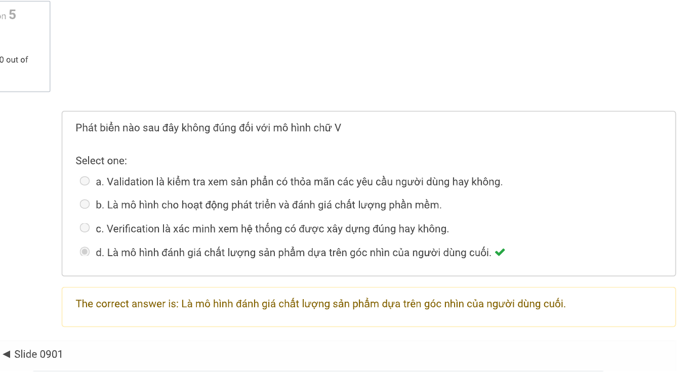

- A. Validation là kiểm tra xem sản phần có thỏa mãn các yêu cầu người dùng hay không.
- B. Là mô hình cho hoạt động phát triển và đánh giá chất lượng phần mềm.
- C. Verification là xác minh xem hệ thống có được xây dựng đúng hay không:.
- D. Là mô hình đánh giá chất lượng sản phẩm dựa trên góc nhìn của người dùng cuối.

Hiện đáp án và giải thích

**Đáp án:** D. Là mô hình đánh giá chất lượng sản phẩm dựa trên góc nhìn của người dùng cuối.

**Giải thích:** Với câu có hình, phần ảnh đang cung cấp dấu hiệu chính để nhận ra Verification/Validation; phần chữ OCR chỉ nên dùng để đối chiếu. Verification kiểm tra sản phẩm có được xây đúng theo đặc tả không, còn validation kiểm tra có đúng nhu cầu người dùng không. Mẹo phân biệt: verification là 'build the product right', validation là 'build the right product'. Nhãn, mũi tên và vị trí phần tử trong sơ đồ thường quyết định đáp án hơn phần mô tả OCR bị thiếu.

### Câu 44
Nguồn: quiz phụ OCR

Đồ thị luồng điều khiển

- A. Thể hiện việc tương tác về mặt dữ liệu của chương trình.
- B. Biểu diễn các đường đi từ điểm bắt đầu đến điểm kết thúc của chương trình.
- C. Biểu diễn cấu trúc dữ liệu của một đơn vị chương trình:
- D. Là sự liên kết giữa các module trong chương trình được Biểu diễn ở dạng đồ thị:

Hiện đáp án và giải thích

**Đáp án:** B. Biểu diễn các đường đi từ điểm bắt đầu đến điểm kết thúc của chương trình.

**Giải thích:** Tiêu chí bao phủ đo mức câu lệnh, nhánh hoặc đường đi đã được thực thi bởi test case. Bao phủ nhánh mạnh hơn bao phủ lệnh vì phải xét cả kết quả đúng/sai của điều kiện. Các tiêu chí lệnh, nhánh và đường dẫn khác nhau về độ mạnh; câu hỏi về nhánh luôn xoay quanh điểm quyết định.

### Câu 45
Nguồn: quiz phụ OCR

Chọn phát biểu sai đối với kiểm thử luồng điều khiển

- A. Luôn kiểm thử được một đường đi (path) từ điểm bắt đầu đến điểm kết thúc của chương trình.
- B. Luồng điều khiển luôn có một điểm bắt đầu và một điểm kết thúc
- C. Thiết kế các ca kiểm thử nhằm tìm ra các đường dẫn có lỗi.
- D. Với mỗi dữ liệu đầu vào chương trình có thể thực hiện theo các đường dẫn khác nhau:

Hiện đáp án và giải thích

**Đáp án:** A. Luôn kiểm thử được một đường đi (path) từ điểm bắt đầu đến điểm kết thúc của chương trình.

**Giải thích:** Câu hỏi đang tìm ngoại lệ của bao phủ kiểm thử; hãy giữ lại các lựa chọn đúng chuẩn rồi xét lựa chọn còn nằm ngoài phạm vi. Tiêu chí bao phủ đo mức câu lệnh, nhánh hoặc đường đi đã được thực thi bởi test case. Bao phủ nhánh mạnh hơn bao phủ lệnh vì phải xét cả kết quả đúng/sai của điều kiện. Các phương án còn lại thường đúng nhưng thuộc cùng nhóm chuẩn; đáp án cần chọn là ý nhầm pha, nhầm phạm vi hoặc không thuộc danh sách đang hỏi.

### Câu 46
Nguồn: quiz phụ OCR

Phát biểu nào là sai đối với các kĩ thuật thiết kế ca kiểm thử theo kiểm thử hộp trắng

- A. Phân vùng tương đương.
- B. Bao phủ điểm định nghĩa của biến
- C. Bao phủ lệnh. Bao phủ điểm sử dụng của biến.

Hiện đáp án và giải thích

**Đáp án:** A. Phân vùng tương đương.

**Giải thích:** Câu hỏi đang tìm ngoại lệ của bao phủ kiểm thử; hãy giữ lại các lựa chọn đúng chuẩn rồi xét lựa chọn còn nằm ngoài phạm vi. Tiêu chí bao phủ đo mức câu lệnh, nhánh hoặc đường đi đã được thực thi bởi test case. Bao phủ nhánh mạnh hơn bao phủ lệnh vì phải xét cả kết quả đúng/sai của điều kiện. Các phương án còn lại thường đúng nhưng thuộc cùng nhóm chuẩn; đáp án cần chọn là ý nhầm pha, nhầm phạm vi hoặc không thuộc danh sách đang hỏi.

### Câu 47
Nguồn: quiz phụ OCR

Phát biểu nào là sai đối với kiểm thử hộp trắng

- A. Người dùng hệ thống có thể tham gia thực hiện tùy từng giai đoạn cụ thể.
- B. Được thực hiện chủ yếu bởi lập trình viên hoặc kiểm thử viên
- C. Có thể triển khai ở bước tích hợp các module
- D. Có thể áp dụng ở giai đoạn
- E. Kiểm thử đơn vị:

Hiện đáp án và giải thích

**Đáp án:** A. Người dùng hệ thống có thể tham gia thực hiện tùy từng giai đoạn cụ thể.

**Giải thích:** Câu hỏi đang tìm ngoại lệ của kiểm thử hộp trắng/hộp đen; hãy giữ lại các lựa chọn đúng chuẩn rồi xét lựa chọn còn nằm ngoài phạm vi. Hộp đen dựa trên yêu cầu và miền đầu vào/đầu ra; hộp trắng dựa trên cấu trúc mã, nhánh, lệnh và đường đi. Nếu đề nhắc đồ thị điều khiển hoặc bao phủ lệnh/nhánh, đó là dấu hiệu của kỹ thuật hộp trắng. Các phương án còn lại thường đúng nhưng thuộc cùng nhóm chuẩn; đáp án cần chọn là ý nhầm pha, nhầm phạm vi hoặc không thuộc danh sách đang hỏi.

### Câu 48
Nguồn: quiz phụ OCR

Kiểm thử hộp trắng

- A. Kiểm thử hoạt động của chương trình dựa vào mô tả chức năng.
- B. Được thực hiện bởi kiểm thử viên
- C. Tập trung vào kết quả đầu ra dựa trên dữ liệu đầu vào
- D. Chiến lược kiểm thử dựa trên cấu trúc của chương trình.

Hiện đáp án và giải thích

**Đáp án:** D. Chiến lược kiểm thử dựa trên cấu trúc của chương trình.

**Giải thích:** Hộp đen dựa trên yêu cầu và miền đầu vào/đầu ra; hộp trắng dựa trên cấu trúc mã, nhánh, lệnh và đường đi. Nếu đề nhắc đồ thị điều khiển hoặc bao phủ lệnh/nhánh, đó là dấu hiệu của kỹ thuật hộp trắng. Hộp đen nhìn yêu cầu và miền dữ liệu; hộp trắng nhìn lệnh, nhánh, đường đi và đồ thị điều khiển.

### Câu 49
Nguồn: quiz phụ OCR

Trong kiểm thử hộp trắng với luồng điều khiển

- A. Tiêu chí Bao phủ nhánh còn được gọi là Bao phủ điểm quyết định.
- B. Có thể xét Bao phủ nhánh và Bao phủ lệnh thay thế cho Bao phủ đường dẫn.
- C. Tiêu chí mạnh nhất là Bao phủ mọi đường dẫn.
- D. Bao phủ lệnh luôn được đảm bảo trong mọi trường hợp.

Hiện đáp án và giải thích

**Đáp án:** C. Tiêu chí mạnh nhất là Bao phủ mọi đường dẫn.

**Giải thích:** Tiêu chí bao phủ đo mức câu lệnh, nhánh hoặc đường đi đã được thực thi bởi test case. Bao phủ nhánh mạnh hơn bao phủ lệnh vì phải xét cả kết quả đúng/sai của điều kiện. Các tiêu chí lệnh, nhánh và đường dẫn khác nhau về độ mạnh; câu hỏi về nhánh luôn xoay quanh điểm quyết định.

### Câu 50
Nguồn: quiz phụ OCR

Sử dụng kĩ thuật Bao phủ nhánh trong kiểm thử luồng điều khiển nhằm mục đích

- A. Kiểm tra giá trị điều kiện của điểm quyết định phải là true.
- B. Đảm bảo các nhánh tại điểm quyết định ở trên đồ thị luồng điều khiển phải được xem xét.
- C. Xác định giá trị đầu ra khi chương trình thực hiện câu lệnh điều kiện tương ứng.
- D. Câu lệnh điều kiện bất kì luôn được thực hiện ít nhất một lần.

Hiện đáp án và giải thích

**Đáp án:** B. Đảm bảo các nhánh tại điểm quyết định ở trên đồ thị luồng điều khiển phải được xem xét.

**Giải thích:** Tiêu chí bao phủ đo mức câu lệnh, nhánh hoặc đường đi đã được thực thi bởi test case. Bao phủ nhánh mạnh hơn bao phủ lệnh vì phải xét cả kết quả đúng/sai của điều kiện. Các tiêu chí lệnh, nhánh và đường dẫn khác nhau về độ mạnh; câu hỏi về nhánh luôn xoay quanh điểm quyết định.

### Câu 51
Nguồn: quiz phụ OCR

Phát biểu nào là sai đối với kĩ thuật Bao phủ nhánh

- A. Không đảm bảo tìm được giá trị của dữ liệu để tất cả các nhánh rẽ đều được xét.
- B. Bao phủ nhánh đảm bảo Bao phủ lệnh.
- C. Luôn thiết kế được đường đi tương ứng với các nhánh rẽ.
- D. Các nhánh rẽ làm mọi câu lệnh đều được thực thi ít nhất một lần.

Hiện đáp án và giải thích

**Đáp án:** C. Luôn thiết kế được đường đi tương ứng với các nhánh rẽ.

**Giải thích:** Câu hỏi đang tìm ngoại lệ của bao phủ kiểm thử; hãy giữ lại các lựa chọn đúng chuẩn rồi xét lựa chọn còn nằm ngoài phạm vi. Tiêu chí bao phủ đo mức câu lệnh, nhánh hoặc đường đi đã được thực thi bởi test case. Bao phủ nhánh mạnh hơn bao phủ lệnh vì phải xét cả kết quả đúng/sai của điều kiện. Các phương án còn lại thường đúng nhưng thuộc cùng nhóm chuẩn; đáp án cần chọn là ý nhầm pha, nhầm phạm vi hoặc không thuộc danh sách đang hỏi.

### Câu 52
Nguồn: quiz phụ OCR

Các tiêu chí nào không dùng đế lựa chọn đường dẫn chương trình trong kiểm thử luồng điều khiển

- A. Bao phủ các đường dẫn.
- B. Đảm bảo mọi miền dữ liệu đầu vào của hệ thống đều được xem xét.
- C. Đảm bảo mọi câu lệnh trong chương trình đều được thực thi.
- D. Đảm bảo mọi giá trị điều kiện true/false ở câu lệnh điều kiện đều được kiếm tra

Hiện đáp án và giải thích

**Đáp án:** B. Đảm bảo mọi miền dữ liệu đầu vào của hệ thống đều được xem xét.

**Giải thích:** Câu hỏi đang tìm ngoại lệ của bao phủ kiểm thử; hãy giữ lại các lựa chọn đúng chuẩn rồi xét lựa chọn còn nằm ngoài phạm vi. Tiêu chí bao phủ đo mức câu lệnh, nhánh hoặc đường đi đã được thực thi bởi test case. Bao phủ nhánh mạnh hơn bao phủ lệnh vì phải xét cả kết quả đúng/sai của điều kiện. Các phương án còn lại thường đúng nhưng thuộc cùng nhóm chuẩn; đáp án cần chọn là ý nhầm pha, nhầm phạm vi hoặc không thuộc danh sách đang hỏi.

### Câu 53
Nguồn: quiz phụ OCR

Kĩ thuật Bao phủ lệnh không yêu cầu

- A. Mọi câu lệnh đều được thực thi ít nhất một lần:
- B. Cần thực thi ít nhất một nhánh rẽ ở khối câu lệnh điều kiện.
- C. CCác đỉnh trên đồ thị luồng điều khiển phải xuất hiện ít nhất lần trong đường thực thi của chương trình.
- D. Tìm ra đường đi qua câu lệnh cần xem xét.

Hiện đáp án và giải thích

**Đáp án:** B. Cần thực thi ít nhất một nhánh rẽ ở khối câu lệnh điều kiện.

**Giải thích:** Tiêu chí bao phủ đo mức câu lệnh, nhánh hoặc đường đi đã được thực thi bởi test case. Bao phủ nhánh mạnh hơn bao phủ lệnh vì phải xét cả kết quả đúng/sai của điều kiện. Các tiêu chí lệnh, nhánh và đường dẫn khác nhau về độ mạnh; câu hỏi về nhánh luôn xoay quanh điểm quyết định.

### Câu 54
Nguồn: quiz phụ OCR

begin qt, ck (qt 0.3 + ck 0.7) < 4 return false qt < 3 |l ck < 3 T return true return false end Các node nào trên đồ thị tương ứng với các điều kiện cần kiểm tra

- A. Node 2
- B. Node 3
- C. Node 1
- D. Node 4

Hiện đáp án và giải thích

**Đáp án:** Node 2, Node 4

**Giải thích:** Tiêu chí bao phủ đo mức câu lệnh, nhánh hoặc đường đi đã được thực thi bởi test case. Bao phủ nhánh mạnh hơn bao phủ lệnh vì phải xét cả kết quả đúng/sai của điều kiện. Các tiêu chí lệnh, nhánh và đường dẫn khác nhau về độ mạnh; câu hỏi về nhánh luôn xoay quanh điểm quyết định.

### Câu 55
Nguồn: quiz phụ OCR

bool kq(float qt, float ck) { * if ((qt 0.3 + ck 0.7) < 4) 9; return false; //1 else if (qt < 3 |l ck < 3) return false; //2 else return true; //3 Test case tương ứng với câu lệnh trả về return true; của đoạn chương trình là

- A. <4,8, true>
- B. không có đáp án nào đúng
- C. <1, 5, false>
- D. <2, 8, false>

Hiện đáp án và giải thích

**Đáp án:** <4, 8, true>

**Giải thích:** Tiêu chí bao phủ đo mức câu lệnh, nhánh hoặc đường đi đã được thực thi bởi test case. Bao phủ nhánh mạnh hơn bao phủ lệnh vì phải xét cả kết quả đúng/sai của điều kiện. Các tiêu chí lệnh, nhánh và đường dẫn khác nhau về độ mạnh; câu hỏi về nhánh luôn xoay quanh điểm quyết định.

### Câu 56
Nguồn: quiz phụ OCR

begin 9 qt, ck; (qt 0.3 + ck 0.7) < 4 return false gt < 3 |l ck < 3 T return true return false end Các node nào trên đồ thị tương ứng với các giá trị kết quả có thể trả về

- A. Node 3
- B. Node 2
- C. Node 5
- D. Node 6

Hiện đáp án và giải thích

**Đáp án:** Node 3, Node 5, Node 6

**Giải thích:** Tiêu chí bao phủ đo mức câu lệnh, nhánh hoặc đường đi đã được thực thi bởi test case. Bao phủ nhánh mạnh hơn bao phủ lệnh vì phải xét cả kết quả đúng/sai của điều kiện. Các tiêu chí lệnh, nhánh và đường dẫn khác nhau về độ mạnh; câu hỏi về nhánh luôn xoay quanh điểm quyết định.

### Câu 57
Nguồn: quiz phụ OCR

begin 9 qt, ck; (qt 0.3 + ck 0.7) < 4 return false gt < 3 |l ck < 3 T return true return false end Test case tương ứng với đường đi qua các node 1-2-4-5 được thể hiện trên đồ thị là

- A. <1, 5, false>
- B. không tồn tại
- C. <2, 8, false>
- D. <4, 8, true>

Hiện đáp án và giải thích

**Đáp án:** <2, 8, false>

**Giải thích:** Tiêu chí bao phủ đo mức câu lệnh, nhánh hoặc đường đi đã được thực thi bởi test case. Bao phủ nhánh mạnh hơn bao phủ lệnh vì phải xét cả kết quả đúng/sai của điều kiện. Các tiêu chí lệnh, nhánh và đường dẫn khác nhau về độ mạnh; câu hỏi về nhánh luôn xoay quanh điểm quyết định.

### Câu 58
Nguồn: quiz phụ OCR

bool kq(float qt, float ck) { * if ((qt 0.3 + ck 0.7) < 4) 9; return false; //1 else if (qt < 3 |l ck < 3) return false; //2 else return true; //3 Test case tương ứng với nhánh (qt * 0.3 + ck * 0.7) < 4 (đúng) trên đồ thị luồng điều khiển là

- A. <4, 8, true>
- B. <1, 5, false>
- C. không có đáp án nào đúng
- D. <2, 8, false>

Hiện đáp án và giải thích

**Đáp án:** <1, 5, false>

**Giải thích:** Tiêu chí bao phủ đo mức câu lệnh, nhánh hoặc đường đi đã được thực thi bởi test case. Bao phủ nhánh mạnh hơn bao phủ lệnh vì phải xét cả kết quả đúng/sai của điều kiện. Các tiêu chí lệnh, nhánh và đường dẫn khác nhau về độ mạnh; câu hỏi về nhánh luôn xoay quanh điểm quyết định.

### Câu 59
Nguồn: quiz phụ OCR

Kĩ thuật phân lớp tương đương trong phương pháp kiểm thử hộp đen thực hiện những bước nào sau đây

- A. Xác định các giá trị nằm ở miền giao của mỗi lớp để đảm bảo tính chính xác của ca kiểm thử.
- B. Lấy giá trị bất kì miền giá trị để xây dựng ca kiểm thử.
- C. CCần xác định tính hợp lệ của dữ liệu đầu vào.
- D. Xác định các lớp tương đương từ giá trị đầu vào và đầu ra.

Hiện đáp án và giải thích

**Đáp án:** D. Xác định các lớp tương đương từ giá trị đầu vào và đầu ra.

**Giải thích:** Hộp đen dựa trên yêu cầu và miền đầu vào/đầu ra; hộp trắng dựa trên cấu trúc mã, nhánh, lệnh và đường đi. Nếu đề nhắc đồ thị điều khiển hoặc bao phủ lệnh/nhánh, đó là dấu hiệu của kỹ thuật hộp trắng. Hộp đen nhìn yêu cầu và miền dữ liệu; hộp trắng nhìn lệnh, nhánh, đường đi và đồ thị điều khiển.

### Câu 60
Nguồn: quiz phụ OCR

Kĩ thuật phân lớp tương đương trong phương pháp kiểm thử hộp đen

- A. Luôn có thể xác định lớp dựa theo miền dữ liệu hợp lệ hoặc không hợp lệ.
- B. Hành vi của hệ thống là đối với mọi điểm thuộc lớp tương đương có thế khác nhau.
- C. Hệ thống sẽ hoạt động theo cách khác nhau tùy thuộc vào dữ liệu thuộc lớp nào
- D. Dựa vào miền dữ liệu đầu vào và đầu ra

Hiện đáp án và giải thích

**Đáp án:** D. Dựa vào miền dữ liệu đầu vào và đầu ra

**Giải thích:** Hộp đen dựa trên yêu cầu và miền đầu vào/đầu ra; hộp trắng dựa trên cấu trúc mã, nhánh, lệnh và đường đi. Nếu đề nhắc đồ thị điều khiển hoặc bao phủ lệnh/nhánh, đó là dấu hiệu của kỹ thuật hộp trắng. Hộp đen nhìn yêu cầu và miền dữ liệu; hộp trắng nhìn lệnh, nhánh, đường đi và đồ thị điều khiển.

### Câu 61
Nguồn: quiz phụ OCR

Đâu không được xem là nhược điểm của kĩ thuật phân lớp tương đương trong phương pháp kiểm thử hộp đen là

- A. Phụ thuộc vào kiến trúc của đơn vị chương trình.
- B. Việc thiết kế các ca kiểm thử sẽ phức tạp nếu các dữ liệu không còn độc lập.
- C. Không quan tâm đến một số giá trị không hợp lệ
- D. Phụ thuộc vào kinh nghiệm của người kiểm thử.

Hiện đáp án và giải thích

**Đáp án:** A. Phụ thuộc vào kiến trúc của đơn vị chương trình.

**Giải thích:** Câu hỏi đang tìm ngoại lệ của kiểm thử hộp trắng/hộp đen; hãy giữ lại các lựa chọn đúng chuẩn rồi xét lựa chọn còn nằm ngoài phạm vi. Hộp đen dựa trên yêu cầu và miền đầu vào/đầu ra; hộp trắng dựa trên cấu trúc mã, nhánh, lệnh và đường đi. Nếu đề nhắc đồ thị điều khiển hoặc bao phủ lệnh/nhánh, đó là dấu hiệu của kỹ thuật hộp trắng. Các phương án còn lại thường đúng nhưng thuộc cùng nhóm chuẩn; đáp án cần chọn là ý nhầm pha, nhầm phạm vi hoặc không thuộc danh sách đang hỏi.

### Câu 62
Nguồn: quiz phụ OCR

Các phương pháp thiết kế ca kiểm thử đối với phương pháp kiểm thử hộp đen

- A. Phân lớp tương đương, phân tích giá trị biên, sử dụng bảng quyết định, kiểm thử trạng thái.
- B. Kiểm thử trạng thái, phân miền giá trị; sử dụng bảng quyết định, xác định giá trị biên.
- C. Xác định giá trị biên, kiểm thử hoạt động, phân chia miền tương đương, sử dụng bảng quyết định:.
- D. Phân tích giá trị của biến, sử dụng bảng quyết định, kiểm thử trạng thái hệ thống

Hiện đáp án và giải thích

**Đáp án:** Phân lớp tương đương, phân tích giá trị biên, sử dụng bảng quyết định, kiểm thử trạng thái.

**Giải thích:** Hộp đen dựa trên yêu cầu và miền đầu vào/đầu ra; hộp trắng dựa trên cấu trúc mã, nhánh, lệnh và đường đi. Nếu đề nhắc đồ thị điều khiển hoặc bao phủ lệnh/nhánh, đó là dấu hiệu của kỹ thuật hộp trắng. Hộp đen nhìn yêu cầu và miền dữ liệu; hộp trắng nhìn lệnh, nhánh, đường đi và đồ thị điều khiển.

### Câu 63
Nguồn: quiz phụ OCR

Phát biểu nào là sai đối với phương pháp kiểm thử hộp đen

- A. Được thực hiện bởi kiểm thử viên
- B. Kiểm thử hộp đen dựa trên yêu cầu và chức năng của chương trình:
- C. Không xác định được việc sẽ kiểm soát lỗi như thế nào
- D. Cấu trúc của đơn vị chương trình quyết định đến việc thiết kế các test case.

Hiện đáp án và giải thích

**Đáp án:** D. Cấu trúc của đơn vị chương trình quyết định đến việc thiết kế các test case.

**Giải thích:** Câu hỏi đang tìm ngoại lệ của kiểm thử hộp trắng/hộp đen; hãy giữ lại các lựa chọn đúng chuẩn rồi xét lựa chọn còn nằm ngoài phạm vi. Hộp đen dựa trên yêu cầu và miền đầu vào/đầu ra; hộp trắng dựa trên cấu trúc mã, nhánh, lệnh và đường đi. Nếu đề nhắc đồ thị điều khiển hoặc bao phủ lệnh/nhánh, đó là dấu hiệu của kỹ thuật hộp trắng. Các phương án còn lại thường đúng nhưng thuộc cùng nhóm chuẩn; đáp án cần chọn là ý nhầm pha, nhầm phạm vi hoặc không thuộc danh sách đang hỏi.

### Câu 64
Nguồn: quiz phụ OCR

Thứ tự các bước để giải quyết bài toán kiểm thử hộp đen với lớp tương đương là

- A. Phân các lớp cho miền giá trị của dữ liệu: Xác định các dữ liệu đầu vào và miền giá trị tương ứng. Lấy giá trị thích hợp
- B. ho các dữ liệu đầu ra. Thiết kế các test case.
- C. Xác định các dữ liệu đầu vào và miền giá trị tương ứng. Thiết kế các test case. Lấy giá trị thích hợp cho các dữ liệu đầu ra. Xác định các test case.
- E. Xác định các dữ liệu đầu vào và miền giá trị tương ứng. Phân các lớp cho miền giá trị của dữ liệu. Lấy giá trị thích hợp
- F. ho các dữ liệu đầu ra. Xác định các test case

Hiện đáp án và giải thích

**Đáp án:** Xác định các dữ liệu đầu vào và miền giá trị tương ứng. Phân các lớp cho miền giá trị của dữ liệu: Lấy giá trị thích hợp cho các dữ liệu đầu ra. Xác định các test case

**Giải thích:** Hộp đen dựa trên yêu cầu và miền đầu vào/đầu ra; hộp trắng dựa trên cấu trúc mã, nhánh, lệnh và đường đi. Nếu đề nhắc đồ thị điều khiển hoặc bao phủ lệnh/nhánh, đó là dấu hiệu của kỹ thuật hộp trắng. Hộp đen nhìn yêu cầu và miền dữ liệu; hộp trắng nhìn lệnh, nhánh, đường đi và đồ thị điều khiển.

### Câu 65
Nguồn: quiz phụ OCR

Với bài toán xét kết quả của sinh viên với hai điểm thi là toán và vật lý. Sinh viên chỉ vượt qua kì thi nếu: Cả điểm toán và điểm vật lý >= 70 (xét theo thang điểm 100) và điểm trung bình của toán và vật lý >= 80. Các miền tương đương được xác định bởi giới hạn của các đường

- A. Lý = 100; Lý = 70
- B. Toán = 100; Toán = 70
- C. Không có đáp án nào đúng
- D. (Toán + Lý)/2 = 80

Hiện đáp án và giải thích

**Đáp án:** Toán = 100; Toán = 70, Lý = 100; Lý = 70, (Toán + Lý)/2 = 80

**Giải thích:** Bài toán điểm số thường yêu cầu chia miền đầu vào theo các vùng tạo kết quả khác nhau rồi chọn ca đại diện. Các điểm sát ranh giới hoặc làm đổi phân loại kết quả quan trọng hơn các điểm nằm sâu trong cùng một miền. Không cần chọn mọi điểm đầu vào; cần chọn các điểm đại diện cho từng miền và các điểm dễ làm đổi kết quả.

### Câu 66
Nguồn: quiz phụ OCR

Điểm toán 9; 100 (3) (1) 70 (5) (6) Điểm trung bình = 80 70 100 Điểm lý Với bài toán xét kết quả của sinh viên với hai điểm thi là toán và vật lý. Sinh viên chỉ vượt qua kì thi nếu: Cả điểm toán và điểm vật lý >= 70 (xét theo thang điểm 100) và điểm trung bình của toán và vật lý >= 80. Các miền tương ứng với trường hợp "Không đạt" là:

- A. 1, 2, 4, 5, 6, 7
- B. 1, 5, 6
- C. 1, 4, 5, 6
- D. 1, 2, 4, 5, 6

Hiện đáp án và giải thích

**Đáp án:** A. 1, 2, 4, 5, 6, 7

**Giải thích:** Bài toán điểm số thường yêu cầu chia miền đầu vào theo các vùng tạo kết quả khác nhau rồi chọn ca đại diện. Các điểm sát ranh giới hoặc làm đổi phân loại kết quả quan trọng hơn các điểm nằm sâu trong cùng một miền. Không cần chọn mọi điểm đầu vào; cần chọn các điểm đại diện cho từng miền và các điểm dễ làm đổi kết quả.

